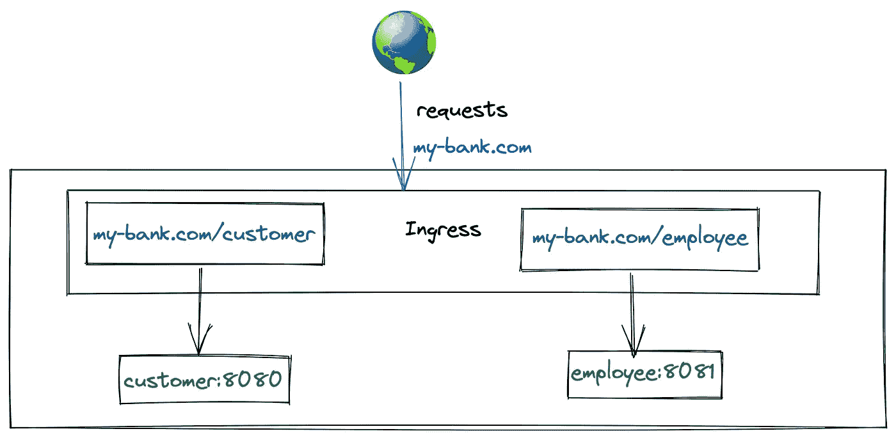
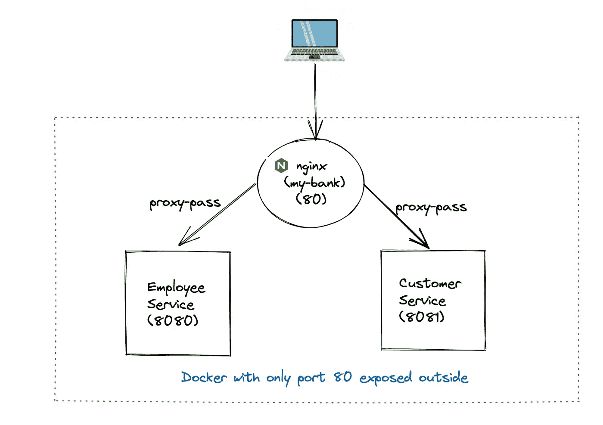

# 使用普通 Nginx 和 Docker Compose 在不到 5 分钟的时间内复制 Kubernetes 入口

> 原文：<https://medium.com/geekculture/replicate-kubernetes-ingress-using-plain-nginx-and-docker-compose-in-less-than-5-minutes-8b435530a674?source=collection_archive---------4----------------------->

我们使用 Kubernetes **Ingress** 来部署我们的 web 应用程序。
*(要知道什么是 ingress，查看一下* [*这个*](/google-cloud/kubernetes-nodeport-vs-loadbalancer-vs-ingress-when-should-i-use-what-922f010849e0) *真好看博客作者*[*Sandeep Dinesh*](https://medium.com/u/bba63600816e?source=post_page-----8b435530a674--------------------------------)*)*

对于示例应用程序*我的银行*。设置如下所示:



Kubernetes Ingress Setup for my-bank

出于调试目的，我们需要在本地机器上复制上述设置。

在探索了包括 [nginx-proxy](https://github.com/nginx-proxy/nginx-proxy) 在内的各种替代方案之后(感谢 [Kim Wuestkamp](https://medium.com/u/7ad6cde74bf7?source=post_page-----8b435530a674--------------------------------) 提出[这个](https://codeburst.io/replicate-kubernetes-ingress-locally-with-docker-compose-2872e650af6b)想法)。对我们来说，最简单的解决方法是在 docker-compose 文件中使用普通的 nginx 和 proxy_pass 指令。



这是我们主应用程序的 html 页面的编码方式:

注意，我们只需要在 href 中给出相对路径`/employee/home`,即使在本地设置中也不用给出完整的 url。

员工和客服都有如下的文档:

*nginx/conf . d/default . conf*

```
server {
    listen 80*;
*    server_name  localhost my-bank.com*;

*    location / {
        root   /usr/share/nginx/html*;
*        try_files $uri $uri/ /index.html*;
*    }

    location /employee {
            proxy_pass http://employee:8081*;
*            proxy_set_header Host my-bank.com*;
*    }

    location /customer {
            proxy_pass http://customer:8080*;
*            proxy_set_header Host my-bank.com*;
*    }

    error_page   404 500 502 503 504  /error.html*;
*    location /error.html {
        root   /usr/share/nginx/html*;
*    }
}
```

上面的配置指示 nginx 在端口 80 启动主应用程序，如果 url 的路径中分别包含/customer 或/employee，则将请求代理到 8080 和 8081。

最后，将所有这些放入 docker-compose:

最后，使用命令`docker-compose up`启动应用程序，并使用`docker-compose down --rmi 'all'`停止应用程序，没有任何剩余的图像和容器。

和往常一样，完整的代码可以在 [Github](https://github.com/ShailyAggarwalK/nginx-ingress) 找到

快乐编码:)

打招呼👋在 [LinkedIn](https://www.linkedin.com/in/shaily-aggarwal-51056617b) 或 [Twitter](https://twitter.com/ShailyAggarwa12) 上