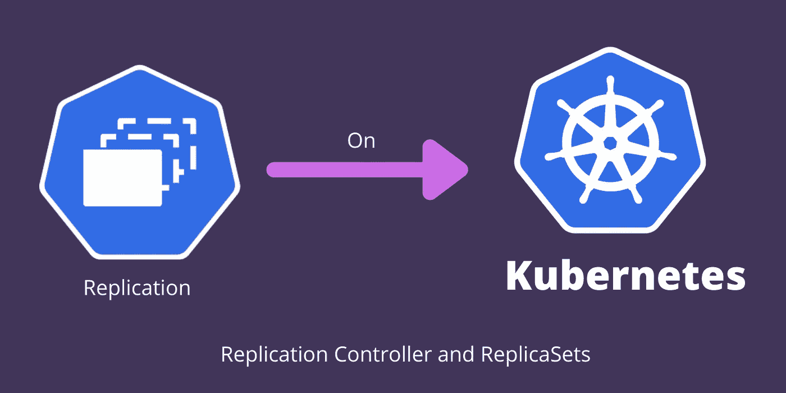

# Kubernetes 中的复制控制器与复制集

> 原文：<https://medium.com/geekculture/replication-controller-vs-replicasets-in-kubernetes-7b780e4d09d5?source=collection_archive---------2----------------------->

了解我们为什么需要复制以及复制在 Kubernetes 中是如何工作的。使用 kubectl scale 命令缩放应用程序。

K8s Replication Controller and ReplicaSets

Kubernetes 有许多控制器。库伯内特的控制员做了很多工作。它们充当着库伯内特人的大脑。在本文中，我们将看到**复制控制器(旧技术)和复制集(新技术)**。两个复制控制器…