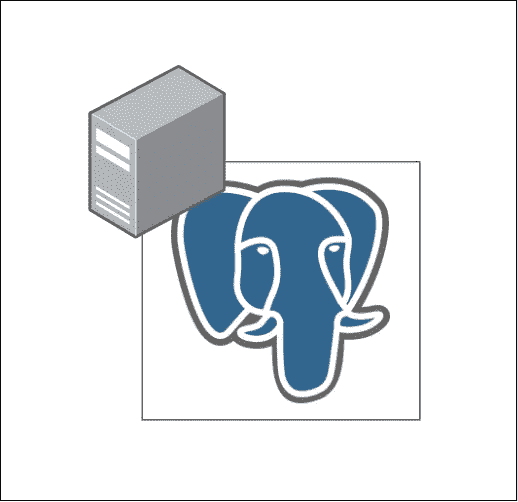
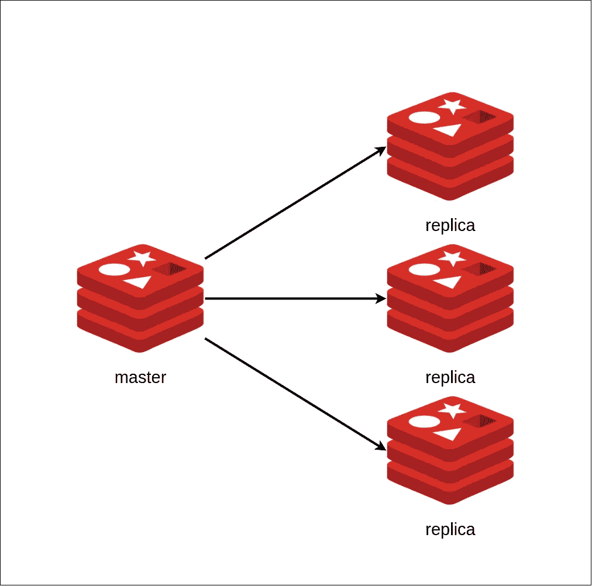
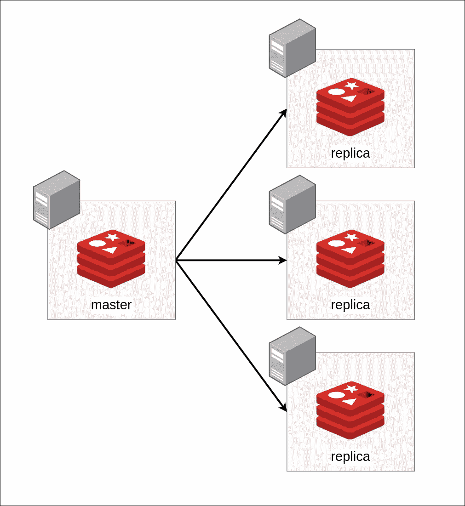
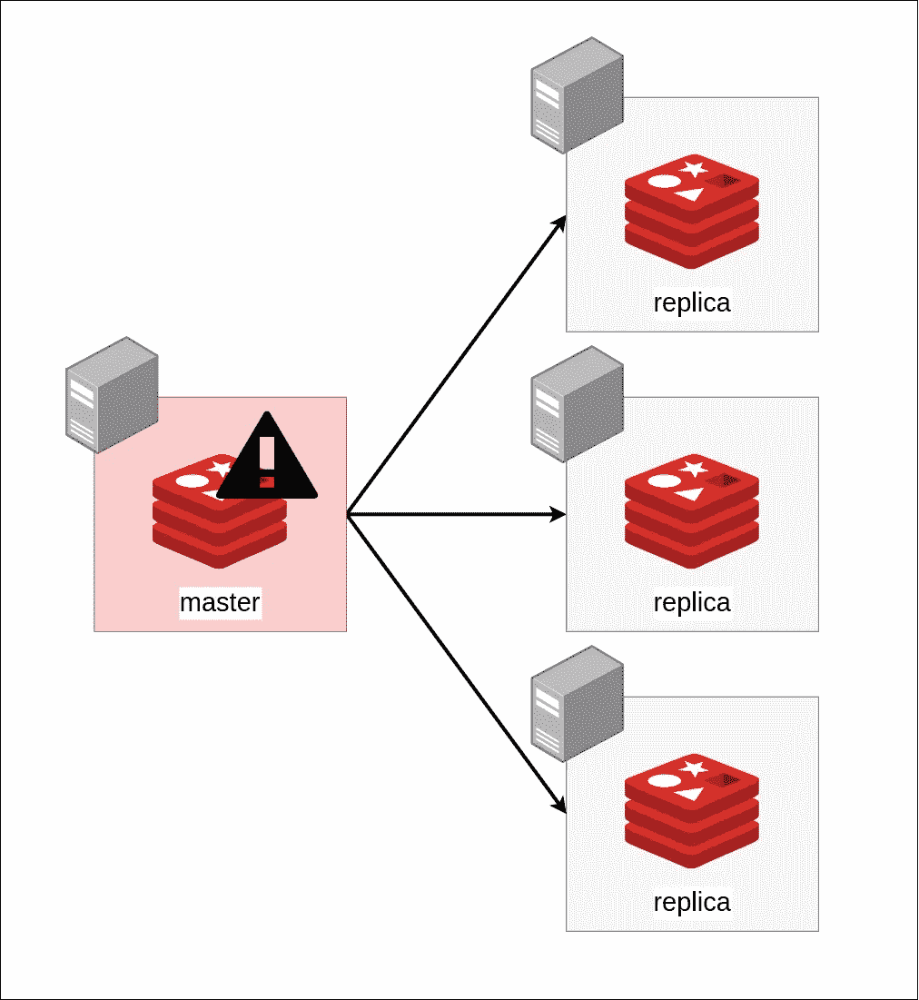
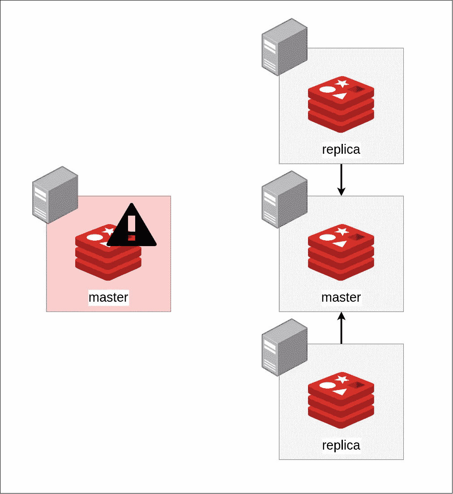

# Redis 数据库中的复制:横向扩展数据库的体系结构

> 原文：<https://medium.com/geekculture/replication-in-databases-with-redis-architecture-for-horizontally-scaling-databases-b19fc6c5d149?source=collection_archive---------1----------------------->


# 等等，这是什么？我为什么需要这个？

所有这些花哨的新词、复制、横向扩展似乎……很复杂。您的应用程序可能已经足够复杂，如果您现在在想为什么还需要它，我不会感到惊讶。为什么不能现在就关闭这个标签，回到在 EC2 实例上运行的简单 Postgres 呢？

在您关闭这个选项卡之前，请允许我通过指出“在 EC2 实例上运行的简单数据库”体系结构中的问题，来解释为什么这些新奇的词汇有些重要。

因此，假设您有一个运行在某个云托管提供商的单个虚拟专用服务器上的数据库(这并不重要)。



好的，这很简单，我只需要在某个服务器上运行 Postgres(同样，它可以是任何数据库，我只是暂时选择了 Postgres)。但是它有什么问题吗？完美吗？

## 有效性

让我们假设我们在 EC2 实例上运行它。AWS 承诺单个 EC2 实例 99.5%的可用性。99.5%似乎是一个非常大的数字，把它想象成*总是可用的*并不牵强。但是**不是**一直可用，不会有 0.5%的时间可用。这大致相当于每年 44 小时。这意味着您的数据库(可能还有应用程序的其余部分)每年会停机 2 天。

除此之外，你可能需要更新你的数据库，备份数据，也许执行操作系统更新，等等。所有这些都增加了数据库的停机时间。

如果你正在构建一个简单的东西，比如一个每天收到几百个请求的博客网站，那么你就可以管理这个停机时间。然而，如果您正在构建一个每分钟处理数百个以上请求的大型生产系统，那么当您试图解释为什么您的应用程序每个月都有几个小时不可用时，产品团队可能会不太高兴。

## 规模

在一天结束时，运行在单个服务器上的单个数据库只能访问有限的硬件。这意味着有限量的 RAM、有限量的 CPU 和有限量的网络带宽。这实际上意味着，随着您向应用程序添加更多的用户和特性，您的数据库需要更多的这些物理资源。当然，您可以增加实例的大小，这将增加更多的 CPU 和内存，可能会从中型服务器移动到大型服务器，然后移动到大型服务器，等等，但是像这样的垂直扩展是有限制的。最终，你的非常非常大的服务器也会有处理大量用户的问题(不，你不能切换到非常非常*非常*大的服务器)。不仅如此，像这样的垂直扩展可能成本也很高。

垂直扩展成本高昂的原因在于弹性。弹性只是一个花哨的词，它定义了您可以多快地扩展您的系统，也可以多快地缩减它。如果您购买了非常大的服务器，但是该服务器在高峰时段满负荷运行，而在晚上却处于闲置状态，那么您在晚上运行这么大的服务器就是在浪费金钱。


your really really *REALLY* large server at night probably

那么，我们该怎么办呢？

# 前言

在我们深入研究架构之前，我想谈一些事情，

因为我想写一篇博文，而不是一本书，所以我会用 Redis 探索这些问题及其解决方案。尽管其他数据库也有类似的解决方案。

我还想弄清楚一些术语。

水平扩展是指在系统中添加更多同类节点。因此，不是运行单个数据库实例，而是运行两个或三个实例，等等。

垂直扩展是指运行单个数据库实例，但是向其添加更多的硬件容量(例如，通过添加更多的 RAM 和 CPU)。这也带来了一些负面影响。更多关于[这里](https://www.youtube.com/watch?v=xpDnVSmNFX0)。

# 说建筑吧！

我们知道，我们在单个服务器上的单个数据库存在一些问题。也许我们可以改善这一点。让我们看看如何！

## 使用副本进行水平缩放

解决这个问题的一个非常直观的方法就是添加更多的数据库(我们称之为副本)。这个想法很简单，我们说我们的原始数据库是*主数据库*，我们添加更多的数据库，将这些数据库中的每一个称为*副本。*这些名字非常具有描述性，应该能告诉你这些数据库的用途。主数据库保存数据的基本事实，副本只是从主数据库复制数据。



所有的写操作都在主数据库中进行，而读操作可以在副本数据库中进行。

在主服务器和副本服务器之间的通信方式、这些副本服务器是否与主服务器通信，或者在添加新数据时主服务器是否与副本服务器通信，以及我们的目标是什么样的一致性等方面，我们可以有很大的灵活性。但是现在，让我们假设数据被写入主数据库，主数据库将写入它的新数据流发送到它的副本(这就是它在 Redis 中的工作方式)。我们还假设这种通信是异步的。这意味着主数据库不会等待副本添加或更新数据。

当主数据库收到写入新数据或更新旧数据的请求时，它会执行这些操作，并将命令流发送到副本数据库。但是，一旦它向副本发送了命令，它就不会等待副本实际执行该操作。相反，它会向客户端返回数据已被添加。最终，副本也会插入或更新数据，并与主数据库保持一致。

这意味着有时(当您的主服务器已经插入数据，而您的副本服务器尚未插入数据时)您的数据库可能处于不一致的状态，当用户从副本服务器读取数据时，他们最终可能会读取陈旧的数据。这取决于你在构建什么，对你来说可能是也可能不是问题。例如，如果您正在构建一个像 Youtube 这样的网站，并且您使用 Redis 来存储视频的点赞数，那么如果您在有人喜欢 Youtube 上的某个视频时使用副本，那么其他用户可能需要一秒钟左右才能看到新的点赞数。这对于特定的应用程序来说并不重要，但是对于其他一些应用程序来说，这种不一致性可能是一个问题。

将这些副本添加到我们的架构中对我们帮助很大。对于大多数应用程序，读取流量远高于写入流量。以 Twitter 或 Youtube 为例。你每个月看多少条微博，你发多少次微博。这个比率可能是你写的一条新推文与你读的一百条推文的比率。这应该和 Twitter 上的大多数人其实差不多。像这样的应用程序带来的流量是非常大的。好的一面是，我们的副本节点是为读取而精确制造的，如果需要，我们可以添加更多的副本节点。

我们甚至可以在单独的虚拟专用服务器上运行这些。



现在，我们可以将读取流量分发到这些独立的服务器，并将写入流量发送到主数据库。通过这种方式，我们可以显著提高数据库的性能。现在，我们不需要依赖单台机器(及其有限的硬件)来服务所有请求，而是可以利用多台机器来实现这一点。

我们也提高了阅读时系统的可用性。我们有多个实例来服务读请求，而不是单个 EC2 实例。这意味着即使一个实例停止运行，我们仍然有其他实例可以用来处理负载。

除此之外，我们还可以有更复杂的体系结构，也许我们可以在高峰流量期间添加更多的副本节点，并在非工作时间(如晚上)进行扩展。这样我们就不会浪费服务器资源，还能省钱。这也解决了我们之前讨论的弹性问题。

此外，我们还可以在编写时提高系统的可用性。让我来解释一下。如果主节点发生故障，



我们可以将其中一个副本提升为主副本(毕竟它们也是 Redis 实例)。



这显然不是很简单，但对我们来说很好，有一些项目(如 [Redis Sentinel](https://redis.io/topics/sentinel) )已经解决了这个问题，我们可以不用做很多工作就可以使用它们！


Software engineers IRL

所以，完成所有这些的配置一定非常复杂，对吧？

不，一点也不！

## 履行

我使用 docker 运行 Redis 副本和 Redis 主服务器。这是我的目录结构的样子

```
.
├── docker-compose.yml
├── master
│   ├── Dockerfile
│   └── redis.conf
└── replica
    ├── Dockerfile
    └── redis.conf2 directories, 5 files
```

你可以在 [Github](https://github.com/Sanil2108/Medium/tree/master/redis-replicas) 上查看所有的源代码。

我创建了两个 docker 映像，一个用于 Redis master，另一个用于 Redis replica。对于这两张图片，docker 文件是相同的-

它只是下载 redis:6.2 的默认配置，复制位于上下文目录中的定制配置，并使用新的定制配置运行 redis。我们需要默认配置的原因是我们新的定制配置覆盖了默认配置。

这是主服务器的配置文件

这是副本的配置文件-

配置文件非常小，它们只是关闭了保护模式并绑定到 0.0.0.0 而不是 127.0.0.1，这允许我们从 docker 外部使用它。对于生产环境来说，关闭保护模式并不是一个好方法，但是对于我们的简单示例来说，它应该可以正常工作。它们还包括默认的配置文件，用于导入我们尚未在文件中定义的所有配置默认值。

最后，副本配置文件包含这一行

```
replicaof master 6379
```

这一行表示 Redis 数据库将作为主机 *master 上端口 *6379* 上运行的数据库的副本。*

完成所有这些设置后，我们可以创建一个 docker-compose 文件来运行一个主节点和两个副本节点。

仅此而已！

我们可以简单地使用

```
docker-compose build; docker-compose up -d;
```

一旦容器启动并运行，您可以为主服务器打开一个 Redis CLI，并为其中一个副本服务器打开一个，以查看复制过程。主服务器连接到本地端口 6379，副本服务器在端口 6380 和 6381 上运行。

这是一个简单的演示

# 结论

在大多数数据库中，副本是一个非常棒的特性，它有助于轻松地大规模扩展数据库。许多数据库都非常好地支持创建这些主从复制。

一个很好的反驳理由可能是，在这些体系结构中，我们只是扩展了读取容量，而不是写入容量。这是事实，但是，大多数应用程序都是大量读取的。想想你使用的应用程序，比如 Medium。你在媒体上阅读了多少博客文章，你写了多少。你产生的大部分流量是阅读流量。不仅如此，对于一些数据库，比如关系数据库，读比写更重。因此，许多与处理数据库规模相关的问题都是从数据库中读取，而不是写入数据库。

副本还可以增加数据库的可用性，它们对于许多其他用例也很有用。例如，当您想要备份数据库时，您的数据库可能会导致停机或性能降低。如果您有一个复制副本，那么您可以简单地使用复制副本进行备份，而主数据库将平稳运行。

但是，如果您的数据解决方案需要大量写入流量，该怎么办呢？例如，聊天应用程序。在一个聊天应用程序中，大部分的交流是在两个人之间进行的，当他们启动应用程序时，两个人都可能只阅读一次旧消息，然后在新消息到来时阅读新消息。他们也会写同样多的信息。所以你的读写流量非常相似。为此，我们可以研究主从架构或分片。这些都是相当大的主题，所以我将不得不分别写它们。

现在，在结束之前，我还想指出几个问题。

第一个是 docker compose 绝对不是解决这个问题的合适的容器编排。我们肯定可以增加一些复杂性，并通过使用一些其他容器编排来使它变得更好，例如 ECS。因为我不想从使用 ECS 进行数据库复制开始，所以我在这篇文章中讨论了 docker compose 来降低复杂性。

对于一般的读取副本或分布式数据系统，您必须考虑 CAP 定理。如果你喜欢我写的东西，并想进一步探索，我肯定会鼓励你[阅读更多关于 CAP 定理](https://www.youtube.com/watch?v=l9JSK9OBzA4&t=7s)的内容。

最后，和所有事情一样，所有这些都是有代价的。随着开发人员构建这种架构时增加更多的数据库或开发时间，AWS 账单上的成本可能会更高。这对你是否有用取决于你真正想做的是什么。

差不多就是这样，真的。如果你能走到这一步，谢谢你的阅读。

