# 请求对象 Express.js

> 原文：<https://medium.com/geekculture/request-object-express-js-669720f3bfb5?source=collection_archive---------6----------------------->


你好，我正在学习 Express.js，理解请求部分非常重要，我们可以如何使用它来处理客户端的请求，这非常有趣，这是 Express.js 和 Node.js 世界的又一步。

# 请求快递. js

首先，请求是当用户从服务器发送信息或请求信息时，有两种常见的请求，第一种是 GET，第二种是 POST。

# 请求正文

当我们使用 body 只是为了发送数据时，我们在这种情况下使用 POST，对于上传文件，媒体类型可以是“application/json”、“application/x-www-form-urlencoded”或“multipart-form-data”。

# 请求对象

请求对象作为请求处理程序的第一个参数传递，它包含用户请求的信息。

首先，我们需要用 Express.js 创建我们的小服务器，开始吧！

安装 express 并创建我们的 js 文件，然后启动服务器

```
const express = require( 'express' )
const app     = express()
const port    = process.env.PORT || 1024app.get( '/', ( *req*, *res* ) => {
*res*.type( 'text/plain' )
*res*.send( 'Thanks for reading' )})app.listen( port, console.log( `http://127.0.0.1:${ port }` ) )
```

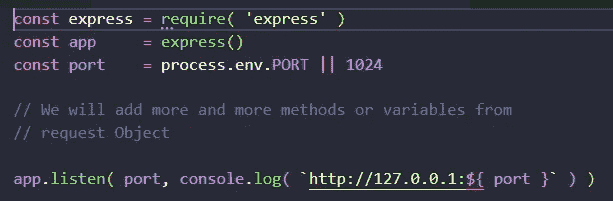

Example starting our server

```
req.params
```

包含命名路由参数的

```
app.get( '/params', ( *req*, *res* ) => {
console.log( *req*.params )
*res*.send( `Params` )
})
```

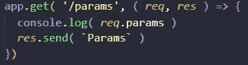

Example params code

如果我们运行我们的第一个服务器，我们可以看到它在控制台的输出上发送一个对象，因为现在它是一个空对象，但是稍后我们将看到参数。

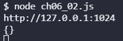

Example output console

```
req.query
```

它有 querystring 参数(GET 参数)

```
app.get( '/querystrings', ( *req*, *res* ) => {
console.log( *req*.query )
*res*.send( 'QueryStrings' )
})
```

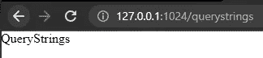

Example going to the querystring page

这是一条正常的路径，但是如果我们添加 querystrings 会发生什么呢？


Example empty object without querystrings


Example going to the querystring page with querystrings


Example querystring from GET

这些参数是页面的输出，我们可以用它们来提供信息等。

```
req.body
```

如果用户使用页面中的一个表单，并从 POST 请求中发送其数据，我们可以从该对象中看到关于它的信息。

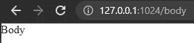

Example body page


Example output on the console with the request body

现在，我有一个未定义的保留字，但这是因为我们需要从 POST 发送数据，这将捕获对象，我们可以保存它。

```
req.route
```

关于当前路线的信息

```
app.get( '/route', ( *req*, *res* ) => {
console.log( *req*.route )
*res*.send( 'Route' )
})
```

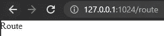

Example route page

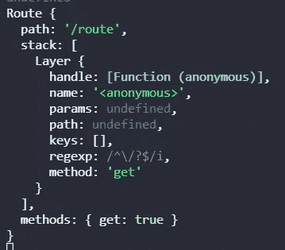

Output on the console with all the information about the route

如你所见，它给出了关于路线的所有信息

```
req.cookies
```

关于 cookies 值的信息

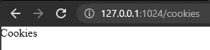

Example cookies page

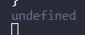

Example output on the console

我们可以看到，在输出中又出现了一个未定义的保留字，因为我们需要用 cookie 传递信息。

```
req.headers
```

来自客户端的信息你可以在 Chrome DevTools 的网络部分看到，点击页面，在右边你会看到标题。

```
app.get( '/headers', ( *req*, *res*) => {
*res*.type( 'text/plain' )
const headers = *Object*.entries( *req*.headers )
*res*.send(
headers.map( *itm* => `${ *itm*[ 0 ] }: ${ *itm*[ 1 ] }` )
)})
```

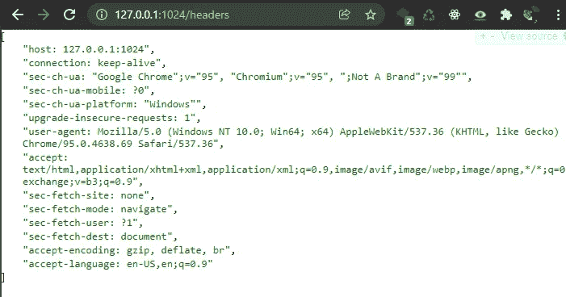

Example headers from the server to the client

这是关于从服务器到客户端的头的信息，但是我把它发送到客户端，但是这是在幕后

```
req.accepts
```

这是为了确定用户是否接受给定的类型

```
app.get( '/accepts', ( *req*, *res* ) => {
console.log(*req*.accepts)
*res*.send( 'Accepts' )})
```

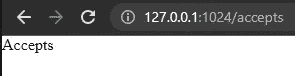

Example accepts page

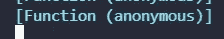

Example output on the console

我们可以看到 for accepts 发送了一个匿名函数，其中包含了我们需要的信息。

```
req.ip
```

包括客户端的 IP

```
app.get( '/ip', ( *req*, *res*) => {
const ip = *req*.ip
console.log( *req*.ip )
*res*.send( `Your IP address is : ${ ip }`  )
})
```

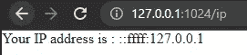

Example IP address from the client

如您所见，正在发送本地环境的 IP 地址

```
req.hostname
```

客户端报告的主机名

```
app.get( '/hostname', ( *req*, *res* ) => {
console.log( *req*.hostname)
*res*.send( `Your hostname is : ${*req*.hostname }` )
})
```


Example hostname of the client

如您所见，在这种情况下，发送客户端的主机名也是本地环境

```
req.path
```

URL 的请求路径只是路径

```
app.get( '/path', ( *req*, *res* ) => {
console.log(*req*.path)
*res*.send(  `your path is : ${ *req*.path }`)
})
```

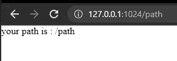

Example path page

同样的方式也适用于路径页面

```
req.xhr
```

如果调用是 Ajax，它将返回 true

```
app.get( '/xhr', ( *req*, *res* ) => {
console.log( *req*.xhr )
*res*.send( `Are you using XHR? : ${ *req*.xhr }` )})
```

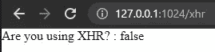

Example using XHR in the XHR page

```
req.protocol
```

检查请求是什么协议，HTTP 还是 HTTPS

```
app.get( '/protocol', ( *req*, *res* ) => {
console.log( *req*.protocol )
*res*.send( `your protocol is: ${ *req*.protocol }` )
})
```

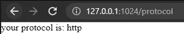

Example showing protocols

在这一部分，它会发送您正在使用的协议，HTTP 或 HTTPS 在这种情况下是 HTTP

```
req.secure
```

如果连接是安全的，返回 true

```
app.get( '/secure', ( *req*, *res* ) => {
console.log( *req*.secure )
*res*.send( `Is this secure? ${ *req*.secure }` )
})
```


Example secure page

我们可以看到我的页面不安全，因为我们使用 HTTP 而不是 HTTPS

```
req.url
```

这将返回路径和查询字符串

```
app.get( '/url', ( *req*, *res* ) => {
console.log( *req*.url )
*res*.send( ` this is your url ${ *req*.url }` )
})
```

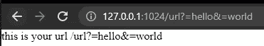

Example URL Object URL page

最后，我们可以看到 URL 正在发送 URL 和查询字符串

# 结论

总之，请求对象非常方便，因为它是向客户端返回清晰信息的基础，在这种情况下是一致和准确的，了解这个对象并与它一起工作以在 Express.js 项目中增加更好的结果非常重要。

# 来源

这本[书](https://www.amazon.com/Web-Development-Node-Express-Leveraging/dp/1492053511)真的很神奇！

[](http://expressjs.com/en/api.html#req) [## 4.x API

### 创建快速应用程序。express()函数是由 express 模块导出的顶级函数。var…

expressjs.com](http://expressjs.com/en/api.html#req)