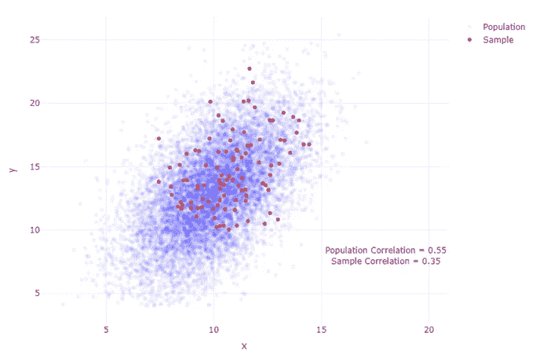
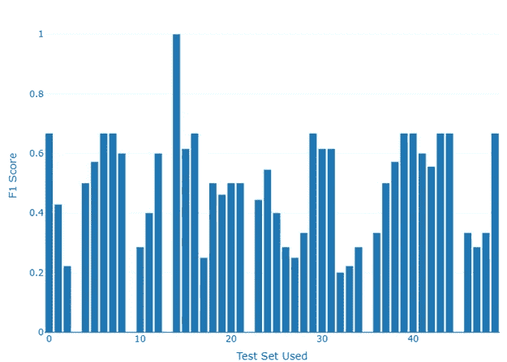
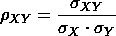
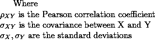
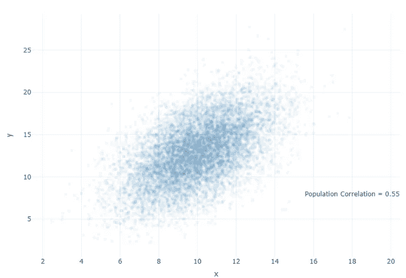
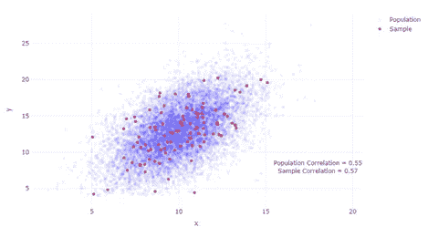
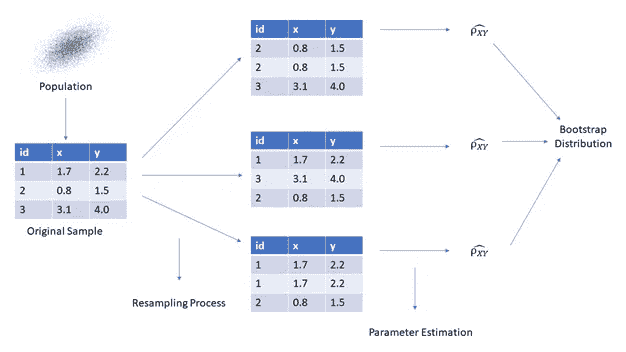
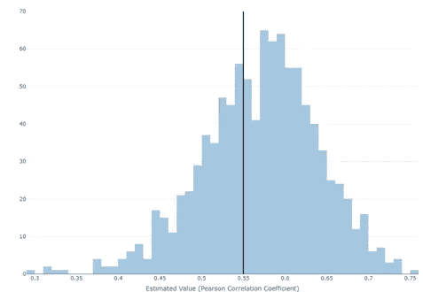
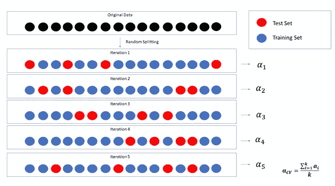

# 机器学习建模的重采样方法

> 原文：<https://medium.com/geekculture/resampling-methods-for-machine-learning-modeling-d2cdc1d3640f?source=collection_archive---------3----------------------->

Image by [Manja Vitolic](https://unsplash.com/@madhatterzone)from [Unsplash](https://unsplash.com/)

**什么是重采样方法？**

一般来说，重采样方法是一种工具，它包括从数据集中重复提取样本，并对这些样本中的每个样本计算统计数据和度量，以便获得关于某些东西的进一步信息，在机器学习设置中，这些东西是模型的性能。但是在仅仅是统计分析的情况下，这可能是关于一些参数的行为的额外洞察

**我们为什么要用它？**

两个词可以表达使用重采样方法的必要性:**随机机会**。每次我们从总体中抽取样本并计算统计量时，估计的参数可能会尽可能接近真实的总体值，这只是由于随机的机会，因此我们没有任何关于结论可信度的信息，我们的预测将是可疑的。这就是为什么我们使用 **bootstrapping** ，从我们的原始样本中抽取多个样本(重新采样)，我们可以首先探索可能产生的不同组合，计算标准误差和置信区间，这为我们提供了估计真实总体参数的一致值范围。

Computing a statistic from a sample carries some degree of uncertainty. In the image we can see how the sample estimate differs from the real value in approx. 36%. The bootstrap method helps us to address this problem. PS: the effect has been exaggerated. Image by Author

在评估模型性能的情况下，我们通常将数据集分为训练集和测试集。但是这种方法有一个缺点，模型的性能会根据所选的测试集显示不同的结果。由于关心模型的是它的泛化能力(在看不见的数据上执行)，这种测量的不稳定性使得比较不同的模型变得困难，并且给出了模型性能的可疑景象

Depending on the test set selected, the evaluation of a model can be very misleading. In the image we can see how the model shows F1 Scores (a performance metric) ranging from 0.2 to 1.0 (Which is a big deal of difference). The cross-validation approach comes in handy to address this volatility. Image by Author

**自举**

自举是由反义寡核苷酸引起的重采样方法。它包括从我们的原始样本中取出多个样本，并研究由此产生的分布，我们为什么要这样做？嗯，它让我们可以看到有多少变化，并进一步了解我们首先采取的样本。

bootstrap 方法主要用于提供估计的标准误差，从而计算置信区间。

**自举方法的优势**

*   这很容易实现
*   它不依赖于我们对人口分布的任何假设
*   让我们对数据集的不确定性有所了解，从而得出更一致的结论

**它是如何工作的？**

执行引导程序重采样的步骤如下:

*   从人群中抽取一个样本，一个数据集
*   从样品中取出多个样品并替换。我们采集的样本越多，它就越精确，……而且会消耗越多的时间
*   计算这些样品中每一个的感兴趣的统计量
*   确定结果分布的标准误差(标准偏差),并用它们计算置信区间
*   然后使用这个置信区间进行数据分析。你可以根据不确定性的详细程度对总体参数做出结论

**插图**

让我们假设我们有两个变量 X 和 Y，并希望量化它们之间的相关性。做统计的人现在知道这个度量可以用公式来确定:

对于我们的模拟生成的数据集(图像),我们计算出的相关性为 0.55，这表明 X 和 Y 之间存在某种正相关关系:

Image by Author

问题出现在真实情况下，我们无法获得群体参数，因为我们无法通过模拟生成数据，诸如方差和相关性之类的量是不可获得的，但却是可估计的。我们能做的是使用样本数据计算这些测量的近似值，但是由于上面解释的随机机会的影响，我们不能完全依赖这些点估计。这就是 bootstrap 发挥作用的地方

我们首先从总体中抽取一个样本，假设我们的样本有 100 个观察值

Image by Author

现在，bootstrap 方法允许我们使用计算机来模拟获得新样本集的过程，因此我们可以仅使用初始样本(100 个观察值)来估计相关性的可变性。我们不是从总体中获得独立的数据集，而是通过从原始数据集重复采样观察值并计算每个重采样的相关性来获得不同的数据集。下图描述了这一过程:

Image by Author

在每个重采样中得到的度量(在这种情况下是相关性)构成了一个分布，即所谓的自举分布

Bootstrap distribution build on a sample of 100 observations draw out from a 10K population. The black line represents the real population value (0.55). Image by Author

然后我们可以使用这个引导分布来做我们想做的任何事情。比如计算置信区间或者估计人口参数。

值得注意的是，自举不是减少误差的方法，而是估计误差。它旨在计算总体的形状和分布，而不是点估计(单个值而不是它们的区间)。它没有向我们的样本添加新数据，正如我们从上面的直方图中看到的，bootstrap 分布的平均值与实际平均值略有不同，这是因为所选样本引入的偏差，如果我们的数据更具代表性，我们的分布将更加以平均值为中心，反之亦然。它有助于进一步了解我们的人口，但它不是万灵药，如果我们的样本是极端有偏见的，那么我们从自举或任何其他重采样方法得出的任何结论都将是可疑的

**交叉验证**

机器学习设置的主要缺点之一是训练误差和测试误差之间的差异。这方面的一个例子是著名的过拟合，大多数统计学习算法通过考虑比信号更多的噪声来直接或间接地寻求最小化训练误差，然后，当给模型提供新数据时，与训练度量可能首先指示的相比，它表现很差。不要误解我的意思，训练指标是自动化和了解学习算法执行情况的关键(快速比较)，但最终，模型的效用取决于它管理不可见数据的能力(通过测试指标衡量)。举例来说，当我们优化训练指标时，我们可能正在记忆数据，当优化测试指标时，我们正在从中学习，这就是我们想要的。

什么是交叉验证法？

将数据集划分为一个大的训练集和一个小的测试集是拟合和评估模型的典型方法，这被称为验证集方法。但是这种方法存在以下问题:

*   测试错误率的验证估计值变化很大，具体取决于哪些观察值包含在训练集中，哪些观察值包含在验证集中(如本文第二张图所示)
*   只有观察值的子集(包括在训练集中而不是验证集中的观察值)用于拟合模型

交叉验证是对这种方法的改进，旨在解决以前的责任。它的变种很少，但最实用的是**分层** **k 倍交叉验证**

它基本上以如下方式工作:

*   而不是创建两个数据子集，一个用于训练，另一个用于测试。这种方法包括**随机地**将一组观察结果分成 *k 个*组，或者折叠，大小大致相等。第一个折叠被视为验证集，该方法适用于剩余的 k1 折叠
*   然后，测试误差(或测试度量)是根据保留的折叠(验证集)的观察值来计算的
*   这个过程重复 *k* 次；每次，一组 different 观察值被视为一个验证集。这个过程产生测试误差的 *k* 估计值。k 倍交叉验证估计值是通过对这些值取平均值来计算的，这可以被认为是我们评估模型的最终的、经过策划的测试度量

An illustration of how the stratified k-fold cross-validation approach works. In this case we are performing the algorithm with k = 5\. Acv is the average of all the metrics estimated, and is the metric that we can use to compare between models. Acv could be any test metric we want, like the Mean Square Error (MSE), or the F1-Score; in case of classification models. Image by Author

**交叉验证的优势**

基本上，交叉验证方法的优点/效用是它解决了前面提到的责任

*   由于重采样的数量，我们可以对获得的不同测试度量进行平均，击败当我们只有一个测试集时随机机会的影响
*   我们使用所有的数据。当我们给它们更多的数据时，好的构建算法表现得更好。而且用他们没有见过的数据测试模型，获得准确的测试度量

什么时候使用引导和交叉验证？

虽然 bootstrap 和 CV 都是重采样方法，但是它们的用途是不同的。当**通过测试指标评估**型号**的性能时，你应该使用交叉验证。当你想用他的标准误差和置信区间对某个群体的值进行估计的时候。**

# 参考:

R 中的统计学习导论。