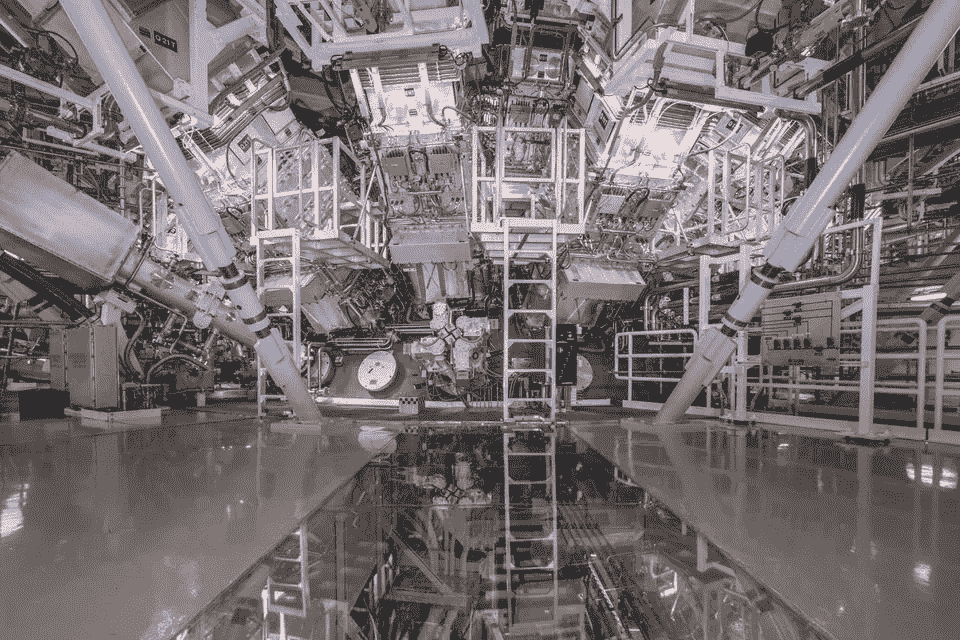

# 研究人员引发首个可持续聚变反应——市场疯人院

> 原文：<https://medium.com/geekculture/researchers-spark-first-sustainable-fusion-reaction-market-mad-house-1dd4d5194bbb?source=collection_archive---------6----------------------->

研究人员声称在国家点火装置(NIF)用激光引发了第一次可持续聚变反应。

据路透社报道，为了解释这一点，聚变燃料在被 192 束 X 射线激光轰击后，自身加热到了更高的温度。因此，研究人员首次实现了他们称之为燃烧聚变的现象。

