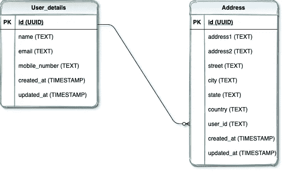
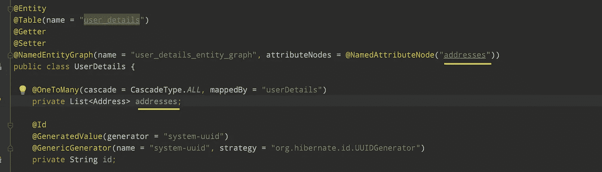
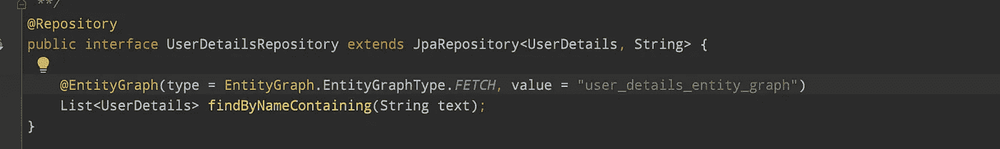
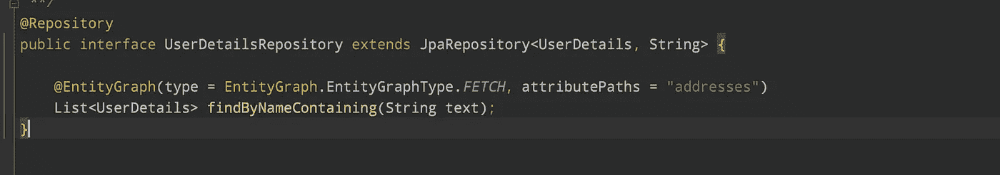
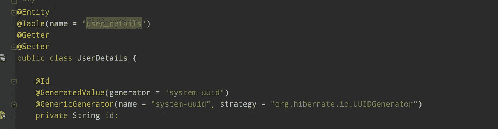

# 解决休眠 N+1 问题

> 原文：<https://medium.com/geekculture/resolve-hibernate-n-1-problem-f0e049e689ab?source=collection_archive---------0----------------------->

在这个故事里，我讲的是什么是 N+1 问题，对应用性能有什么影响，以及如何在应用中克服这一点。本文将通过 spring boot 中的一个例子演示 N+1 查询是如何发生的以及它们的解决方案。

> 这也是面试中最常见的问题。


***Hibernate 中的 N+1 问题是什么？***

***N+1 查询问题*** 据说，当一个 ORM(如 hibernate)执行 1 个查询来检索父实体，执行 N 个查询来检索子实体时，就会出现这种问题。随着数据库中实体数量的增加，单独执行的查询很容易影响应用程序的性能。



user_details 和 address 之间的关系是从 user_details(id)到 address(user_id)的一对多映射。这意味着一个用户可以有许多地址。

**UserDetails.java**

**Address.java**

**SQL DDL 语句**

现在让我们用存储库函数查询包含在`user_details`表上的名称。

```
***@Repository***
public interface UserDetailsRepository extends JpaRepository<UserDetails, String> {

   List<UserDetails> findByNameContaining(String text);
}
```

当我们调用该函数时，这将生成两个不同的查询，一个基于`name`从 user_details 获取，另一个基于使用`user_id`的地址。到目前为止，我们只有两个用户，额外的查询只有两个。如果匹配查询的数量增加，附加查询也会增加。

```
Hibernate: select userdetail0_.id as id1_1_, userdetail0_.created_at as created_2_1_, userdetail0_.email as email3_1_, userdetail0_.mobile_number as mobile_n4_1_, userdetail0_.name as name5_1_, userdetail0_.updated_at as updated_6_1_ from user_details userdetail0_ where userdetail0_.name like ? escape ?Hibernate: select addresses0_.user_id as user_id10_0_0_, addresses0_.id as id1_0_0_, addresses0_.id as id1_0_1_, addresses0_.address1 as address2_0_1_, addresses0_.address2 as address3_0_1_, addresses0_.city as city4_0_1_, addresses0_.country as country5_0_1_, addresses0_.created_at as created_6_0_1_, addresses0_.state as state7_0_1_, addresses0_.street as street8_0_1_, addresses0_.updated_at as updated_9_0_1_, addresses0_.user_id as user_id10_0_1_ from address addresses0_ where addresses0_.user_id=?Hibernate: select addresses0_.user_id as user_id10_0_0_, addresses0_.id as id1_0_0_, addresses0_.id as id1_0_1_, addresses0_.address1 as address2_0_1_, addresses0_.address2 as address3_0_1_, addresses0_.city as city4_0_1_, addresses0_.country as country5_0_1_, addresses0_.created_at as created_6_0_1_, addresses0_.state as state7_0_1_, addresses0_.street as street8_0_1_, addresses0_.updated_at as updated_9_0_1_, addresses0_.user_id as user_id10_0_1_ from address addresses0_ where addresses0_.user_id=?
```

**如何解决这个问题？**

***EntityGraphs*** 通过定义需要使用 SQL 连接从数据库中检索哪些实体，提供了一种制定性能更好的查询的方法。

EntityGraphs 有两种类型， ***Fetch*** 和 ***Load*** ，定义 EntityGraphs 的属性节点指定的*以外的实体是否应该被懒洋洋地*或*取。EntityGraph 的属性节点指定的属性总是被*急切地获取*。***

*****提取类型:*** 由 EntityGraph 的 AttributeNodes 指定的属性被视为 FETCH TYPE。EAGER 和其余属性被视为 FetchType.Lazy。**

*****加载类型:*** 由 EntityGraph 的 AttributeNodes 指定的属性被视为 FetchType。EAGER 和其余的属性根据它们指定的或默认的 FetchTypes 来处理。**

**实体图可以用两种方式定义**

## **1.使用 NamedEntityGraph 批注**

**要使用 NamedEntityGraph，首先，用 JPA 的 **@NamedEntityGraph** 注释对实体类 UserDetails 进行注释，然后用图的名称将 **@EntityGraph** 注释附加到存储库方法。**

********

**现在，如果您再次运行 repository 方法，就会执行一个查询。**

```
****Hibernate: select userdetail0_.id as id1_1_0_, addresses1_.id as id1_0_1_, userdetail0_.created_at as created_2_1_0_, userdetail0_.email as email3_1_0_, userdetail0_.mobile_number as mobile_n4_1_0_, userdetail0_.name as name5_1_0_, userdetail0_.updated_at as updated_6_1_0_, addresses1_.address1 as address2_0_1_, addresses1_.address2 as address3_0_1_, addresses1_.city as city4_0_1_, addresses1_.country as country5_0_1_, addresses1_.created_at as created_6_0_1_, addresses1_.state as state7_0_1_, addresses1_.street as street8_0_1_, addresses1_.updated_at as updated_9_0_1_, addresses1_.user_id as user_id10_0_1_, addresses1_.user_id as user_id10_0_0__, addresses1_.id as id1_0_0__ from user_details userdetail0_ left outer join address addresses1_ on userdetail0_.id=addresses1_.user_id where userdetail0_.name like ? escape ?****
```

****2。在存储库接口上使用专用实体图****

**您也可以使用 ***attributePaths*** 定义一个特定的 EntityGraph，而不需要在实体上使用 NamedEntityGraph 注释。***attribute paths***应该包含要急切获取的实体的名称。**

********

**现在，如果您再次运行 repository 方法，就会执行一个查询。**

```
****Hibernate: select userdetail0_.id as id1_1_0_, addresses1_.id as id1_0_1_, userdetail0_.created_at as created_2_1_0_, userdetail0_.email as email3_1_0_, userdetail0_.mobile_number as mobile_n4_1_0_, userdetail0_.name as name5_1_0_, userdetail0_.updated_at as updated_6_1_0_, addresses1_.address1 as address2_0_1_, addresses1_.address2 as address3_0_1_, addresses1_.city as city4_0_1_, addresses1_.country as country5_0_1_, addresses1_.created_at as created_6_0_1_, addresses1_.state as state7_0_1_, addresses1_.street as street8_0_1_, addresses1_.updated_at as updated_9_0_1_, addresses1_.user_id as user_id10_0_1_, addresses1_.user_id as user_id10_0_0__, addresses1_.id as id1_0_0__ from user_details userdetail0_ left outer join address addresses1_ on userdetail0_.id=addresses1_.user_id where userdetail0_.name like ? escape ?****
```

****结论****

**因此，N+1 个查询减少到只有一个使用连接从两个表中获取数据的查询。
EntityGraphs 提供了一种机制，通过这种机制，可以在单个 select 语句中从数据库中快速提取实体，从而帮助提高应用程序的性能。您还可以使用子图来定义子类的实体，这些实体需要和父类一起获取。**