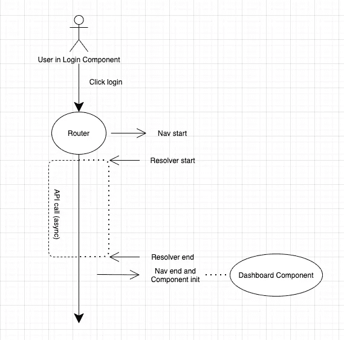

# 预加载数据的角度解析器

> 原文：<https://medium.com/geekculture/resolvers-in-angular-to-pre-load-data-16c37393b172?source=collection_archive---------4----------------------->

## 从一条路线导航到另一条路线时了解角度路线解析器


Resolvers in Angular to Pre-Load data

当*加载一个 Angular 组件时，我们进行一个 API 调用，该调用将获取一些数据并将其与 ngOnInit 生命周期钩子*中的 UI 绑定。在这样做的同时，组件呈现 HTML 框架，然后一旦数据从 API 调用中可用，就动态地绑定数据。

这种方式很好，但更好的呈现数据的方式是借助解析器。

## 那么到底什么是角旋变器呢？

> `**Angular Route Resolver**`用于在用户从一条路线导航到另一条路线时预取一些数据。它可以定义为一种平滑的方法，通过在呈现导航组件之前提供数据来增强用户体验。



A simple flow of how Resolver works

要实现一个解析器，它将类似于我们如何实现一个服务，它将是一个带有@ injectible()decorator 的类文件。用 Resolve 接口实现 ResolverService。这是一个通用接口，我们可以在其中提供我们想要的数据作为 Resolve <t>的回报，它为我们提供了在导航期间被调用的 Resolve 方法。</t>

(请忽略下面截图中的其余逻辑)

只要看看我是如何编写一些逻辑并进行 API 调用来从服务器获取食谱的(如果本地没有的话)。


Resolver code which fetches recipes from a server before the route navigation is completed and the component is loaded

要访问组件中的数据，我们必须在特定路由的 app-routing.module.ts 中添加此 ResolverService。

这里，resolve 占用了 angular 将查找的解析器的映射:

```
{
 path: ':id', 
 component: RecipeDetailComponent, 
 resolve: [RecipeResolverService]
},
```

为了访问解析的数据，我们将使用 *ActivatedRoute* 服务的数据属性。在我们的组件中，从构造函数注入 ActiveRoute，该构造函数提供对与插座中加载的组件相关联的路由信息的访问:

```
constructor(private activatedRoute: ActivatedRoute) {}
```

然后在 ngOnInit 中，我们可以订阅 activatedRoute 的数据属性:

```
ngOnInit(): void {
 this.activatedRoute.data.subscribe(
  (data) => {
   //logic to handle data
 });
}
```

或者我们也可以获得这条路线的当前快照:

```
ngOnInit(): void {
 this.data = this.activatedRoute.snapshot.data;
 //logic to handle data
}
```