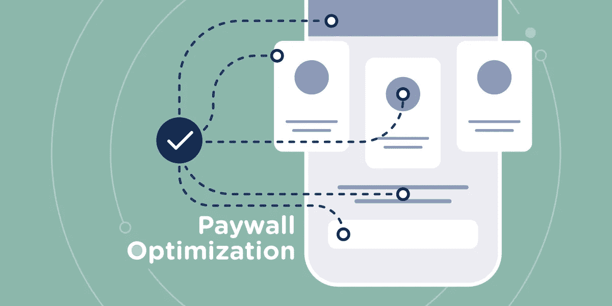
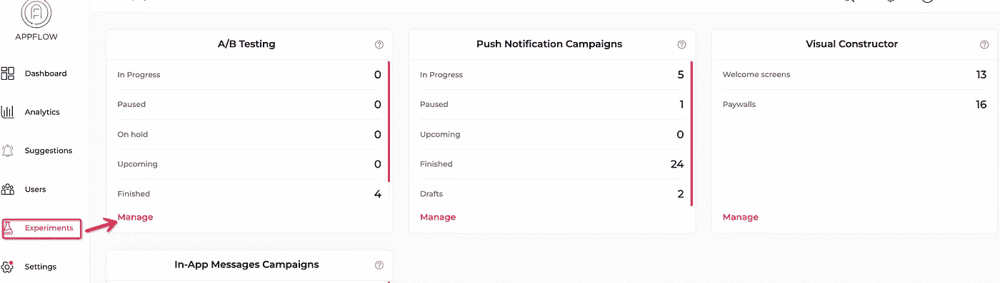
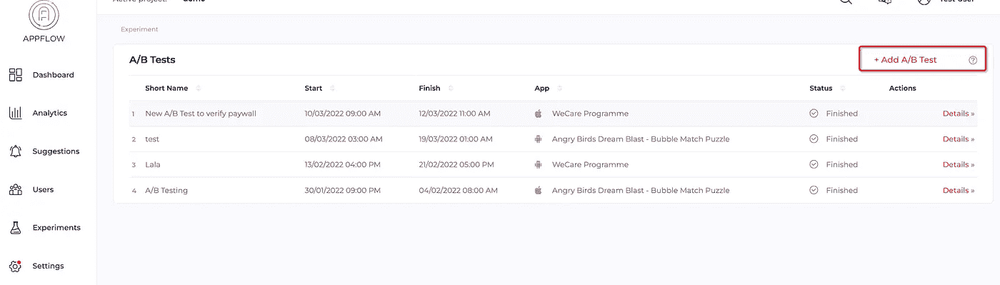
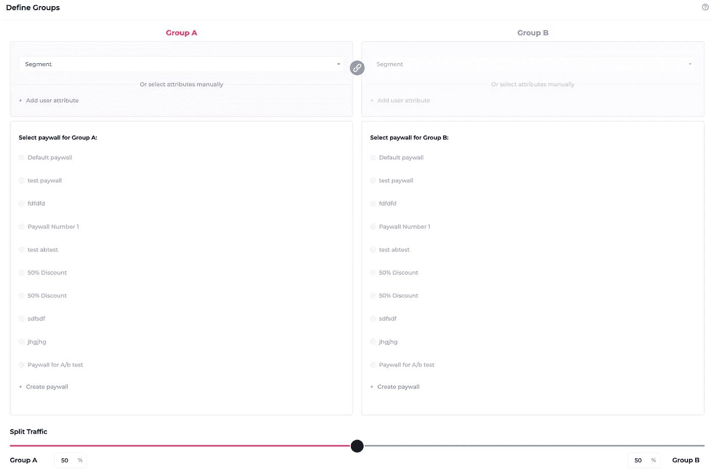

# iOS 和 Android 付费墙优化资源

> 原文：<https://medium.com/geekculture/resources-for-ios-android-paywall-optimization-d6fdbb813ceb?source=collection_archive---------10----------------------->

付费墙通常是一个屏幕，用户被要求付费以访问内容或体验。它是一个虚拟的门户，将免费内容和需要订阅的内容分开。这些付费墙在 iOS 和 Android 中都存在。付费墙模式非常受欢迎，因为它有很多优势，从创收到增加用户。它让用户对付费墙背后的产品质量有了信心。与 onClick 广告相比，付费墙也被证明是更可靠的收入来源，据研究，点击广告的访问者比例约为 0.2-0.5%。即使是适度的付费墙也能产生更高的收入。这就梳理了付费墙的主要方面。

# 应用付费墙优化资源

设计师是不断寻找创新方法的创意者。由于有了互联网，设计资源现在变得更加容易获取。只需轻点几下，就能随时随地发现灵感。对于 UX/UI 设计师来说，有一些很棒的网站和应用程序可以找到与付费墙、网页设计、应用程序设计、横幅、海报设计等相关的灵感。
本文包括一个顶级资源列表，提供了付费墙的设计理念和灵感。

# UXFlow.ai

[UXFlow.ai](https://www.uxflow.ai/) 是一个免费网站，可以显示任何应用程序的移动应用程序屏幕，允许移动应用程序所有者/设计者调查、比较和增强他们自己应用程序的 UX 和用户界面，同时节省时间和金钱。他们提供了大量的应用程序屏幕，特别是付费墙和入职屏幕(2000 多个应用程序屏幕)。

# 滴水不漏

[Dribble](https://dribbble.com/) 让设计师可以发布他们的作品，并与他人分享他们的设计知识。Dribbble 的收藏整体质量很高，许多摄影师、设计师和其他艺术家都用它来展示他们的作品。然而，它并不是对所有人开放的。要提交自己的作品，必须先从其他设计师那里获得邀请码。

# 行为

[Behance](https://www.behance.net/) 是 UI 设计师获取设计灵感的顶级网站之一。有许多来自世界各地的设计师的宏伟作品。每天，Behance 的管理团队都从广泛的行业中精心挑选新鲜的创意作品。设计，时装，插图，工业设计，建筑，摄影，美术，广告，印刷，动画，音效，和其他学科都包括在内。

# 拼趣

Pinterest 是顶级图片和视频分享网站之一，让个人发现新想法，并获得灵感去完成他们喜欢的事情。这个平台提供了广泛的信息，如设计、家居装饰和烹饪食谱等。Pinterest 用户通过欣赏、评论和评论彼此的作品来相互交流。

# 无花果树

[FigmaCrush](https://www.figmacrush.com/) 是 Figma 设计资料的最大集合。这是 Figma UI 套件、移动和网站模板、图标、线框套件以及 Figma 社区制作和发布的任何其他有趣的 Figma 设计资产的综合列表。

# 付费墙的哪些元素需要优化？

付费墙中的特定功能必须进行优化，以便涵盖所有基础，整个过程可以像一个润滑良好的引擎一样运行。需要给予重视的特征如下:

*   带有吸引人的标题和报价的恰当措辞可能会吸引用户。用户通常不了解技术，因此无法理解产品的技术细节，因此他们需要简短、醒目和清晰的描述，说明他们在购买产品时将拥有的优势。
*   **透明**
    与用户建立的信任是一个非常重要的因素。为了发展这种信任因素，必须清楚地提及关于应用程序的信息，例如订阅成本、订阅持续时间等，并且整个订阅过程应该是用户友好的。
*   **可视性**
    适当的可视性是拥有较高转化率的绝对要求。更大的可视性并不直接与显示的高频率相关，而是必须达到一个完美的平衡，以便用户获得足够的信息，同时不会被该功能所挫败。
*   一个吸引人的付费墙界面设计会吸引很多潜在用户。适当的字体大小和正确的配色方案，搭配主题背景(根据节日或季节)将是最佳组合。这证明了视觉冲击对潜在客户的重要性。
*   **定价和折扣**
    这对于付费墙 A/B 测试至关重要，有助于应用开发者根据预算和需求确定最佳 SKU。选择范围从 7 天到每月，以及季度和年度计划与各自的价格。

# 订阅付费墙的无编码 A/B 测试

没有单一的完美付费墙，这就是为什么 A/B 测试对于订阅应用非常重要。为了节省开发资源，提高实验效率，推荐一个免编码的 a/b 测试工具，可以在 Appflow.ai —应用内订阅 SDK 中找到。

通过远程配置对移动付费墙实施 A/B 测试非常简单，如下所示:

1.  **转到您计划添加新 A/B 测试的活动项目的 Appflow.ai 实验**。**点击管理**，可以在 A/B 测试卡底部找到。

2.现在您可以看到您所有的 A/B 测试的状态被列在一个带有编辑和删除选项的表格中。**点击右上角的**添加新的 A/B 测试，为你的应用创建一个 A/B 测试。

3.在输入字段中填入相应的值，如 A/B 测试的名称、平台和日期范围。

4.**为每个组选择用户段**。Appflow.ai 支持灵活的用户群进行付费墙 a/b 测试。

**5。为定义的组**选择付费墙，并通过以最佳比例分割流量来平衡负载。Appflow.ai 还允许移动应用程序开发人员使用他们的[拖放式可视构造函数](https://www.appflow.ai/remote-configuration)来构建订阅付费墙。

现在按下**“保存并下一步”**完成该过程。

按照这些简单的步骤，您可以成功地为您的移动订阅付费墙实施 A/B 测试。A/B 测试允许您试验不同版本的订阅付费墙，方法是向不同的用户群显示这些版本，以确定哪个版本的性能更好。而且最重要的是，你不需要在应用商店发布新版本。

# 最终想法

如果你想在你所做的事情上做到最好，你必须不断磨练你的才能，让你的创造力发挥出来。灵感是伟大设计的核心。像 uxflow.ai 和 appflow.ai 这样的应用程序已经被证明对订阅应用程序的付费墙设计和测试非常有用。前者提供了一个数据库，以激发应用程序开发人员和设计人员进行最佳的应用程序 UI/UX 设计，而后者为您的应用程序提供免编码的 A/B 测试，并根据您的目标生成统计数据。点击此处访问 [Appflow.ai 进行无编码 A/B 测试](https://www.appflow.ai/ab-testing)，我希望这篇文章为优化 iOS 和 Android 付费墙提供了很好的资源洞察。

**更多资源:** [4 款针对手机 App 的用户细分](https://www.appflow.ai/blog/4-models-for-mobile-app-user-segmentation)

 [## 应用订阅的 A/B 测试- Appflow

### 价格测试有助于你了解你的客户群，以及他们对不同价格模式的反应。配置和…

www.appflow.ai](https://www.appflow.ai/ab-testing)