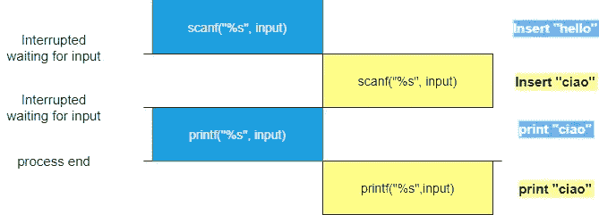
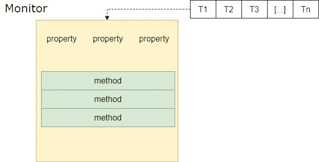

# 资源竞赛

> 原文：<https://medium.com/geekculture/resources-race-competition-573c84c33d99?source=collection_archive---------17----------------------->

## 一点理论


Monza 2005 — Micheal Schumacher win the Italian GP (Picture from the web)

## 介绍

去年，我负责设计和实现一个事件驱动的系统。我讨论最多的话题之一是对共享资源的并发访问。我需要多次讨论如何在分布式多线程环境中保证对共享数据的安全访问。

那些讨论激发了我写这个故事和下面的内容。我想回到基础，一起探讨并发访问的含义。

## 一个常见的例子

要有一个共同的背景，我给大家介绍一个例子。

让我们假设以下代码在单核机器上的多线程环境中运行。这些简化并没有消除问题，而是让我们面对它。

看后面的 C 代码:

```
void add(char[] *input)
{
   scanf("%s",input);
   printf("%s",input);
}
```

这个函数有一个指针作为输入，不返回任何东西。它读取关键字，然后回显它们。对于那些不熟悉 C 语言的人，可以在这里浏览一下。

我指出指针是共享资源。事实上，在多线程环境中，所有线程共享相同的内存位置。

以下是一个可能的场景:



example run

该运行打印“ciao”两次，而“hello”从不打印。这种情况之所以存在，是因为我们无法对以下方面做出任何假设:

*   步骤执行的顺序；
*   每个线程的相对速度。

如果您想避免这种情况，我们需要研究一种算法，允许我们安全地访问共享变量。

## 保护资源

根据 OS 理论，我们有三个方面要赶时间:

*   **互相排斥；**
*   **僵局**；
*   **饥饿**。

当访问共享资源时。

我们将*互斥*定义为一个线程独占访问一个共享资源的需求。我们将访问共享资源的代码部分称为*临界区*。当我们设计一个算法时，我们必须保证不超过一个线程同时运行临界区。

您的同步模式必须避免*死锁*和*饥饿*问题。

**死锁**是一种墨西哥式的线程停滞:我将尝试用另一个例子来解释。


Mexican Stall from Sergio Leone‘s The Good, The Bad and The Ugly (picture from the web)

让我们考虑两个线程 T 和 T，它们都需要使用 R and R。可能发生的情况是:

*   r 锁 T；
*   r 锁 T；
*   t 需要 R 来完成；
*   t 需要 R 来完成。

两个线程都被阻塞在一个 stall 中，无法继续，就像西部电影中一样。

**饥饿**发生在一个进程无限期等待访问一个资源的时候。这个问题的出现是因为线程执行时间和调度器行为是未知的*先验*。

Dijkstra 在[1]中阐述了第一个解决方案。今天它被认为是过去了，但它是后来建造的基础。

在下一章中，我将介绍一些由操作系统和编程语言实现的基本原语，它们允许您创建同步模式。

## 旗语

信号量是允许两个或更多进程合作的最简单的原语。

您可以将信号量看作一个共享的*数字*变量，您只能使用原子方法来访问它。当我使用*原子*时，我说调度程序不能中断进程执行。

信号量公开了一个构造函数和两个方法:

*   *等待*:变量减 1；
*   *信号*:将变量加 1

在等待调用之后，如果信号量为负，调用方进程将被阻塞，无法继续执行。

信号量本身并不能解决同步问题。你需要创建一个使用它们的算法。

最简单的方法是使用二进制信号量实现一个临界区:

```
s = semaphore(mysem);
wait(s);
#let's start critical section
[...]
signal(s);
```

让我们假设信号量是在共享代码部分的其他地方初始化的。

第一个进入的线程调用 wait 值，并取回控制权，因为 0 是一个公认的正值，可以启动临界区。

当它工作时，另一个线程来调用 wait 原语。它不能继续下去，因为信号量变成了-1。当第一个线程调用 signal 方法时，允许第二个线程继续。

使用信号量解决的最常见的问题之一是读取器-写入器问题。你有一个共享的内存和两种类型的进程:作者和读者。

读取器线程不修改共享资源状态，而您可以假设可能有多个线程在执行临界区。在此期间，不允许多个写入程序在关键路径上运行。我们不允许读者和作者交错。

我不想在这里处理这个问题，你可以在文献中找到解决方法，看看参考书目部分。

信号量，正如它们被定义的那样，有一些限制。最重要的一点是，信号量并没有解决互斥的问题。这涉及到很容易出错:死锁和饥饿仍然是可能的。事实上，在经典定义中，线程等待信号的时间是没有界限的。

## 班长

监视器是比信号量更复杂的对象。在面向对象的时尚设计中，您可以将监视器视为封装共享所需数据的对象。您只能使用管理互斥的监视器公开方法来访问共享数据。

对于施工，班长保证只有一个工序运行到临界段。我们可以认为监视器是比信号量更容易出错的解决方案，因为您不能忘记任何关闭临界区的信号。



为了保证方法执行中的某种同步，监视器允许所谓的*条件变量。如果测试为假，条件变量*允许监控程序中断执行。为了提供这样的行为，这些变量允许两种方法:

*   *wait* ():调用该方法的线程被阻塞并排队，直到条件为真；
*   *信号*():唤醒第一个排队的线程。

这些操作与信号量的操作完全不同。如果没有线程入队，并且 signal()运行无操作场景。

Monitor 代表了比信号量更简单的原语。它不能解决互斥问题，你必须正确地使用条件。此外，读取器不能使用监视器一起访问同一个缓冲区。

## 信息发送

让流程协调的另一种方式是消息传递。

这种方法允许进程同步和数据共享。为了交换消息，我们定义了几个原语:

*   *发送(目的地，消息)*
*   *接收(来源，消息)*

第一个允许流程向流程/目的地发送消息，第二个允许流程接收消息。

您赋予这些原语的实现类型、进程同步和解决互斥问题的方式都会发生变化。这两种操作都可以是阻塞的或不阻塞的。

在阻塞情况下:

*   *发送*:线程等待对方接收消息；
*   *接收*:如果产生了一个消息，线程接收它。如果仍然没有产生消息，线程停止。

相反，在非阻塞场景中:

*   *发送*:线程发送消息并继续
*   *接收*:只有当消息还在产生时，线程才会接收到消息。

交换消息并不能解决同步问题。这是一个有效的工具，你可以用来建立你的算法。这个原语非常重要，因为它是分布式系统可以接受的解决方案。

## 结论

这个故事是讨论进程同步的系列文章的第一篇。在这一篇中，我谈到了我日常工作背后的理论。

我保证，这些故事将讲述编程语言如何让你实现这些原语。

有兴趣的话，敬请关注！

## 文献学

*   [1] **E.W. Dijkstra** — *并发编程控制中一个问题的解决*—ACM 的通信
*   [2] **J. Bacon，T. Harris** — *操作系统:并发和分布式软件设计* — Addison Wesley
*   [3] **W. Stalling** — *操作系统内部和设计原则第三版* — Jackson(意大利语版)