# 响应对象 Express.js

> 原文：<https://medium.com/geekculture/response-object-express-js-d6e44213a001?source=collection_archive---------2----------------------->


Response Express.js

response 对象是 Express.js 的有用部分，我们将开始检查哪些是最重要的方法，因为我们需要知道它有什么，以及我们可以从中了解到什么。

# 响应对象

响应对象被传递给请求处理器的第二个参数，这样我们就可以给用户发送一个页面，一个图片，一个下载文件等等。

首先，我们需要用 Express.js 创建我们的小服务器，开始吧！

安装 express 并创建我们的 js 文件，然后启动服务器

```
const express = require( 'express' )
const app     = express()
const port    = process.env.PORT || 1024app.get( '/', ( *req*, *res* ) => {
*res*.type( 'text/plain' )
*res*.send( 'Thanks for reading' )})app.listen( port, console.log( `http://127.0.0.1:${ port }` ) )
```


Example starting our server

```
res.status( code )
```

这是用于发送页面的状态，最常见的状态有 404、200、500。

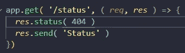

Example code res..status

```
app.get( '/status', ( *req*, *res* ) => {
*res*.status( 404 )
*res*.send( 'Status' )
})
```

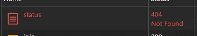

Example status 404 using the res.status object

如果我们可以看到，我添加了 404 状态，它的工作，默认选项是 200

```
res.set( name, value )
```

这是为客户端设置响应头。

```
app.get( '/set', ( *req*, *res* ) => {
*res*.set( {medium: 'Hi thank you for reading'})
*res*.send( 'set' )
})
```


Example code for instance

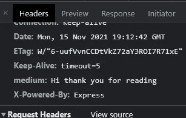

Example headers output on the Chrome DevTools

添加一个对象，我们可以看到它正在发送给客户端。

```
res.cookie(name, value, [options] )
```

我们可以从服务器端设置一个 cookie

```
app.get( '/cookie', ( *req*, *res*) => {
*res*.cookie( 'cook', 'first', [])
*res*.send( 'Cookie' )
})
```

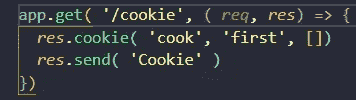

Example code from res.cookie()

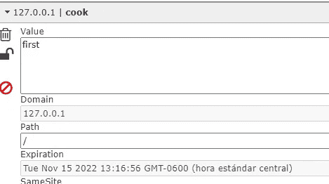

Example cookie created with Express.js

这个扩展名是[编辑这个 cookie](https://chrome.google.com/webstore/detail/editthiscookie/fngmhnnpilhplaeedifhccceomclgfbg)

```
res.clearCookie(name, [ options ])
```

这是清除饼干

```
app.get( '/clearingcookie', ( *req*, *res*) => {
*res*.cookie( 'cook', 'first', [])
*res*.clearCookie( 'cook' )
*res*.send( 'Cookie' )
})
```

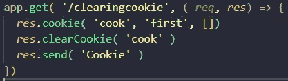

Example clear cookie after it was created

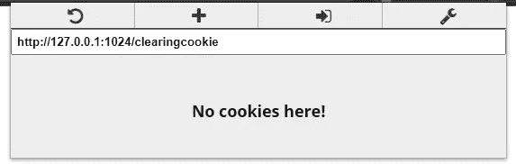

Clear cookie completed

```
res.redirect( [status], url )
```

这用于将浏览器重定向到一个 URL。

```
app.get( '/redirect', ( *req*, *res* ) => {
*res*.redirect( 301, '/' )
})
```

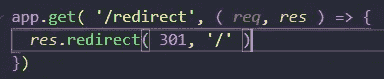

Example code redirect

当我试图浏览这个页面时，它把我重定向到了主页。

```
res.send( body )
```

向客户端发送响应，默认类型是“text/html ”,但是如果您想要发送其他类型的信息，您需要更改 res.type()

```
res.json( json ) res.jsonp( json )
```

向客户端发送 JSON 格式

```
app.get( '/json', ( *req*, *res* ) => {
*res*.json({
page: 'Medium',
comment: 'Thanks for Reading',
emoji: '😃'})})
```

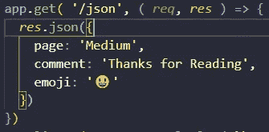

Exampel code for request json method

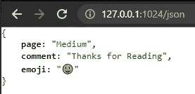

Example response JSON format to the client

```
res.end()
```

在不向客户端发送任何东西的情况下终止连接

```
res.format( object )
```

这是为了向客户端发送多种格式，这对 API 非常有用。

```
res.attachment( filename )
```

这是对标题的响应，让浏览器需要加载一些东西

```
res.download( path, [filename], [callback])
```

与响应下载相同

```
res.links( links )
```

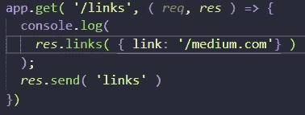

Example code res.links

```
app.get( '/links', ( *req*, *res* ) => {console.log(*res*.links( { link: '/medium.com'} )
);
*res*.send( 'links' )})
```


Example output links Chrome DevTools

```
res.render( view, [locals], callback)
```

响应渲染将视图发送给客户端我们用了太多带把手的。

# **结论**

Express.js 中的 response 对象对于 request 对象非常有用，它是连接客户端和服务器的核心，我们也为客户端提供了一个非常好的体验，完全检查和试验它非常重要！

# **来源**

这本[书](https://www.amazon.com/Web-Development-Node-Express-Leveraging/dp/1492053511)真的很神奇！

[](http://expressjs.com/en/api.html#res) [## 4.x API

### 创建快速应用程序。express()函数是由 express 模块导出的顶级函数。var…

expressjs.com](http://expressjs.com/en/api.html#res)