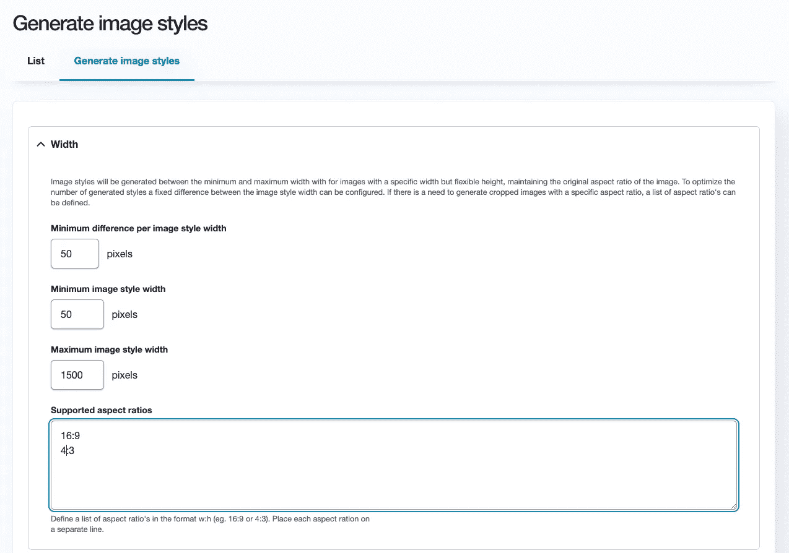

# Drupal 9 中的媒体响应图像优化

> 原文：<https://medium.com/geekculture/responsive-image-optimization-with-media-in-drupal-9-62080c31d5f4?source=collection_archive---------1----------------------->


正确配置响应式映像总是一件痛苦的事情。在 Drupal 中，你可以[在你的主题或模块](https://www.drupal.org/docs/theming-drupal/working-with-breakpoints-in-drupal)中创建断点，并使用[响应图像模块](https://www.drupal.org/docs/mobile-guide/responsive-images)来设置不同的响应图像样式，定义特定断点使用哪种图像样式。这需要相当多的工作和计划来设置一切，如果需要更改，维护所有的图像样式总是一件痛苦的事情。我最近建立的大多数网站也有流畅的设计。由于图像是为固定断点定义的，这导致为用户加载的许多图像仍然太大。

经过一番努力，我们思考如何找到一种方法来改善这种情况。在 HTML5 中，我们可以定义一个“srcset”属性，它根据浏览器的视窗加载正确的图像。为了获得更好的性能，默认的“src”包含了一个非常小的图像版本。还要注意 HTML5 的“loading”属性，它支持图像的延迟加载，从而实现更多的优化。

```

```

# 每纵横比的媒体视图模式

由于我们使用媒体将图像添加到内容中，我们尝试了由纵横比定义的媒体视图模式，并结合了特定纵横比的图像的一系列不同图像样式。媒体模板可以为所有图像样式提供不同的宽度，并使用“srcset”属性让浏览器选择最佳图像。因此，我们现在得到了 4:3 和 16:9 比例的图像样式，如下所示:

*   响应式 _4_3_50w
*   响应式 _16_9_50w
*   响应式 _4_3_150w
*   响应式 _16_9150w
*   …
*   响应式 _4_3_1450w
*   响应式 _16_9_1450w

对于保持原始比例的图像，我们只使用宽度，如 *50w* 、 *150w* 等。我们的“16_9”视图模式的媒体模板(*media-image-16-9 . html . Twig*)现在看起来像这样，使用 [Twig Tweak 模块](https://www.drupal.org/project/twig_tweak)的“image_style”过滤器从文件中加载图像样式的实际图像 URL:

```
{#
/**
 * @file
 * Default theme implementation to display an image.
 */
#}




```

# 基于容器宽度的图像样式

我们注意到的第一个问题是,“srcset”属性使用了视窗宽度，而不是图像容器的宽度。这意味着当视窗为 1400 像素，图像显示在宽度为 200 像素的列中时，浏览器会选择宽度为 1400 像素的图像样式。这并没有给我们想要的结果。计算容器宽度的唯一方法是通过 JavaScript，因此我们编写了一个小脚本来计算每个图像的可用宽度，并使用 [ResizeObserver](https://developer.mozilla.org/en-US/docs/Web/API/ResizeObserver) 加载正确的图像样式。ResizeObserver 在 IE11 中不工作，但这不是我们项目的要求。此外，Drupal 还将[在 Drupal 10](https://www.drupal.org/node/3199540) 中放弃 IE11 支持！为了防止浏览器最初从“srcset”属性加载大图像，我们将“srcset”属性更改为“data-srcset ”,并让 JavaScript 处理剩下的部分。

```
// Fetch all images containing a "data-srcset" attribute.
const images = context.querySelectorAll('img[data-srcset]');

// Create a ResizeObserver to update the image "src" attribute when its
// parent container resizes.
const observer = new ResizeObserver(entries => {
  for (let entry of entries) {
    const images = entry.target.querySelectorAll('img[data-srcset]');
    images.forEach(image => {
      const availableWidth = ***Math***.floor(image.parentNode.clientWidth);
      const attrWidth = image.getAttribute('width');
      const sources = image.getAttribute('data-srcset').split(',');

      // If the selected image is already bigger than the available width,
      // we do not update the image.
      if (attrWidth && attrWidth > availableWidth) {
        return;
      }

      // Find the best matching source based on actual image space.
      let source, responsiveImgPath, responsiveImgWidth;
      for (source of sources) {
        let array = source.split(' ');
        responsiveImgPath = array[0];
        responsiveImgWidth = array[1].slice(0, -1);
        if (availableWidth < responsiveImgWidth) {
          break;
        }
      }

      // Update the "src" with the new image and also set the "width"
      // attribute to easily check if we need a new image after resize.
      image.setAttribute('src', responsiveImgPath);
      image.setAttribute('width', responsiveImgWidth);
    });
  }
});

// Attach the ResizeObserver to the image containers.
images.forEach(image => {
  observer.observe(image.parentNode);
});
```

# 自动生成图像样式

这种方法的第二个问题是创建我们需要的所有图像样式。这可以通过一个表单来自动创建我们需要的长宽比的所有图像样式来解决。因此，我们建立了[易响应图像模块](https://www.drupal.org/project/easy_responsive_images)。该模块需要最小和最大宽度以及每种图像风格之间的优选像素数量。还可以定义一个可选的纵横比列表。保存配置时，会自动生成样式。



# 图像优化和 WebP 支持

既然我们已经基于容器加载了最好的图像，我们可以再采取一个步骤来提高图像的性能。使用[图像优化模块](https://www.drupal.org/project/imageapi_optimize)，我们可以创建优化管道，可以自动应用于通过图像样式显示的图像。我们选择使用通过[图像优化二进制文件模块](https://www.drupal.org/project/imageapi_optimize_binaries)支持的 JpegOptim 和 PngQuant([上一篇博客](https://www.previousnext.com.au/blog/better-image-optimisation-drupal)包含了更多关于模块和结果的数据)。如果你不能在你的服务器上安装这些二进制文件，还有一个 [ImageAPI 优化 GD 模块](https://www.drupal.org/project/imageapi_optimize_gd)。

然后还有 [ImageAPI 优化 WebP](https://www.drupal.org/project/imageapi_optimize_webp) 模块。

> WebP 是一种现代图像格式，为网络上的图像提供卓越的无损和有损压缩。使用 WebP，网站管理员和 web 开发人员可以创建更小、更丰富的图像，使 web 速度更快。

在我们的测试中，我们发现对于大多数图像，WebP 比 jpg 图像小 30%-50%。对于 png 图像，它甚至更多。为了在浏览器支持时轻松加载图像的 WebP 版本，我们在 [Easy Responsive Images 模块](https://www.drupal.org/project/easy_responsive_images)中创建了一个“image_url”分支过滤器，通过 [Imagecache 外部模块](https://www.drupal.org/project/imagecache_external)增加了对外部图像的额外支持。

使用 JavaScript 和新的 Twig 过滤器的媒体视图模式的最终文件如下所示:

```
{#
/**
 * @file
 * Default theme implementation to display an image.
 */
#}
{{ attach_library('easy_responsive_images/resizer') }}



```

该示例对所有定义的宽度使用相同的纵横比，但从技术上讲，这不是一项要求。根据需要，仍然可以对较小/较大的屏幕使用不同的宽高比，尽管这将使设置更加复杂，并且需要更多的媒体查看模式。

大概就是这样。接下来的一些步骤可能是为模块添加格式化程序，并弄清楚对视网膜图像的支持(即使这些会增加图像大小)。

希望这有助于任何希望改进和优化 Drupal 中响应图像实现方式的人。