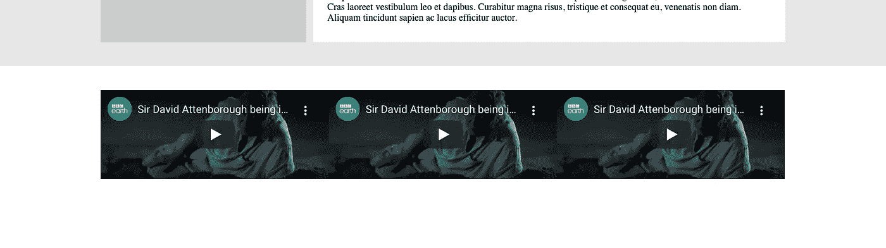
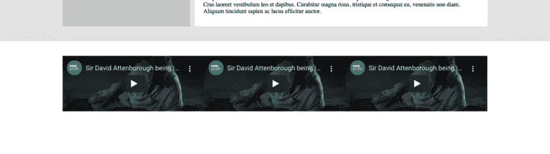

# 响应 Youtube 嵌入

> 原文：<https://medium.com/geekculture/responsive-youtube-embeds-58475a177510?source=collection_archive---------8----------------------->

在我们的 HTML 布局中保持视频的纵横比


Photo by [NordWood Themes](https://unsplash.com/@nordwood?utm_source=medium&utm_medium=referral) on [Unsplash](https://unsplash.com?utm_source=medium&utm_medium=referral)

几周前，我的一个客户让我在我们的 [Craft:Scribe](https://www.craftscribe.com) 模板中“添加一行 YouTube 视频”。我想，这很容易。毕竟，YouTube 有一个**共享>嵌入**菜单选项，它会吐出一个< iframe >代码供我们复制，对吗？

# 朴素方法



Sample row of YouTube iframe embeds (image by author)

在将**宽度**设置为 *100%* 并将**高度**设置为*自动*之后，这就是我很快设法得到的东西(向我最喜欢的纪录片致敬)。代码看起来像这样:

```
<div class="flex" id="videos">
    <div class="col-33">
        <iframe width="100%" height="auto" src="..></iframe> 
    </div>
    <div class="col-33">...</div>
    <div class="col-33">...</div>
</div>
```

乍一看，它看起来还不错。视频留在分配给它们的空间内，播放按钮看起来是集中的。但我的客户立即指出，它们“大小不合适”。

视频应该有 16:9 的长宽比，不知何故，我天真的方法(简单地将高度设置为自动)没有保持这个比例。

# 更好的方法

为了做得更好，我们可以添加更多的代码:

```
<div class="flex" id="videos">
    <div class="col-33">
        <div> <!-- additional div element here! -->
            <iframe width="100%" height="auto" src="..></iframe>     
        </div>
    </div>
    <div class="col-33">...</div>
    <div class="col-33">...</div>
</div>
```

注意，现在我已经添加了一个额外的 **div** 元素，它首先包围了 **iframe** 。我只把它添加到第一个视频中，但我们已经可以看到不同之处:


After adding an additional div (image by author)

# 实验数字电视系统

我在最初的帖子中遗漏了这一点。

虽然添加一个额外的 div 最初会起作用，但是当屏幕足够宽时，同样的问题会再次出现。



Same issue returns when the screen is wide enough (image by author)

为了解决这个问题，我们需要将 iframe 设置为绝对位置。

```
#videos > div.col > div{
    position: relative;
    padding-bottom: 56.25%; */* 16:9 of the videos */*
}#videos > div.col > div > iframe{
    position: absolute;
    top: 0;
    left: 0; 
    width: 100%;
    height: 100%;
}
```

# 额外的

在这一点上，我们当然可以停止添加额外的编辑，因为视频显示正确。只剩下一个非常微妙的细节——在嵌入下面有一个额外的空间，为了便于说明，我在这里对其进行了着色。


Space below the video (image by author)

如果需要，这个空格可以在一行 CSS 中轻松删除:

```
#videos > div.col > div{
    ... margin: 0;
}
```

我希望这篇小教程对你来说是一篇好文章！

如果你有兴趣阅读更多，请查看我的其他一些关于技术的文章

[创建一个简单的推文墙](/geekculture/creating-a-simple-wall-of-tweets-8e62366e9d4e) [缩小 JS 文件](/geekculture/minifiying-js-files-861cdd7b214c)
[Docker 用 Mac M1 构建](/geekculture/docker-build-with-mac-m1-d668c802ab96)

我也把写历史作为一种爱好

[《巴卡》背后的故事](https://loisthash.medium.com/the-story-behind-baka-7e26274e65c2)
[让他们吃肉](https://loisthash.medium.com/let-them-eat-meat-80714d2fed25)

再次感谢您！

另外，你也可以在推特上找到我。