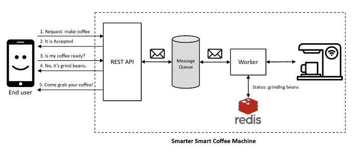

# 将长期运行的任务从 HTTP 请求处理中分离出来——使用内存中的消息代理

> 原文：<https://medium.com/geekculture/rest-api-best-practices-decouple-long-running-tasks-from-http-request-processing-d6efde658cc7?source=collection_archive---------0----------------------->

## 第 2 部分:讨论通过使用内存中的消息代理和异步完成任务的进程内工作器来分离长期运行任务的最简单的实现。

System Diagram by Author