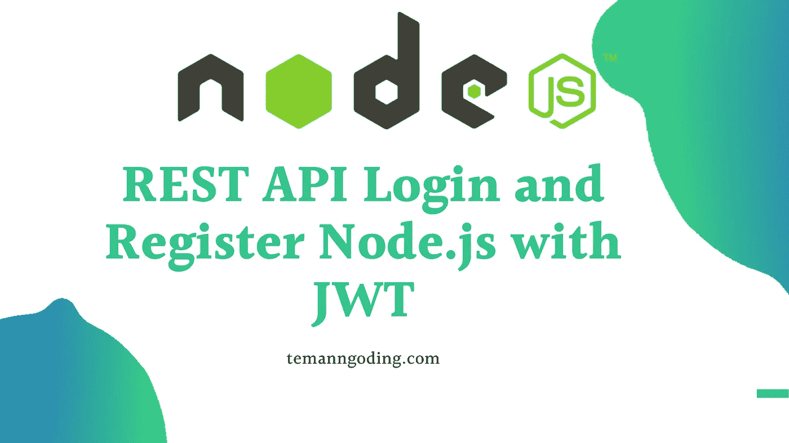
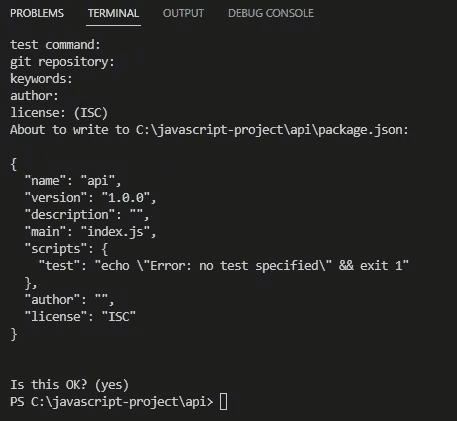
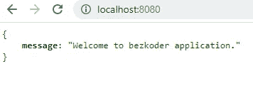
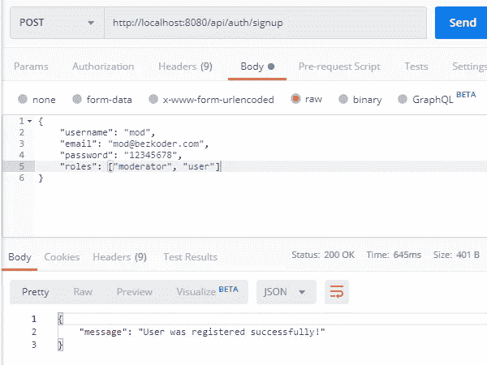
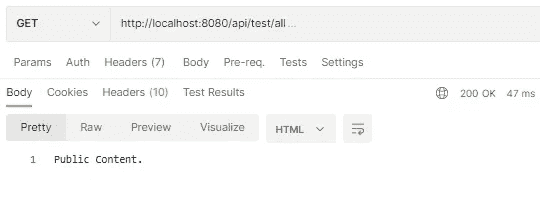
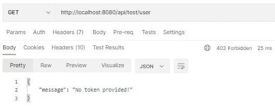
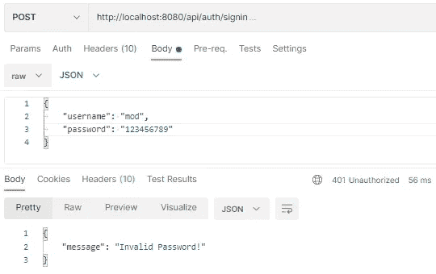
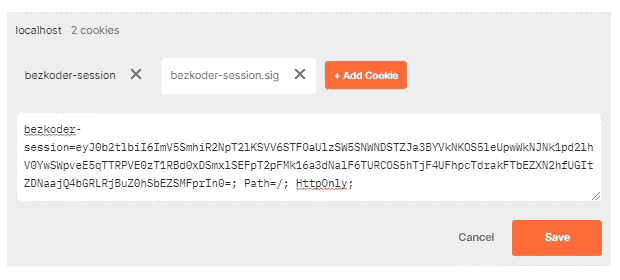
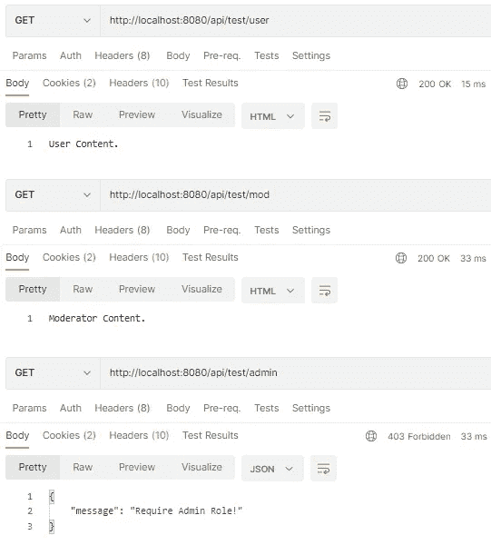

# REST API 登录并用 JWT 注册 Node.js

> 原文：<https://medium.com/geekculture/rest-api-login-and-register-node-js-with-jwt-8cb6755f5a6b?source=collection_archive---------1----------------------->



你好，你好吗，朋友们，又回来了，泰曼·恩戈丁。在本次讨论中，我们将创建一个 REST API 登录，并使用 Node.js 向 JWT 注册。并且我会举一些例子来制作 Rest API。

您可以学习其他教程:

[自动数字格式带 JavaScript 所有国家](https://temanngoding.com/format-number-otomatis-dengan-javascript-semua-negara/)

[Javascript 错误处理](https://temanngoding.com/penanganan-eror-javascript/)

[Javascript 教程:将时间 am pm 转换为 24 小时](https://temanngoding.com/tutorial-javascript-convert-waktu-am-pm-to-24-jam/)

注册和登录是任何 web 或应用程序中的常见模块。当用户在您的网站和应用程序上注册时，您将他们的数据存储在您的数据库中。因此，如果以后他想登录，他不需要再次注册。在本教程中，您将学习如何使用节点 js + express + MySQL + JWT auth 创建一个用户注册 rest API。

# 1.创建 Node.js 快速登录应用程序

第一步是创建一个新项目。

```
$ mkdir api
$ cd api
```

然后，我们用 package.json 文件初始化 Node.js 应用程序:



接下来我们需要安装一些库:`express`、`cors`、`cookie, session`、`sequelize`、`mysql2`、`jsonwebtoken`和`bcryptjs`。

在 command 中运行以下命令:

```
npm install express cookie-session sequelize mysql2 cors jsonwebtoken bcryptjs --save
```

我们可以看到我们的包:

```
{
  "name": "api",
  "version": "1.0.0",
  "description": "",
  "main": "index.js",
  "scripts": {
    "test": "echo \"Error: no test specified\" && exit 1"
  },
  "author": "",
  "license": "ISC",
  "dependencies": {
    "bcryptjs": "^2.4.3",
    "cookie-session": "^2.0.0",
    "cors": "^2.8.5",
    "express": "^4.18.1",
    "jsonwebtoken": "^8.5.1",
    "mysql2": "^2.3.3",
    "sequelize": "^6.21.3"
  }
}
```

# 2.安装 Express web 服务器

在我们的根文件夹中，创建一个新的 server.js 文件:

让我解释一下我们刚刚做了什么:
–导入 express、会话 cookies 和 cors 模块:

Express 用于构建 REST API
cookie-session 有助于将客户端的会话数据存储在 cookie 中，而不需要服务器端的任何数据库/资源
cors 提供 Express 中间件来支持 cors
-创建 Express 应用程序，然后使用 app.use()方法添加请求解析、基于 cookie 的会话中间件和 CORS 中间件。
–为测试定义一个简单的获取路线。
–在端口 8080 上监听传入的请求。

现在在 command:node server . js 中运行这个命令

在你的浏览器中打开 [http://localhost:8080/](http://localhost:8080/) ，然后我们会得到这样一个 json:



# 3.MySQL 配置和序列

使用 db.config.js 文件创建一个 config 文件夹，并编写以下代码:

```
module.exports = {
  HOST: "localhost",
  USER: "root",
  PASSWORD: "123456",
  DB: "testdb",
  dialect: "mysql",
  pool: {
    max: 5,
    min: 0,
    acquire: 30000,
    idle: 10000
  }
};
```

前五个参数用于 MySQL 连接。
pool 是可选的，这将用于配置 Sequelize 连接池:

*   max:池中的最大连接数
*   min:池中的最小连接数
*   空闲:连接在被释放之前可以空闲的最长时间，以毫秒为单位
*   获取:池在抛出错误之前尝试获取连接的最长时间，以毫秒为单位

# 4.定义顺序模型

我们准备采用顺序模型。在 models 文件夹中，创建一个用户和角色数据模型，代码如下:

**型号** / *user.model.js*

```
module.exports = (sequelize, Sequelize) => {
  const User = sequelize.define("users", {
    username: {
      type: Sequelize.STRING
    },
    email: {
      type: Sequelize.STRING
    },
    password: {
      type: Sequelize.STRING
    }
  });
  return User;
};
```

**models**/*role . model . js*

```
module.exports = (sequelize, Sequelize) => {
  const Role = sequelize.define("roles", {
    id: {
      type: Sequelize.INTEGER,
      primaryKey: true
    },
    name: {
      type: Sequelize.STRING
    }
  });
  return Role;
};
```

在初始化 Sequelize 之后，我们不需要编写 CRUD 函数，Sequelize 支持所有这些函数:

*   创建新用户:创建(对象)
*   按 id 查找用户:findByPk(id)
*   通过电子邮件查找用户:findOne({ where: { email: … } })
*   获取所有用户:findAll()
*   按用户名查找所有用户:findAll({其中:{用户名:… } })

# 5.初始化序列

现在，使用以下代码创建 app/models/index.js 文件:

```
const config = require("../config/db.config.js");
const Sequelize = require("sequelize");
const sequelize = new Sequelize(
  config.DB,
  config.USER,
  config.PASSWORD,
  {
    host: config.HOST,
    dialect: config.dialect,
    operatorsAliases: false,
    pool: {
      max: config.pool.max,
      min: config.pool.min,
      acquire: config.pool.acquire,
      idle: config.pool.idle
    }
  }
);
const db = {};
db.Sequelize = Sequelize;
db.sequelize = sequelize;
db.user = require("../models/user.model.js")(sequelize, Sequelize);
db.role = require("../models/role.model.js")(sequelize, Sequelize);
db.role.belongsToMany(db.user, {
  through: "user_roles",
  foreignKey: "roleId",
  otherKey: "userId"
});
db.user.belongsToMany(db.role, {
  through: "user_roles",
  foreignKey: "userId",
  otherKey: "roleId"
});
db.ROLES = ["user", "admin", "moderator"];
module.exports = db;
```

用户和角色的关系是多对多的关系:
–一个用户可以有多个角色。
–一个角色可以由多个用户担任。

并且不要忘记调用 server.js 中的 sync()方法。

```
...
const app = express();
app.use(...);
const db = require("./app/models");
const Role = db.role;
db.sequelize.sync({force: true}).then(() => {
  console.log('Drop and Resync Db');
  initial();
});
...
*function* initial() {
  Role.create({
    id: 1,
    name: "user"
  });

  Role.create({
    id: 2,
    name: "moderator"
  });

  Role.create({
    id: 3,
    name: "admin"
  });
}
```

initial()函数帮助我们在数据库中创建 3 行。在开发过程中，您可能需要删除现有的表并重新同步数据库。所以你可以使用 force: true 就像上面的代码一样。

对于生产，只需手动输入这一行，并使用不带参数的 sync()来避免数据丢失:

```
...
const app = express();
app.use(...);
const db = require("./app/models");
db.sequelize.sync();
...
```

# 6.配置授权密钥

像 verify()或 sign()这样的 jsonwebtoken 函数使用需要密钥(作为字符串)的算法来编码和解码令牌。

在 app/config 文件夹中，使用以下代码创建一个 auth.config.js 文件:

# 7.创建中间件功能

**中间件** / *verifySignUp.js*

```
const db = require("../models");
const ROLES = db.ROLES;
const User = db.user;
checkDuplicateUsernameOrEmail = async (req, res, next) => {
  try {
    // Username
    let user = await User.findOne({
      where: {
        username: req.body.username
      }
    });
    if (user) {
      return res.status(400).send({
        message: "Failed! Username is already in use!"
      });
    }
    // Email
    user = await User.findOne({
      where: {
        email: req.body.email
      }
    });
    if (user) {
      return res.status(400).send({
        message: "Failed! Email is already in use!"
      });
    }
    next();
  } catch (error) {
    return res.status(500).send({
      message: "Unable to validate Username!"
    });
  }
};
checkRolesExisted = (req, res, next) => {
  if (req.body.roles) {
    for (let i = 0; i < req.body.roles.length; i++) {
      if (!ROLES.includes(req.body.roles[i])) {
        res.status(400).send({
          message: "Failed! Role does not exist = " + req.body.roles[i]
        });
        return;
      }
    }
  }

  next();
};
const verifySignUp = {
  checkDuplicateUsernameOrEmail,
  checkRolesExisted
};
module.exports = verifySignUp;
```

**中间件** / *authJwt.js*

```
const jwt = require("jsonwebtoken");
const config = require("../config/auth.config.js");
const db = require("../models");
const User = db.user;
verifyToken = (req, res, next) => {
  let token = req.session.token;
  if (!token) {
    return res.status(403).send({
      message: "No token provided!",
    });
  }
  jwt.verify(token, config.secret, (err, decoded) => {
    if (err) {
      return res.status(401).send({
        message: "Unauthorized!",
      });
    }
    req.userId = decoded.id;
    next();
  });
};
isAdmin = async (req, res, next) => {
  try {
    const user = await User.findByPk(req.userId);
    const roles = await user.getRoles();
    for (let i = 0; i < roles.length; i++) {
      if (roles[i].name === "admin") {
        return next();
      }
    }
    return res.status(403).send({
      message: "Require Admin Role!",
    });
  } catch (error) {
    return res.status(500).send({
      message: "Unable to validate User role!",
    });
  }
};
isModerator = async (req, res, next) => {
  try {
    const user = await User.findByPk(req.userId);
    const roles = await user.getRoles();
    for (let i = 0; i < roles.length; i++) {
      if (roles[i].name === "moderator") {
        return next();
      }
    }
    return res.status(403).send({
      message: "Require Moderator Role!",
    });
  } catch (error) {
    return res.status(500).send({
      message: "Unable to validate Moderator role!",
    });
  }
};
isModeratorOrAdmin = async (req, res, next) => {
  try {
    const user = await User.findByPk(req.userId);
    const roles = await user.getRoles();
    for (let i = 0; i < roles.length; i++) {
      if (roles[i].name === "moderator") {
        return next();
      }
      if (roles[i].name === "admin") {
        return next();
      }
    }
    return res.status(403).send({
      message: "Require Moderator or Admin Role!",
    });
  } catch (error) {
    return res.status(500).send({
      message: "Unable to validate Moderator or Admin role!",
    });
  }
};
const authJwt = {
  verifyToken,
  isAdmin,
  isModerator,
  isModeratorOrAdmin,
};
module.exports = authJwt;
```

**中间件** / *index.js*

```
const authJwt = require("./authJwt");
const verifySignUp = require("./verifySignUp");
module.exports = {
  authJwt,
  verifySignUp
};
```

# 8.创建控制器

**控制器**/*auth . controller . js*

```
onst db = require("../models");
const config = require("../config/auth.config");
const User = db.user;
const Role = db.role;
const Op = db.Sequelize.Op;
const jwt = require("jsonwebtoken");
const bcrypt = require("bcryptjs");
exports.signup = async (req, res) => {
  // Save User to Database
  try {
    const user = await User.create({
      username: req.body.username,
      email: req.body.email,
      password: bcrypt.hashSync(req.body.password, 8),
    });
    if (req.body.roles) {
      const roles = await Role.findAll({
        where: {
          name: {
            [Op.or]: req.body.roles,
          },
        },
      });
      const result = user.setRoles(roles);
      if (result) res.send({ message: "User registered successfully!" });
    } else {
      // user has role = 1
      const result = user.setRoles([1]);
      if (result) res.send({ message: "User registered successfully!" });
    }
  } catch (error) {
    res.status(500).send({ message: error.message });
  }
};
exports.signin = async (req, res) => {
  try {
    const user = await User.findOne({
      where: {
        username: req.body.username,
      },
    });
    if (!user) {
      return res.status(404).send({ message: "User Not found." });
    }
    const passwordIsValid = bcrypt.compareSync(
      req.body.password,
      user.password
    );
    if (!passwordIsValid) {
      return res.status(401).send({
        message: "Invalid Password!",
      });
    }
    const token = jwt.sign({ id: user.id }, config.secret, {
      expiresIn: 86400, // 24 hours
    });
    let authorities = [];
    const roles = await user.getRoles();
    for (let i = 0; i < roles.length; i++) {
      authorities.push("ROLE_" + roles[i].name.toUpperCase());
    }
    req.session.token = token;
    return res.status(200).send({
      id: user.id,
      username: user.username,
      email: user.email,
      roles: authorities,
    });
  } catch (error) {
    return res.status(500).send({ message: error.message });
  }
};
exports.signout = async (req, res) => {
  try {
    req.session = null;
    return res.status(200).send({
      message: "You've been signed out!"
    });
  } catch (err) {
    this.next(err);
  }
};
```

有 4 个函数:
–/API/test/all 用于公共访问
–/API/test/user 用于登录用户(角色:用户/版主/管理员)
–/API/test/mod 用于具有版主角色的用户
–/API/test/admin 用于具有管理员角色的用户

**控制器** / *用户.控制器. js*

```
exports.allAccess = (req, res) => {
  res.status(200).send("Public Content.");
};
exports.userBoard = (req, res) => {
  res.status(200).send("User Content.");
};
exports.adminBoard = (req, res) => {
  res.status(200).send("Admin Content.");
};
exports.moderatorBoard = (req, res) => {
  res.status(200).send("Moderator Content.");
};
```

# 9.定义路线

**认证:**

*   帖子`/api/auth/signup`
*   帖子`/api/auth/signin`
*   帖子`/api/auth/signout`

**路线** / *auth.routes.js*

```
const { verifySignUp } = require("../middleware");
const controller = require("../controllers/auth.controller");
module.exports = *function*(app) {
  app.use(*function*(req, res, next) {
    res.header(
      "Access-Control-Allow-Headers",
      "Origin, Content-Type, Accept"
    );
    next();
  });
  app.post(
    "/api/auth/signup",
    [
      verifySignUp.checkDuplicateUsernameOrEmail,
      verifySignUp.checkRolesExisted
    ],
    controller.signup
  );
  app.post("/api/auth/signin", controller.signin);
  app.post("/api/auth/signout", controller.signout);
};
```

**授权:**

*   获取`/api/test/all`
*   为登录用户(用户/版主/管理员)获取`/api/test/user`
*   获取`/api/test/mod`作为版主
*   获取管理员的`/api/test/admin`

**路线** / *user.routes.js*

```
const { authJwt } = require("../middleware");
const controller = require("../controllers/user.controller");
module.exports = function(app) {
  app.use(function(req, res, next) {
    res.header(
      "Access-Control-Allow-Headers",
      "Origin, Content-Type, Accept"
    );
    next();
  });
  app.get("/api/test/all", controller.allAccess);
  app.get(
    "/api/test/user",
    [authJwt.verifyToken],
    controller.userBoard
  );
  app.get(
    "/api/test/mod",
    [authJwt.verifyToken, authJwt.isModerator],
    controller.moderatorBoard
  );
  app.get(
    "/api/test/admin",
    [authJwt.verifyToken, authJwt.isAdmin],
    controller.adminBoard
  );
};
```

不要忘记在 server.js 中添加以下代码:

```
...
// routes
require('./app/routes/auth.routes')(app);
require('./app/routes/user.routes')(app);
// set port, listen for requests
...
```

# 10.运行和测试

使用命令运行 Node.js 应用程序:node server.js

`/signup`



/API/测试/全部



/API/测试/用户



/API/auth/登录



–获得`/api/test/user`
–获得`/api/test/mod`
–获得`/api/test/admin`



这就是我这次可以传达的教程，希望有用。

谢了。

[https://temanngoding . com/en/rest-API-log in-and-register-node-js-with-jwt/](https://temanngoding.com/en/rest-api-login-and-register-node-js-with-jwt/)