# REST API 测试:Github & Postman

> 原文：<https://medium.com/geekculture/rest-api-testing-github-postman-62ba105e550e?source=collection_archive---------5----------------------->

> “未经测试的代码是破损的代码”——一个明智的编码者。

# 为什么我们要测试我们的 API？

为我们的 API 创建测试不仅能确保我们的代码 100%地工作，还能确保以后我们添加的任何新特性或重构不会破坏和撤销旧的有价值的工作！

我再怎么强调编写测试的重要性也不为过。它与实际可执行代码的价值是一对一的。

# 我们如何做到这一点？

## 工具

*   邮递员
*   Github 帐户
*   您的 Web REST API

## 场景

我将向您展示如何在 Postman 上创建测试，并将这些测试应用到 Github 的 gists API 上。

> 大事始于小事。—阿拉伯的劳伦斯

# 先迈小步。

为最基本的功能创建测试用例！验证最简单的 GET 或 POST 请求。然后，您可以转到更新和删除请求。

# 在“N”之后之前检查

由于我们使用的是 REST API，这意味着没有存储关于客户端当前状态的数据。因此，作为一个客户/测试人员，我们需要跟踪任何变化的状态(例如，更新一个要点描述，或者它的内容，或者甚至删除一个要点)

# 收拾干净，你这个邋遢的懒虫！

清除您的测试所做的任何状态更改是一个很好的实践。例如，假设我们在一个测试中创建了一个 gist 来测试 API 是否能够处理 POST 请求。那么明智的做法是把那个帖子也删掉。我们不想以 1000 个新的虚拟测试生成的内容结束。

# 邮递员是什么？

用于构建和使用 API 的 API 平台。它是测试我们的 API 的一个很好的工具。

 [## 下载邮差|免费开始

### 免费试用邮差！加入依赖 Postman 的 2000 万开发者的行列，Postman 是 API 开发的协作平台…

www.postman.com](https://www.postman.com/downloads/) 

当您启动它时，您应该会看到类似这样的内容:

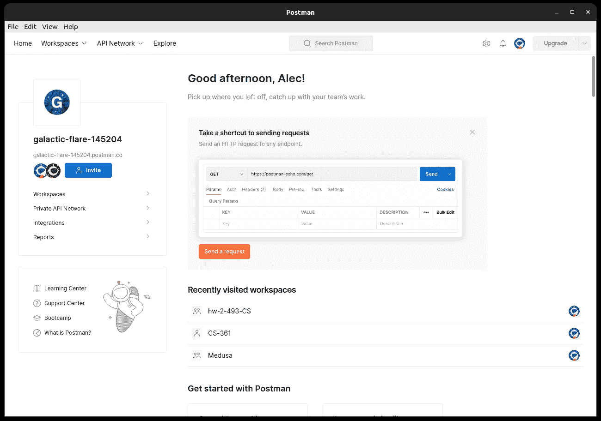

Img. 1 — Postman Application’s Home Page.

# 创建新的

我们的第一步是创建一个新的集合，以便将我们的请求保存在一个集合中，供重用和共享。

所以在应用程序的左上角，点击“文件”，然后点击“新建…”

将出现一条弹出消息，并在“构建模块”部分单击“收藏”

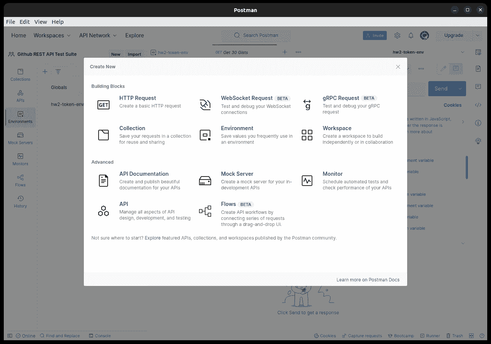

Img. 2 — Postman’s Pop-up Message when creating a new collection.

那就这样吧！现在，您对 API 的任何新请求都保存在该集合中！(以后可以重新命名。)

# 设置我们的环境以使用来自 Github 的令牌

在 Github 帐户中，进入“设置”。

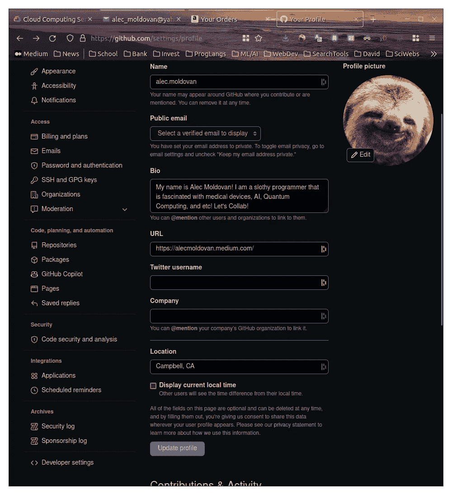

Img. 3 — Github Account Settings page.

然后转到左侧面板底部的开发者设置。< >开发者设置'

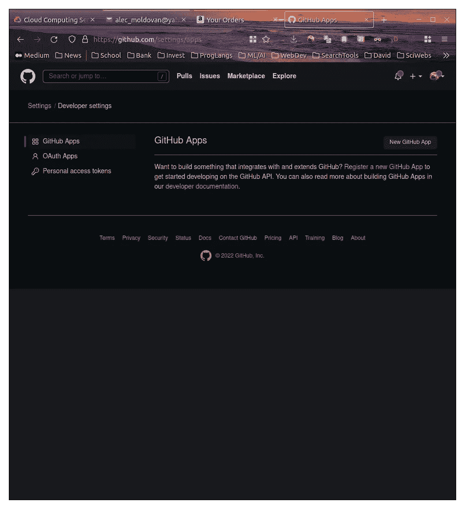

Img. 4 — Developer Settings page

在开发者设置页面中，点击“个人访问令牌”。然后点击“生成新令牌”。

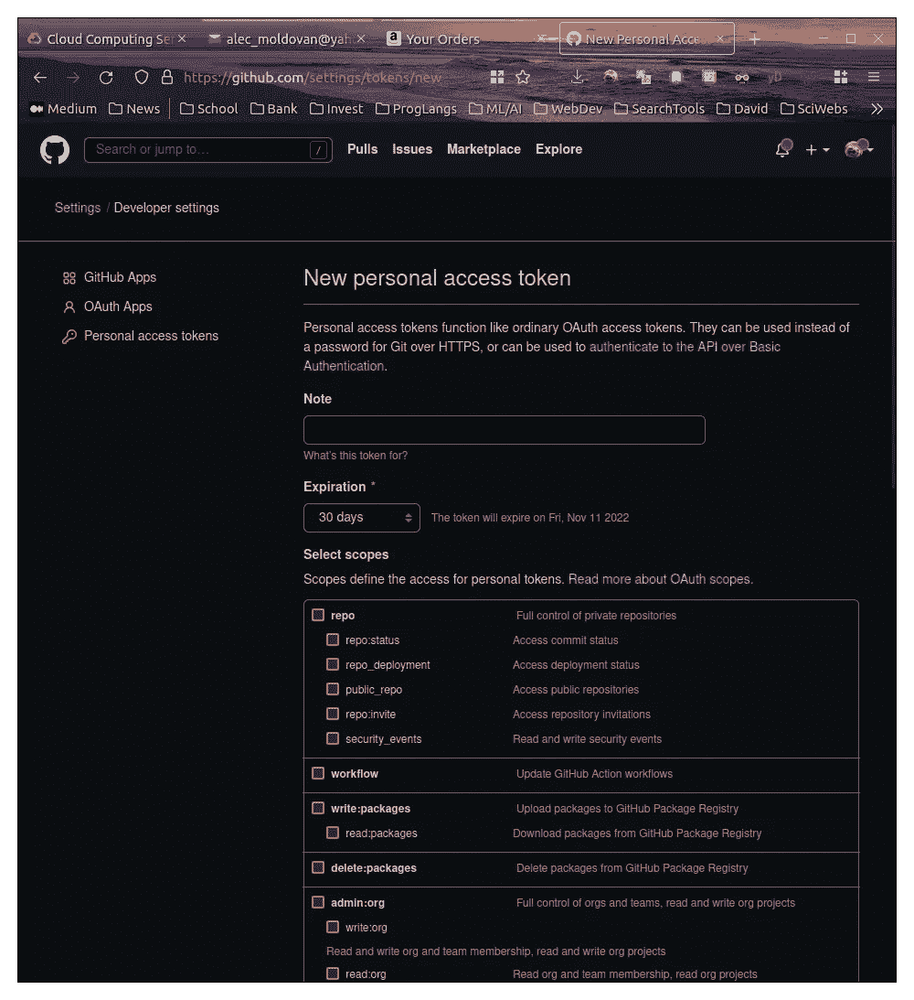

Img. 5 — New Personal Access Token Page.

在这个页面中，命名你的个人访问令牌(PAT)任何与你的测试项目或者你将要测试的 API 相关的东西。然后滚动并点击“要点”旁边的复选框。

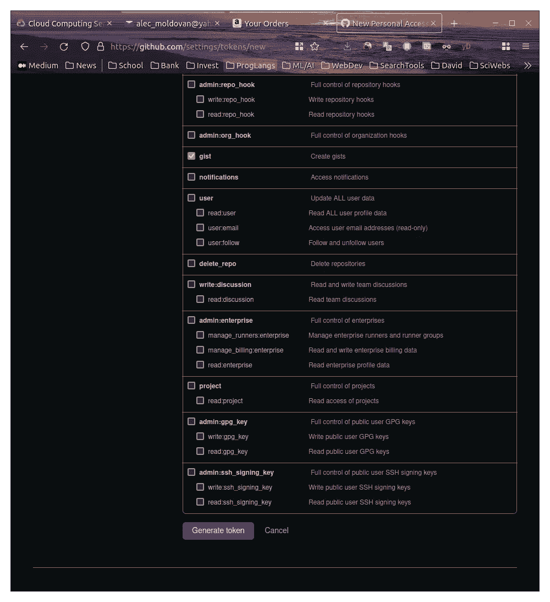

Img. 6 — Configuring your permissions with the PAT you will be using.

点击“生成令牌”后，您将被重定向到个人访问令牌页面，但您会看到一个长而无意义的单词，包含数字和所有内容。将它复制到文本编辑器中以备后用！

这个令牌将作为一个环境变量保存在 Postman 中，这样您就可以用您的 gists 在您的 github 帐户上执行 CRUD 操作。

这是因为您将通过第三方应用程序(如 Postman)与您的 Github 帐户进行交互。因此，您发送到作为您的 gists 的帐户资源的每个请求都需要一个令牌。这是 Github 的服务器做访问控制或者安全。

所以你刚刚创建的令牌就是 Github 想要验证并允许进入你的帐户的秘密密码！

关于网络安全已经说得够多了。

# 设置您的邮递员环境

好吧。让我们回到我们之前创建的邮递员集合！

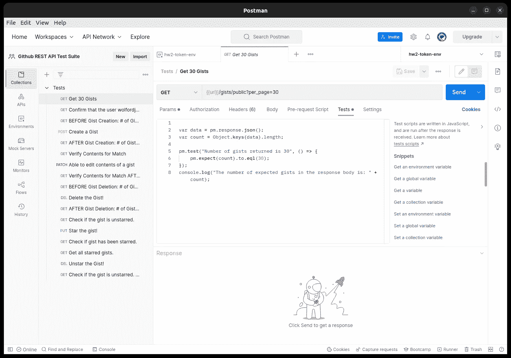

Img. 7 — Postman App with a collection filled with requests.

因此，在左侧面板上，您会看到“环境”。单击它，然后单击加号(+)创建一个新环境！

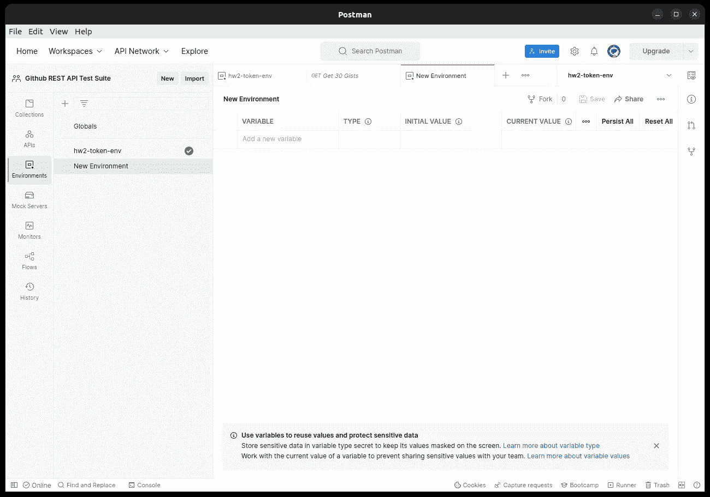

Img. 8 — Postman New Environment page.

将鼠标悬停在选项卡区域中的“新环境”名称上，为环境命名一个与您的项目相关的名称。

最后，创建一个名为 token 的变量，并将 Github 中的个人访问令牌粘贴到这个变量中！然后在右上角区域您可以将环境更改为您的新环境！

这个新环境将有助于附加您向 Github 发出的每个请求所需的承载令牌。

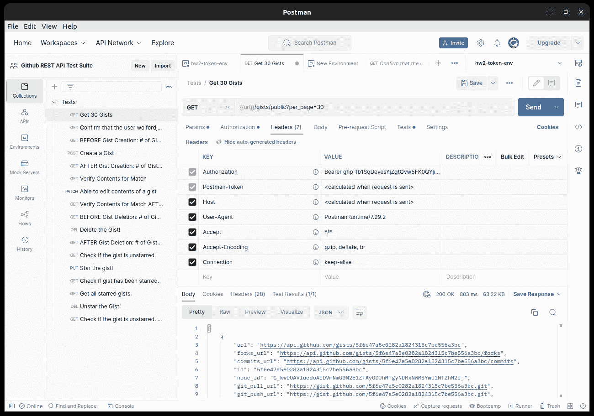

Img. 9 — Request Headers to show the PAT use in the Authorization header per request.

# 我们的第一个邮递员请求

已经没有更多的设置，我们已经准备好开火了！

可以提出不同类型的请求:

*   获取—检索数据
*   POST —发送数据。
*   PUT — Update(更新整个资源。类似于 POST 但是具有定义的 URI)
*   修补—更新(如果资源不存在，部分更新不会创建资源)
*   删除—删除数据。

因此，通过点击收藏旁边的三个点，您可以提出新的请求。

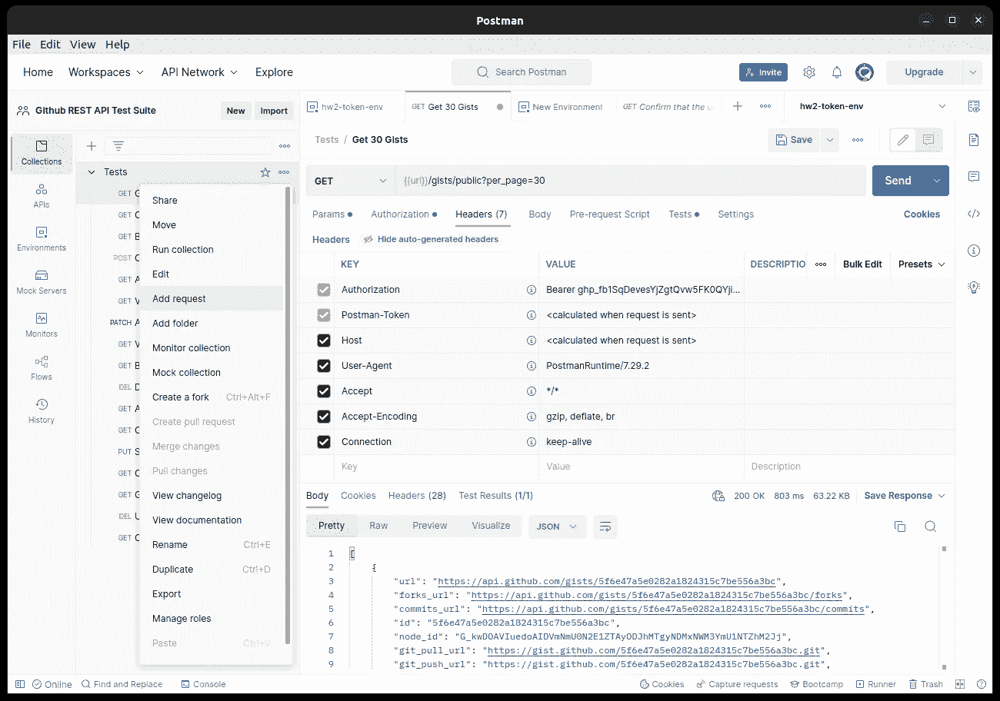

Img. 10 — Making a new request.

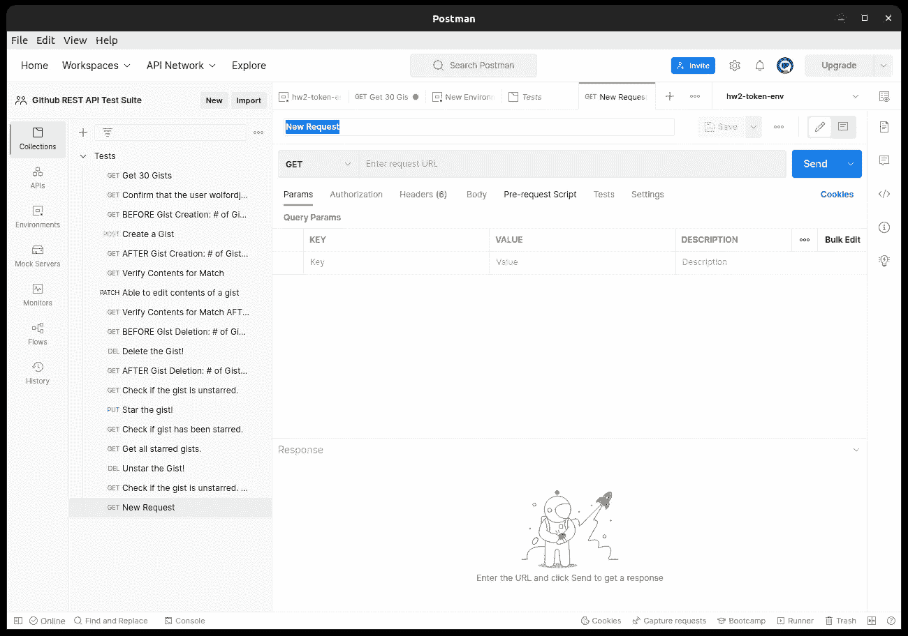

Img. 11 — A newly created GET request.

在 HTTP 动词“GET”之后，我们将测试 Github API 是否可以在收到 GET 请求时返回至少 30 个公共 gists。

在文本字段中输入请求的目标 URL:

https://api.github.com/gists/public？per_page=30

提示:您可以保存域的另一个环境变量用例:【url】下的【https://api.github.com】T2。这是因为你不需要为每一个新的请求写出整个域名，只需要参考“url”。

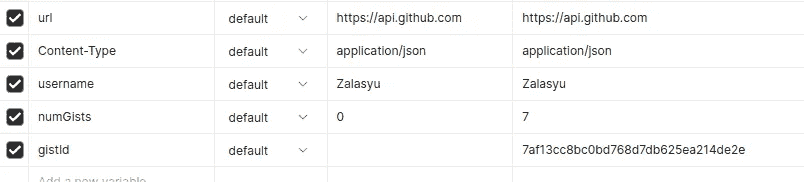

Img. 12 — Environment Variable url saves the Github API domain.

优化方式:

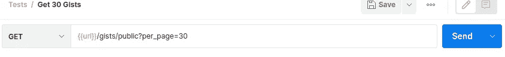

Img. 13 — An optimized url using the ‘url’ environment variable.

现在让我们测试一下，我们实际上从 GET request 方法中获得了 30 个 public gists。

# 试验

有一个 Tests 选项卡使用 Javascript 和 Postman 的框架。

Img. 13 — An example test case using Postman’s Framework.

上面是一个将在请求发送后执行的脚本。我使用的是 pm.test()，它有两个参数:测试名称和如何运行测试的函数。

所以第二个参数是一个函数，它包含 pm.expect()来指定我们想要验证的内容。因此，对于我们的情况，我们期望计数变量等于 30。换句话说，我们希望声明 30 个 gists 根据我们的请求返回。

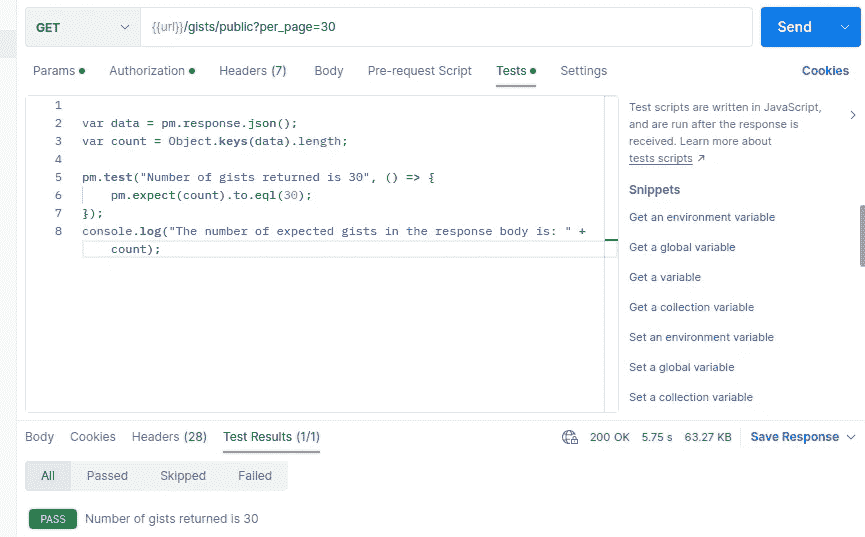

Img. 14 — Results of the Test script in the Tests tab.

看起来请求确实返回了 30 个 gists！用于返回指定数量的 gists 的那种功能的 API 被确认是起作用的！耶！

您已经测试了您的第一个 API 端点！

# 谢谢你，不要偷懒！

问我任何问题！