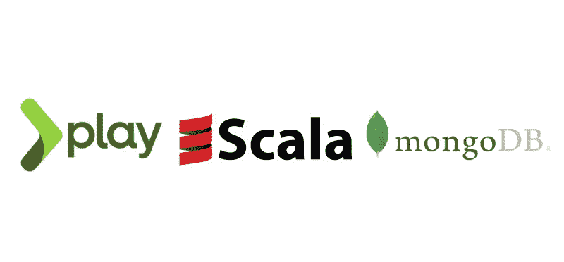

# 带有 Scala Play 框架和反应式 Mongo 的 REST API

> 原文：<https://medium.com/geekculture/rest-api-with-scala-play-framework-and-reactive-mongo-5016e57846a9?source=collection_archive---------1----------------------->

用 Scala/Play 框架和 Reactive mongo 构建 REST API 的基础。



# 介绍

在这篇文章中，我将展示如何使用 Play 框架和反应式 mongo 插件来构建一个异步非阻塞 REST 应用程序。为了简单起见，在这个故事中，我们将创建一个基本的 API，允许我们对存储在 mongo 数据库中的数据执行基本的 CRUD 操作。

# **先决条件**

这篇文章对初学者来说是容易理解的。但是，需要 Scala 和 Play 框架的基础知识。在继续之前，请确保您的本地机器上安装了以下工具。

*   JVM 14
*   Scala 2.13.3
*   Sbt 1.3.13
*   Docker(可选)

您可以使用以下命令设置本地 mongo db 服务器:

```
> mkdir mydata
> docker pull mongo:latest
> docker run --name local-mongodb -d -p 27017:27017 -v ~/data:/data/db mongo
```

# **项目设置**

第一部分包括创建项目和添加所需的依赖项。

## 播种项目:

第一步是创建我们的项目框架。使用这个 sbt 命令可以很容易地做到这一点:

```
> sbt new playframework/play-scala-seed.g8
```

您将被要求填写一些关于项目的基本信息，例如包的名称和组织。

```
This template generates a Play Scala projectname [play-scala-seed]: movie-store
organization [com.example]:Template applied in ./movie-store
```

> 在我写这篇文章的时候，这个项目是用 Play 2.8 生成的。如果你在未来的某个地方，你可能会得到新版的 Play。如果是这样，请考虑升级其他依赖项。

如果一切顺利，您应该能够用这个命令启动应用程序。

```
> sbt run
```

## 添加依赖项:

Play 2.8 的反应式 mongo 插件可以通过添加以下依赖项来启用:

Dependencies to enable reactive mongo.

> mongo 驱动程序将被自动解析为传递依赖。

为反应式 mongo 模块启用依赖注入。将下面一行添加到 application.conf 中。

Enable dependency injection for reactive mongo.

## 配置数据库访问:

最后一步是配置数据库访问。

Database access

# API

既然我们的项目已经准备好了，我们将继续下一步，包括创建模型、存储库和控制器。我将尽可能保持这个例子的简单，但它应该足够好地满足我们的目的。

## 型号:

Movie Model

正如你所看到的，我们有一个基本的包含电影定义的`case class`和一个包含`implicit` JSON/BJSON 序列化器的`companion object`。

对于 JSON 序列化，我们使用自动映射。基本上，`Json.format[Movie]`宏将检查电影案例类字段并生成一个 JSON。另一方面，对于外部类型，您应该像`DateTime`一样，以`implicit`的形式提供它们的序列化器。

然而，对于 BSON，我们正在实现我们的自定义序列化程序。

## 存储库:

这是我们电影库的初始版本。基本上，它注入了执行上下文和反应性的 mongo api。此外，它还包含一个助手**函数**，该函数返回一个`BSONCollection`的`Future`。

> “收藏”是一个功能，以避免潜在的问题，在发展与发挥自动重装。

一旦存储库准备好了，我们就可以开始添加一些基本的查询。

Read queries

`find`方法有两个参数，选择器和投影。简而言之，选择器用于匹配特定的文档，投影仪用于投影文档上特定的字段。在我们的例子中，我们希望保持简单，坚持使用默认值。

find 方法返回一个查询构建器，这意味着查询尚未执行。它允许您向查询添加选项，比如排序。

> 你可以在 mongo [文档](https://docs.mongodb.com/manual/tutorial/project-fields-from-query-results/)中了解更多关于这个发现的信息。

Write queries

现在，您可以看到写查询。insert `insert`方法返回一个`InsertBuilder`实例，您可以用它来插入`one`或`many`文档。分别返回`UpdateBuilder`和`DeleteBuilder`的更新和删除方法也是如此。

## 控制器

现在，我们到了最后一部分。我们将创建端点来公开电影存储库的操作。

让我们从创建控制器开始:

现在，我们将创建负责读取数据的两个端点:

Read data endpoints

我们有两个端点，第一个将返回电影列表，第二个将解析给定的 id 并返回相关的电影(如果找到的话)。

Create/Update/Delete endpoints

除了像前面的代码一样验证参数中传递的 id。此外，我们通过在请求体中使用 validate 助手来检查 json 是否有效。

> 由于上一节创建的 json 序列化宏，Scala 对象可以从 json 隐式序列化，反之亦然。

Routes

最后一部分是将控制器方法绑定到它们的路由。

# 测试 API

现在我们的应用程序已经准备好了，我们可以用 *`cURL`* 进行简单的测试。
先从创作电影开始。

```
> curl --verbose --header "Content-Type: application/json" \
  --request POST \
  --data '{ "title":"My favorite movie", "description":"My favorite movie description" }' \
  http://localhost:9000/movies
```

如果一切正常，您应该会得到类似的结果。

```
< HTTP/1.1 201 Created
< Referrer-Policy: origin-when-cross-origin, strict-origin-when-cross-origin
< X-Frame-Options: DENY
< X-XSS-Protection: 1; mode=block
< X-Content-Type-Options: nosniff
< X-Permitted-Cross-Domain-Policies: master-only
< Date: Sun, 10 Jan 2021 12:25:06 GMT
< Content-Type: application/json
< Content-Length: 75
{
  "title": "My favorite movie",
  "description": "My favorite movie description"
}*
```

现在有了一个 *`GET`* 请求:

```
> curl --verbose --request GET http://localhost:9000/movies
```

同样，您应该会得到类似的结果。

```
< HTTP/1.1 200 OK
< Referrer-Policy: origin-when-cross-origin, strict-origin-when-cross-origin
< X-Frame-Options: DENY
< X-XSS-Protection: 1; mode=block
< X-Content-Type-Options: nosniff
< X-Permitted-Cross-Domain-Policies: master-only
< Date: Sun, 10 Jan 2021 12:47:34 GMT
< Content-Type: application/json
< Content-Length: 213
[
  {
    "_id": {
      "$oid": "5ffaf5b787901a6769f585f8"
    },
    "_creationDate": "2021-01-10T13:40:23.359+01:00",
    "_updateDate": "2021-01-10T13:40:23.359+01:00",
    "title": "My favorite movie",
    "description": "My favorite movie description"
  }
]*
```

# 结论

在这篇文章中，我们看到了一个在 mongo 数据库上用 Play 创建 restful API 的基本例子。你可以在我的 [Github](https://github.com/smahjoub/play-mongo) 里找到代码解决方案。谢谢你。