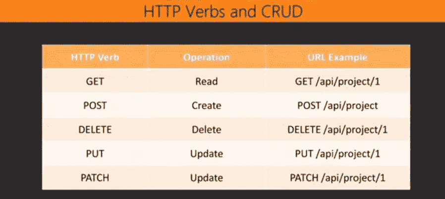
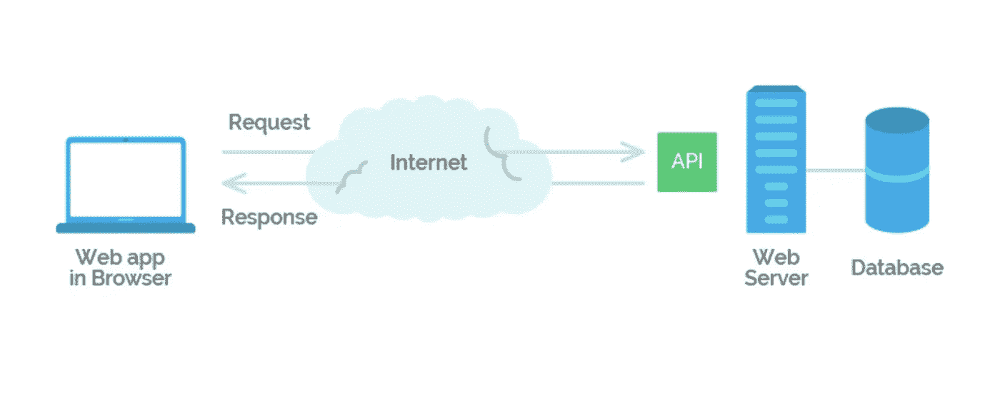
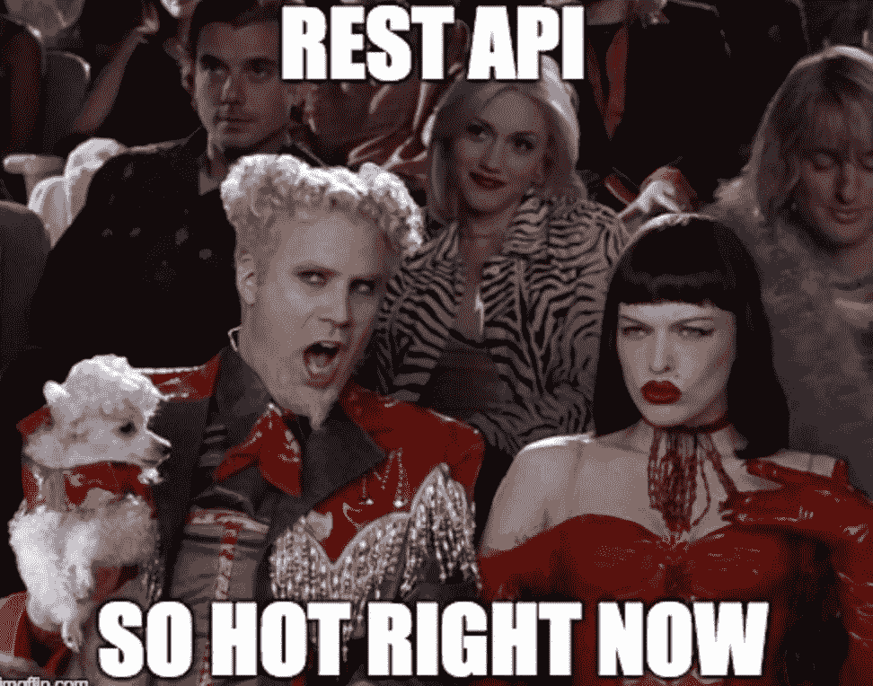

# REST 架构约束

> 原文：<https://medium.com/geekculture/rest-architectural-constraints-495a50ae0651?source=collection_archive---------17----------------------->

什么是休息？不，不是那种你在巴哈马群岛的吊床上编码时放松时的那种休息。我指的是 20 多年前首次引入的一种建筑风格。如果你已经知道了这一点，你还记得你最后一次使用 RESTful API 是什么时候吗？无论您是编程新手还是想要快速复习，本文将在深入研究 6 个指导原则之前回顾一下什么是 REST。

# **休息概述**

## 什么是休息？

REST 代表具象状态转移，是由[罗伊·菲尔丁](https://en.wikipedia.org/wiki/Roy_Fielding)在 2000 年首次提出的一种架构风格。REST 提供了 web 上计算机系统之间的标准，使得系统之间的通信更加容易。

## RESTful API

REST 决定了 API(应用程序编程接口)的外观，它有一套开发人员在创建 API 时必须遵循的规则。当您链接到相关联的 URL 时，您应该能够获得数据(资源)。换句话说，每个 URL 被称为一个*请求*，而您接收的数据是*响应*。例如，来自脸书 API 的资源可以是一张照片或一个用户，每个都有一个唯一的标识符。本质上，当调用 RESTful API 时，服务器会将所请求资源的状态表示传输给客户机。以下是创建 API 端点时应该记住的一些 REST API 规则:

*   REST API URIs 应该总是以名词结尾
*   使用复数来保持 API URI 在整个应用中的一致性
*   HTTP 动词用于标识动作

# 休息的指导原则

现在我们已经对 REST 有了一些背景知识，让我们来探索使任何 web 服务成为真正 RESTful API 的架构约束…

## 客户端-服务器通信

客户是使用 API 的人或软件。典型的信息流基本上是一种请求/响应范式，在这种范式中，客户端请求某些东西，服务器用所请求的数据进行响应。通过将用户界面问题从数据存储问题中分离出来，我们提高了跨多个平台的用户界面的可移植性，并通过简化服务器组件提高了可伸缩性。这种关注点的分离是这种约束的主要原则，它允许组件独立发展，支持多个组织域的互联网规模的需求。

## 无国籍

所有 RESTFUL APIs 都是无状态的。这意味着除了与即时请求相关的内容和认证客户端所需的信息之外，API 在服务器上不保存任何客户端上下文。尽管状态可以存储在数据库中，但从技术上讲，它并不存储在 API 本身中。这意味着通信本质上必须是无状态的，会话状态完全保存在客户端。这提高了可见性，因为监视系统不必通过单个请求来确定请求的全部性质。恢复部分故障的任务增强了可靠性，而不必存储状态请求提高了可伸缩性。然而，这种简单性也有一些缺点。由于在请求之间没有存储状态，随着重复数据请求的增加，存在降低网络性能的风险。

## 隐藏物

REST APIs 是可缓存的，因为它们可以存储先前请求的数据，并在需要时使用这些数据。缓存约束要求对请求的响应中的数据必须标记为(隐式或显式)可缓存或不可缓存。只有当响应可缓存时，客户端缓存才有权重用该响应。虽然这通过减少一系列交互来提高性能，但是如果缓存与请求被直接发送到服务器时所获得的数据不同，则缓存可能不可靠。

## 统一界面

这个约束强调组件之间的统一接口，这简化并提高了交互的可见性。尽管这种实现鼓励独立的可发展性，但是统一的接口也会降低效率，因为信息是以标准化的形式传输的，而不是特定于应用程序需求的形式。重要的是要注意获得统一接口所需的以下架构约束，以帮助指导组件的行为:资源的标识；通过表现操纵资源；自我描述的消息；超媒体是应用程序状态的引擎。

## 分层系统

这通过将每个组件的知识限制在与其交互的直接层之外，改变了架构约束的组件行为，从而创建了由分层组成的架构。单层系统的这种限制有助于降低整个系统的复杂性，并促进组件之间的独立性。虽然这可以用来保护旧客户端的新服务，并通过将不常用的功能转移到共享中介来简化组件，但也有不利的一面。缺点是它们会增加数据处理的开销，从而降低性能。

## 命令代码

对 REST 约束集的最后一点补充来自按需编码风格，它允许通过下载和执行脚本形式的代码来扩展客户端功能。所需实现的功能数量的减少以及允许在部署后下载功能的灵活性简化了客户端功能并提高了系统可扩展性。尽管有这些改进，还是有降低可见性的风险，这就是为什么这是 REST 中的一个可选约束。通过拥有一个可选的约束，我们有能力设计一个在一般情况下支持期望行为的架构，但是要理解它可能在某些上下文中被禁用。

# 结论

我们已经了解到 REST 的设计是无状态的，高度可伸缩的，并且输出灵活。因为 REST 是围绕请求-响应模型设计的，所以当客户机请求大量调用时，它被认为是最有用的环境，因为服务器可以用各种数据进行响应。总之，我们可以说，如果一个 API 遵循了 REST 的 6 个指导原则，那么它就是一个 RESTful API。

## 其他资源:

*   前一篇博客:CRUD 操作解释
*   [REST API 教程](https://restfulapi.net/)
*   [什么是休息？](https://www.codecademy.com/articles/what-is-rest)
*   [其余建筑元素](https://www.toolsqa.com/rest-assured/rest-architectural-elements/)
*   [HTTP 请求](https://www.toolsqa.com/client-server/http-request/)

