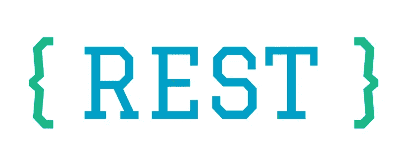

# REST，RPC，GraphQL…选什么？

> 原文：<https://medium.com/geekculture/rest-rpc-graphql-what-to-choose-c57c78c0593d?source=collection_archive---------9----------------------->

## 从实用角度比较 API 协议

10 多年来，我一直是一名网页开发人员。在我的职业生涯中，我构建并使用了许多基于不同目的构建的 API，并实现了各种协议。在这个多样的 API 协议世界中，您总是需要考虑选择哪一个来以最小的痛苦实现您的目标。

在这篇文章中，我想从我的经验的角度给你回顾几个最流行的 API 协议——它们的优缺点、问题和适用性。我将通过回顾它们的优点和缺点来帮助你为你的特定项目选择最好的协议。所以，让我们跳到细节。

# GraphQL

图形查询语言( **GraphQL** ) —现代协议之一，但越来越成为开发人员的选择。Web API 的查询语言方法的想法并不新鲜，只需提一下脸书(FQL)的类似 SQL 的接口。

顾名思义，GraphQL 表明，为了对该协议做出明智的选择，系统中呈现的对象必须符合图的概念。换句话说，它必须是一个有大量对象和它们之间密切关系的系统。最好的例子是像社交网络这样的系统。

另一个同样有趣的应用领域也值得一提。GraphQL 可以在几个 API 之间执行聚合层的功能，从而将它们组合在一个方案下，这种方法称为**后端对前端**。可能这是今天唯一一个有标准化方案的架构，也就是自文档化的，这给了它额外的加分。

GraphQL 一度被称为 REST 的杀手，但我不确定它是否会发生。正如 REST 被认为会杀死 SOAP，但是相当多的应用程序继续在这个方向上工作和发展，所以 GraphQL 有它的范围和缺点。

**适用性**

具有清晰的对象模型和对象间关系的中型和大型项目

**优点**

*   自记录数据方案
*   内置验证
*   能够使用现成的订阅
*   根据客户需求设计请求

**缺点**

*   年轻的建筑和它周围的社区
*   需要解决解析器结构中固有的问题，例如 N + 1 问题
*   比 REST 和 RPC 更难理解

# 休息

当今最可靠的协议是表述性状态转移( **REST** )。大多数 web 应用程序都使用它。

从实践来看，系统中心的绝大多数项目都有以 CRUD 操作形式进行相当简单交互的对象，所以 REST 为这些对象的表示和操作提供了合适的工具。

从架构的角度来看，也就是从进化能力的角度来看，REST 有很大的潜力，因为它对以 HTTP 方法形式描述的对象的动作有清晰明确的语义。换句话说，它有一个隔离的抽象层次，对系统的连接性特征有很好的影响，查询的清晰语义即使在没有文档的情况下也能给出对系统和接口的理解。

**适用性**

使用对象和对象上的 CRUD 操作对应用程序进行建模和开发

**优点**

*   当今最常用的建筑
*   建立在 HTTP 协议功能的基础上
*   名词和动词的清晰和熟悉的语义

**缺点**

*   对于数据冗余或不足的问题，没有固有的解决方案
*   实现不适合对象模型的任务的难度

# JSON-RPC

远程过程调用( **RPC** ) —开发客户机-服务器应用程序的最简单但功能不亚于此的工具之一。JSON-RPC 架构基于最自然的通信方式——使用 HTTP 协议调用接口函数。

从我自己的经验来看，我可以说，对于专注于用户动作而不是业务对象(或者他们所说的真实世界的对象)的小型 API 的组织来说，这种架构是最适合的。选择这种方法的一个很好的先决条件是一个小的对象字典和对它们的确定数量的操作。

如果你正在设计一个微服务架构，你也需要考虑这个协议，这有几个原因。对于不仅在 RPC 对象上实现 CRUD 操作的具有正确粒度的微服务来说，它可以解决字典和超出标准集的更复杂操作的问题。

RPC 具有相当明显的优势，但是从架构的角度来看，尽管它很简单，但是当系统扩展了附加功能时，复杂性就增加了。系统的词汇开始与系统本身成比例地增长，存在大量的新程序，这增加了这种系统的开发和维护的复杂性。

**适用性**

具有少量对象和确定数量的动作的微服务和小型项目

**优点**

*   最少的实施工作

**缺点**

*   考虑到体系结构的简单性——随着项目的增长，它在发展的复杂性方面有一个明显的缺点

# 而不是结论

一如既往，选择哪种框架、架构或协议取决于您。没有好的或坏的协议，就像我们还没有解决所有问题的灵丹妙药，但是随着对优势和劣势的理解，您将有更多的方面可以考虑，以便为您的特定项目选择更好的协议。

> *感谢您阅读这篇文章！*
> 
> *如果你想让我继续写关于软件文档、设计、SDLC 和所有相关主题的文章，请随意鼓掌，订阅并留下你的评论。*