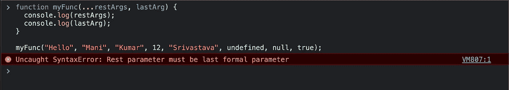

# JavaScript 中的 Rest 与 Spread 运算符

> 原文：<https://medium.com/geekculture/rest-vs-spread-operator-in-javascript-5ec180c82909?source=collection_archive---------7----------------------->

# 目标

理解 JavaScript 中 **Rest** 和 **Spread** 一元运算符的用法。

# 运算符符号

**静止**操作符的符号为`…` (3 个点)。

**展开**操作符的符号为`…` (3 点)

注意-两者具有相同的运算符符号

# TL；速度三角形定位法(dead reckoning)

## Rest 运算符的基本用法

Gist #0.1 | Basic Usage of Rest Operator

## 传播算子的基本用法

Gist #0.2 | Basic Usage of Spread Operator

# 让我们开始…

# 第一部分

在解释 JavaScript 上下文中的 Rest 和 Spread 操作符之前，最好在一个**通用上下文**中理解它们。

假设你有一副 52 张扑克牌。

当**牌展开**时，我们称之为拿走一副牌并把它们平放在桌子上。

并且在**收集卡片**时收集展开的卡片并将其转换回卡片组。

下面是视觉辅助的图表—

Gif #1.1 | Visual Aid for Cards Spread and Cards Collect

> 现在，假设我们想留下前十张牌，收集剩下的 42 张。我们会叫它什么？
> 
> 我们会说，我们保留前十张卡片，收集 42 张卡片中的`**rest**`。
> 
> (你能连接为什么是 rest 操作符吗？)

现在，通过考虑我们上面提到的类比，让我们理解 JavaScript 环境中的 **rest** 和 **spread** 。

52 张牌的一副牌(或一叠牌)是可迭代的，例如一个数组，每张牌是可迭代的一个元素。

将可迭代平面的所有元素放置到一个方法，或另一个可迭代，或其他，称为**可迭代展开**。用于此目的的运算符是`…` (3 点)。

在这个位置展开 [看上面提到的例子。](#980c)

当涉及到将布局的元素收集回 iterable 时，我们**并不真正称之为 Iterable Collect** ，我们只是说`let’s collect **rest** of the elements to an iterable`。其余的元素可以是所有布局的元素，也可以是其中的一些。用于此目的的操作符也是`…` (3 个点)。

此处的**[参见上述示例。](#295f)**

# **第二部分**

**在这一节中，我们将讨论 JavaScript 中的基本概念和术语，这对理解 Rest 和 Spread 操作符很有用。**

## ****#2.1)什么是按值复制和按引用复制？****

**在 JavaScript 中，将一个具有原始值的变量赋给另一个变量会创建原始值的精确副本，也就是说，它通过值进行**复制。****

**例如**

```
let a = "Delhi", 
let b = a; console.log(a); // "Delhi"
console.log(b); // "Delhi"
```

**乍一看，输出似乎很明显。如果我向变量`a`追加另一个字符串会怎么样？`a`中的更新值是否也反映在变量`b`中？**

```
a = a + ", India";console.log(a); // "Delhi, India"
console.log(b); // "Delhi"
```

**答案是**不**！因为当`a`的值被赋给`b`时，那么`a`的值的**精确副本**被提供给`b`。**

**看看下面的视频——**

**Video #2.1.1 | Copy by Value**

****按值复制**仅在变量值为原始类型时发生，如数字、字符串、布尔、未定义、符号和 BigInt。**

**让我们再举一个例子，但是用一个物体。**

```
let obj1 = {name: "Mani"};
let obj2 = obj1; console.log(obj1); // {name: "Mani"}
console.log(obj2); // {name: "Mani"}
```

**似乎很明显，对吧？**

**如果我向`obj1`添加另一个属性会怎么样？会在`obj2`中也有体现吗？**

```
obj1["lastName"] =  "Srivastava";console.log(obj1); // {name: "Mani", lastName: "Srivastava"}
console.log(obj2); // {name: "Mani", lastName: "Srivastava"}
```

**答案是肯定的。**

**看看下面的视频——**

**Video #2.1.2 | Copy by Reference**

**发生这种情况只是因为如果一个对象的值是非原语的，那么将一个对象赋给另一个变量会导致**引用被复制**到那个变量。这就是为什么一个物体的变化在另一个物体中是可见的。**

## **#2.2)什么是浅层复制和深层复制？**

**浅拷贝，在 JS 对象的上下文中，意味着**

*   **按值复制对象声明第一级中包含基元值的对象的所有键。**
*   **在对象声明的第一级中引用包含非基元值的对象的所有键。**

**深度复制意味着按值复制对象的所有键，无论是在第一级还是任何更深的级别，并且与原始对象具有相同的结构。**

**想了解浅抄，看下面的视频。**

**Video #2.2.1 | Shallow Copy**

## ****#2.3)什么是可迭代？****

**iterable 是一种能够一次返回一个值的数据结构，允许它在 for 中迭代..循环的。**

**数组、字符串、映射、集合是 JavaScript 中可迭代对象的内置例子。**

**默认情况下，对象不是可迭代的，但是可以使用`Symbol.iterator`属性将它们转换成可迭代的。查看参考资料部分的链接#2。**

**实际上，`Symbol.iterator`属性也在内置的 iterables 中。看看下面的视频。**

**Video #2.3.1 | Iterables**

# **第三部分**

**在本节中，我们将查看 Rest 和 Spread 运算符的各种用法示例。**

## **#3.1)扩展运算符**

**在继续之前应该注意的一点是，Spread 操作符只处理 iterables，并对它们进行浅层复制。**

****#3.1.1)成串展开****

**由于字符串是可迭代的，我们可以对它使用 spread 操作符。浅拷贝的观点在这里并不重要。**

**看看下面的代码，并自己执行它。**

**Gist #3.1.1.1 | Spread in Strings**

****#3.1.2)排列展开****

**由于数组是可迭代的，我们可以对它使用 spread 运算符。它对数组进行浅层复制。看看下面的代码—**

**Gist #3.1.2.1 | Spread in Arrays**

****#3.1.3)在地图中展开并设置****

**看看下面的代码—**

**Gist #3.1.3.1 | Spread in Map and Set**

****#3.1.4)在物体中扩散****

**我们之前已经看到，一个对象不是可迭代的。这意味着我们不能使用 spread 运算符来扩展(或传播)它的值。**

**但是我们可以使用 spread 操作符来制作一个对象的**浅拷贝**。**

**观看以下视频了解详细信息——**

**Video #3.1.4.1 | Spread in an Object**

****#3.1.5)在自定义可迭代对象中传播****

**默认情况下，一个对象是不可迭代的，但是我们可以使用`Symbol.iterator`属性使它成为可迭代的。参考以下代码—**

**Gist #3.1.5.1 | Custom Iterable Object**

**了解了这些之后，让我们检查一下是否可以在自定义的 iterable 对象上使用 spread 操作符。观看下面的视频—**

**Video #3.1.5.1 | Spread in an Custom Iterable Object**

## **#3.2) Rest 运算符**

**受**第 1 节**中提到的卡片类比的启发，`rest`运算符用于收集剩余的值，并将它们放入一个对象或数组中。**

****#3.2.1)在功能中休息****

**请看下面的例子，了解 rest 在函数中的用法**

**Gist #3.2.1.1 | Rest Operator in Functions**

**只需观察`“Kumar”`之后`…restArgs`是如何收集论据的。我们要么从函数调用中收集部分参数，要么收集所有参数。**

**但是我们能在`…restArgs`参数后放些什么来收集最后一个参数吗？比如下面这个例子——**

```
function myFunc(...restArgs, lastArg) {     // ....
}
```

**不要！我们不能这样做，这样做的话，浏览器会抛出以下错误**

****

> **注意:您可以使用`arguments`对象访问函数的参数。查看参考段**中的**参考连杆#1** 。****

****#3.2.2)为非结构化作业休息****

**在数组和对象的情况下，我们可以使用 rest 操作符进行非结构化赋值。参考下面的例子—**

**Gist #3.2.2.1 | Rest Operator in De-structuring Assignments**

**注意，对于数组，RHS 中值的位置决定了 LHS 中键的值。因此，由于 LHS 的`a`和 RHS 的`12`在第一位，所以`12`映射到`a`。**

**但是在对象的情况下，RHS 中的键映射到 LHS 中的相同键。如果 RHS 中没有 LHS 中提到的密钥，那么该密钥将在控制台中记录`undefined`。所以，如果`obj`的结构中没有`firstName`键，那么`console.log(firstName)`将记录`undefined`。**

# **结论**

**在本文中，我们看到了在 JavaScript 中何时何地使用 Rest 和 Spread 操作符。**

# **参考**

1.  **[https://www . freecodecamp . org/news/JavaScript-rest-vs-spread-operators/](https://www.freecodecamp.org/news/javascript-rest-vs-spread-operators/)**
2.  **[https://developer . Mozilla . org/en-US/docs/Web/JavaScript/Reference/Global _ Objects/Symbol/iterator # user-defined _ iterables](https://developer.mozilla.org/en-US/docs/Web/JavaScript/Reference/Global_Objects/Symbol/iterator#user-defined_iterables)**