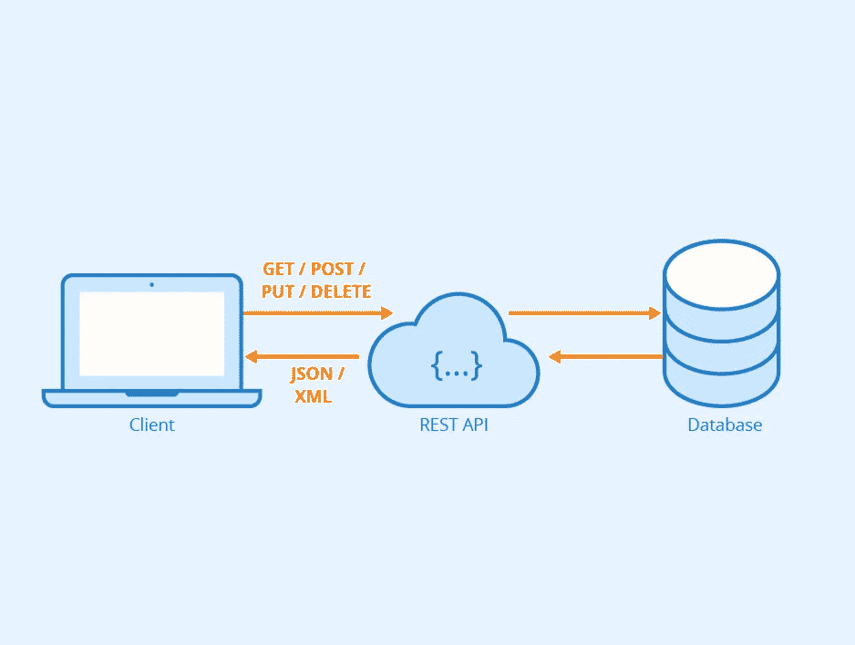
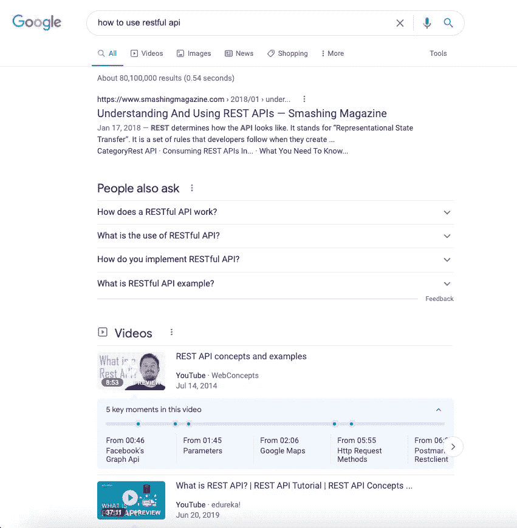

# RESTful API 101

> 原文：<https://medium.com/geekculture/restful-api-101-b61671e5a3ea?source=collection_archive---------10----------------------->



Credit: [Seobility](https://www.seobility.net/en/wiki/REST_API)’s REST API wiki page

当我第一次学习 RESTful API 时，我几乎遵循了我能找到的关于如何使用 RESTful API 的每一个教程，然后我在我的项目中实现了它。你猜怎么着？在写这篇文章之前，当人们问我什么是 RESTful API 时，我仍然不能正确地用语言表达。因此，我想写一篇关于 RESTful API 或 REST 的文章，给那些刚刚开始学习获取 API 或需要复习的人！

# 介绍

假设你在 Google 搜索栏上搜索“如何使用 RESTful API”，然后回车。你会看到一个结果列表，包括 YouTube 视频和我下面看到的文章。REST API 以类似的方式工作，除了从您请求的服务中获得一个结果列表。



**REST** 代表**RE**presental**S**state**T**transfer。REST 是一种软件架构风格(或软件设计模式),被创建来指导万维网架构的设计和开发。Roy Fielding 在 2000 年的博士论文中首次提出了 REST。REST 使用各种表示来表示资源，比如 JSON(特别是对于 JavaScript 开发者)、XML 和 text，其中 JSON 是最流行的一种。

API 代表应用程序编程接口，是由开发者创建的，允许客户端与服务器端进行通信。

REST 决定了 API 的外观。它是开发人员在创建 API 时遵循的一组规则。其中一条规则是，当你链接到一个特定的 URL 时，你应该能够获得一段数据(也称为资源**)。**

**对于那些以前在项目中使用过 REST 的人来说，您可能熟悉以下四种 HTTP 方法，它们通常在基于 REST 的架构中使用:**

*   ****GET** (提供对资源的只读访问)**
*   ****发布**(创建新资源)**
*   ****上传**(更新现有资源)**
*   ****补丁**(更新现有资源)**
*   ****删除**(删除一个资源)**

**每个 URL 被称为**请求**，返回给你的数据被称为**响应**。**

# **RESTful Web 服务**

**当你在寻找如何使用 RESTful API 的资源时，你可能会遇到术语“ **RESTful Web 服务**”。web 服务是用于在应用程序或系统之间交换数据的开放协议(不归任何特定公司所有，也不限于特定公司的产品——来自 [Khan Academy](https://www.khanacademy.org/computing/computers-and-internet/xcae6f4a7ff015e7d:the-internet/xcae6f4a7ff015e7d:developing-open-protocols/a/open-standards-and-protocols) )和标准的集合。**

**基于 REST 架构的 web 服务被称为 RESTful web 服务。您可能熟悉使用 HTTP 方法来创建 API 请求。这些 web 服务使用上面提到的 HTTP 方法来实现 REST 架构。RESTful web 服务通常定义了一个 URI (Uniform Resource Identifier，统一资源标识符)，它提供了 JSON 和一组 HTTP 方法之类的资源表示。**

**假设我们有以下包含多个用户的 JSON 文件:**

```
{
  "user1": { 
     "id": 1,
     "username": "nerdthegeek",
     "password": "nerd1234"
  },
  "user2": {
     "id": 2,
     "username": "githublover",
     "password": "dontlovegit"
  },
  "user3": {
     "id": 3,
     "username": "theonewhocodes",
     "password": "code2244"
  }
}
```

**有了上面的信息，我们将提供以下 RESTful APIs。**

```
+------------+-----------------+---------------------------------+
|   URI      |   HTTP Method   |            Result               |
+------------+-----------------+---------------------------------+
| listUsers  | GET             | Show list of all the users      |
| addUser    | POST            | Add details of new user         |
| deleteUser | DELETE          | Delete an existing user         |
| :id        | GET             | Shows of that user with that id |
+------------+-----------------+---------------------------------+
```

**在从任何教程中复制任何代码示例之前，首先理解请求的结构是很重要的(我犯了那个新手的错误，🥲).**

# **对请求的分析**

**请求中有 4 项内容:**

1.  **终点**
2.  **(HTTP)方法**
3.  **标题**
4.  **数据/正文**

## **端点**

****端点**是您请求的 URL。根端点是您所请求的 API 的起点。例如，Github API 的根端点是`https://api.github.com`。**路径**决定了您请求的资源。你可能看过`:username`之类的。路径上的任何冒号(`:`)都表示一个变量，所以在发送请求时，必须用实际值替换这些值。假设您想要访问自己的 Github repo，在我的情况下，应该是:**

```
[https://api.github.com/users/mehmehmehlol/repos](https://api.github.com/users/mehmehmehlol/repos)
```

**(所有示例参考都基于本文:[理解和使用 REST API](https://www.smashingmagazine.com/2018/01/understanding-using-rest-api/))**

## **方法**

**正如我们前面提到的 HTTP 请求(GET、POST、PUT、PATCH、DELETE)，这些方法为您发出的请求提供了意义。你可能熟悉 **CRUD** ，它是创建、读取、更新、删除。这些方法用于执行这四种可能的操作。**

**让我们来分解这些方法:**

*   **`GET`:如果你执行了一个`GET`请求，服务器会寻找你请求的数据并将其发送给你。一个`GET`请求执行`READ`操作。它也是默认的请求方法。**
*   **`POST`:如果您执行一个`POST`请求，服务器会在数据库中创建一个新条目，并告诉您创建是否成功。一个`POST`请求执行`CREATE`操作。**
*   **`PUT` & `PATCH`:如果执行`PUT`或`PATCH`请求，服务器会更新数据库中的一个条目，并告诉您更新是否成功。一个`PUT`或`PATCH`请求执行`UPDATE`操作。**
*   **`DELETE`:如果您执行`DELETE`请求，服务器会删除数据库中的一个条目，并告诉您删除是否成功。一个`DELETE`请求执行一个`DELETE`操作。**

**(我将用代码示例更新本文)**

## **头球**

**标头用于向客户端和服务器提供信息。它为 HTTP 请求或响应提供附加信息。有许多类型的标题。MDN 的 [HTTP 头](https://developer.mozilla.org/en-US/docs/Web/HTTP/Headers)中提供了完整的列表。像`'Content-Type': 'application/json'`这样的例子。HTTP 头总是键值对。这个例子告诉服务器期待 JSON 内容。**

## **数据/正文**

**该数据包含要发送到服务器的信息。该选项仅用于`POST`、`PUT`、`PATCH`或`DELETE`请求。**

**这就对了。关于 RESTful APIs，你需要知道的差不多就这些了！请让我知道你想知道更多关于 RESTful APIs 的内容，以及你想让我在这篇文章中添加什么，以便它可以提供更多信息，更容易理解，尤其是对于初学者！**

# **资源**

**[](https://www.tutorialspoint.com/nodejs/nodejs_restful_api.htm) [## Node.js - RESTful API

### REST 代表代表性状态转移。REST 是基于 web 标准的架构，使用 HTTP 协议。它…

www.tutorialspoint.com](https://www.tutorialspoint.com/nodejs/nodejs_restful_api.htm) [](https://restfulapi.net/) [## REST API 教程

### REST 是代表状态转移的首字母缩写。它是分布式超媒体系统的架构风格，并且…

restfulapi.net](https://restfulapi.net/) [](https://en.wikipedia.org/wiki/Representational_state_transfer) [## 代表性状态转移-维基百科

### 表述性状态转移(REST)是一种软件架构风格，被创建来指导设计和开发

en.wikipedia.org](https://en.wikipedia.org/wiki/Representational_state_transfer) [](https://www.smashingmagazine.com/2018/01/understanding-using-rest-api/) [## 理解和使用 REST API-Smashing Magazine

### 如果你想能够阅读 API 文档并有效地使用它们，你首先需要理解一切…

www.smashingmagazine.com](https://www.smashingmagazine.com/2018/01/understanding-using-rest-api/)**