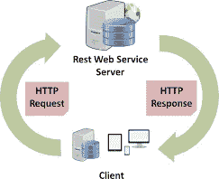

# RESTful Web 服务

> 原文：<https://medium.com/geekculture/restful-web-services-5919a08da2d7?source=collection_archive---------18----------------------->

# 介绍

RESTful [Web 服务](https://www.technologiesinindustry4.com/2020/12/how-websites-are-created.html)遵循 REST 架构风格。REST 定义了任何简单的接口。通过标准化接口传输数据。它在没有额外消息层的情况下传输数据。例如，简单对象访问协议(SOAP)。REST 给出了一组创建无状态服务的设计规则。这些被视为资源。每个资源可以由其唯一的统一资源标识符(URIs)来表示。

在本文中，我们将深入理解 RESTful Web 服务。

# 描述

REST 架构风格是为基于网络的应用程序开发的。它是专门为客户机-服务器应用程序设计的。同样，它是为互联网规模的使用而设计的。因此，客户机和源服务器之间的耦合必须尽可能松散，以便于大规模采用。

这是通过定义资源在服务器上创建一个抽象层来实现的。封装实体，例如服务器上的文件。因此，隐藏了底层应用程序的细节，如文件服务器、数据库等。然而，这个定义甚至比它更常见:

*   任何可以被命名的信息都可以是资源
*   图像、数据库查询，
*   时间服务，例如，“伦敦今天的天气”
*   甚至是其他资源的集合。

这种方法在长期的 Internet 规模的环境中实现了客户机和服务器之间最大的互操作性。这种环境跨越了组织的界限。

客户端可能只是使用 URIs 访问资源。资源的表示是 REST 中的一个重要概念。也就是说，为了确保响应可以被尽可能多的客户端应用程序解释，资源的表示以超文本格式发送。因此，资源是通过在客户机和服务器之间的消息中传输的超文本表示来处理的。

# 六个架构限制

1.  统一界面
2.  客户端-服务器
3.  无国籍的
4.  可缓冲的
5.  分层系统
6.  按需编码(可选)

# 1.统一界面

这是区分 REST API 和非 REST API 的主要约束。它建议应该有一种与给定服务器关联的统一方式，而不管设备或应用类型如何。
下面是统一界面的四个指导原则:

*   **基于资源:**单个资源在请求中表示。例如 API 或用户。
*   **通过表示操纵资源:**客户机有资源的表示，它包含足够的信息来改变或删除服务器上的资源。
*   **自描述消息:**每条消息都包含足够的信息来描述如何处理该消息。[因此，该服务器可以容易地分析该请求。](https://www.technologiesinindustry4.com/2020/12/how-websites-are-created.html)
*   **作为应用程序状态引擎的超媒体(HATEOAS):** 它需要为每个响应添加链接。因此，客户端可以容易地发现其他资源。

# 2.客户端-服务器

这个约束基本上意味着客户端应用程序和服务器应用程序必须能够逐渐发展，而不相互依赖。客户端应该只理解资源 URIs，仅此而已。如今，这是 web 开发中的标准实践。因此，我们不需要任何花哨的东西。保持轻松。

# 3.无国籍的

无状态意味着控制请求所需的状态包含在请求本身中。服务器不会保留任何与会话相关的内容。客户端必须包含服务器的所有信息。也就是说，无论是作为查询参数、头还是 REST 中的 URI 的一部分，都要完成请求。无状态允许更高的可用性，因为服务器不需要传达会话状态。当客户端需要向服务器发送大量数据时，会遇到挫折。因此，它缩小了网络优化的范围，需要更多的带宽。

# 4.可缓冲的

在万维网上，客户端和中介可以缓存响应。响应必须隐式或显式地将自己描述为可缓存或不可缓存，以阻止客户端在响应进一步的请求时给出陈旧或不适当的数据。组织良好的缓存部分或完全消除了一些客户端-服务器交互。这是为了进一步增强可伸缩性和性能。

# 5.分层系统

REST 引入并使我们能够使用分层系统架构，其中；

*   我们在服务器 a 上部署 API。
*   在服务器 b 上存储数据。
*   在服务器 c 中验证请求。

比如说。客户端通常不知道它是直接链接到终端服务器还是通过中间媒介链接到终端服务器。

# 6.按需编码(可选)

这是一个可选约束。很多时候，我们会以 XML 或 JSON 的形式发送资源的静态表示。但是，当我们需要时，我们可以自由地支持我们应用程序的一部分。例如，客户端可以调用我们的 API 来获取 UI 小部件呈现代码。这是允许的。

# 结论

*   以上所有的约束都有助于我们构建一个真正 RESTful 的 API。
*   我们应该跟着他们。
*   我们会发现自己违反了一两个约束。
*   不要担心；我们仍在制作 RESTful API。
*   所有上述约束条件都与[万维网(WWW)](https://www.technologiesinindustry4.com/2020/12/how-websites-are-created.html) 关系最为密切。
*   使用 RESTful APIs，我们可以对 web 服务做和对网页一样的事情。

更多详情请访问:【https://www.technologiesinindustry4.com】T2