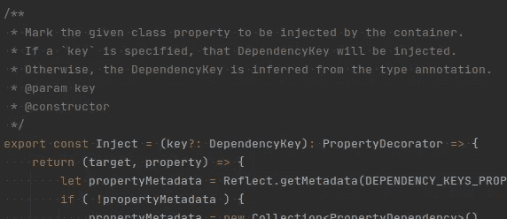

# 重新思考类型脚本中的依赖注入

> 原文：<https://medium.com/geekculture/rethinking-dependency-injection-in-typescript-6f47aa27e891?source=collection_archive---------2----------------------->

## 比较命名注入、构造函数注入和属性注入

> 这篇文章最初出现在我的博客上，[这里](https://garrettmills.dev/blog/2021/03/30/Rethinking-Dependency-Injection-in-TypeScript/)。



A snippet from @extollo/di’s Inject decorator.

以前读过这篇博客的人都知道，我对依赖注入和控制反转范例特别感兴趣。

在过去的几年里，我已经用 JavaScript 为各种项目实现了 d I，目前我正在重写我的框架及其 DI 实现，所以我想分享一些关于不同 JavaScript/TypeScript DI 策略的观察。

特别是，我们将探索命名注入、构造函数注入和属性注入。

# 命名注入

我在 JavaScript 中对 DI 的第一次尝试依赖于纯运行时代码，并允许通过名称从容器注入服务:

```
const Injectable = require('./Injectable')class SomeInjectableClass extends Injectable {
    static services = ['logging'] myMethod() {
        this.logging.info('myMethod called!')
    }
}
```

这是一个相当有效且可伸缩的范例，将服务定义为类本身的属性使得考虑父类所需的服务变得容易:

```
// ...
class AnotherInjectableClass extends SomeInjectableClass {
    static get services() {
        return [...super.services, 'another_service']
    }

    myMethod() {
        this.another_service.something()
        super.myMethod()
    }
}
```

事实上，这种机制足够可靠，以至于它成为我的 [Flitter 框架](https://code.garrettmills.dev/Flitter/di)中使用的注射器的基础。

# 缺点

然而，这种方法也不是没有缺点。首先，所有的类都必须扩展一个公共的`Injectable`基类。如果你的类是从一个库中的基类扩展而来，那么它就不能被直接注入。

同样，依赖服务名使得很难确切地知道注入到类中的是什么。特别是当我将更多的项目和我的框架转移到 TypeScript 时，依赖命名注入是不行的。这需要引用带有`any`类型注释的属性:

```
class SomeInjectableClass extends Injectable {
    static get services(): string[] {
        return [...super.services, 'another_service']
    }

    myMethod(): void {
        (this as any).another_service.something()  // NOT type safe
    }
}
```

依赖命名服务也使得可注入类不灵活，因为服务必须注入到具有相同名称的属性中。比方说，我有一个名为`models`的服务，以及一个使用它的类。如果该类想要保留一个名为`models`的数组，它将与注入的服务冲突:

```
class SomethingThatUsesModels extends Injectable {
    static get services() {
        return [...super.services, 'models']
    }

    // CONFLICT with the injected 'models' service
    protected models: Model[] = []
}
```

因为命名注入器必须绕过类型安全，这可能会导致这样的情况，即 TypeScript 编译器将`models`类型化为`Model[]`，但是注入器将其重写为被注入的`models`服务，这将导致运行时错误。

# 构造函数注入

因为我们是在 TypeScript 中工作，所以我们想完全抛弃命名注入。TypeScript 编译器有一个标志，当启用该标志时，会发出类和属性的类型元数据，使其可通过反射 API 使用。

这很有用，因为它有效地基于依赖项的类型而不是任意字符串来“命名”依赖项。因此，在定义类型化可注入类时，每个属性包含两条信息，而不仅仅是一条。

同样，我们可以启用实验性的“装饰者”功能，这允许我们注入任何任意的类，而不是要求它扩展一个基本的`Injectable`类。例如:

```
@Injectable()
class SomethingThatUsesModels {
    protected models: Model[] = [] constructor(
    	protected readonly modelsService: ModelsService,
    ) { }
}
```

任何使用过 Angular 框架的人都熟悉这种格式。Angular DI 在历史上就是这样工作的，使用类型反射来处理注入。现在，它使用自定义编译器在编译时处理注入，但这超出了本文的范围。

# 这是如何工作的？

好了，我们有了一个装饰器和一些类型注释。但是，我们实际上是如何进行注射的呢？

关键是那个`Injectable`装饰师。本质上，这个装饰器是一个接受它所装饰的类的函数。然后，这个函数使用`reflect-metadata`包获取构造函数参数的类型注释列表，然后将该信息存储为附加元数据。

这里有一个来自 [Extollo DI](https://code.garrettmills.dev/extollo/di/src/branch/master/src/decorator/injection.ts) (Flitter 的 TypeScript 继任者)的(简化)示例:

```
/**
 * Get a collection of dependency requirements for
 * the given target object.
 * @param {Object} target
 * @return Collection<DependencyRequirement>
 */
function initDependencyMetadata(target: Object): Collection<DependencyRequirement> {
    const paramTypes = Reflect.getMetadata('design:paramtypes', target)
    return collect<DependencyKey>(paramTypes).map<DependencyRequirement>((type, idx) => {
        return {
            paramIndex: idx,
            key: type,
            overridden: false,
        }
    })
}/**
 * Class decorator that marks a class as injectable.
 * When this is applied, dependency metadata for the constructors 
 * params is resolved and stored in metadata.
 * @constructor
 */
export const Injectable = (): ClassDecorator => {
    return (target) => {
        const meta = initDependencyMetadata(target)
        Reflect.defineMetadata(DEPENDENCY_KEYS_METADATA_KEY, meta, target)
    }
}
```

本质上，这个装饰器所做的就是从类的元数据中读取类型注释，并将它们以更好的格式存储在自己的元数据键中(`DEPENDENCY_KEYS_METADATA_KEY`)。

## 实例化该类

好的，我们已经将类型注释存储在元数据中，但是我们如何将它们注入到类中呢？这就是容器出现的地方。

在我们的旧范式中，容器是一个将服务名(`another_service`)映射到创建同名服务的工厂的类。(例如`another_service`至`instanceof AnotherService`)。在基于类型的系统中，容器是一个将类型*映射到创建该类型服务的工厂的类。*

这个结果非常强，因为它支持类型安全的注入。在上面的例子中，容器将“令牌”`ModelsService`映射到`ModelsService`的一个实例。

因此，当我们要求容器注入并创建我们的`SomethingThatUsesModels`类的实例时，容器遍历`DEPENDENCY_KEYS_METADATA_KEY`元数据键中的所有项目并解析它们。然后，它将这些实例传递给新类来实例化它。举一个(简化的)例子:

```
class Container {
    resolveAndCreate<T>(token: Instantiable<T>): T {
        const dependencies = Reflect.getMetadata(DEPENDENCY_KEYS_METADATA_KEY)
        const params = dependencies.orderByAsc('paramIndex')
        	.map(dependency => this.resolveAndCreate(dependency.key)) return new token(...params)
    }
}
```

所以，我们可以像这样实例化我们的`SomethingThatUsesModels`类:

```
const inst = <SomethingThatUsesModels> container.resolveAndCreate(SomethingThatUsesModels)
```

# 缺点

构造函数注入范式工作得很好，解决了我们在命名注入之间关心的许多特性。特别是:

*   提供类型提示注入
*   将类属性名与注入标记分开

然而，这落后于命名注入的一个原因是子类必须知道并提供其父类的依赖关系。

例如，假设我有一个类:

```
@Injectable()
class ParentClass {
    constructor(
    	protected logging: LoggingService
    ) { }
}
```

现在，我想定义这个类的一个子类，它有自己的依赖项:

```
@Injectable()
class ChildClass extends ParentClass {
    constructor(
    	protected another: AnotherService,
    ) { super() }  // ERROR!
}
```

这将立即导致编译失败，因为`ChildClass`没有将所需的依赖项传递给父节点。实际上，子类还必须*将父类的依赖项指定为其构造函数中的参数:*

```
@Injectable()
class ChildClass extends ParentClass {
    constructor(
    	protected another: AnotherService,
        logging: LoggingService,
    ) { super(logging) }
}
```

这个问题变得非常明显。父对象的所有依赖项和导入也必须在*all*of children 中指定。随着类变得越来越大，继承链变得越来越长，您很快就会遇到长得离谱的构造函数签名:

```
@Injectable()
class LargerControllerClass extends ParentControllerClass {
    constructor(
    	protected logging: LoggingService,
        protected config: ConfigService,
        protected models: ModelsService,
        socket: SocketService,
        renderer: ViewRenderer,
        other: OtherService,
		another: AnotherService,
        more: MoreService,
    ) { super(socket, renderer, other, another, more) }
}
```

这里，子节点不仅需要知道父节点的依赖关系，还需要考虑构造函数参数的顺序，这在实践中可能是不相关的，但在不同版本之间可能会中断。

# 资产注入

为了改进这一点，我们希望将注入的依赖项从构造函数中分离出来，同时仍然保持我们从构造函数注入中获得的类型提示和属性名优势

这有一个额外的好处，即保持构造函数签名较小，并保持非注入的构造函数参数与注入的不同。

幸运的是，在 TypeScript 中，类的属性也发出类型注释，并且可以被修饰。所以，我们可以改变我们的

`ParentClass`和`ChildClass`定义如下:

```
@Injectable()
class ParentClass {
    @Inject()
    protected readonly logging!: LoggingService
}@Injectable()
class ChildClass extends ParentClass {
    @Inject()
    protected readonly another!: AnotherService
}
```

# 这是如何工作的？

这里的“神奇”之处是`@Inject()`装饰器，它查看它所装饰的属性的类型注释，并将该属性及其令牌值作为元数据存储在类中。下面是 Extollo 的[实现](https://code.garrettmills.dev/extollo/di/src/branch/master/src/decorator/injection.ts#L69)的一个简化示例:

```
/**
 * Mark the given class property to be injected by the container.
 * @constructor
 */
export const Inject = (): PropertyDecorator => {
    return (target, property) => {
        const propertyMetadata = new Collection<PropertyDependency>()
        Reflect.defineMetadata(DEPENDENCY_KEYS_PROPERTY_METADATA_KEY, propertyMetadata, target) const type = Reflect.getMetadata('design:type', target, property)
        if ( type ) {
            const existing = propertyMetadata.firstWhere('property', '=', property)
            if ( existing ) {
                existing.key = key
            } else {
                propertyMetadata.push({ property, key })
            }
        } Reflect.defineMetadata(DEPENDENCY_KEYS_PROPERTY_METADATA_KEY, propertyMetadata, target)
    }
}
```

现在，当容器创建一个类的实例时，它不是将依赖项作为参数传递给构造函数，而是实例化该类，然后在具有`@Inject()`decorator 的类上设置属性。例如:

```
class Container {
    resolveAndCreate<T>(token: Instantiable<T>): T {
        const inst = new token()
        const dependencies = Reflect.getMetadata(DEPENDENCY_KEYS_PROPERTY_METADATA_KEY, token)
        const instances = dependencies.map(x => {
            inst[x.property] = this.resolveAndCreate(x.key)
        })

        return inst
    }
}
```

不过，这里有一个问题。说我们是来`resolveAndCreate<ChildClass>(ChildClass)`的。由于 JavaScript 的工作方式，这个调用返回的实例将只具有在子类中定义的属性，而不是在父类中定义的属性(即`another`，而不是`logging`)。

为了理解为什么，我们需要一些背景知识。

## 原型链

在 JavaScript 中，继承是原型。假设我们有以下内容:

```
const parent = new ParentClass(...)
const child = new ChildClass(...)
```

创建为`parent`的对象有一个原型“链”组成。因此，如果我试图访问`parent`上的方法或属性，JavaScript 将首先检查属性是否存在于`parent`本身。如果没有，它将检查属性是否存在于`ParentClass.prototype`，然后是`ParentClass.prototype.prototype`，依此类推。

如果你跟踪原型链足够长的时间，JavaScript 中的每一项最终都会从`Object.prototype`或`Function.prototype`扩展而来。(对于班级来说，是后者。)从这些原型中的任何一个，我们都可以使用`Class.prototype.constructor`访问与它们相关联的构造函数。

因此，为了从原型中获取`ParentClass`构造函数，我们可以做`ParentClass.prototype.constructor`。

## 问题

当我们的`@Inject()` decorator 保存关于属性类型注释的元数据时，它是通过在定义属性的类的原型上定义一个新的元数据属性来完成的。

由于`logging`属性最初是在`ParentClass`中定义和修饰的，所以包含我们需要的信息的元数据属性实际上是在`ParentClass.prototype`中定义的。

然而，当对`ChildClass`中的`another`属性调用`@Inject()`时，*用`ChildClass`在`ChildClass.prototype`上定义的属性定义*一个新的元数据键。

因此，为了获得我们需要注入的所有属性，我们必须检查为被实例化的构造函数的继承链中的所有原型定义的元数据。因此，容器实现可能看起来像这样:

```
class Container {
    resolveAndCreate<T>(token: Instantiable<T>): T {
        const inst = new token()
        const meta = new Collection<PropertyDependency>()
        let currentToken = token do {
            const loadedMeta = Reflect.getMetadata(DEPENDENCY_KEYS_PROPERTY_METADATA_KEY, currentToken)
            if ( loadedMeta ) meta.concat(loadedMeta)
            currentToken = Object.getPrototypeOf(currentToken)
        } while (
            Object.getPrototypeOf(currentToken) !== Function.prototype
            && Object.getPrototypeOf(currentToken) !== Object.prototype
        ) meta.map(x => {
            inst[x.property] = this.resolveAndCreate(x.key)
        })

        return inst
    }
}
```

现在，`inst`将为继承链中的所有父类定义注入的所有属性。

# 两全其美

这种方法结合了命名注入的优点和构造函数注入的类型安全:

*   子类不需要考虑其父类的依赖性
*   注入的依赖项可以是类型提示的
*   依赖项的属性名独立于它们的类型
*   父依赖项会自动计算在内

用了一段时间后，我真的很喜欢这个范式。它提供了一种类型安全的方式来可靠地进行依赖注入，同时仍然保持类定义的整洁和与父类无关。

# 缺点

虽然它仍然是我的首选解决方案，但 TypeScript 中的属性注入仍然有它的缺点。也就是说，它需要使用[非空断言操作符](https://www.typescriptlang.org/docs/handbook/release-notes/typescript-2-0.html#non-null-assertion-operator)，因为属性是由容器填充的。

正因为如此，如果你在容器外手工实例化一个类，而没有填充所有的属性，编译器不会捕捉到它。访问该实例的属性会导致运行时错误。然而，假设你总是用容器实例化`Injectable`类，这个问题很大程度上是无声的。

我在本文中没有深入探讨的另一个缺点是容器代码。泛化容器(无论是构造函数注入还是属性注入)需要使用`any`操作符*，因为工厂是通过键匹配的。至少在我的实现中是这样。我很想看看其他选择。*

# 结论

毫无疑问，在这篇文章的另一个版本中，我会发现一个我想尝试的新范例。但是在可预见的将来，我将在我的项目中实现和运行属性注入。正如我在文章中提到的，构造函数注入和属性注入支持构成了我的新项目 [Extollo framework](https://extollo.garrettmills.dev) 的依赖注入器的基础。

我尽量不深入研究实现本文中各种策略所需的实际代码，因此如果您有兴趣了解我是如何在我的项目中实现这些策略的，这里有一些链接:

*   [过滤器 DI](https://code.garrettmills.dev/flitter/di) (命名-注入)
*   [Extollo DI](https://code.garrettmills.dev/extollo/di)(构造函数-和属性-注入，WIP)

一如既往，我很乐意听到人们实施这一点的任何其他策略或方法，所以请随意留下评论或[联系](https://garrettmills.dev/#contact)。