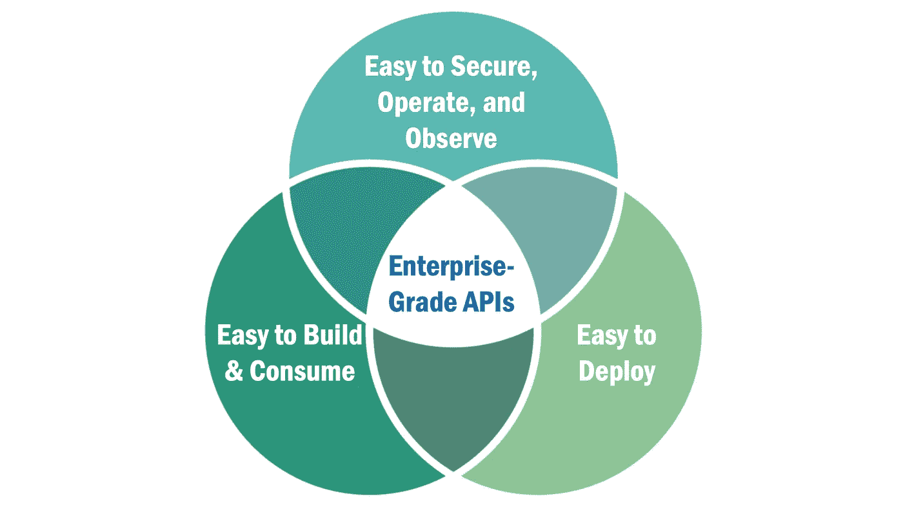

# 重新思考企业级 API

> 原文：<https://medium.com/geekculture/rethinking-enterprise-grade-apis-8af3d5f2bfbd?source=collection_archive---------15----------------------->

企业级 API 仍然很难构建和操作。不一定要这样。

Image by [Eric Broda](https://www.linkedin.com/in/ericbroda/)

# 构建企业级 API 没有这么困难

企业级 API 是组织用来将新产品推向市场的构建块。它们是联结开放银行业、开放…