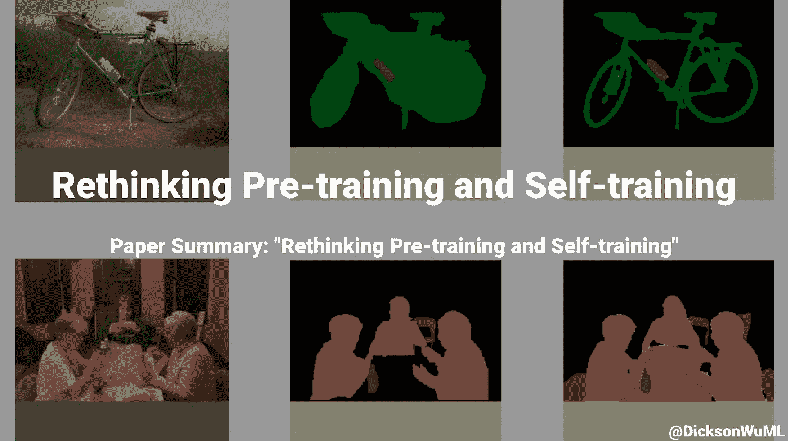

# 反思职前培训和自我培训

> 原文：<https://medium.com/geekculture/rethinking-pre-training-and-self-training-6731999d3248?source=collection_archive---------14----------------------->

## 论文摘要:“反思职前培训和自我培训”

> 论文作者:Barret Zoph、Golnaz Ghiasi、宗、尹翠、、Ekin D. Cubuk、Quoc V. Le

# 摘要:

预训练一直都在用！我们使用 ImageNet 上预先训练好的权重用于各种其他模型。但是一篇论文显示…