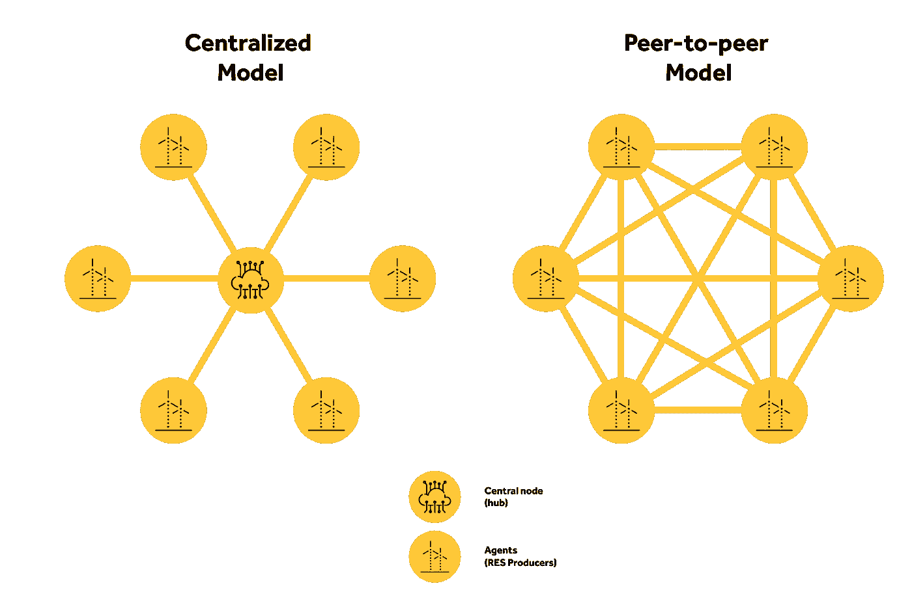
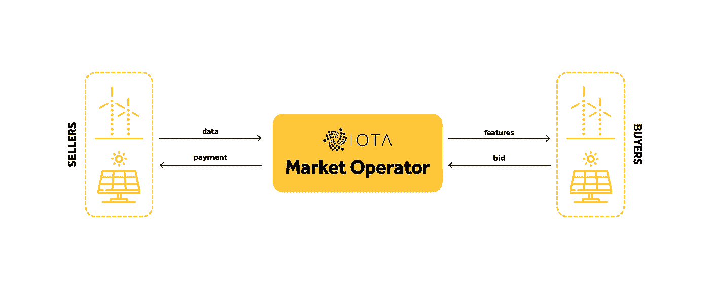
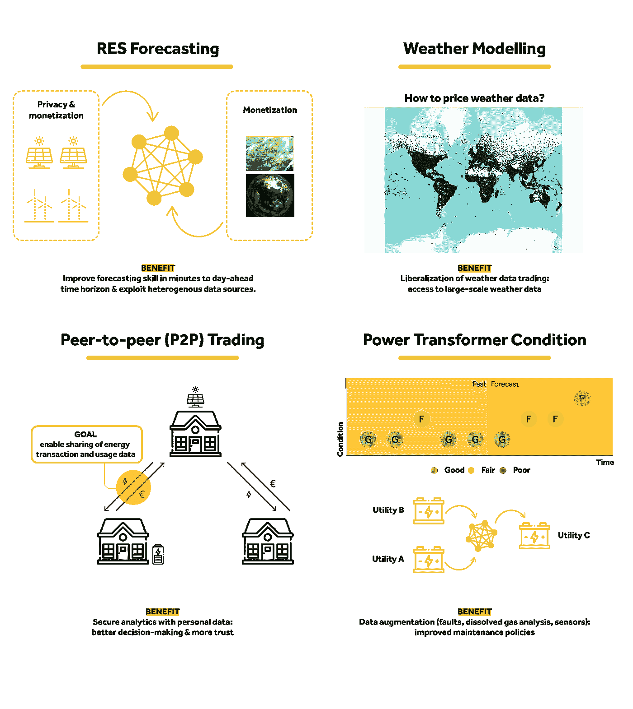

# 重新思考可再生能源预测商业模式

> 原文：<https://medium.com/geekculture/rethinking-renewable-energy-forecasting-business-models-8cd2cb44d531?source=collection_archive---------8----------------------->

## ***通过协作分析实现可持续能源系统中的数据隐私和货币化。***

Retrieved from Pixabay.

可再生能源预测服务分为两种类型:预测即服务(FaaS)和软件即服务(SaaS)。大多数预报服务供应商(Energy & Meteo Systems、Meteologica、Vaisala、WEPROG 等)都采用了 FaaS。)提供由基于云的框架或网络服务 API 支持的按需客户定义的预测服务:客户端要么接收数值天气预测(NWP)，要么将电力数据交换为不同类型的可再生能源电力预测(从单个发电厂到聚合发电厂)。不太常见的是基于 SaaS 的商业模式，客户购买预测软件许可，如西班牙的 AleaSoft。

目前，大量数据是从地理上分散的可再生能源收集的，如风力涡轮机和光伏板。这些数据包括发电和天气测量，如气温、风速和风向、辐射等。最近的文献表明，来自空间分布的 RES 代理的时间序列数据可以提高不同时间范围的预测技能。例如，NWP 的空间网格可以提高几天前的预报[1]；地理上分布的测量可以提高风能和太阳能预测能力达 6 小时[2，3]。

这种背景推动了预测服务新商业模式的设计，现在被驱动来利用来自不同所有者的数据，并为超越传统 FaaS 和 SaaS 的合作创造经济激励。为了实现这个目标，**需要解决两个需求:数据隐私和数据市场的算法解决方案**。

# **协作分析和数据隐私:**

在 [Smart4RES](https://www.smart4res.eu/) Horizon 2020 项目的框架下，INESC TEC 一直在为分布式学习和协作预测开发隐私保护协议，并于 2020 年 12 月向欧洲专利局提交了**专利**。

我们专注于非常短期 RES 预测的隐私保护协议[【4】](https://zenodo.org/record/4588854#.YEY5sGj7SUk)，**，我们的主要研究成果是数据转换和基于分解的方法的新颖组合，允许预测模型在另一个特征空间中拟合，而不降低其预测技能**。

这种创新模式的主要优势是:

(a)可以解决对等体之间的异步通信；

(b)可以使用两种不同的方案——与中立节点的集中式通信和对等(P2P)通信——并且以原始数据不能被中央节点或对等节点恢复的方式来实现灵活的隐私保护协作模型。

这种分布式学习框架使得不同的代理或数据所有者(例如，可再生能源发电厂、市场参与者、预测服务提供商)能够利用地理上分布的时间序列数据(电力和/或天气测量、NWP 等)。)并提高预测技能，同时保持数据私密性。在这种情况下，数据隐私既可以指并网可再生能源发电厂的商业敏感数据，也可以指采用可再生能源技术的家庭的个人数据(例如，根据欧盟一般数据保护条例)。分布式学习意味着，代替共享数据，以分布式方式解决模型拟合问题。

如上所述，**两种协作方案是可能的:与中央节点(中央集线器)的集中式通信和对等通信(P2P)** 。

Centralized and peer-to-peer communication schemes for collaborative analytics (image by author).

在集中式模型中，中心节点可以是输电/配电系统运营商(TSO/DSO)或预测服务提供商。TSO 或 DSO 可以运行一个平台，促进竞争性可再生能源电厂之间的合作，以提高预测准确性并降低系统平衡成本；另一方面，预测服务提供商可以托管中央节点，并在模型拟合期间为不同数据所有者之间的信息(非数据)交换提供 API 和协议，并为此服务收取费用。

P2P 模型适用于不想依赖(或信任)中立代理的数据所有者。

潜在的商业模式有:

(a)消费者或可再生能源发电厂之间的 P2P 预测；

(b)智能城市，其特点是在房屋、建筑物和交通网络上安装越来越多的传感器和设备。

# **数据市场和货币化:**

由于 RES 代理很可能是同一电力市场中的竞争对手，即使数据隐私得到保证，他们也不愿意共享数据，尤其是功率测量。**鼓励代理分享数据的一种有效方式是通过金钱补偿**。交易数据的“二级”市场是将可再生能源预测数据货币化的必要条件。**这个数据市场的运作方式应该是**，经过一些迭代后，**代理商意识到哪些数据是相关的，以提高其收益**，这样卖家就可以根据他们的数据得到报酬。买方的收益应该是特定用例中预测准确性和价值的函数，例如，电力市场投标中不平衡成本的降低。

在 Smart4RES 项目中，**我们正在为 RES 预测**[【5】](https://zenodo.org/record/4534136#.YEOUuGj7RaQ)中的数据市场开发算法解决方案。第一种方法是将[6]中的解决方案扩展到滑动窗口环境，并针对电力市场中的可再生能源预测和竞价调整增益函数。

Framework of the data market for renewable energy forecasting (image by author).

Nord Pool 市场的数据用于评估 RES 代理商数据市场的潜力，得出的结论是:

(a)所有代理人都从数据市场中受益(从经济角度来看);

(b)首先在一个位置观察风流(或风力发电)的代理，例如在时间步长*t1*，提供相关信息以改进在其他位置的邻居代理的预测模型(例如对于 *t + 1* ),受风向影响，然后所有代理受益于来自数据市场或电力市场的更好预测的更高收入。总之，数据市场可以是一个促进可再生能源代理商之间数据交换的解决方案，并有助于降低不平衡成本。

# **未来事物的形状:**

隐私保护协议和数据市场的应用并不局限于 RES 预测。下图描述了其他潜在用例，INESC TEC 正在将这些技术应用于[eu universal](https://euniversal.eu/)Horizon 2020 项目中的数据驱动低压控制，同时考虑来自智能计量基础设施的稀疏数据。

Potential use cases for collaborative analytics and data markets (image by author).

**在未来，公用事业可能会创造经济激励，让消费者分享他们的数据**(来自智能电器、能源网关等)。)**并使用这些数据支持电网运行**(例如故障和停电位置)**以及提供** [**能源和非能源服务**](https://interconnectproject.eu/) 。一个例子是使用智能电表数据根据消费者对动态关税的弹性对其进行排名，并使用因果关系推断确定需求响应潜力[7]。

***本文作者:***

[**Ricardo Bessa**](http://www.rbessa.com) ，IEEE 资深会员，INESC TEC 动力与能源系统中心协调员。他的研究兴趣包括可再生能源预测、电力市场、智能电网和风险决策。

***致谢***

导致这项工作的研究正在作为 Smart4RES 项目(欧盟的 Horizon 2020，编号 864337)的一部分进行。本文仅反映作者的观点。欧洲创新与网络执行局(INEA)对其包含的信息的任何用途概不负责。

***延伸阅读***

[1] J. R. Andrade 和 R. J. Bessa，“用数值天气预测网格改进可再生能源预测”，IEEE Trans .反对有效。《能源》,第 8 卷，第 4 期，第 1571-1580 页，2017 年 10 月。

[2] L. Cavalcante、R. J. Bessa、M. Reis 和 J. Browell，“用于极短期风力预测的 LASSO 向量自回归结构”，《风能》，第 20 卷，第 4 期，第 657–675 页，2017 年 4 月。

[3] R. Bessa，A. Trindade 和 V. Miranda，“智能电网的时空太阳能预测”，IEEE Trans .印度。信息技术。，第 11 卷，第 1 期，第 232–241 页，2015 年 2 月。

[4]c . gon alves，R.J. Bessa，P. Pinson，“可再生能源预测的隐私保护分布式学习”，IEEE Trans .反对有效。能源，出版中，2021 年。

[5]c . gon alves，P. Pinson，R.J. Bessa，“可再生能源预测的数据市场”，IEEE Trans .反对有效。《能源》,第 12 卷，第 1 期，第 533-542 页，2021 年 1 月。

[6] A. Agarwal，M. Dahleh 和 T. Sarkar，“数据市场:算法解决方案”，正在进行中。ACM 会议。经济学。计算，2019 年，第 701–726 页。

[7] K. Ganesan，J. Tomé Saraiva，Ricardo J. Bessa，“关于在设计关税中使用因果关系推断以实施更有效的行为需求响应计划”，《能源》，第 12 卷，第 14 期，第 2666 页，2019 年 7 月。