# 使用 Ansible 动态检索容器的 IP 并在容器内配置 web 服务器。

> 原文：<https://medium.com/geekculture/retrieving-containers-ip-dynamically-using-ansible-and-configuring-a-webserver-inside-the-container-74716c8bbfb5?source=collection_archive---------14----------------------->

一个 **nsible 被用于自动化，但是某些事情仍然在 Ansible 中手工完成，它们也需要自动化。** ***一个这样的元素就是存货的*** 。有时，我们手动创建和更新清单，而其他时候，我们希望它是动态的，即它应该动态收集平台上的所有主机。

让我们举一个例子。如果我们想在 docker 容器中配置一些东西，我们有一些方法。我们可以启动容器，**直接进入容器内部，获取外壳并进行配置**。另一种方法是通过**使用 Dockerfile** 的概念来创建一个具有所需配置的 docker 映像。

还有其他方法，其中之一是**使用 Ansible 进入容器内部并代表我们执行操作**。在这次实践中，我也将同样贯彻执行。

在这篇博客中，我将创建一个 Ansible playbook，它将启动一个容器，检索该容器的 IP，并同时在库存中更新它。在下一部行动手册中(或同一部)，我们可以进一步深入到该容器内部执行某些配置。

## 这难道不令人兴奋吗？🔥就像启动容器、获取其 IP/主机名、进入容器内部以及配置某些东西一样，一切都可以通过单击来完成。

# 这就是自动化的力量！🔥🔥

大多数时候， **Ansible 使用 SSH 协议进入 Linux 系统进行配置管理**。类似地，要进入 docker 容器内部，Ansible 也需要一个与容器的 SSH 连接。在这里，我将使用“CentOs”作为基本映像，默认情况下，SSH 在此映像中未启用。

## 因此，我的第一步是创建一个支持 SSH 的映像。

我将使用上面的 Dockerfile 文件创建一个支持 SSH 的映像:

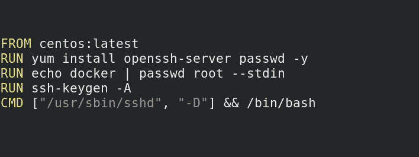

在这里，我已经创建了映像，并使用 SSH、 ***获取终端或容器，我已经将 root 密码设置为“docker”***。

## 要构建图像:

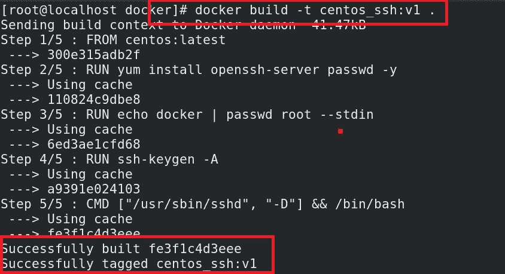

因此，已经创建了支持 SSH 的映像:

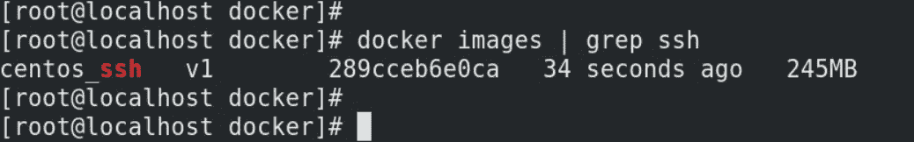

现在， ***下一部分是创建一个可翻译的剧本，它将启动容器，检索它的 IP，并动态地更新库存中的 IP。***

这是一个可行的行动手册:

> ***-名称:动态对接
> 主机:本地主机
> vars_prompt:***
> 
> ***-名称:c_name
> 提示:输入容器名称
> 私有:否***
> 
> ***-名称:ssh_port
> 提示:输入 ssh 的公开端口
> 私有:否***
> 
> ***-名称:web_port
> 提示:输入 WebServer 的公开端口
> 私有:否
> 
> 任务:***
> 
> ***-名称:启动 Docker 守护进程
> 服务:
> 名称:docker
> 状态:启动***
> 
> ***-名称:发射容器
> docker_container:
> 名称:" {{ c_name }}"
> 图像:centos_ssh:v1
> 状态:已启动
> 交互:是
> tty:是
> 端口:
> -" { { web _ port } }:80 "
> -" { { ssh _ port } }:22 "
> 寄存器:x***
> 
> ***-名称:调试
> 调试:
> var:x . container . network settings . IP address***
> 
> ***-名称:更新库存
> block infile:
> path:IP . txt
> block:|
> 【docker】
> { { x[' container '][' network settings '][' IP address ']} } ansi ble _ ssh _ user = root ansi ble _ ssh _ pass = docker ansi ble _ connection = ssh***

该行动手册将询问容器名称、SSH 和 WebService 的公开端口，然后它将从给定的映像(与我们在上一步中创建的映像相同)启动容器。

启动后，它会将输出注册到一个名为“x”的变量中。然后，它将检索变量容器的 IP，并在一个名为“ip.txt”的文件中更新它

这个“ip.txt”文件将是我们的库存文件，我们必须在 Ansible 的配置文件中传递这个文件。这里是我在本地创建的一个“ansible.cfg”文件:

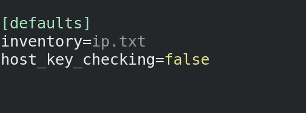

现在，让我们运行这个剧本:

## 在这里，您可以看到容器的 IP 已经被检索到。我有容器的导出端口 22，因为我们可以通过两种方式在容器内部执行 SSH:

## >首先，通过使用基本操作系统的 IP 和端口 9001，在这种情况下，我们可以在某个其他节点上运行 Ansible，该节点将访问此基本操作系统，并使用暴露的 SSH 端口配置在此操作系统上运行的容器。

## >或者，通过使用容器的 IP 和端口 22，如果操作系统与容器直接连接，在这种情况下，我们必须只在本地主机上运行 Ansible。

## 为了方便起见，我使用第二个选项。然而，你可以选择以上任何一种方法。如果您选择第一个选项，您必须为 SSH 使用端口 9001，而不是端口 22。要更改端口，您可以在清单中使用“ansible_ssh_port”关键字。

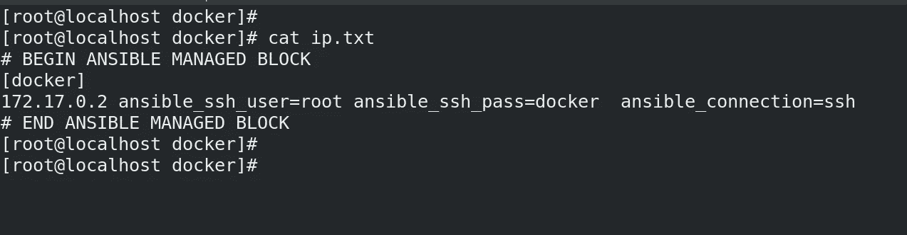

如您所见，库存也已更新。

下一步是通过进入容器来配置一些东西(让我们配置一个 web 服务器),这件事将只由 Ansible 来完成。

这里是相同的可行的剧本。

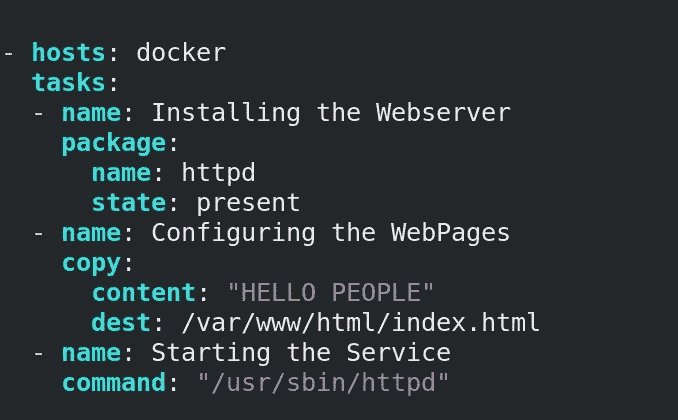

正如我们所知，我们不能使用' systemctl '命令来启动容器内的服务。所以在这里，我已经直接执行了‘httpd’的二进制文件来启动服务。

以下是行动手册的输出:

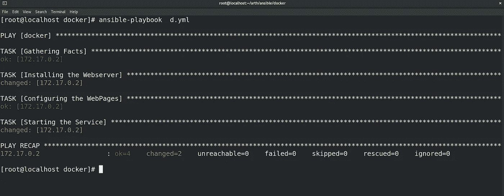

行动手册运行成功。让我们尝试在基本操作系统的 9002 端口访问网页:

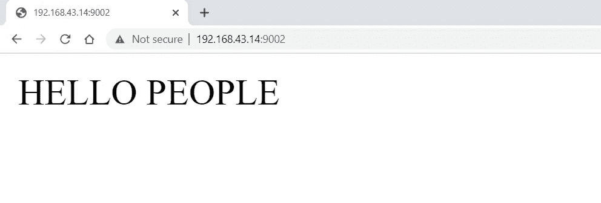

因此，通过使用 Ansible 进入容器内部，我们也成功地配置了一个 web 服务器。

# #临时演员

**我们还有一种方法可以做到这一点，即动态获取容器的 IP 地址。这可以通过使用脚本来完成，通常称为动态清单。**

您可以创建任何语言的脚本来检索 IP，也可以使用一些预先创建的脚本。您可以在这个[位置](https://github.com/ansible/ansible/tree/stable-2.9/contrib/inventory)获得一些预先创建的动态库存脚本。

这里我们需要两个文件: [docker.py](https://raw.githubusercontent.com/ansible/ansible/stable-2.9/contrib/inventory/docker.py) 和 [docker.yml](https://raw.githubusercontent.com/ansible/ansible/stable-2.9/contrib/inventory/docker.yml) 。

将这两个文件下载到您的本地系统中。**您需要使用“chmod +x docker.py”命令使 python 文件可执行。**

您只需在 docker.py 文件的第一行将“env python”更改为“python3 ”:

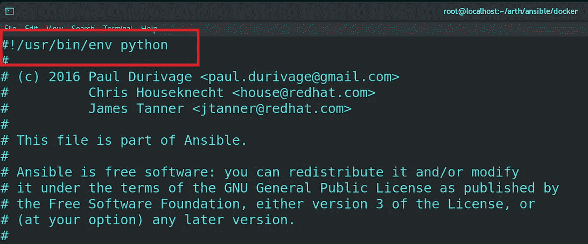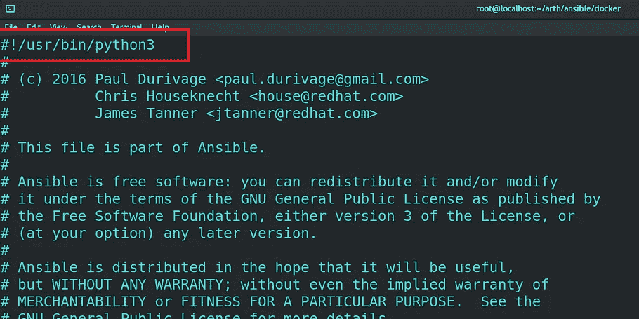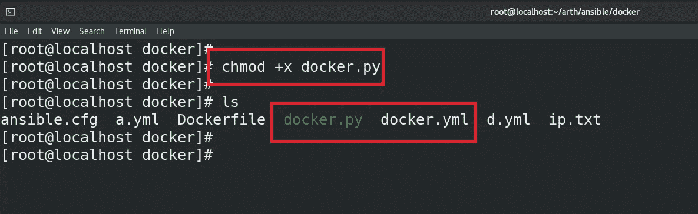

**现在，您需要做的就是执行该文件，以获得关于运行中的容器的信息。但在此之前，让我们启动一些容器:**

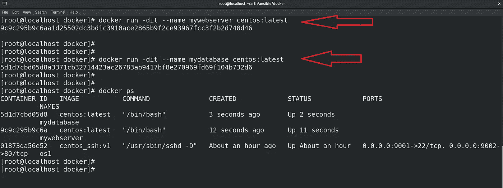

## 现在，让我们执行脚本:

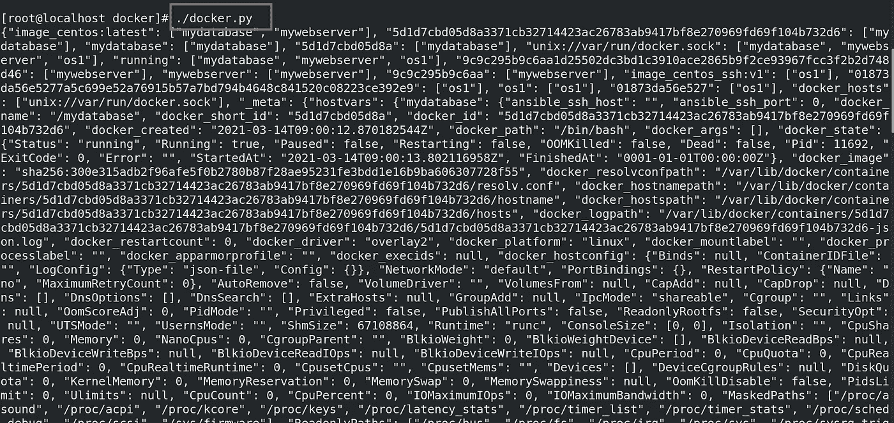

如你所见，它会给你所有容器的全部信息。

但现在问题来了，如何利用这个库存？所以，在 Ansible 的配置文件中，我们可以直接传递这个文件来获取主机:

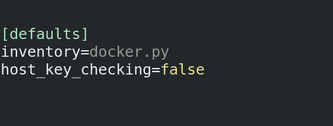

**检索主机:**

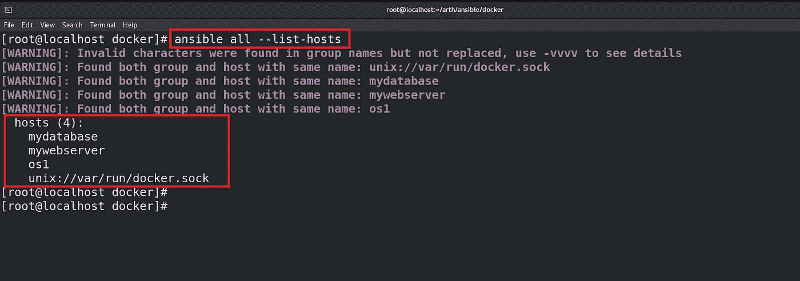

**因此，您可以看到使用 docker 的动态清单脚本已经成功检索了所有主机。**

**原来如此，如此而已。我希望你喜欢上面的博客。请分享并鼓掌。😁**

## 要获得上述所有代码和文件，请访问以下 GitHub 链接:

 [## shhubhamm/Docker_with_ansible

### 在 GitHub 上创建一个帐户，为 shhubhamm/Docker_with_ansible 开发做贡献。

github.com](https://github.com/shhubhamm/Docker_with_ansible) 

## 你也可以在 LinkedIn 上和我联系:

 [## Shubham Mehta - S.K.M.U Dumka -印度| LinkedIn

### ✨:我是一个积极的学习者，喜欢以一种敢做的心态挑战每一个问题，以便将任何想法变成现实

www.linkedin.com](https://www.linkedin.com/in/shubham-mehta-b09335188/) 

在下一篇博客中，我们会看到更多令人兴奋的任务。

结束！😊