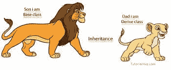

# 使用继承重用角度形状组

> 原文：<https://medium.com/geekculture/reusing-angular-form-groups-using-inheritance-71e1d555c47e?source=collection_archive---------5----------------------->



Inheritance

当许多表单控件在多个表单中重复时，重用现有的表单组非常有用。在这种情况下，您可以在多个组件中重用一个表单组。

我正在考虑 2 个组成部分:学生和管理员。这两个角色有很多相似的特征，如姓名、年龄、地址、pin 码等。他们也有不同的特点，如学生将有一个等级和总量，而管理员将有一个资格和经验。

我在项目的 src/app 文件夹下创建了一个 **commonFormGroup.ts** 文件。这是一个非常简单的例子，只有 3 个常见的表单控件，但是在实际的应用程序中，您会发现有多个常见的表单控件。这个文件可以包含多个类，即不同类型的表单的表单组都在一个地方。

```
import { FormControl, FormGroup } from “@angular/forms”;export class **CommonFormGroup**{public **commonPersonForm**=new **FormGroup**({
firstName:new FormControl(“”),
lastName:new FormControl(“”),
age:new FormControl(0)
})
}
```

这个表单组非常简单，没有验证，只有每个表单控件的默认值。这些表单控件及其验证将在子类中定制。

现在在**的学生成分中。**如您所见，StudentComponent 类扩展了基类 CommonFormGroup。因此，基类中的所有属性和方法对 StudentComponent 都是可用的。我们需要做的只是添加特定于 StudentComponent 的附加表单控件。

```
import { Component, OnInit } from ‘@angular/core’;
import { FormControl, Validators } from ‘@angular/forms’;
import { CommonFormGroup } from ‘../commonFormGroup’;@Component({
selector: ‘app-student’,
templateUrl: ‘./student.component.html’,
styleUrls: [‘./student.component.scss’]
})**export class StudentComponent extends CommonFormGroup** {**constructor() {
super();
}**public grades=[1,2,3,4,5,6,7,8,9,10,11,12];ngOnInit() {this.commonPersonForm.get(‘age’).patchValue(6);this.commonPersonForm.get(‘firstName’).setValidators([Validators.required,Validators.pattern(/^([a-zA-Z]+\s)*[a-zA-Z]+$/)]);this.commonPersonForm.get(‘lastName’).setValidators([Validators.required,Validators.pattern(/^([a-zA-Z]+\s)*[a-zA-Z]+$/)]);this.commonPersonForm.get(‘age’).setValidators([Validators.required,Validators.pattern(/^[0–9]+$/),
Validators.max(18),Validators.min(6)]);**this.commonPersonForm.addControl(‘grade’,new FormControl(1,[Validators.required]));****this.commonPersonForm.addControl(‘aggregate’,new FormControl(0,[Validators.required,Validators.pattern(/^[0–9]*$/),Validators.maxLength(3)]))**}}
```

我们添加了验证，并对几乎所有的表单控件进行了修改。

1.  **年龄**的初始值已被重置为 6。
2.  **名字**和**姓氏**表单控件具有验证功能，限制用户只能输入带空格的字母。
3.  **年龄**表单控件具有只接受数字的验证，学生的最小年龄可以是 6 岁，最大年龄可以是 18 岁。
4.  2 个附加表格控件:**等级和骨料**已添加至表格组。

```
<h4>Student Form</h4><form **[formGroup]=”commonPersonForm”**>
<div class=”row”>
<label class=”col-md-2">First Name:</label>
<input **formControlName=”firstName”** class=”col-md-8 form-control” type=”text”>
</div><div class=”row”>
<label class=”col-md-2">Last Name:</label>
<input **formControlName=”lastName”** class=”col-md-8 form-control” type=”text”>
</div><div class=”row”>
<label class=”col-md-2">Age:</label>
<input **formControlName=”age”** class=”col-md-8 form-control” type=”text”>
</div><div class=”row”>
<label class=”col-md-2">Grade:</label>
<select **formControlName=”grade”** class=”col-md-8 form-control” type=”text”>
<option *ngFor=”let grade of grades”>{{grade}}</option>
</select>
</div><div class=”row”>
<label class=”col-md-2">Aggregate:</label>
<input **formControlName=”aggregate”** class=”col-md-8 form-control” type=”text”>
</div><button class=”btn btn-success” [disabled]=”commonPersonForm.invalid”>Submit</button></form>
```

在 **AdminComponent** 中，我们也做了类似的修改。

```
import { Component, OnInit } from ‘@angular/core’;
import { FormControl, Validators } from ‘@angular/forms’;
import { CommonFormGroup } from ‘../commonFormGroup’;@Component({
selector: ‘app-admin’,
templateUrl: ‘./admin.component.html’,
styleUrls: [‘./admin.component.scss’]
})**export class AdminComponent extends CommonFormGroup** {**constructor() {
super();
}**ngOnInit() {this.commonPersonForm.get(‘age’).patchValue(18);this.commonPersonForm.get(‘firstName’).setValidators([Validators.required,Validators.pattern(/^([a-zA-Z]+\s)*[a-zA-Z]+$/)]);this.commonPersonForm.get(‘lastName’).setValidators([Validators.required,Validators.pattern(/^([a-zA-Z]+\s)*[a-zA-Z]+$/)]);this.commonPersonForm.get(‘age’).setValidators([Validators.required,Validators.pattern(/^[0–9]+$/),
Validators.max(60),Validators.min(18)]);**this.commonPersonForm.addControl(‘qualification’,new FormControl(“”,[Validators.required]));****this.commonPersonForm.addControl(‘experience’,new FormControl(2,[Validators.required,Validators.pattern(/^[0–9]*$/),Validators.maxLength(2),Validators.min(2)]))** }
}
```


Inheritance

每种形式都独立工作，互不依赖。它们的工作方式与没有继承时完全一样。但是继承无疑简化了代码，使得复杂的表单和大量的表单控件易于重用。