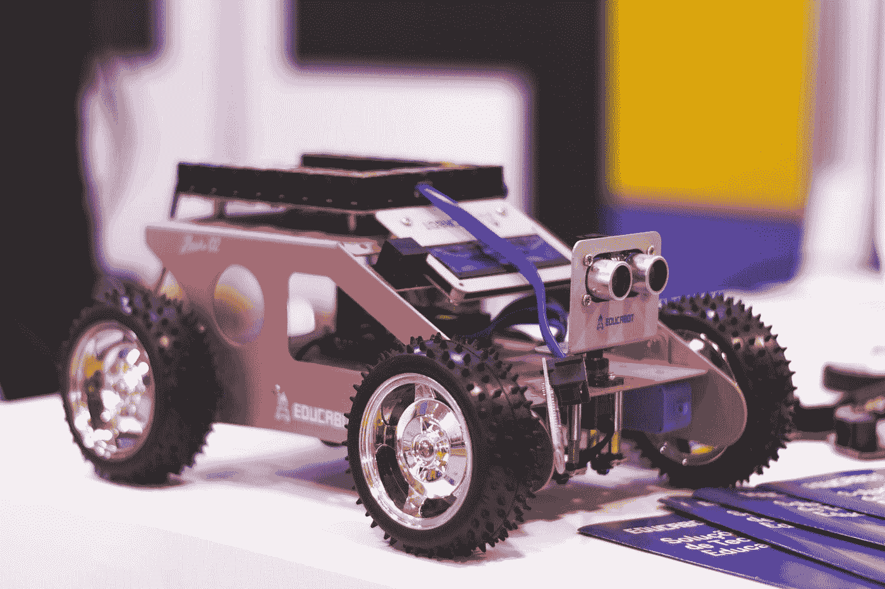

# 利用机器人技术改造汽车制造

> 原文：<https://medium.com/geekculture/revamp-of-the-automobile-fabrication-through-the-use-of-robotics-1c3486930b58?source=collection_archive---------50----------------------->

## 即将到来的永恒是迷人的。

Photo by [Marília Castelli](https://unsplash.com/@liacastelli?utm_source=medium&utm_medium=referral) on [Unsplash](https://unsplash.com?utm_source=medium&utm_medium=referral)

奥德汽车公司的作者亨利·福特设想了顺序建筑系统，这是一种工业设施设计。工作从一个活动开始传递，然后传递到下一个活动，直到劳动者(他们保持固定)完成项目。