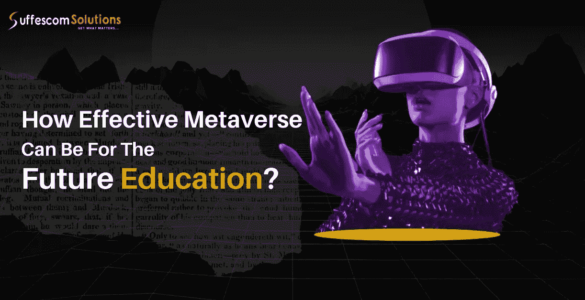

# 揭示元宇宙教育机构的可能性

> 原文：<https://medium.com/geekculture/revealing-the-possibilities-for-educational-institutions-in-the-metaverse-ef015f465d54?source=collection_archive---------14----------------------->

## 几乎每一个行业都可以在元宇宙的领域中占据一席之地。

## 自人类文明开始以来，教育行业就一直存在。随着 Web3 相关技术的出现，这些机构正在走向 Web3 的元宇宙。

Photo by [Micheal Ogungbe](https://unsplash.com/@micheal632?utm_source=medium&utm_medium=referral) on [Unsplash](https://unsplash.com?utm_source=medium&utm_medium=referral)

## 通过[元宇宙]，教育机构可以利用 AR/VR 和[智能合同]的力量，为学生展示身临其境的体验。Edu 诗句承诺将元宇宙的旗帜举得更高。对于整体沉浸式体验，它肯定会要求更多的沉浸式体验。

元宇宙是一个拥有无数可能性的虚拟世界。几乎每一个行业都可以在元宇宙的领域中占据一席之地。最近，疫情时代带来的技术进步改变了产业营销产品的方式。2003 年，第二生命平台出现了，旨在创建能够像人类一样执行相同活动的数字化身，但在数字世界中，它立即变得非常受欢迎。除了当时的流行之外，当时的技术还没有现在先进到可以证明一个真实的平行世界的存在。

借助区块链技术的力量，教育机构可以在元宇宙的领域中运行良好。区块链技术不需要第三方控制，运行在去中心化的框架上。Web3 空间的保护伞容纳了区块链、AR/VR、[智能合同](https://en.wikipedia.org/wiki/Smart_contract?ref=hackernoon.com)和许多其他未来技术。元宇宙属于 web3 的世界，因此它在提供完美的沉浸式体验的同时保持着巨大的势头。将一个人直接传送到元宇宙的领域讲述了元宇宙领域可能带来的可能性。

# 探索元宇宙教育机构的众多可能性。

# 教育行业，过去和现在

自人类文明开始以来，教育行业就一直存在。随着趋势的变化，教育行业也在不断发展。目前，他们依靠基于 Web2 的集中式技术来运营。但是随着与 Web3 相关的技术的出现，这些机构也正在走向 Web3 的元宇宙。有了[元宇宙，教育机构](https://risingmax.com//web3/web3-eLearning-platform-development?ref=hackernoon.com)可以利用 AR/VR 和区块链技术的力量为学生展现身临其境的体验。

元宇宙对这些学生很有启发，他们很清楚数字设备的潜力，并让教育者思考如何在 Web3 元宇宙空间经营教育机构。因此，教育机构正在寻找一种方法来选择在元宇宙的空间。解决这个问题的方法是创造 Edu 诗句，它有望将元宇宙的旗帜举得更高。

[How Effective Can Be Education In Metaverse?](https://www.suffescom.com/blog/how-effective-can-be-education-in-metaverse/)

# 将统治 Edu 宇宙的技术

## 区块链技术

区块链是目前的流行词，它彻底改革了互联网。这是一种记录信息的方法，使得数据几乎不可能被操纵、黑客攻击或更改。这是一个分布式账本，将交易分布在为区块链提供燃料的计算机网络上。这种结构可以存储称为块的事务性数据，这些数据分布在网络中称为“链”的各种数据库中，最终通过对等节点连接起来。

## 智能合同

智能合约被编程为有利于大众，取代政府指导方针和零售，这是区块链用户利用的众多优势之一。智能合同是用代码编写的，协议被融合到区块链中，不可逆转。

智能合同最积极的一点是，它限制了任何第三方的节制，并阻止了某些不利情况被拖入法庭。随着时间的推移，智能合约已经变得相当先进，因为它们始于程序员将实现的简单语句。

## 增强现实/虚拟现实

AR/VR 技术是元宇宙的支柱。这样，元宇宙可以帮助用户从他们的地方传送到一个由开发者特别制作的幻想世界，帮助用户体验一个前所未有的世界。元宇宙教育机构将利用 AR/VR 的功能来创建虚拟教室。

## 加密货币

加密货币是 Web3 元宇宙的一个有用的支付来源。加密货币用于购买、交易和出售数字资产。它们也可以通过交换钱包转换成法定货币，反之亦然。

## 物联网

通过物联网或物联网，我们可以连接厨房电器、汽车、婴儿摄像头和冰箱等日常物品，甚至可以控制家里的灯。在过去几年的讨论中，物联网增加了很多，提供了流程之间的无缝通信。元宇宙作为一个沉浸式虚拟空间存在，依赖于直接来自物理世界的高分辨率数据。而且，它肯定会要求更加增强的物联网架构。

# 元宇宙可以通过以下好处加强教育产业

## 沉浸式虚拟校园或虚拟大学。

元宇宙将为学生创造大量沉浸式体验的机会。元大学的概念并不是最近才出现的；《第二人生》在近 20 年前推出了其中的许多产品。但是那时候科技没有现在发达。元宇宙现在拥有一大堆人们以前无法想象的未来科技。

元大学的一个值得注意的例子是迈阿密大学，仅该校就有 26 门课程嵌入了虚拟和增强现实项目。

## 可视化和讲故事

讲故事是一个概念，它让几乎每个学生都受益匪浅，能够非常有效地理解一个相当困难的话题。凭借元宇宙创造高度身临其境的情节和故事线的有效力量，人们可以很容易地沉浸在一种比仅仅在黑板上讨论好得多的体验中。

# 重新定义意外情况下人的能力

很多时候，医疗实践领域中的意外情况会导致一些并发症。有了元宇宙和它的虚拟现实，虚拟会议可以与附加功能一起进行，给学生提供他在实际操作中必须面对的相同情况。

# 基于游戏的学习

如上所述，基于游戏的学习实际上可以帮助学生准确地理解特定的主题。通过大量有趣的任务和活动，元宇宙拥有改变教育行业的实力。

# 教育机构可以从元宇宙借鉴的学习类型

# 增强虚拟和混合环境中的真实技能

元宇宙将借助真实世界和压力情境，为教育机构提供体验和提高技能的机会。学生们可以利用元宇宙作为一个平台来避免犯错误，并且不用担心后果。虚拟现实和数据科学一起将推动学习者的参与，并增加学生的信心。

# 经验学习

许多制药行业的领导者已经采用元宇宙来创建更有影响力的教学故事情节。数据科学和虚拟现实的参与将有助于学生更好地理解特定的教育主题。

# 深思熟虑的练习

元宇宙准备帮助教育机构提供有价值的实践课程和反馈回路。那里的学习者可以轻松地练习他们的练习课，以避免在物理操作练习课中可能发生的任何危险情况。

此外，对于其他机构，比如说军事机构，元宇宙将成为网络 3 保护伞下的最佳媒介，为精确练习瞄准提供高科技虚拟现实刺激枪支。教育的其他领域，如历史，也可以利用元宇宙回到过去，让自己沉浸在专为他们制作的故事情节中。

# 状态依赖学习

这种创造性的学习模式将包括创建一个全息形式的三维立体图形，它站在摄像机前，背诵和解释特定的学习主题。这种学习模式也可以在工作场所使用，以应对压力情况，并为员工的心理健康提供治疗性谈话。

# 教育机构的理想 Edu 诗中包含的值得注意的特征

# 教师控制面板

教师控制面板是一个重要的面板，教师可以使用它来全面监控学生在虚拟空间中的活动。应该完全避免佩戴虚拟现实的学生可能面临的任何不利情况。教师还可以跟上学生沉浸其中的故事情节，并在虚拟空间中与他们互动。

## **安全控制**

当谈到在 Web3 的元宇宙为教育机构创造空间时，安全控制功能或紧急按钮功能是必不可少的。

安全控制特征可以避免其他化身给其他化身带来任何不适的机会。

# 讨论室

虚拟空间可以有单独的聊天室和讨论室，学生可以在其中休息一下，远离学习负担，进行社交活动。教师也可以监控这些房间。

# 学会赚钱

“学会赚钱”模式帮助学生在学习的同时赚钱。“学习赚钱”模式将彻底改革教育行业，通过 GameFi 模式和在线学习应用程序的完美结合，学生不再为学习付费，而是真正获得了学习报酬。正如为了学习而玩一样，为了赚钱而学也拥有自己的内部学习资产。这些资产是不可替换的代币形式，可用于获得奖励。

# 走在底线上

总之，元宇宙拥有巨大的教育机构潜力。凭借其令人难以置信的一系列技术，元宇宙已经准备好彻底改造教育的未来。元宇宙已经转化了一些技术，教育部门也已经显示出对现代技术的适应性，以改造未来的教育。新时代的虚拟现实头戴设备是那些对新时代技术并不冷漠的学生们非常感兴趣的事情。

采用元宇宙教育有很多好处，其中值得一提的是残疾学生和偏远地区学生对元宇宙的使用。学生们可以在世界任何地方上课，尽管旅行对他们来说可能有点困难。元宇宙欢迎那些想多走一步获得有意义的教育的学生，这种教育有可能带来积极的变化。

我们都知道多媒体和电影会对观众的思想产生影响。事实上，元宇宙是一种电影体验，甚至超越它，是一种 3d 体验，通过它，每个行业，包括教育行业，都可以带来期待已久的变化。