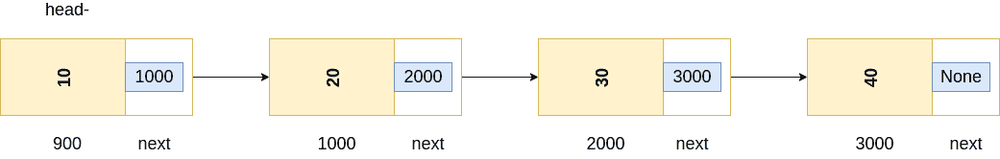

# 使用 python 在没有额外数据结构的情况下反转链表

> 原文：<https://medium.com/geekculture/reverse-a-linked-list-without-additional-datastructures-using-python-7739305dbba0?source=collection_archive---------13----------------------->

## 如何在 python 中反转链表


## 典型的链表



# 目标

给定一个单链表，在不使用额外数据结构的情况下反转它。

# 问题陈述:

让我们假设我们有一个如上的链表

我们这里的链表有以下元素

```
10-->20-->30-->40 Head = 10
```

头部指向数值 10。我们现在需要反转这个链表。输出应该如下所示

```
40-->30-->20-->10 Head = 40
```

在本文中，我们将执行以下操作

*   创建一个单向链表
*   反转单向链表，前提是头节点可用

# 创建一个单链表:

Creating a single linked list

# 演练:

## 节点:

节点是具有两个属性的类。

1.  `data`
2.  `next`

data 属性保存节点数据值，next 存储后续的节点对象。在上面的例子中，10、20、30 和 40 存储在`data`变量中。

## 链接列表:

LinkedList 类是初始化所有节点的地方，并根据需要将其插入到链表的开头/结尾。在上面的代码中，我们在链表的尾部插入元素。当我们反转链表时，我会告诉你我们这样做的原因。

在这段代码中插入一个`node`的时间复杂度是`O(1)`。原因是，我们在`self.current`变量中跟踪最后插入的节点。我们将新节点插入到`self.current.next`变量中，并将新节点赋给`self.current`。

我们还有一个获取链表头的方法。有多种方法可以得到链表的头。这只是其中的一个实现。

现在我们已经准备好了代码，让我们创建一个链表。

让我们也定义一个`print_lst`函数来可视化一个给定链表的内容。

```
def print_lst(head):    current = head 
   while current:      print(current.data, end="->") 
     current = current.next
```

# 创建链接列表:

```
# Initialize the linked list object l1 = LinkedList() # Insert elements into linked list l1.insert_at_the_end(10) 
l1.insert_at_the_end(20) 
l1.insert_at_the_end(30) 
l1.insert_at_the_end(40) # Get the head of the linked list 
l1_head = l1.get_lst_head() 
print_lst(l1_head) Output: 
10->20->30->40->
```

# 反转一个链表

理想情况下，我们可以在链表的头部或尾部插入一个元素。正如我们前面讨论的，我正在解释为什么我们选择在例子的末尾插入元素。

原因是，当你在链表的头部插入元素时，插入的顺序是相反的，即第一个元素在最后，最后插入的元素将在链表的头部。我们将利用这一点，并在头部插入元素，以便给定的链表是反向的

```
def reverse_lst(head):

    current = head
    new_head = None

    while current:

        node = Node(current.data)

        # Assign the new head to node's next
        node.next = new_head

        # Assign the node to new head
        new_head = node
        current = current.next

    return new_headreversed_head = reverse_lst(l1_head)
print_lst(reversed_head)Output: 40->30->20->10->
```

请注意，有多种方法可以反转一个链表，比如使用一个堆栈，多个指针，这个方法通过修改现有的链表来反转链表。

根据您的采访者，需求和实现可能会发生变化。

下面给出了完整的代码。

Code to reverse linked list

请随时留下任何反馈。

*最初发表于*[*【https://dineshkumarkb.com】*](https://dineshkumarkb.com/tech/reverse-a-linked-list-without-additional-datastructures-using-python/)*。*