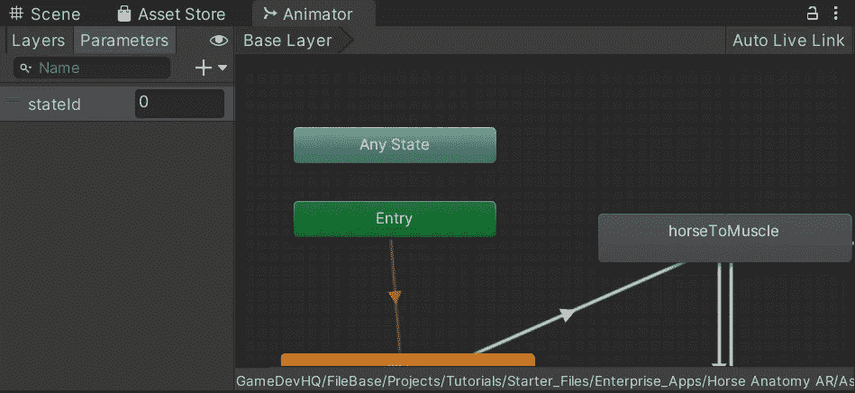

# 在 Unity 中反转动画

> 原文：<https://medium.com/geekculture/reverse-an-animation-in-unity-11aa9e2c9fd0?source=collection_archive---------7----------------------->

## 如何团结

## 在 Unity 里反转一个动画简直易如反掌。

**反转**一部动画在**合一**简直易如反掌。我说的倒放，是指准确无误地倒放**。让我们假设我们已经有了一个模型，里面有一个**动画组件**和一个**动画**，一个**状态**。像这样:**

****