# 裸机固件逆向工程—第 3 部分|分析 ARM 组件和利用漏洞

> 原文：<https://medium.com/geekculture/reverse-engineering-bare-metal-firmware-part-3-analyzing-arm-assembly-and-exploiting-3b2dbe219f19?source=collection_archive---------10----------------------->

From: [https://0x00sec.org/uploads/default/original/2X/e/e52e1dc9cf922b754575f507d0c9794ed51f47c6.png](https://0x00sec.org/uploads/default/original/2X/e/e52e1dc9cf922b754575f507d0c9794ed51f47c6.png)

大家好，我是 wittsend 2:rag NAR Security 的创始人，我将继续教大家如何逆向工程(和利用)裸机固件。在第三部分，我们将重点分析我写的 CTF 挑战赛——furor 中的汇编。我们将探讨 ARM (32 位)的一些重要概念，以及在逆向工程和利用 ARM 时需要注意的一些事情。

第一部分和第二部分中有一些概念是我们在第三部分中没有涉及的。在继续之前阅读它们是一个好主意(或者当你困惑时参考它们)。链接如下:

*   第一部分:[https://medium . com/codex/reverse-engineering-bare-metal-low-level-kernel-images-with-QEMU-getting-started-c 705 b 7 b 14d 35](/codex/reverse-engineering-bare-metal-low-level-kernel-images-with-qemu-getting-started-c705b7b14d35)
*   第二部分:[https://ragnarsecurity . medium . com/reverse-engineering-bare-metal-kernel-images-part-2-6a 52 a4 AFA 3 ef](https://ragnarsecurity.medium.com/reverse-engineering-bare-metal-kernel-images-part-2-6a52a4afa3ef)

如果您还没有，请在 Twitter 上关注我们，了解更多嵌入式系统、逆向工程和二进制开发内容:【https://twitter.com/RagnarSecurity

在试图阅读 furor 的汇编之前，我们先来看一下 ARM 指令集的一些核心概念。ARM 是一种 RISC 架构，这意味着比基于 CISC 的处理器(如英特尔)中的指令更少。这并不意味着只有“几个”指令:仍然有许多指令。处理器也有两套指令:常规 ARM 指令和 THUMB 指令。ARM 指令一般是 32 位；然而，为了节省内存(和资金)，创建了 THUMB 指令，其大小是一半。**关于这一点的一个重要注意事项:** THUMB 指令的空字节更少，这使得利用更容易。

让我们先来看一下 ARM 二进制文件中的一些重要指令:

*   LDR[寄存器][地址] —将数据从内存中的地址移动到寄存器。
*   STR[寄存器][地址] —将数据从寄存器移动到内存中的地址。
*   MOV[目标寄存器] [src 寄存器/立即值] —将数据从源移动到目标。

这些是从内存或寄存器移动数据的指令。关于 ARM，需要注意的一点是，它是一个基于加载/存储的架构，这意味着您需要在使用它之前将数据从内存放入寄存器(并调用 store 将数据从寄存器放入内存)。与 x86 不同，您不能调用 move 或对内存本身执行操作。

我们也有一般的算术指令:

*   添加[目的地]、[服务中心]、
*   sub [dest]。【src】。
*   sdiv [dst]、[src]、<const>—在 ARMv7R Thumb 模式下可用</const>
*   udiv [dst]、[src]、<const>—在 ARMv7R Thumb 模式下可用</const>
*   CMP[寄存器 1]，[寄存器 2]
*   和[目的地]，[服务中心]
*   或[目的地]，[服务中心]
*   eor [dest]。[src] —异或
*   tst[寄存器 1]，[寄存器 2]
*   asr [dst]， <const>—算术右移(按常量移动 dst)</const>
*   夏令时
*   asl [dst]， <const>—算术左移(按常量移动 dst)</const>
*   美国夏令时。[src]

此外，我们也可以使用比较和分支(跳转)指令。提醒一下，这些检查由 **cmp** 或 **tst** 设置的标志，以确定下一组执行应该如何发生。

*   b <e><q>{addr} — e 和 q 可选。它们可以是诸如 eq，lt，le，ne 之类的东西，它们检查标志来查看调用 cmp 时发生了什么。</q></e>
*   bl {addr/function} —这可能是你会看到的最常见的
*   blx {addr/function} —与上述指令相同，但可以选择从 ARM 模式切换到 Thumb 模式(反之亦然)。
*   bx {addr} —跳转到目标地址，更改指令集。

分支不仅有条件地使用，而且与调用函数相关联。每当我们调用一个函数时，我们通常会使用某种形式的分支指令。

在分析 furor 固件之前，要讨论的最后一个概念是调用约定。调用约定是一组定义好的指令，用来帮助设置和完成函数的执行。例如，您将看到一个 prolog 和 epilog，在函数执行开始时，它将前一个函数的局部变量和旧程序计数器推入堆栈。在函数结束时，它将这些变量从堆栈中弹出，将旧的程序计数器放入链接寄存器，然后返回到上一个函数。此外，调用约定决定函数参数如何传递。在 ARM 中，前四个参数存储在寄存器 r0-r3 内。之后，它被存储在堆栈上。这与 x86 机器上的 cdecl 或 stdcall 不同，在 x86 机器上，所有参数都存储在堆栈上。

作为参考，下面是 ARM 如何使用其寄存器:

*   R0-R3:在堆栈上传递的参数值。额外的变量被放入堆栈
*   R4-R11:局部变量
*   R12:过程内调用暂存变量
*   R13:堆栈指针
*   R14:链接寄存器—这通常是要返回的地址(通常通过 **bl lr** 看到)
*   R15:程序计数器—指向即将执行的下一条指令

关于 ARM 指令集更深入的解释，请参考 **Azeria Lab 关于编写 ARM 汇编的教程**:[https://azeria-labs.com/writing-arm-assembly-part-1/](https://azeria-labs.com/writing-arm-assembly-part-1/)。它由七个部分组成，对我刚才解释的概念进行了更深入的探讨

现在你对 ARM 有了一点了解，让我们来分析一下 furor 背后的代码。为了提醒我们在前面的部分中发现了什么，固件要求输入密码，有一个隐藏的标志(通过字符串找到)，我们找到了反映固件行为的函数。

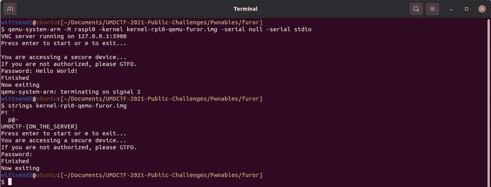

The firmware executed by QEMU and strings inside the firmware image.

S

因为我们使用的是没有符号的汇编代码，所以我们需要弄清楚每个函数都有符号。我们应该做的第一件事是在固件执行期间将各种功能与行为相关联。这将使我们很好地了解哪些函数处理输入和输出，从而更容易理解正在发生的事情。

看函数时，我会想到两件事。FUN_000101f0 有一个我们在 QEMU 中运行固件时看到的字符串的参数。由于这很容易关联，我们将调用这个函数 **uart_puts** 。(作为参考，uart 是嵌入式系统使用的一种输入和输出类型。它利用串行，我们用 QEMU 对此进行模拟。我们还知道固件在两个地方接受输入:在语句之后:“**按回车开始……”**和**密码:“**。

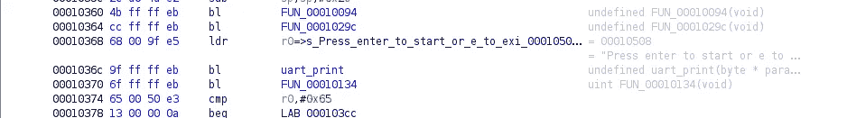

The first time the firmware accepts input

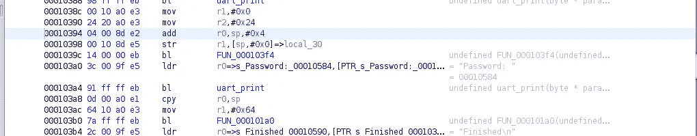

The second time the firmware accepts standard input

根据上面的汇编代码，它似乎是两个不同的功能。紧接在**“按下回车键启动…”之后的功能**只接受一个字符，而在**“密码:”**之后的功能接受多个字符。根据参数，看起来第二个函数接受 0x64 (100)个字符。函数的原型类似于 **getc()** 和**gets()；**因此我们将分别调用这些函数 **uart_getc()** 和 **uart_gets()** 。这就是我们现在所拥有的:

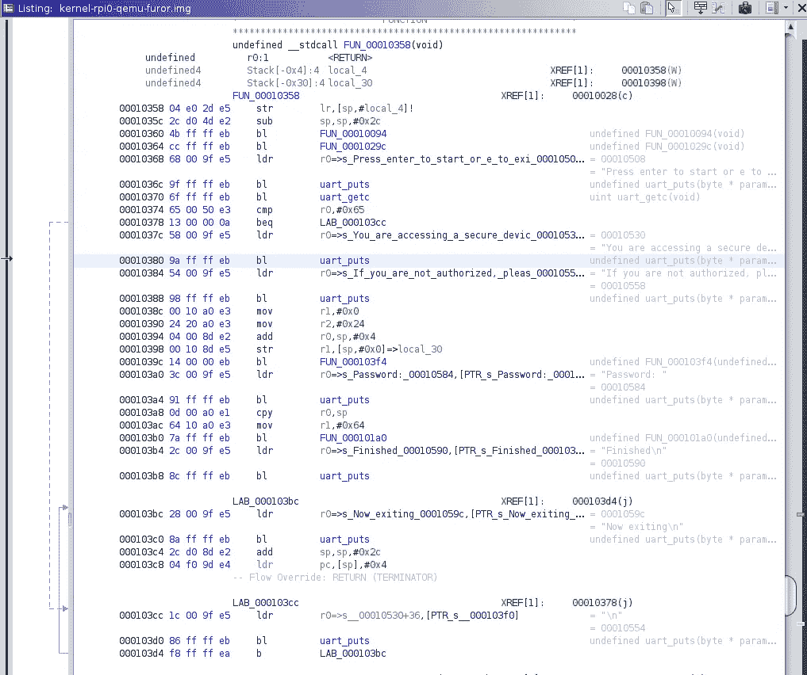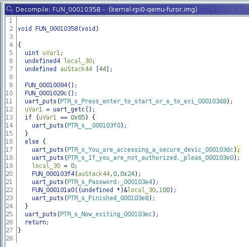

现在我们需要找出其他的功能。这将需要阅读和逐步通过 ARM 指令(或反编译器)。我们先从 **FUN_00010094 开始。**

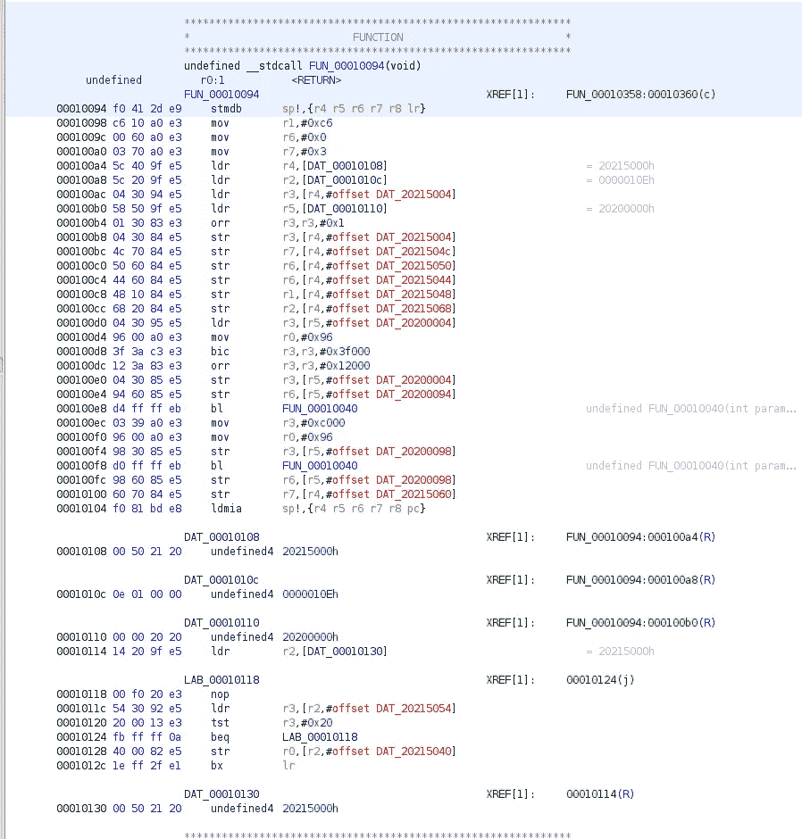

FUN_00010094

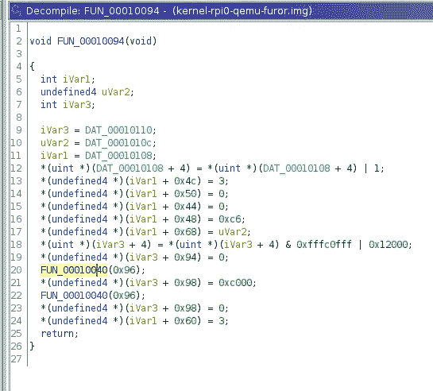

Disassembly view of FUN_00010094

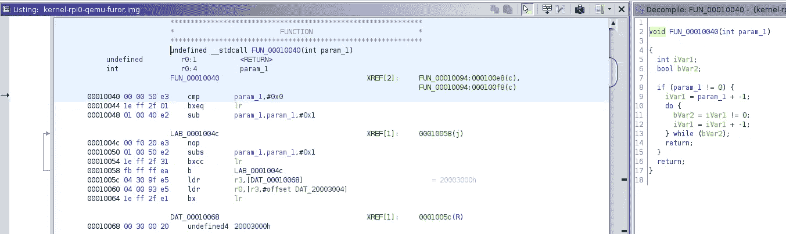

FUN_00010040

看起来这个函数主要是在内存中加载和设置一些值。我们确实看到它调用了一个 FUN_00010040，但它所做的似乎只是循环，直到变量变为零。看起来这可能是固件的一个特定的设置功能。

现在我们来看 **FUN_0001029C:**

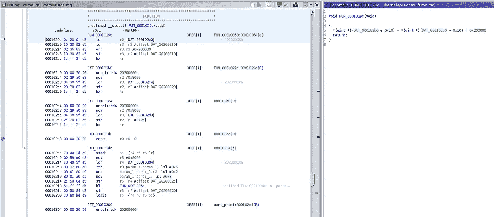

FUN_0001029C

它看起来比前面的函数小得多；然而，它似乎是通过使用 orr 指令来修改内存中的值。这暗示它是另一个设置指令，所以我们将它标记为。

> 关于 ARM 的另一个注意事项:移位器操作数可能具有某些功能。例如:地址为 0x000102ec 的 ADD 指令，我们看到 **r3，lsl 0x2** 。这意味着处理器会将 r3 的位左移 2 位，然后将其添加到 param_1。这允许更紧凑的汇编代码。

最后我们还有 FUN_000103F4 剩下来分析。

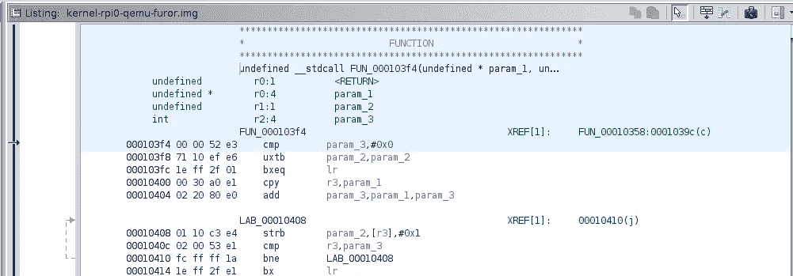

FUN_000103F4

它接受三个参数，一个指针(param_1)、一个立即值(param_2)和一个整数(param_3)。它以 param_3 的定义速率循环迭代。它获取 param_2 的值，并将其放在内存位置 **param_1 + (4 字节偏移量*当前迭代)**。看到这个，它让我想起了 memset，所以我将它与 Linux 文档中的 memset 进行了比较。手册页的副本在下面。

memset manual page.

正如我们所看到的，对于我们在固件汇编代码中分析的函数和 Linux 的 memset，原型非常相似。参数和描述的行为几乎相同。因此，我们可以假设这个函数是 memset。

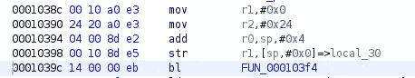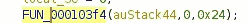

经过所有这些分析，这里是我们得到的。比以前干净多了。

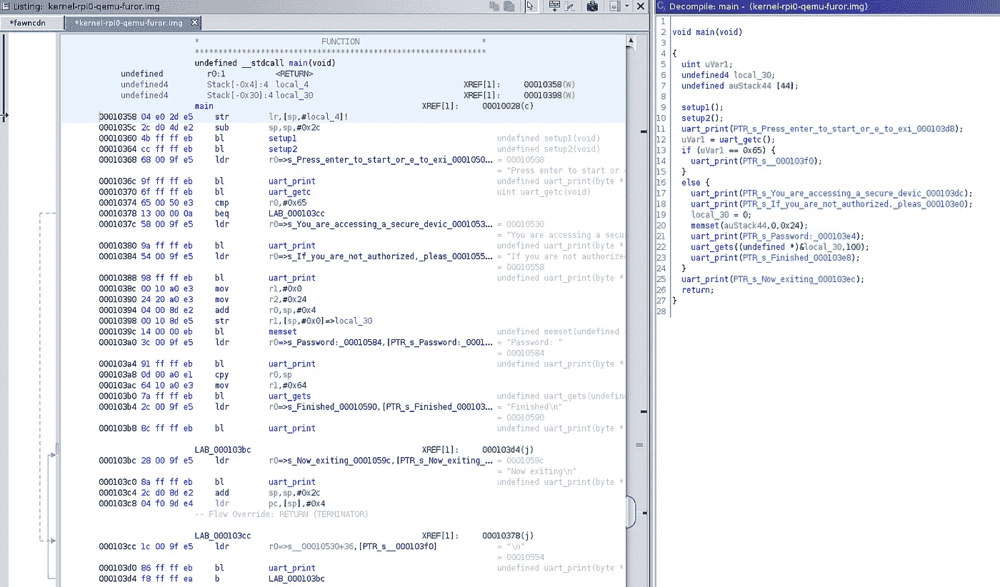

既然我们已经弄清楚了固件正在利用的大多数功能，我们需要弄清楚是否存在我们可以利用的漏洞。要检查的一些漏洞是堆栈、堆/内存和格式字符串。由于这个固件不使用格式字符串，我们可以把它从列表中划掉。因此，这可能是一个基于内存的漏洞(无论是堆栈还是其他部分)。

当查看 prolog 时，我们看到分配给堆栈的函数允许读入 0x64 字节。这意味着我们有一个基于堆栈的缓冲区溢出漏洞。

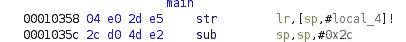

因为这个挑战被设计成有一个远程服务器，所以有意的利用是将标志打印到屏幕上。让我们首先找到字符串所在的位置，并查看是否有任何关于如何利用漏洞的迹象。

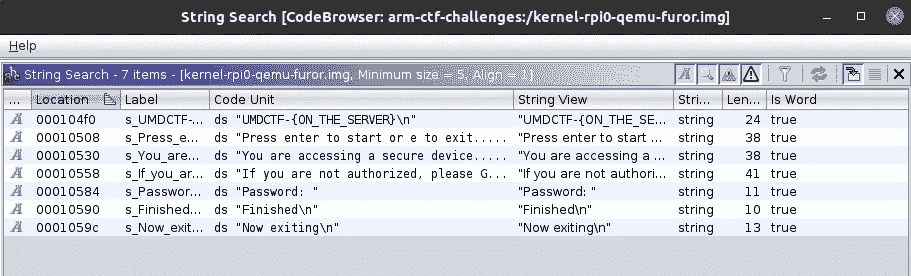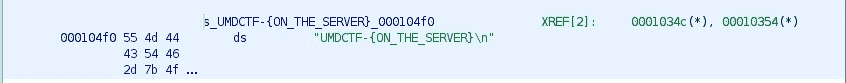

There are two references to the flag

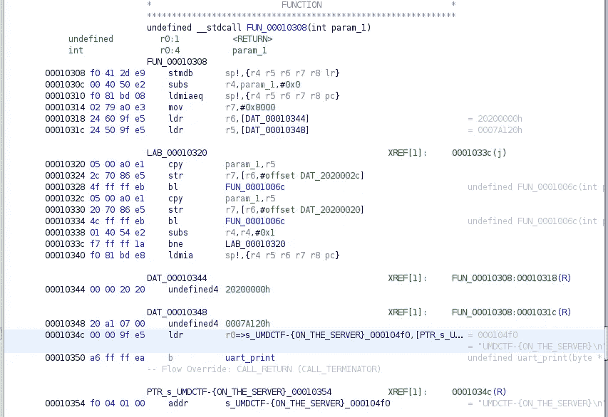

There is a function here that prints the flag..

正如我们在上面看到的，有一个函数可以打印出标志。因此，如果我们控制返回地址(存储在 LR 寄存器中)并将其指向该函数，我们将通过串行打印该标志。是时候利用这个漏洞了！

在我们精心制作这个漏洞之前，提到利用裸机固件和标准 Linux 二进制文件之间的一个主要区别是至关重要的:**没有信号(意味着没有分段错误)**。因此，我们必须依靠我们的调试技能来知道我们何时到达了有效载荷中的正确位置。

我将利用我在第一部分中编写的脚本在 GDB 调试固件。通过这种方式，我们可以单步执行函数，并查看和确定各种有效负载如何影响内存、寄存器和输出。

有两种方法可以成功利用这一点:

*   直接调用函数(我写的时候就想好了)。
*   使用 ROP 和 shellcode 打印标志(非故意的，但是可能的)

我将演示第二个选项，因为它经历了许多有用的概念(比第一个选项更有用)。有效载荷本身是由 UMDCTF 的竞争对手 datajerk 编写的。

要打印标志，我们需要执行几个步骤:

*   我们需要加载标志作为参数(r0)。
*   将标志作为参数传递后，我们需要调用 uart_puts。

这可以用一种有趣的方式来完成。如果增长超过堆栈，内存可能会回绕。特别是在 furor 中，GDB 指出在地址 0xFFFF 之后，堆栈绕到 0x10000。

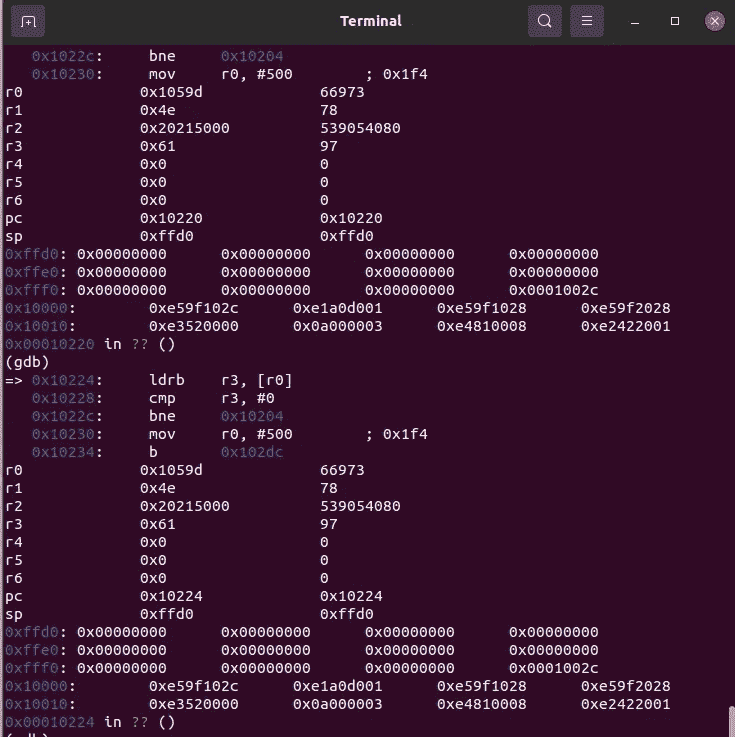

另外，这个固件没有保护(像 NX 或者 stack canaries)。这些都是需要由固件手动实现的，因为二进制文件的大多数通用安全特性都是依赖于操作系统的。

因此，有效载荷将如下所示:

*   溢出缓冲区，直到我们到达$pc(从调试它是 44 字节)。
*   用地址 0x10008 覆盖＄PC—我们将这样做，因为我们将执行 shellcode 来加载 shellcode 并调用 **uart_puts()**
*   将标志地址(0x104f0)写入存储器(该地址为 0x10000)
*   将 uart_puts 的地址(0x101f0)写入存储器(将位于 0x10004)
*   添加外壳代码**pop { r0 }；pop { PC }**；地址为 0x10008。 **Pop {r0}** 将包含标志的地址，而 **pop {pc}** 将包含 **uart_puts()** 的地址。

因此，当我们退出主函数时，我们将跳转到地址 0x10008，加载标志，然后分支到 uart_puts，它将打印出标志。

这是我们最终得到的有效载荷:

以下是最终输出:

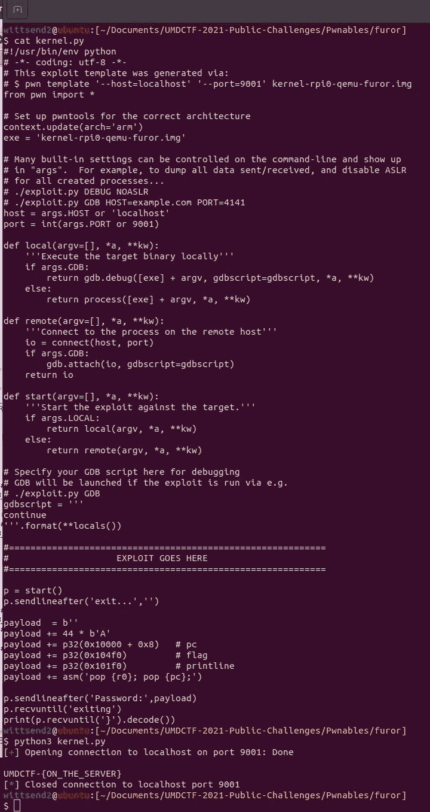

这就结束了逆转(和利用)裸机固件的第三部分。这也是这个系列的最后一部分。如果你喜欢这个教程，并想阅读更多，请关注我…

*   推特:[https://twitter.com/RagnarSecurity](https://twitter.com/RagnarSecurity)
*   https://www.reddit.com/user/ragnarsecurity
*   在中号这里！

我们计划分享的内容包括深入研究逆向裸机固件(更复杂的固件)，开发裸机固件的教程，以及用 Raspbian 或 Ubuntu 对 Raspberry Pi 进行逆向工程。如果您对内容有任何建议或要求，请随时给我们发消息。