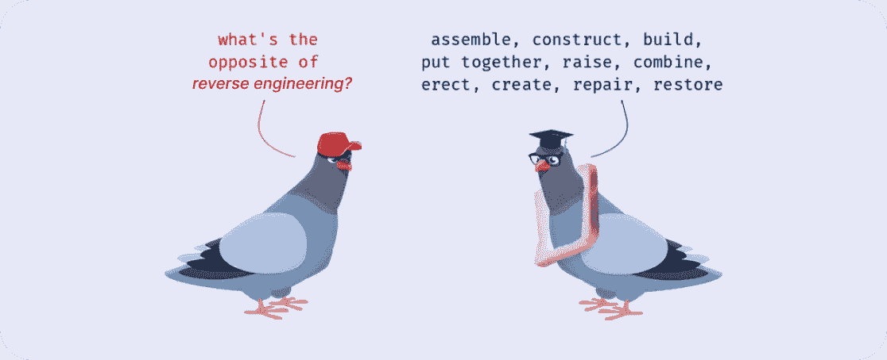
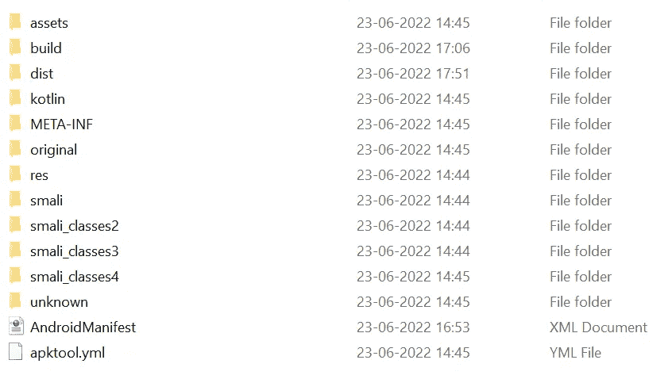
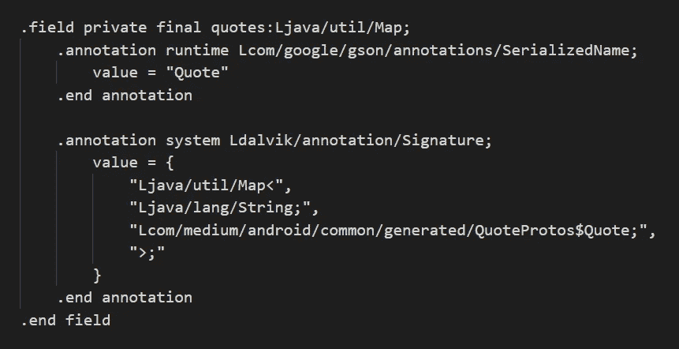
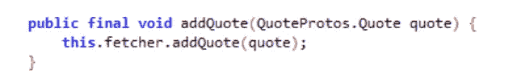
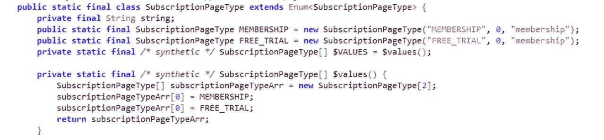
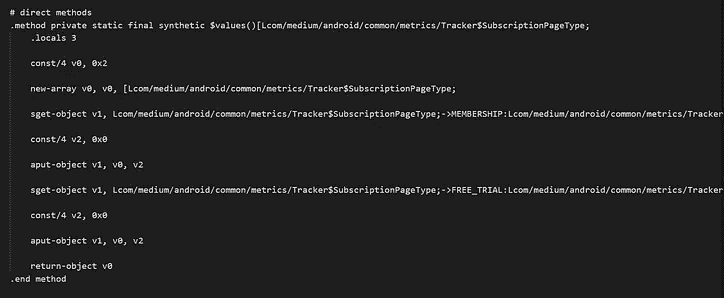

# 对中型应用程序进行逆向工程

> 原文：<https://medium.com/geekculture/reverse-engineering-the-medium-app-6c4009bbf28a?source=collection_archive---------13----------------------->

## 逆向工程



photo by [thesaurus.plus](https://thesaurus.plus/img/antonyms/639/dismantle.png)

逆向工程，分解产品以确定其功能。

在我进一步说之前，让我解释一下我是如何走到这一步的。在一位安全分析师最近表示，我开发的一个应用程序很容易被逆向工程以读取/写入代码并窃取重要信息之后，逆向工程引起了我的注意。

我像往常一样向我的搜索引擎查询同样的事情，她提供了高层次的理由。我开始搜索这一切是因为，作为一个普通人，我没有一下子得到它。

最终能够对软件进行逆向工程来读取代码。

嗯！！我猜你想知道“写”部分发生了什么。

我会说到这一点，但你熟悉这一部分吗？当您使用或创建软件时，有多少代码必须被压缩并翻译成另一种语言才能运行？

由系统构建、运行或编译的程序确实要经过编译步骤。

# 编译程序

对人类可读代码如何进入我们的 CPU 理解的字节序列的高级概述。

*   **预处理阶段:**遍历源代码，执行注释移除、宏展开、条件移除、包含展开。
*   **编译阶段:**将任意语言(python、java、kotlin、HTML、dart、C)编写的源代码转换成汇编语言。
*   **汇编阶段:**汇编器将汇编代码转换成二进制操作码/目标代码。
*   **链接阶段:**入口点，在这里所有的目标代码得到一个内存来解决。

互联网上有足够多的工具可以帮助对软件进行逆向工程，如 Ghidra、x64dbg、OllyDbg、apktool、jadx 等

理论到此为止。让我们看看我是如何破解 Medium 应用程序的。

# 中型 APK

为了反编译源代码，我使用了一些工具，比如 [apktool](https://ibotpeaches.github.io/Apktool/) (生成**[**Smali**](https://github.com/JesusFreke/smali/wiki/Registers)**文件**)， [Jadx](https://github.com/skylot/jadx) (试图为那些美味的 Java 文件付出额外的努力)。然后，我可以通过将应用程序反编译成 Dalvik 字节码，然后将其翻译成粗略估计的 Java 代码来检查功能。**

**对介质 apk 进行反向工程时，会创建一个文件夹，其中包含与其相关的所有文件，如下图所示。**

****

**image by author**

**smali 类中的代码类似于下图**

****

**smali code — image by author**

**[**斯马利**](https://github.com/JesusFreke/smali/wiki/Registers)**——**由于二进制代码很难解释或编辑，因此有一些工具可以用来与人类可读的表示形式进行相互转换。Smali 是最典型的人类可读格式。**

**下图显示了 Smali 在 JAVA 中的表现。**

****

**smali to java**

# **免费制作所有故事**

**我有媒体的所有源代码，所以试图让所有的故事免费，因为媒体每月只免费提供 3 个故事来阅读会员要求的故事。**

**在应用程序的源代码中游了一夜之后，我弄清楚了从启动屏幕到故事预览流程的功能。**

```
The main root for membership verification was within this path***medium\smali_classes3\com\medium\android\common\metrics***And there where i made the changes to the code
```

********

**left image edited java code, right image edited smali code**

**我们无法完全获得 Java 应用程序的源代码。因此，我们必须在汇编级别进行任何必要的更改，以便能够重新编译我们的应用程序(我们有应用程序的完整汇编源代码)。**

**修改汇编文件听起来可能很可怕，但也没那么糟糕。特别是如果我们在讨论 Java 字节码汇编(Java 虚拟机和 Dalvik 虚拟机都有相对高级的指令集，这里不是 LC-3 或 x86)。**

**在将这些行添加到应用程序代码之后，我们必须重新编译所有内容。我们将再次利用 Apktool 从 Smali 文件构建一个 APK。我们现在有一个改变了的 APK。**

**还没完，安卓设备不允许被篡改的 apk 安装，除非登录。**

> **尽管我尽了最大努力，但我观察到介质足够聪明，可以验证 cookie 来验证成员资格。在那里，我没有遇到**

**当我学习逆向工程时，这个资源对我帮助很大。那就是 YouTube 系列的 **HackadayU** 上的[**与 Ghidra**](https://www.youtube.com/watch?v=d4Pgi5XML8E&list=PLcSbrXYDkKywrtGtuo4OMV7QMHuiV6JHV&index=1&t=907s) 的逆向工程**

# **参考**

*   **[**达尔维克操作码**](http://pallergabor.uw.hu/androidblog/dalvik_opcodes.html)**
*   **[**斯马利**](https://github.com/JesusFreke/smali)**
*   **[**反转一个使用了 Flutter**](https://cryptax.medium.com/reversing-an-android-sample-which-uses-flutter-23c3ff04b847) 的 Android 样本**
*   **[**某木马化医疗 app 的现场逆向工程——Android/Joker**](https://cryptax.medium.com/live-reverse-engineering-of-a-trojanized-medical-app-android-joker-632d114073c1)**
*   **[**安卓应用的逆向工程**](/@parfaitayassor/reverse-engineering-of-android-applications-6e25460a48c8)**

**请不要起诉媒体🙏🙏🙏这一切都是出于教育目的。**

***感谢您花时间阅读本文。如果你觉得这个帖子有用又有趣，请鼓掌推荐。***

**如果我做错了什么，请在评论中提出来。我很想进步。**