# 综述—用于神经机器翻译的具有快进连接的深度递归模型(Deep-ED & Deep-Att)

> 原文：<https://medium.com/geekculture/review-deep-recurrent-models-with-fast-forward-connections-for-neural-machine-translation-e4881ffcf2d1?source=collection_archive---------16----------------------->

## 使用快进连接，帮助渐变传播

在这个故事里，回顾了百度研究院的**深度递归模型与神经机器翻译的快进连接**、(Deep-ED & Deep-Att)。在本文中:

*   介绍了一种基于深长短时记忆(LSTM)的新型线性连接，命名为**快进(F-F)连接**。
*   这些 F-F 连接有助于传播梯度并构建深度为 16 的深层拓扑。

这是一篇发表在 **2016 TACL** 的论文，被引用超过 **180 次**，其中 TACL**影响力得分为 6.43** 。( [Sik-Ho Tsang](https://medium.com/u/aff72a0c1243?source=post_page-----e4881ffcf2d1--------------------------------) @中)

# 概述

1.  **F-F 连接**
2.  **Deep-ED 和 Deep-Att:网络架构**
3.  **实验结果**

# 1.F-F 连接

## 1.1.RNN 的 F-F 连接

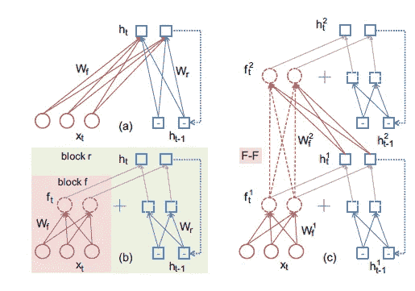

RNN models. The recurrent use of a hidden

*   **(a):基本 RNN:** 当一个输入序列{ *x* 1，…， *xm* }给一个递归层，**在每个时间步 *t*** 的输出 *ht* 可以计算为:

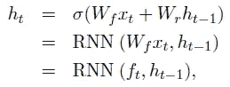

*   **(b):具有中间计算状态和加法运算(+)并随后激活的基本 RNN。**由“f”块和“r”块组成，**等价于(a)** 。
*   这个计算可以等效地分成两个连续的步骤:
*   **、【f】块**、**前馈计算、**(b)中的左半部分:

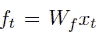

*   **“r”程序块，循环计算**，右部分和求和运算(+)，然后在(b)中激活。

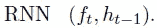

*   **(c):由红色虚线表示的具有 F-F 连接的两个堆叠的 RNN 层**:

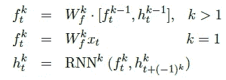

*   其中 **[，]** 表示**串联**。
*   F-F 连接**连接相邻递归层的两个前馈计算模块“F”。**
*   F-F 连接的路径既不包含非线性激活，也不包含递归计算。它为**提供了信息传播**的快速路径。

## 1.2.双向 LSTM 中的 F-F 连接

*   类似地，带有 F-F 连接的**深层双向 LSTM 模型**的计算:

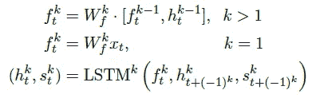

*   此外，**在上述等式中引入了另外两个运算**:

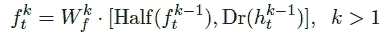

*   **Half( *f* )** 表示 *f* 的**前半部分元素， **Dr( *h* )** 是 [**的辍学**](https://sh-tsang.medium.com/paper-dropout-a-simple-way-to-prevent-neural-networks-from-overfitting-image-classification-a74b369b4b8e) 操作。**
*   **使用 Half()是为了减少参数大小**并且不影响性能。

# 2.深度 ED 和深度 Att:网络架构

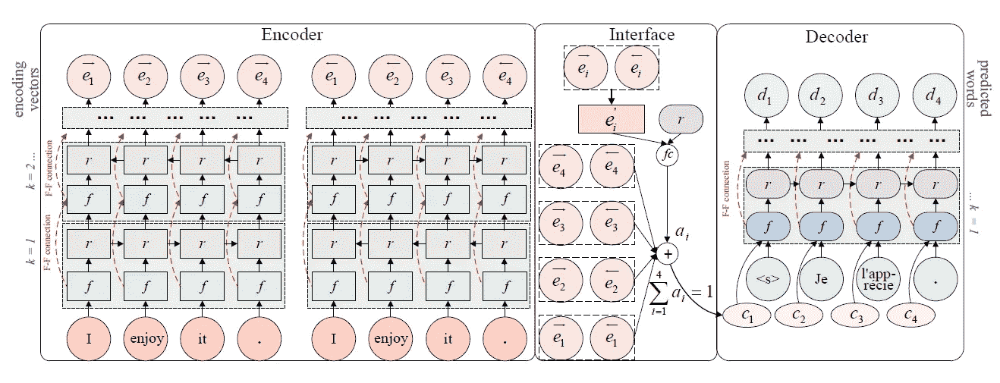

**Deep-ED and Deep-Att: Network Architecture**

## **2.1。编码器**

*   LSTM 层是堆叠的，所谓的交错双向编码器。

## 2.2.连接

*   作为引入 F-F 连接的结果，我们有 **4 个输出向量**(两列的 *hnet* 和 *fnet* )。
*   对于**深插**， ***et* 为静态**。
*   对于 **Deep-Att** ，**只将每个时间步的 4 个输出向量串接起来得到*et*，并使用[注意力解码器](https://sh-tsang.medium.com/review-neural-machine-translation-by-jointly-learning-to-align-and-translate-3b381fc032e3)中的软注意力机制从 *et* 计算出最终表示 *ct* :**

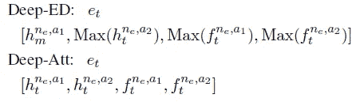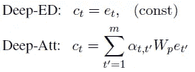

*   其中:

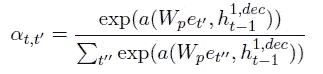

*   对于 **Deep-Att** 来说，为了减少内存开销，**将 *et 与 *Wp* 线性投影成 1/4 维大小的矢量***。
*   (有兴趣请随意阅读[注意解码器](https://sh-tsang.medium.com/review-neural-machine-translation-by-jointly-learning-to-align-and-translate-3b381fc032e3)。)

## **2.3。解码器**

*   在 softmax 之前有一列*和*堆叠的 LSTM 层。也使用 F-F 连接。

## 2.4.其他详细信息

*   **源语言和目标语言的 256 维单词嵌入**。
*   所有 **LSTM** 层都有 **512 个存储单元**。
*   **对于 Deep-ED 和 Deep-Att，ct 的尺寸分别为 5120 和 1280。**
*   使用波束搜索。
*   **运行 **10 天**的 4 到 8 个 GPU 机器**(每个机器有 4 个 K40 GPU 卡)在数据批处理级别训练完整模型。每次通过需要将近 1.5 天。
*   [压差](https://sh-tsang.medium.com/paper-dropout-a-simple-way-to-prevent-neural-networks-from-overfitting-image-classification-a74b369b4b8e)比 *pd* 为 0.1。
*   每批有 500~800 个序列。

# 3.实验结果

## 3.1.**英语到法语**

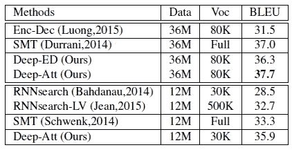

**English-to-French task**

*   具有六层的先前最佳单 NMT 编码器-解码器模型(Enc-Dec)实现 BLEU=31.5。
*   **Deep-ED** 获得 36.3 的 **BLEU 评分，领先 Enc-Dec 模型 4.8 BLEU 分，优于[注意力解码器/RNNSearch](https://sh-tsang.medium.com/review-neural-machine-translation-by-jointly-learning-to-align-and-translate-3b381fc032e3) 。**
*   对于 **Deep-Att** ，性能进一步提升至 **37.7** 。
*   还列出了传统 SMT 系统之前的最先进性能(Durrani 等人，2014 年)，BLEU 为 37.0。

> 这是**第一次**以端到端形式**训练的**单 NMT 模型**在这项任务中击败最好的常规系统**。

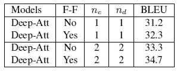

**Effect of F-F Connections**

*   F-F 连接带来了在 BLEU 上的改进。

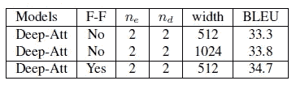

**Different LSTM layer width in Deep-Att**

*   使用**两倍大的 LSTM 层宽**1024 后，Deep-Att 只能获得 33.8 的 BLEU 评分。与 F-F 对应的 Deep-Att 后面还有**。**

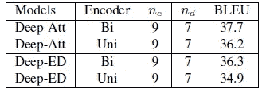

**Effect of the interleaved bi-directional encoder**

*   **对于双向 LSTM** ，对于 Deep-Att 和 Deep-ED，这两个编码器之间有大约 1.5 点的间隙

**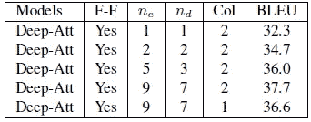**

****Deep-Att with different model depths****

*   ****在 *ne* =9、 *nd* =7** 的情况下，Deep-Att 的 **best** 得分为 37.7。**

**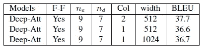**

****Encoders with different number of columns and LSTM layer width****

*   ****发现带有**单编码列**的 1.1 BLEU 点退化**。**

## **3.2.英语到德语**

**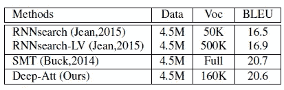**

****English-to-German task****

*   **BLEU= **20.6** 的提议**单模型**结果**类似于传统 SMT 结果 20.7** (Buck et al .，2014)，并且优于[注意力解码器/RNNSearch](https://sh-tsang.medium.com/review-neural-machine-translation-by-jointly-learning-to-align-and-translate-3b381fc032e3) 。**

**还有其他结果，如后处理和集成结果。如果感兴趣，请随意阅读该文件。**

## **参考**

**【2016 TACL】【Deep-ED & Deep-Att】
[具有用于神经机器翻译的快进连接的深度递归模型](https://arxiv.org/abs/1606.04199)**

## **自然语言处理**

****序列模型:2014**[[GRU](https://sh-tsang.medium.com/review-empirical-evaluation-of-gated-recurrent-neural-networks-on-sequence-modeling-gru-2adb86559257)[[doc 2 vec](https://sh-tsang.medium.com/review-distributed-representations-of-sentences-and-documents-doc2vec-86ef911d4515)]
**语言模型:2007**[[Bengio TNN’07](https://sh-tsang.medium.com/review-adaptive-importance-sampling-to-accelerate-training-of-a-neural-probabilistic-language-e71244001b13)]**2013**[[word 2 vec](https://sh-tsang.medium.com/review-word2vec-efficient-estimation-of-word-representations-in-vector-space-f9dbe2145afa)][[NCE](https://sh-tsang.medium.com/review-learning-word-embeddings-efficiently-with-noise-contrastive-estimation-nce-dba1c345c153)][[负采样](https://sh-tsang.medium.com/review-distributed-representations-of-words-and-phrases-and-their-compositionality-negative-ab9ebfc3f041)
**句子嵌入:2013 **2015**[注意力解码器/rnn search](https://sh-tsang.medium.com/review-neural-machine-translation-by-jointly-learning-to-align-and-translate-3b381fc032e3)**2016**[GNMT](https://sh-tsang.medium.com/review-googles-neural-machine-translation-system-bridging-the-gap-between-human-and-machine-518595d87226)[ByteNet](https://sh-tsang.medium.com/review-neural-machine-translation-in-linear-time-bytenet-e5a50bfb462b)[Deep-ED&Deep-Att](https://sh-tsang.medium.com/review-deep-recurrent-models-with-fast-forward-connections-for-neural-machine-translation-e4881ffcf2d1)
**图片字幕:****2015**[m-RNN](https://sh-tsang.medium.com/review-deep-captioning-with-multimodal-recurrent-neural-networks-m-rnn-4417d82ef4f5)****

## **[我以前的其他论文阅读材料](https://sh-tsang.medium.com/overview-my-reviewed-paper-lists-tutorials-946ce59fbf9e)**