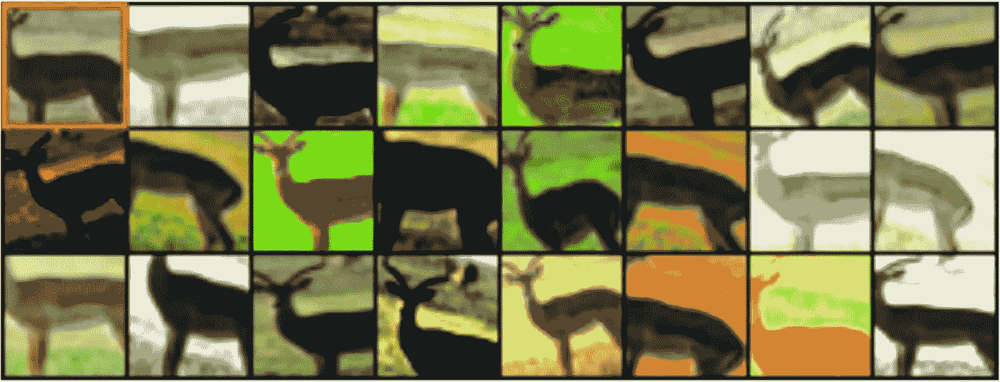
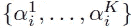
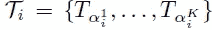
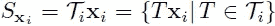
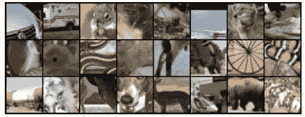
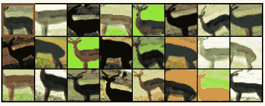
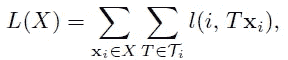
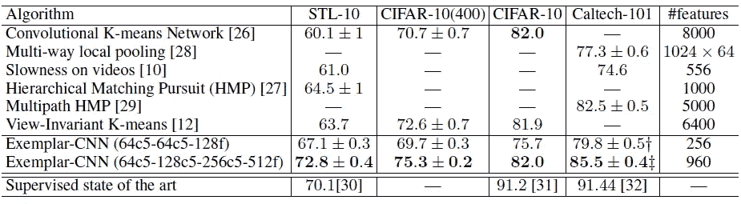
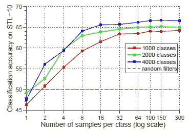
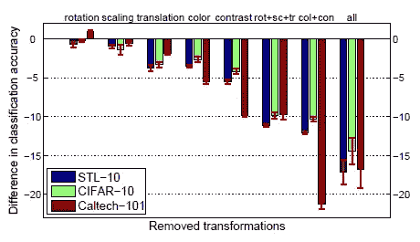

# 回顾——Exemplar-CNN:卷积神经网络的判别无监督特征学习(自我监督学习)

> 原文：<https://medium.com/geekculture/review-exemplar-cnn-discriminative-unsupervised-feature-learning-with-convolutional-neural-fa68abe937cc?source=collection_archive---------29----------------------->

## Exemplar-CNN:通过数据转换使用代理类在无标签数据上训练

**Surrogate classes are generated by data transformation using unlabeled data**

在这篇报道中，回顾了弗赖堡大学的**利用卷积神经网络**(Exemplar-CNN)进行的判别无监督特征学习。在本文中:

*   **使用未标记的数据生成代理类。**
*   每个代理类都是通过对随机采样的“种子”图像块应用各种变换而形成的。
*   CNN 被训练来区分一组代理类。

这是一篇发表在 **2014 NIPS** 的论文，被引用超过 **600 次**。( [Sik-Ho Tsang](https://medium.com/u/aff72a0c1243?source=post_page-----fa68abe937cc--------------------------------) @中)

# 概述

1.  **创建代理训练数据&学习算法**
2.  **CNN 架构&实验设置**
3.  **实验结果**

# **1。创建代理训练数据&学习算法**

> **随机变换应用于补丁。来自同一原始“种子”图像的所有变换的小块具有与原始“种子”图像相同的代理类。**
> 
> 如果有 8000 个“种子”图像，那么就有 8000 个代理类。

## 1.1.创建代理培训数据

*   训练程序的输入是**一组未标记的图像**。
*   ***N 个*∈【50，32000】大小为**32×32**像素的面片**在**不同的位置和尺度**从不同的图像中随机采样，形成初始**训练集 *X* = { *x* 1，…， *xN* }** 。
*   我们对包含对象或对象部分的**面片感兴趣**，因此我们**只从包含相当大梯度的区域进行采样**。
*   **一族变换{*tα*|*α*∈*A*}**由向量∈ *A* 参数化定义，其中 *A* 是所有可能的参数向量的集合。每个变换 *T* 都是下列基本变换的组合:

1.  **平移**:垂直或水平平移**一段距离，在贴片尺寸的 0.2** 以内；
2.  **缩放**:通过**以 0.7 到 1.4** 之间的因子缩放面片；
3.  **旋转**:图像旋转一个角度**到 20 度**；
4.  **对比度 1** : **将每个斑块像素在所有像素集合的**主成分**上的投影**乘以**一个介于 0.5 和 2 之间的因子**。
5.  **对比度 2** : **将所有像素的饱和度和值**(HSV 的 S 和 V 分量)提高到**0.25 和 4** 之间的幂(对于一个片内的所有像素都一样)，将这些值乘以 0.7 和 1.4 之间的因子，将它们加上-0.1 和 0.1 之间的值；
6.  **颜色**:将一个介于 **-0.1 和 0.1 之间的值加到补片中所有像素的色相**(HSV 的 H 分量)上。

*   对于每个初始面片 *xi* ∈ *X* ，*K*∈【1300】个随机参数向量{ *α* 1i，…， *αKi* }被采样:

*   以及{ *T_α* 1i，…， *T_αKi* }到面片 *xi* 的对应变换。(简而言之，对每个面片应用随机变换)

*   这就产生了它的**变换版本集*Sxi***=*Tixi*= {*Txi*|*T*∈*Ti*}。

*   然后，减去整个结果数据集上每个像素的平均值，并且不进行任何其他预处理。

**Exemplary patches sampled from the STL unlabeled dataset which are later augmented by various transformations to obtain surrogate data for the CNN training.**

*   **从 STL-10 未标记数据集中采样的示例性补丁**如上所示。

**Several random transformations applied to one of the patches extracted from the STL unlabeled dataset. The original (’seed’) patch is in the top left corner.**

*   **上图显示了一个补丁**的变形版本。

## **1.2。学习算法**

> 有了生成的代理类，CNN 就可以训练了。

*   CNN 被训练来区分这些代理类。
*   形式上，我们最小化以下损失函数:
*   通过将标签 *i* 分配给类别 *Sxi* ，这些集合中的每一个都成为一个类别。

*   其中 *l* ( *i* ， *Txi* )为转换后的样本 *Txi* 与(代理)真标签 *i* 上的损失。

> 直观上，上述分类问题用于确保**不同的输入样本可以被区分。**同时，**它对指定的变换实施不变性。**
> 
> **在使用未标记数据集训练 CNN 之后，CNN 特征被汇集用于为目标数据集训练线性 SVM**，这将在下面更详细地提及。

# **2。CNN 架构&实验设置**

## 2.1.代理类的未标记数据集

*   **STL** 特别适合无监督学习，因为它包含了一大组 **10 万个未标记样本**。
*   **代理训练数据**从 STL-10 的**未标记子集中提取。**

## 2.2.两个 CNN

*   使用两个网络:一个是小网络，一个是大网络。
*   **“小”网络**:由**两个卷积层**组成，每个卷积层有 64 个滤波器，后面是**一个全连接层**，有 128 个神经元。
*   **“大型”网络**:由**三个卷积层**组成，分别具有 64、128 和 256 个滤波器，后面是**一个具有 512 个神经元的全连接层**。
*   所有卷积都是 5×5 滤波器。第一次和第二次卷积后使用 2×2 最大池。脱落应用于完全连接的层。

## 2.3.线性 SVM 的池化要素

*   对于 STL-10 和 CIFAR-10，对于每个特征图，使用 **4 象限最大池**，导致每个特征图有 4 个值。
*   对于 Caltech-101，使用了 **3 层空间金字塔**，即整个图像以及 4 个象限和 4×4 网格单元内的最大池，导致每个特征地图有 **1 + 4 + 16 = 21 个值。**
*   在汇集的特征上训练**线性支持向量机(SVM)** 。

# 3.实验结果

## 3.1.SOTA 比较

**Classification accuracies on several datasets**

> **从大型网络中提取的特征在所有数据集上匹配或优于最佳先验结果。**

*   尽管**特征向量的维数小于大多数其他方法的维数**，并且**网络是在 STL-10 未标记数据集**上训练的(即，当应用于 CIFAR-10 和 Caltech 101 时，它们以迁移学习的方式使用)。

## 3.2.代理类的数量

**Influence of the number of surrogate training classes**

*   代理类的数量在 50 到 32000 之间变化。

> **分类精度随着代理类数量的增加而增加，直到在大约 8000 个代理类时达到最优，之后不变甚至下降。**

*   这是可以预料的:代理类的数量越大，就越有可能得出非常相似甚至完全相同的样本，这是很难或者不可能区分的。
*   这也证明了我们随机采样“种子”补丁的方法的主要局限性:它不能扩展到任意大量的未标记数据。

## 3.3.每个代理类别的样本数

**Classification performance on STL for different numbers of samples per class**

*   当每个代理类的训练样本的数量 *K* 在 1 和 300 之间变化时，显示了分类精度。
*   如所见，如果样本数量太少，则没有足够的数据来学习期望的不变性。

> **性能随着每个代理类中样本的增加而提高，在大约 100 个样本时达到饱和。**

## 3.4.转换的类型

**Influence of removing groups of transformations during generation of the surrogate training data.**

*   **值“0”**对应于应用**所有基本变换**的随机合成:缩放、旋转、平移、颜色变化和对比度变化。
*   **图中不同的列**显示了当我们**放弃一些类型的基本变换时，分类准确度的差异。**
*   首先，**旋转**和**缩放**对性能只有**微小影响**，而**平移、颜色变化**和**对比度变化**明显更重要。
*   其次， **STL-10** 和 **CIFAR-10** 上的结果一致表明**空间不变性和颜色对比度不变性对于分类性能来说几乎同等重要**。
*   第三，在 **Caltech-101、** **上，与空间变换相比，颜色和对比度变换**比在其他两个数据集上重要得多，因为 Caltech-101 图像通常对齐得很好，这种数据集偏差使得空间不变性不太有用。

## 参考

【2014 NIPS】【Exemplar-CNN】
[利用卷积神经网络的判别无监督特征学习](https://papers.nips.cc/paper/5548-discriminative-unsupervised-feature-learning-with-convolutional-neural-networks.pdf)

## 自我监督学习

**2014**[[Exemplar-CNN](https://sh-tsang.medium.com/review-exemplar-cnn-discriminative-unsupervised-feature-learning-with-convolutional-neural-fa68abe937cc)**2015**[[上下文预测](https://sh-tsang.medium.com/review-unsupervised-visual-representation-learning-by-context-prediction-self-supervised-51a1d7ce6aff) ]