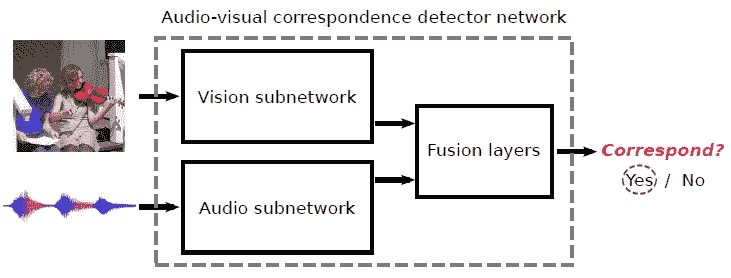
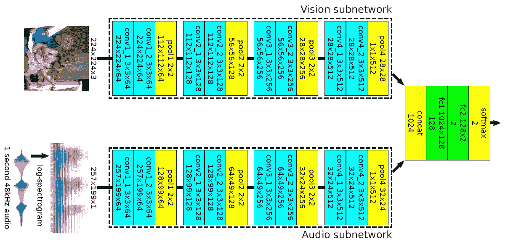
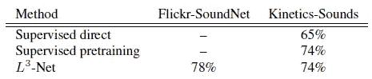
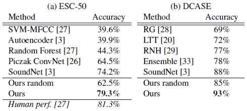
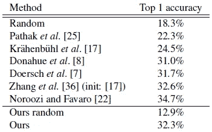
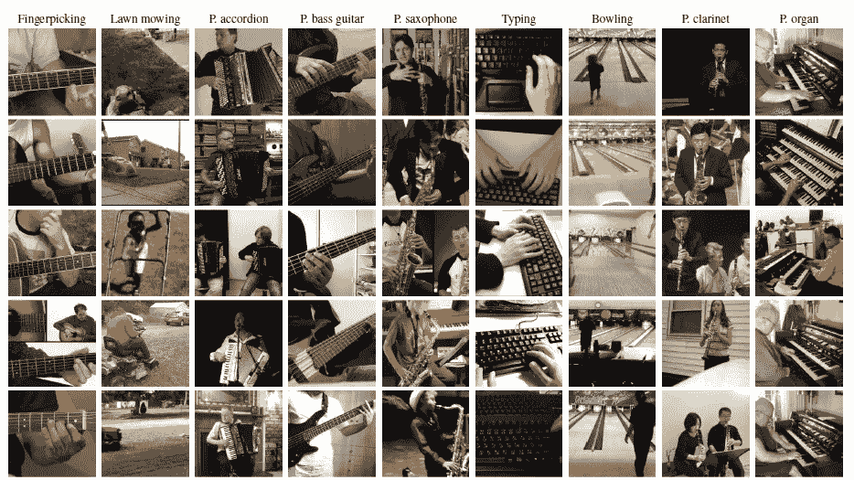
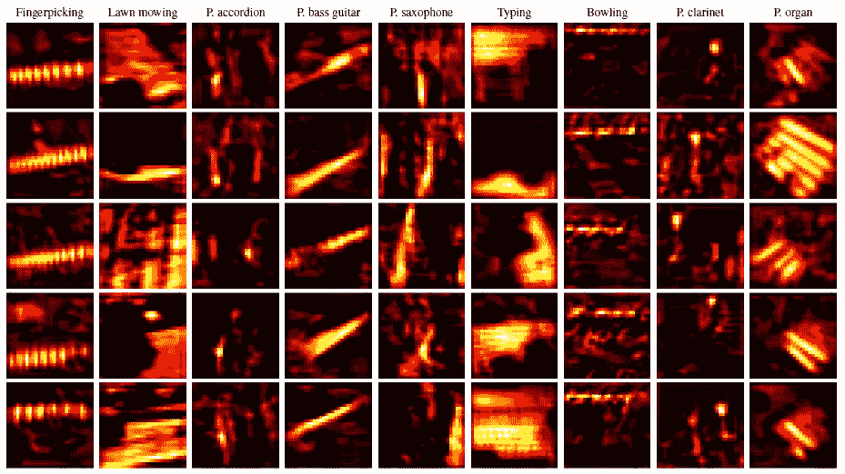
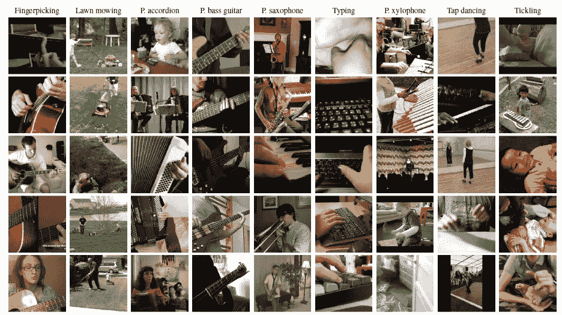
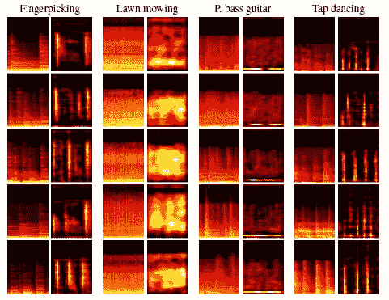

# 复习——看、听、学(自我监督学习)

> 原文：<https://medium.com/geekculture/review-look-listen-and-learn-self-supervised-learning-ff89a7dee980?source=collection_archive---------16----------------------->

## 针对**视听通信任务(AVC)** 使用 L -Net 的自我监督学习

**Audio-visual correspondence task (AVC)**: By seeing and hearing many **unlabelled** examples, a network should learn to determine whether a pair of (video frame, short audio clip) correspond to each other or not.

在这个故事中，**看、听、学**(L-Net)，由 DeepMind 和牛津大学的 VGG 共同完成，回顾。本文考虑了一个问题:

> 通过看和听大量**无标签**视频可以学到什么？

*   **视听通信(AVC)学习任务**被引入以从零开始训练视觉和听觉网络**，除了原始的无约束视频本身之外**没有任何额外的监督，导致**良好的视觉和听觉表现**。

这是一篇发表在 **2017 ICCV** 的论文，引用超过 **400 次**。( [Sik-Ho Tsang](https://medium.com/u/aff72a0c1243?source=post_page-----ff89a7dee980--------------------------------) @中)

# 概述

1.  **核心理念**
2.  **L -Net:网络架构**
3.  **训练数据采样**
4.  **视听通信(AVC)结果**
5.  **转移学习结果**
6.  **定性分析**

# 1.核心理念

## 1.1.二元分类任务

*   通过看到和听到许多人拉小提琴的例子和狗叫的例子，并且从来没有，或者至少很少看到有人拉小提琴而听到狗叫，反之亦然，应该有可能得出小提琴和狗看起来和听起来像什么，而不需要明确地被教导什么是小提琴或狗。
*   AVC 任务是一个简单的**二进制分类任务**:给定一个示例视频帧和一个短音频剪辑，判断它们**是否相互对应。**

## 1.2.困难

*   **对应的(正)对**是从同一视频中同时提取的**，而**错配的(负)对**是从**不同的视频中提取的。****
*   网络**从头开始学习**视觉和听觉特征和概念****而从未见过一个标签**。**
*   **视频可能非常嘈杂**，**音频源在视频中不一定可见**(例如，摄像师说话、视频旁白、声源看不见或被遮挡等。).****
*   ****音频和视频内容可以是**完全不相关的**(例如，具有**添加的音乐**、**非常低音量的声音**、**环境声音**，例如尽管存在其他音频事件，但是风主导音频轨道等。).****

# ******2。L -Net:网络架构******

********

******L³-Net: Network Architecture******

*   ****该网络具有三个不同的部分 : **分别提取视觉和音频特征的视觉和音频子网**，以及**将这些特征考虑在内以产生最终决策的融合网络**。****

## ****2.1.视觉子网络****

*   ****视觉子网络的输入是 224×224 彩色图像。****
*   ****[使用 VGGNet](/coinmonks/paper-review-of-vggnet-1st-runner-up-of-ilsvlc-2014-image-classification-d02355543a11?source=post_page---------------------------) 设计风格，3×3 卷积滤波器，2×2 最大池层，步幅 2，无填充。****
*   ****网络可以被分割成**conv+conv+池层**的四个块，使得在每个块内，两个 conv 层具有相同数量的滤波器，而连续的块具有双倍的滤波器数量:64、128、256 和 512。****
*   ******在最末端**，跨所有空间位置执行最大汇集(即**全局最大汇集**，以产生**单个 512-D 特征向量。******
*   ****每个 conv 层之后是[批量归一化](https://sh-tsang.medium.com/review-batch-normalization-inception-v2-bn-inception-the-2nd-to-surpass-human-level-18e2d0f56651)和 ReLU。****

## ****2.2.音频子网****

*   ****音频子网的输入是一个 1 秒钟的声音剪辑，转换成对数频谱图，作为灰度 257×199 图像处理。****
*   ****音频子网的架构**与 vision one** 相同，除了输入是 1D 信号而不是 3D 信号。****
*   ******最终音频特征**也是 **512-D** 。****

## ****2.3.融合网络****

*   ****两个 512-D 视觉和音频特征被**连接成一个 1024-D 向量。******
*   ****它由**两个完全连接的层**组成，其间夹有 ReLU， **128-D** 的**中间特征尺寸**，对**产生一个 2 路分类输出**，即视觉和听觉是否对应。****

# ******3。训练数据采样&数据集******

## ****3.1.培训数据采样和其他细节****

*   ******非对应的帧-音频对**通过随机采样两个不同的视频并从一个视频中选取随机帧和从另一个视频中选取随机的 1 秒音频剪辑来编译。****
*   ******通过对随机视频进行采样，在该视频中选取随机帧，然后选取与采样帧在时间上重叠的随机 1 秒音频剪辑，来创建相应的帧-音频对**。****
*   ******使用标准的数据扩充**技术:每个训练图像被统一缩放，使得最小尺寸等于 256，然后**随机裁剪**成 224 × 224，**随机水平翻转**，以及**亮度和饱和度抖动**。****
*   ****音频仅通过**将音量随机改变 10%来增强**，但在整个样本中保持一致。****
*   ****网络在 **16 个 GPU 上并行**训练，同步训练在 **TensorFlow** 中实现，每个工人处理一个 **16 元素批次**，从而使得**有效批次大小为 256 个**。****
*   ****一套 **400k 10 秒视频**的训练集，网络**训练两天**，期间见过 **60M 帧-音频对**。****

## ****3.2.数据集****

******两个视频数据集**用于训练网络:Flickr-SoundNet 和 Kinetics-Sounds。****

## ****3.2.1.Flickr-声音网****

*   ****这是一个巨大的**未标记的**数据集，包含来自 Flickr 的完全不受约束的**视频。******
*   ****它包含**超过 200 万个视频**，但出于实际原因**仅使用 50 万个视频**的随机子集(40 万个训练、50 万个验证和 50 万个测试)**仅使用每个视频**的前 10 秒。****
*   ****该数据集用于**迁移学习实验**。****

## ****3.2.2.动力学-声音****

*   ****这是一个用于**定量评估**的带标签数据集。**使用了动力学数据集**的一个子集(比 Flickr-SoundNet 小得多),其中包含为 10 秒裁剪的人类动作手动注释的 YouTube 视频**。******
*   ****该子集包含 **19k 10 秒视频剪辑** (15k 训练，1.9k 验证，1.9k 测试)，通过过滤 **34 种人体动作类别**的动力学数据集形成，例如:****

1.  ******比如演奏各种乐器**(吉他、小提琴、木琴等。),****
2.  ******使用工具**(割草、铲雪等。)，以及****
3.  ******表演杂耍动作**(踢踏舞、保龄球、大笑、唱歌、擤鼻涕等。).****

*   ****它**仍然包含相当多的噪音**，例如:保龄球运动经常伴随着保龄球馆的嘈杂音乐，人声(摄像师或视频解说)经常掩盖感兴趣的声音，许多视频包含音轨。****

# ****4.视听通信(AVC)结果****

********

******Audio-visual correspondence (AVC) results******

*   ****显示了 L3-Net 的 AVC 任务的测试集准确性，以及标记的动力学-声音数据集的两个监督基线。****
*   ****正反数相同，所以几率得到 50%。所有方法都在各自数据集的训练集上进行训练。****
*   ******视觉网络**具有与我们的视觉子网络(第 2.1 节)相同的特征提取干线，在其顶部**附着了两个完全连接的层**(大小:512×128 和 128× **34** ，因为有 **34 个动力学-声音类。******
*   ****音频网络的构建与此类似。****
*   ******监督直接**:直接组合基线计算音视频对应得分为**34-D 网络 softmax 输出**之间的标量积，如果得分大于阈值则判定音视频**对应。******
*   ******监督预训练**:它从两个训练好的网络中提取特征提取干线，通过连接特征并添加两个完全连接的层，将它们组装到我们的网络架构中。**特征提取器的权重被冻结**并且完全连接的层在 AVC 任务上被训练。****
*   ******L -Net** 在两个数据集上分别达到 **74%和 78%，其中机会为 50%。(即使是人类也很难判断一个孤立的帧和一个孤立的一秒钟的音频是否对应)******
*   ******监督基线无法击败 L -Net** ，因为“监督预训练”的性能与 L -Net 不相上下，而“监督直接组合”的效果明显更差，因为与“监督预训练”不同，它没有针对 AVC 任务进行过训练。****

# ****5.转移学习结果****

*   ****在上述 AVC 实验中的自监督训练之后，子网络应该被很好地预训练，并且可以被用作其他监督数据集的权重初始化。****

## ****5.1.ESC-50 和 DCASE 上的音频功能****

********

******Sound Classification******

*   ******环境声音分类(ESC-50)** : 2000 个音频剪辑，每个 5 秒，在 50 个类别之间均衡。****
*   ******声学场景和事件的检测和分类(DCASE)** : 10 类，每类 10 个训练和 100 个测试片段，每个片段长 30 秒。****
*   ****音频特征是通过将 ReLU 之前的音频子网络的最后一个卷积层(conv4_2)最大汇集成 4×3×512 = 6144 维表示来获得的。****
*   ****使用 **z 分数归一化**对特征进行预处理。一个**多类一对所有线性 SVM** 被训练，并且在测试时，记录的类分数被计算为其子片段的类分数的平均值。****
*   ******“我们的随机”**是一个**附加基线**，它显示了我们的网络在没有 L3 训练的情况下的性能。****
*   ****在这两个基准测试中，L -training 令人信服地以 5.1%和 5%的绝对优势击败了之前最先进的 SoundNet [3]。对于 ESC-50，L -training 将之前的最佳结果与人的表现之间的差距减少了 72%,而对于 DCASE，L -training 将误差减少了 42%。****

> ****提议的 L3-training(我们的)在这两项基准测试中**领先**一大截。****

## ****5.2.ImageNet 上的视频功能****

********

******Visual classification on ImageNet******

*   ****conv4_2 特征在 ReLU 之后被提取，并且以相等的内核和步幅大小执行最大池化，直到特征维数低于 10k 在这种情况下，这会产生 4×4×512 = **8192-D 特征**。****
*   ******添加单个全连接层**以对 **1000 ImageNet 类**进行线性分类。****
*   ****除了在 ImageNet 训练集上用交叉熵损失训练的最终分类层之外，所有权重都被冻结为它们的 L -Net 训练值。****
*   ******所提出的 L -Net 训练的特征实现了 32.3%的准确度**，这与其他最先进的自监督方法【7，8，22，36】([上下文预测](https://sh-tsang.medium.com/review-unsupervised-visual-representation-learning-by-context-prediction-self-supervised-51a1d7ce6aff)【7】)不相上下，同时令人信服地击败了随机初始化、数据相关初始化【17】和[上下文编码器](https://sh-tsang.medium.com/review-context-encoders-feature-learning-by-inpainting-bd181e48997)【25】。****
*   ****需要考虑的一个重要事实是**所有竞争方法在训练**时实际上都使用 ImageNet 图像。尽管它们不使用标签，但基本的图像统计信息是相同的:****
*   ****相比之下， **L -Net 使用完全独立的训练数据源**，以 Flickr 视频帧的形式。此外，视频帧具有与静止图像非常不同的低级统计，具有强烈的伪影，例如运动模糊。****

> ****令人印象深刻的是，在 Flickr 视频上经过 L -Net 训练的拟议视觉功能的表现与在 ImageNet 上训练的自我监督的最先进水平不相上下。****

# ****6.定性结果****

## ****6.1.视觉特征****

********

******Learnt visual concepts******

*   ****上图显示了激活 pool4 中特定单位最多的图像(即，根据其大小排名最高)。****

> ******视觉子网络在没有任何明确监督的情况下自动学习识别语义实体**，如吉他、手风琴、键盘等。****

********

******Visual semantic heatmap******

*   ******上面的热图显示，尽管有明显的混乱和遮挡，物体还是被成功检测出来**。****

## ****6.2.音频功能****

********

******Learnt audio concepts******

*   ****以上图像显示了与声音相对应的视频帧。****

> ******同样没有任何监督的音频子网络设法学习各种语义实体**，以及执行精细分类(“拨弄手指”与“弹奏低音吉他”)。****

********

******Audio semantic heatmaps******

*   ****上图显示了光谱图及其语义热图。****
*   ****例如，当检测低音吉他时，它显示出对低频的明显偏好；当检测剪草机时，它显示出对宽频率范围的关注；当检测拨弄手指和踢踏舞时，它显示出时间“步长”。****

## ****参考****

****【2017 ICCV】【L-Net】
[看、听、学](https://arxiv.org/abs/1705.08168)****

## ****自我监督学习****

******2014**[Exemplar-CNN](https://sh-tsang.medium.com/review-exemplar-cnn-discriminative-unsupervised-feature-learning-with-convolutional-neural-fa68abe937cc)**2015**[上下文预测](https://sh-tsang.medium.com/review-unsupervised-visual-representation-learning-by-context-prediction-self-supervised-51a1d7ce6aff)**2016**[上下文编码器](https://sh-tsang.medium.com/review-context-encoders-feature-learning-by-inpainting-bd181e48997)**2017**[L-Net](https://sh-tsang.medium.com/review-look-listen-and-learn-self-supervised-learning-ff89a7dee980)****

## ****[我以前的其他论文阅读材料](https://sh-tsang.medium.com/overview-my-reviewed-paper-lists-tutorials-946ce59fbf9e)****