# 综述——裂脑自动编码器:跨通道预测的无监督学习

> 原文：<https://medium.com/geekculture/review-split-brain-autoencoders-unsupervised-learning-by-cross-channel-prediction-cebeba644a3c?source=collection_archive---------10----------------------->

## 用于自我监督学习的裂脑自动机，胜过拼图游戏、[上下文预测](https://sh-tsang.medium.com/review-unsupervised-visual-representation-learning-by-context-prediction-self-supervised-51a1d7ce6aff)、[阿里/甘比](/nerd-for-tech/review-bigan-adversarial-feature-learning-gan-535eb76be2ca)、 [L -Net](https://sh-tsang.medium.com/review-look-listen-and-learn-self-supervised-learning-ff89a7dee980) 、[上下文编码器](https://sh-tsang.medium.com/review-context-encoders-feature-learning-by-inpainting-bd181e48997)等。

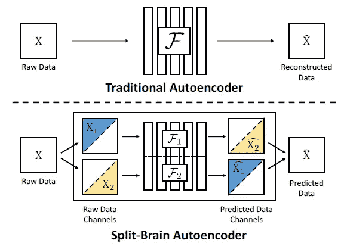

**Proposed Split-Brain Auto (Bottom) vs Traditional Autoencoder, e.g. Stacked Denoising Autoencoder (Top)**

本文对加州大学柏克莱人工智能研究(BAIR)实验室的**裂脑自动编码器:跨通道预测无监督学习**(裂脑自动)进行了综述。在本文中:

*   一个网络被分成**两个子网络**，每个子网络被训练来执行一个困难的任务——从另一个预测数据信道的一个子集**。**
*   通过强制网络解决**跨通道预测**任务，在不使用任何标签的情况下实现**特征学习。**

这是一篇发表在 **2017 CVPR** 的论文，引用超过 **400 次**。( [Sik-Ho Tsang](https://medium.com/u/aff72a0c1243?source=post_page-----cebeba644a3c--------------------------------) @中)

# 概述

1.  **裂脑自动编码器(Split-Brain Auto)**
2.  **实验结果**

# 1.裂脑自动编码器(裂脑自动)

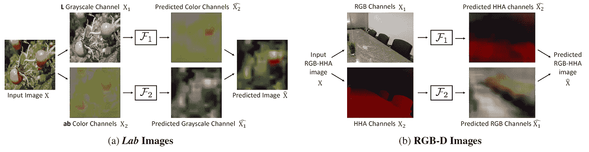

**Split-Brain Autoencoders applied to various domains**

## 1.1.跨通道编码器

*   首先，**输入数据 *X* 分为 *X* 1 和 *X* 2。**
*   然后，**X1 通过网络 *F* 1 预测 *X* 2** :

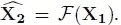

> 通过执行这个从 X1 预测 X2 的**借口任务**，我们希望**获得包含高级抽象或语义的表示 F(X1)**。

*   与 *F* 2 类似的是**X2 通过网络 *F* 2 预测 *X* 1** 。
*   **左**:对于 Lab 色彩空间， *X* 1 可以是 *L* ，是亮度信息， *X* 2 可以是 *ab* ，是色彩信息。
*   **右**:对于 RGB-D 图像， *X* 1 可以是 *RGB* 值， *X* 2 可以是 *D* ，是深度信息。
*   *l* 2 损失可用于训练回归损失:

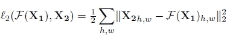

*   发现对于自动着色的图形任务，**交叉熵损失比*1*2 损失**更有效；

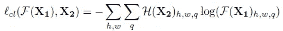

## 1.2.作为聚合跨通道编码器的裂脑自动编码器

*   多个交叉通道编码器， *F* 1， *F* 2，针对相反的预测问题，损失函数分别为 *L* 1， *L* 2:

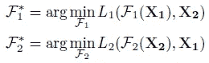

*   上图(a)和(b)分别显示了图像和 RGB-D 域中的裂脑自动编码器示例。

> **通过逐层连接表示， *Fl* = { *Fl* 1， *Fl* 2}，获得在全输入张量 *X* 上预训练的表示 *F* 。**
> 
> 如果 F 是期望的固定大小的 CNN，例如 [AlexNet](/coinmonks/paper-review-of-alexnet-caffenet-winner-in-ilsvrc-2012-image-classification-b93598314160?source=post_page---------------------------) ，我们可以通过沿着信道维度将网络 *F* 的每一层分成两半来设计子网 *F* 1、 *F* 2。

*   网络被修改为**完全卷积**并被训练用于**像素预测任务**。

## 1.3.替代聚集技术

*   一个替代方案，作为基线:相同的表示 *F* 可以被训练来同时执行两个映射:

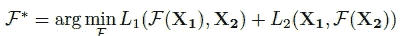

*   或者甚至考虑全输入张量 *X* 。

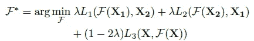

> 然而，我们发现，提出的**裂脑汽车(1.2 节)优于上述两个备选方案(1.3 节)。**

# **2。实验结果**

## 2.1.ImageNet

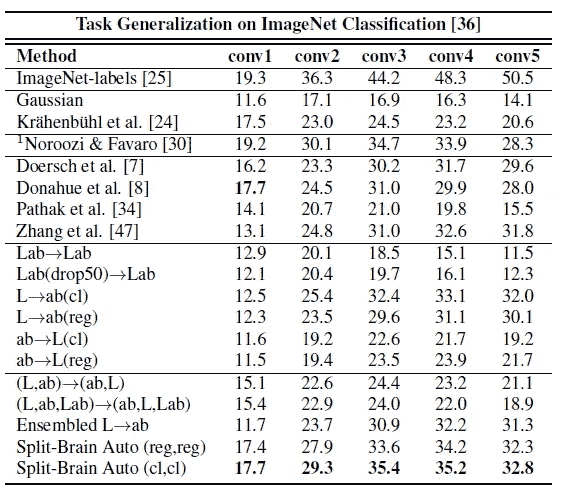

**Task Generalization on ImageNet Classification**

*   所提出的裂脑自动编码器架构**学习来自 ImageNet 的大规模图像数据的无监督表示**。
*   **Lab 颜色空间**用于训练裂脑自动编码器。
*   **所有权重被冻结**并且**特征图在空间上被调整到 9000 维。**
*   所有方法都使用[**Alex net**](/coinmonks/paper-review-of-alexnet-caffenet-winner-in-ilsvrc-2012-image-classification-b93598314160?source=post_page---------------------------)**变体。**
*   **除了 ImageNet-labels 之外，没有标签的 1.3M ImageNet 数据集**用于训练。****
*   **简而言之，尝试了不同的自动编码器变体。**

> ****裂脑自动( *cl* 、 *cl* )、 *cl* 表示使用分类损失，胜过所有变体和所有自我监督学习方法**，如拼图游戏【30】、[上下文预测](https://sh-tsang.medium.com/review-unsupervised-visual-representation-learning-by-context-prediction-self-supervised-51a1d7ce6aff)、[阿里【8】/甘比](/nerd-for-tech/review-bigan-adversarial-feature-learning-gan-535eb76be2ca)、[上下文编码器](https://sh-tsang.medium.com/review-context-encoders-feature-learning-by-inpainting-bd181e48997)【34】和着色【47】。**

## **2.2.地方**

**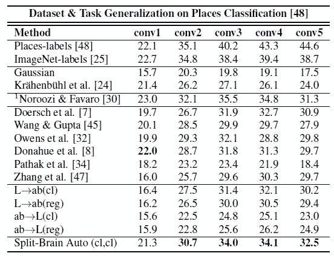**

****Dataset & Task Generalization on Places Classification****

*   ****与**预训练任务(ImageNet)不同的任务(地点)**。****

> **对于地点分类也得到类似的结果，它**优于诸如拼图[30]，** [**上下文预测**](https://sh-tsang.medium.com/review-unsupervised-visual-representation-learning-by-context-prediction-self-supervised-51a1d7ce6aff)**【7】，**[**L-Net**](https://sh-tsang.medium.com/review-look-listen-and-learn-self-supervised-learning-ff89a7dee980)**【45】，** [**上下文编码器**](https://sh-tsang.medium.com/review-context-encoders-feature-learning-by-inpainting-bd181e48997)**【34】和彩色化[47]。****

## **2.3.帕斯卡 VOC**

**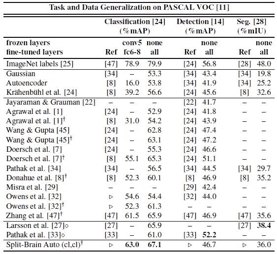**

****Task and Dataset Generalization on PASCAL VOC****

*   **为了进一步测试泛化、分类、检测和分割性能，在 PASCAL VOC 上进行评估。**

> **提出的方法，裂脑自动( *cl* ， *cl* )，在几乎所有已建立的自我监督基准上都达到了**最先进的性能。****

**论文中还有其他结果。如果感兴趣，请随意阅读该文件。希望在未来我能写一个关于拼图游戏的故事。**

## **参考**

**【2017 CVPR】【裂脑自动】
[裂脑自动编码器:跨通道预测的无监督学习](https://arxiv.org/abs/1611.09842)**

## **自我监督学习**

****2008–2010**[堆叠去噪自动编码器](https://sh-tsang.medium.com/review-stacked-denoising-autoencoders-self-supervised-learning-c8ff81cef34c)**2014**[Exemplar-CNN](https://sh-tsang.medium.com/review-exemplar-cnn-discriminative-unsupervised-feature-learning-with-convolutional-neural-fa68abe937cc)**2015**[上下文预测](https://sh-tsang.medium.com/review-unsupervised-visual-representation-learning-by-context-prediction-self-supervised-51a1d7ce6aff)**2016**[上下文编码器](https://sh-tsang.medium.com/review-context-encoders-feature-learning-by-inpainting-bd181e48997)**2017**[L-Net](https://sh-tsang.medium.com/review-look-listen-and-learn-self-supervised-learning-ff89a7dee980)【t24**

## **[我以前的其他论文阅读材料](https://sh-tsang.medium.com/overview-my-reviewed-paper-lists-tutorials-946ce59fbf9e)**