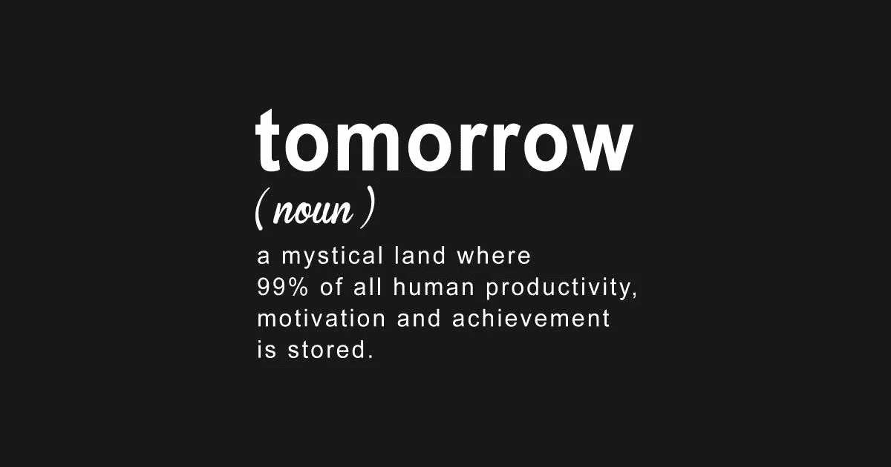
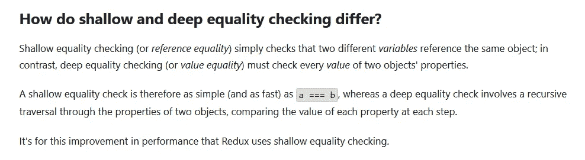
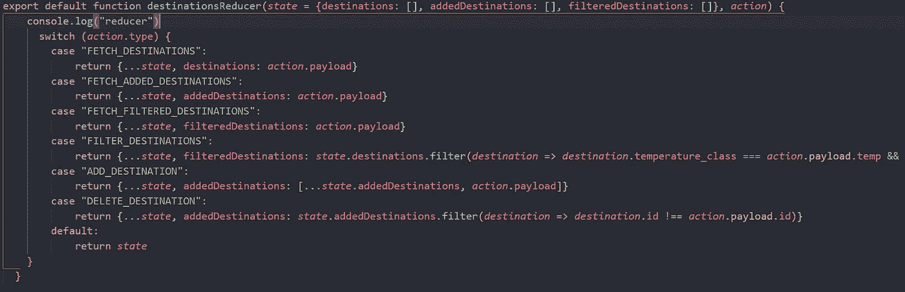

# 重新审视编程中的“次要”基础知识

> 原文：<https://medium.com/geekculture/revisiting-the-back-burner-fundamentals-in-programming-6f5282759f1c?source=collection_archive---------63----------------------->

## 一个新来者试图向其他新来者解释令人困惑的不变状态概念

在为期六个月的密集编码训练营中，你可能会得到很多信息。这些信息中的大部分可以被归类为我喜欢称之为“次要知识”的东西，或者是被提出的基本概念或想法——通常是仓促或随意的——也需要大量的研究才能完全理解。因为一周只有这么几个小时，这些概念被认为是真理，然后很快就被扔到众所周知的“次要”位置，留待以后或更晚的时候研究。

现在，当我结束了我的课程作业，开始应对繁重的求职工作的有点可怕的前景时，我开始重新审视这些核心的基本原则，以努力在我遇到的任何潜在面试中看起来不那么白痴。

我们课程的最后阶段涵盖了 React 和 Redux，这两个非常流行的 Javascript 库用于构建智能、快速和可靠的 web 应用程序。

我已经在另一篇关于普通 Javascript 的博文中提到了状态的概念。现在回顾它的简单性时，我真的笑了，但可以说 React 和 Redux 将状态管理带到了一个全新的水平，特别是当它涉及到 Redux 及其存储时，包含了应用程序的整个状态树，如果你选择使用它的话。

*我应该注意，Redux 并不总是必要的，尤其是对于较小的 web 应用程序。参考* [*这篇短文*](/@dan_abramov/you-might-not-need-redux-be46360cf367) *了解更多关于那个主题的内容。*

当我第一次了解 Redux 存储时，我被告知，对所述存储的任何更新(通过 reducers)都必须以不可变的方式完成。*嗯……我想知道为什么，*我想，我很快在谷歌上搜索了不可变状态和可变状态。搜索结果让我比一个容易拖延的厨师更快地将整个想法抛到了脑后。

要理解的东西太多了，而且没有足够的时间在不影响我其余研究的情况下深入研究不变性的好处。直到现在…

我对 React/Redux 中不可变状态的困惑与一个简单的问题有关:“为什么我们实际上关心我们是否在应用程序中改变 Redux 状态？”

毕竟这不正是我们想要做的吗？我们希望通过 reducers 以某种方式改变 Redux 存储的值。既然我们可以省去中间人，为什么还要复制原始状态呢？改变原始状态不会提高我们应用程序的性能吗？

事实证明，情况恰恰相反。为了理解这一点，你必须理解大多数程序员所说的**浅层和深层相等检查之间的区别。**

因为这是一篇为像我这样的初学者写的博文，所以我只想说浅层等式检查(Redux 用来比较原始状态对象和 reducers 返回的新对象的那种检查)的内存效率更高。下面的图片直接取自 Redux 的官方文档，在解释这种差异方面比我做得更好。

此外，每个从 reducer 新返回的对象都返回一个唯一的状态“片”,它决定了您的组件是否需要基于浅层相等检查重新呈现。

返回新的状态片段还具有更安全的额外好处，因为您不会完全覆盖对应用程序的其他领域至关重要的数据。这种实践还可以防止 bug，并创建一个变更的“时间线”,以便您可以梳理 Redux 存储状态的跟踪变更历史。谈个三赢！

我强烈建议您通过访问[这个链接来看看 Redux 中不变性好处的完整文档页面。](https://redux.js.org/faq/immutable-data#what-are-the-benefits-of-immutability)

我在虚构的穿越太阳系的旅行社 Flatiron School 的最后一个项目使用了一个 reducer，它通过使用 JavaScript 的 spread 运算符返回新对象，这是返回新对象而不改变原始状态的几种方法之一。

以下是所述减速器的屏幕截图:

从 Redux 存储中返回一个全新的状态对象还有很多其他方法，包括稍微老一点但不太流行的 Object.assign()方法，以及通过使用。用于返回新的、经过筛选的数组的 filter 方法。这完全取决于你到底想要完成什么。

当我回顾我刚刚在熨斗学校完成的半年旅程时，我开始意识到一个业余程序员总会遇到一些想法或概念，需要大量的作业才能完全理解。

说实话，我仍然没有完全掌握我在这篇文章中触及的概念，如果你也没有也没关系！至关重要的是，你要继续深入学习那些在学习时被“搁置”的教育领域，无论需要多少次都要重新审视，以理解更复杂的编程基础。