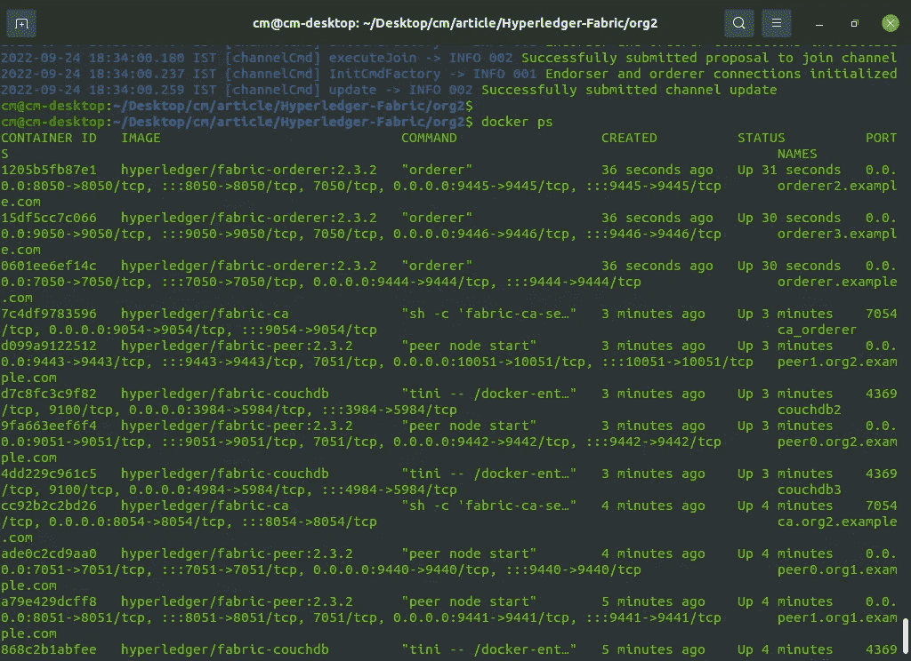
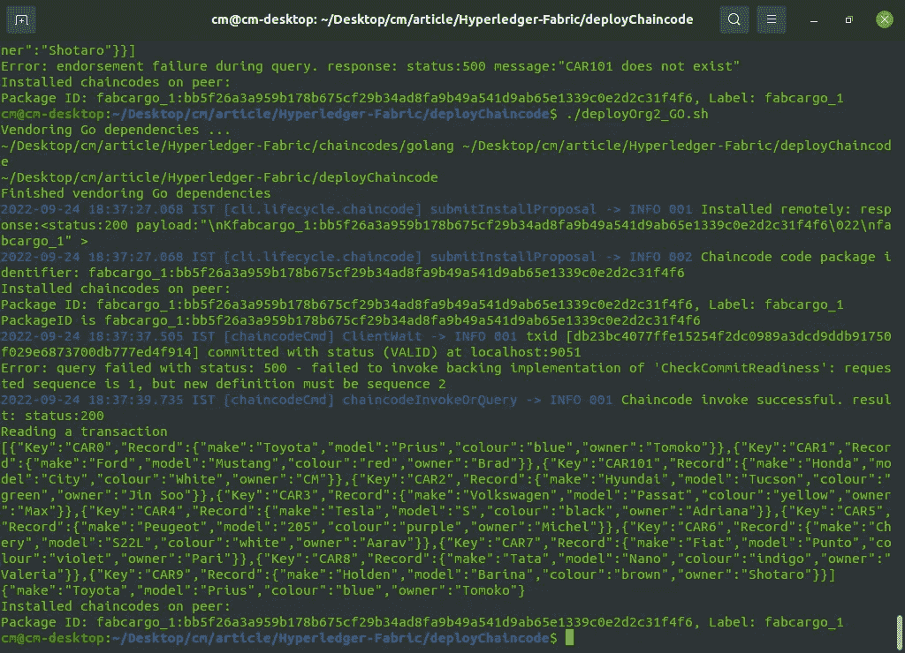
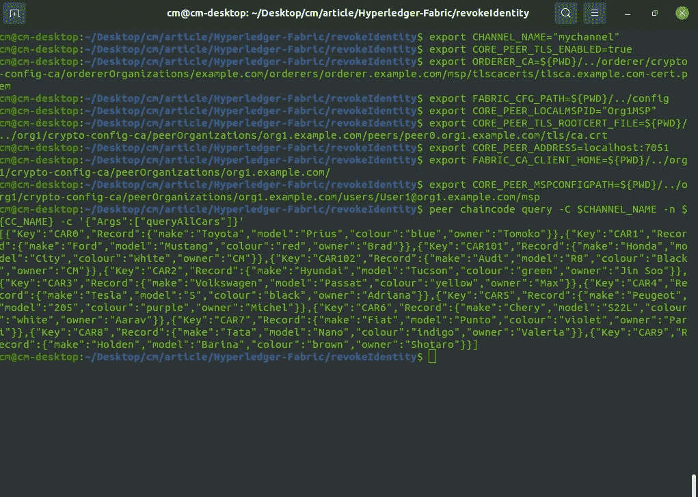
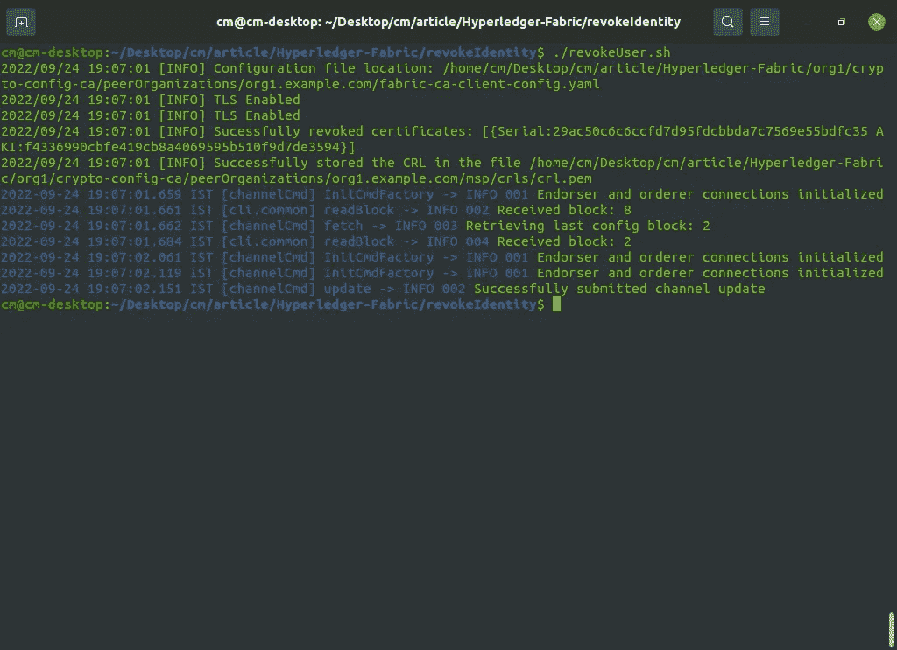
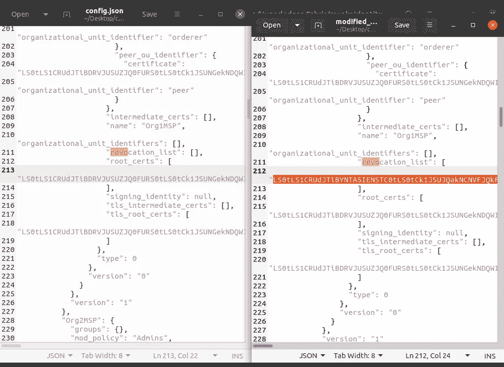
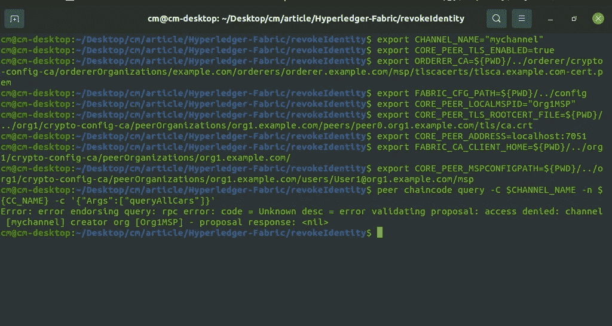

# 撤销/删除 Hyperledger 结构中的身份

> 原文：<https://medium.com/geekculture/revoke-identity-in-hyperledgr-fabric-5aab09caa15c?source=collection_archive---------3----------------------->


Hyperledger Fabric

# 介绍

在本文中，我将演示如何撤销/删除身份(用户)访问。您可能会丢失任何身份(用户)的私钥，在这种情况下，我们应该在不妨碍其他网络组件的情况下撤销对该特定身份的访问。

# 观众

Hyperledger 结构操作员，管理员。这是一篇撤销身份访问的实用实践文章。对于初学者，我想建议请通过一些基本概念的超帐织物。请访问[我以前的文章](/geekculture/hyperledger-fabric-blockchain-setup-from-scratch-21890e26aac7)，建立一个 HLF 网络。

> *注意:这篇文章不推荐给 HLF 初学者。*

# 先决条件

1.  对 **Hyperledger Fabric 区块链**的基本了解。
2.  对 HLF CA 和 CouchDB 有基本的了解。
3.  基本的外壳命令、外壳脚本等。

# 系统需求

1.  Docker —版本 17.06.2
2.  Docker Compose —版本 1.28.5 或更高版本
3.  Golang —版本 1.14
4.  Nodejs —版本 8
5.  Python 2.7

# 网络安装程序

*   具有 org1 和 org2 的 HLF 网络，每个都有 2 个对等体。
*   订购者群集(3 个订购服务节点)RAFT 作为一致算法(订购者、订购者 2、订购者 3)
*   组织 1、组织 2 和订购者的 CA
*   **CouchDB** 是一个世界状态数据库。
*   面料最新版本 **2.3**

# 文件夹结构

*   让我们克隆回购。

```
**git clone** [**https://github.com/cmjagtap/Hyperledger-Fabric**](https://github.com/cmjagtap/Hyperledger-Fabric)
```

下图显示了克隆的存储库的目录结构。

# 结构区块链设置

如果结构网络已经在运行，那么您可以跳过这一步。

*   让我们创建一个结构网络，并执行以下命令。

```
**export PATH=${PWD}/bin:$PATH
sudo service docker start
 cd org1
./1_enrollOrg1AdminAndUsers.sh
./2_generateMSPOrg1.shcd ../org2** ./**1_enrollOrg2AdminAndUsers.sh** ./**2_generateMSPOrg2.sh 

 cd ../orderer** ./**1_enrollAdminAndMSP.sh
./2_artifact.sh

 cd ../org1**
.**/3_createChannel.sh

 cd ../org2**
.**/3_joinChannel.sh**
```

*   Hyperledger fabric 2.3 区块链已准备就绪，您应该会看到所有容器都处于运行模式。



Docker Containers

# 链码部署

在目录结构中，导航到***deploy chain code***目录，执行下面的脚本，它们将部署 fabcar chaincode。

```
**./deployOrg1_GO.sh
./deployOrg2_GO.sh**
```



Chaincode Deployment

在上图中，我们可以看到在 org1 和 org2 上部署了 chaincode。

# 查询带有标识的记录

这里我们使用 Org1 中的 user1 标识。

*   让我们导出所需的 env 变量，如下所示。导航到 **revokeIdentity** 目录。

```
export CHANNEL_NAME="mychannel"
export CORE_PEER_TLS_ENABLED=true
export ORDERER_CA=${PWD}/../orderer/crypto-config-ca/ordererOrganizations/example.com/orderers/orderer.example.com/msp/tlscacerts/tlsca.example.com-cert.pemexport FABRIC_CFG_PATH=${PWD}/../config
export CORE_PEER_LOCALMSPID="Org1MSP"
export CORE_PEER_TLS_ROOTCERT_FILE=${PWD}/../org1/crypto-config-ca/peerOrganizations/org1.example.com/peers/peer0.org1.example.com/tls/ca.crtexport CORE_PEER_ADDRESS=localhost:7051export FABRIC_CA_CLIENT_HOME=${PWD}/../org1/crypto-config-ca/peerOrganizations/org1.example.com/
export [CORE_PEER_MSPCONFIGPATH=${PWD}/../org1/crypto-config-ca/peerOrganizations/org1.example.com/users/User1@org1.example.com](mailto:CORE_PEER_MSPCONFIGPATH=${PWD}/../org1/crypto-config-ca/peerOrganizations/org1.example.com/users/User1@org1.example.com)/msp
```

*   在上面的 env 变量中，我们可以看到[***CORE _ PEER _ MSPCONFIGPATH***](mailto:CORE_PEER_MSPCONFIGPATH=${PWD}/../org1/crypto-config-ca/peerOrganizations/org1.example.com/users/User1@org1.example.com)**指向****user1****MSP，这意味着我们正在使用 user 1 来执行查询操作。**

```
***peer chaincode query -C $CHANNEL_NAME -n ${CC_NAME} -c '{"Args":["queryAllCars"]}'***
```

**

*Query Chaincode*

*   *在上图中，我们可以看到，我们可以使用 **user1 身份查询总账。**现在我们来撤销身份如下。*

# *撤销流程*

*该过程包含如下 3 个步骤*

1.  *生成 CRL*
2.  *将 CRL 转换为 base64 格式*
3.  *用用户 base64 更新频道。*

## *步骤 1)*

*首先，我们必须使用用户 Id 生成该证书的 CRL。我们在注册脚本中使用的这个用户 id。*

*   *使用 **fabric-ca-client** 我们需要生成 CRL，以下命令用于生成 CRL*

```
***fabric-ca-client revoke -e user1 --gencrl --tls.certfiles ${PWD}/../org1/fabric-ca/org1/tls-cert.pem***
```

## *步骤 2)*

*我们需要将此证书转换为 base64 格式，因为我们必须用上述 CRL 更新通道配置。*

*   *为了转换上面的证书，我使用系统 base64 编码器，如下所示:*

```
***base64 -i ${PWD}/../org1/crypto-config-ca/peerOrganizations/org1.example.com/msp/crls/crl.pem | tr -d ‘\n’ > base64Cert***
```

> *这里， **tr** 命令用于从证书中删除\n 我们需要一个单行 base64 字符串。*

## *第三步*

*一旦我们获得了 base64 证书，我们就可以遵循相同的渠道更新流程。*

*   *这里，我使用一个 shell 脚本来生成 CRL 并将其更新到频道中，如下所示:*

****revokeUser.sh :-*** 在这个脚本中，下面的函数为 ***user1*** 生成 CRL，之后，我们将其转换为 base64 格式。*

```
*generateCRL(){fabric-ca-client revoke -e user1 — gencrl — tls.certfiles ${PWD}/../org1/fabric-ca/org1/tls-cert.pem base64 -i ${PWD}/../org1/crypto-config-ca/peerOrganizations/org1.example.com/msp/crls/crl.pem | tr -d ‘\n’ > base64Cert
}*
```

****revokeUser()*** 函数取 base64 证书。使用 JQ，我们将其添加到 Org1 部分，然后将其存储在 modified_config.json 文件中。*

```
*revokeUser(){jq --arg CRL $(cat base64Cert) '.channel_group.groups.Application.groups.Org1MSP.values.MSP.value.config.revocation_list? += [$CRL]' config.json > modified_config.json}*
```

*   *之后，我们需要计算原始配置和新配置之间的差值，然后更新通道。*
*   *让我们执行***revoke user . sh****

**

*Revoke User*

*   *在上图中，我们可以看到我们已经生成了 CRL，并将其存储在 org1 中，之后，我们用新的配置更新了通道。*
*   *您可以在第一个 **config.json** 文件*中验证 org1 的撤销列表*为空，并在执行**revoke user()****modified _ config . JSON**后创建，其中包含 base64 **user1 CRL。***

**

*Compare old vs new config*

*   *渠道更新成功后，让我们尝试使用同一个用户 1 查询分类帐。*
*   *再次导出相同的 user1 env 变量，如下所示，*

```
*export CHANNEL_NAME="mychannel"
export CORE_PEER_TLS_ENABLED=true
export ORDERER_CA=${PWD}/../orderer/crypto-config-ca/ordererOrganizations/example.com/orderers/orderer.example.com/msp/tlscacerts/tlsca.example.com-cert.pemexport FABRIC_CFG_PATH=${PWD}/../config
export CORE_PEER_LOCALMSPID="Org1MSP"
export CORE_PEER_TLS_ROOTCERT_FILE=${PWD}/../org1/crypto-config-ca/peerOrganizations/org1.example.com/peers/peer0.org1.example.com/tls/ca.crtexport CORE_PEER_ADDRESS=localhost:7051export FABRIC_CA_CLIENT_HOME=${PWD}/../org1/crypto-config-ca/peerOrganizations/org1.example.com/
export [CORE_PEER_MSPCONFIGPATH=${PWD}/../org1/crypto-config-ca/peerOrganizations/org1.example.com/users/User1@org1.example.com](mailto:CORE_PEER_MSPCONFIGPATH=${PWD}/../org1/crypto-config-ca/peerOrganizations/org1.example.com/users/User1@org1.example.com)/msp*
```

*   *使用以下命令查询分类帐，*

```
***peer chaincode query -C $CHANNEL_NAME -n ${CC_NAME} -c '{"Args":["queryAllCars"]}'***
```

**

*Query chaincode with revoked identity*

*   *在图中，我们可以看到，**出现了拒绝访问错误，**用户 1 不再有效。*

# *打扫*

*   *执行以下脚本来清理所有 docker 容器和加密证书。*

```
*.**/clean.sh***
```

# *摘要*

*   *我们已经看到了如何在运行的结构网络中撤销身份而不干扰操作。*