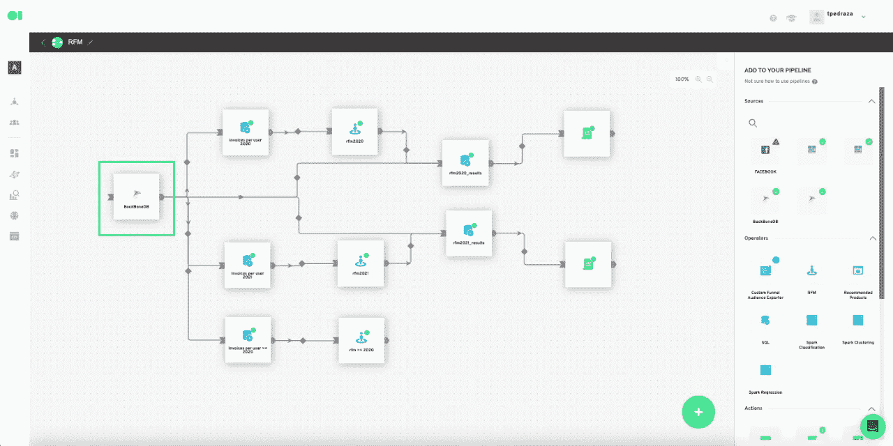
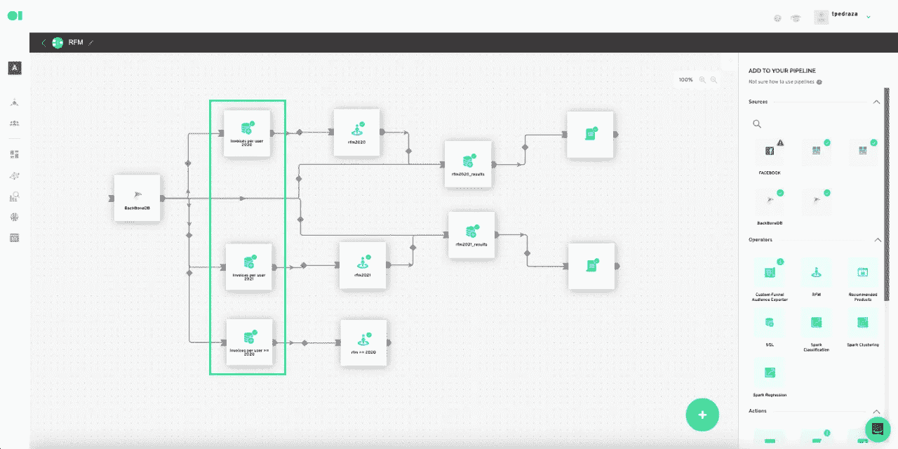
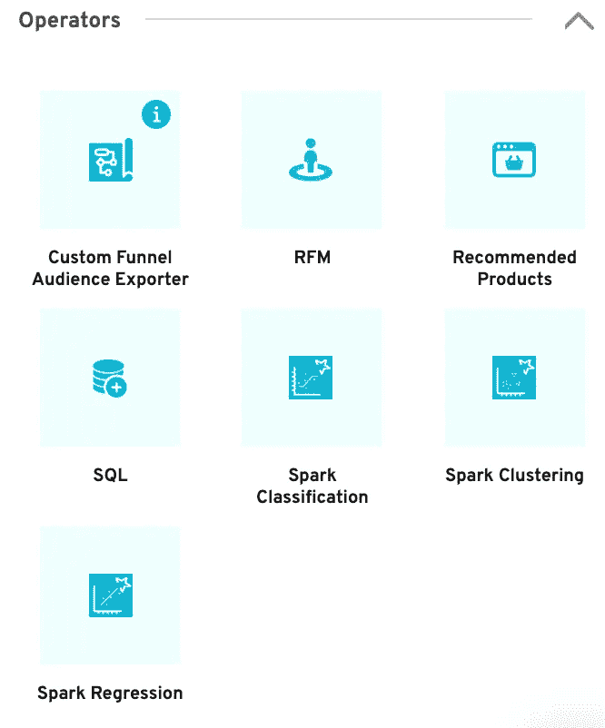
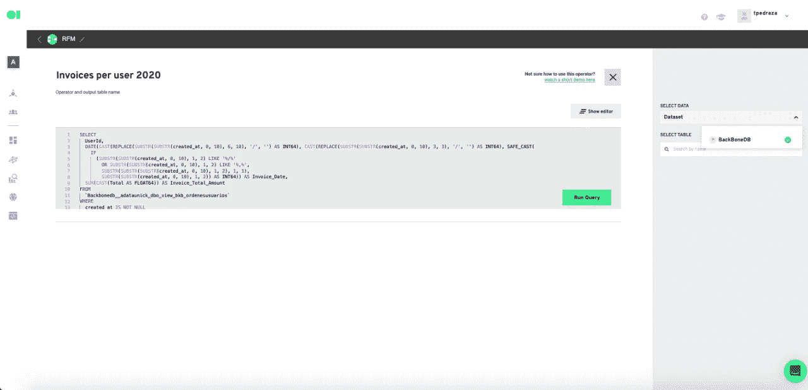
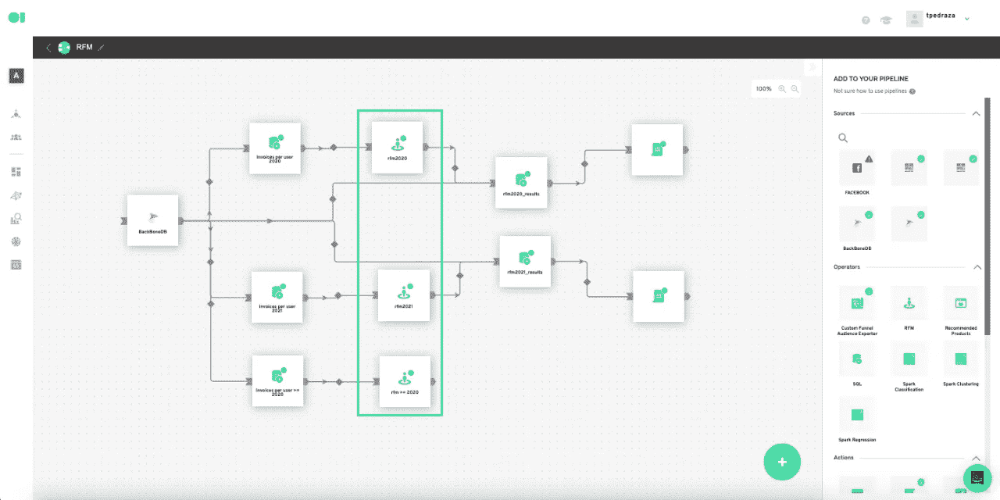
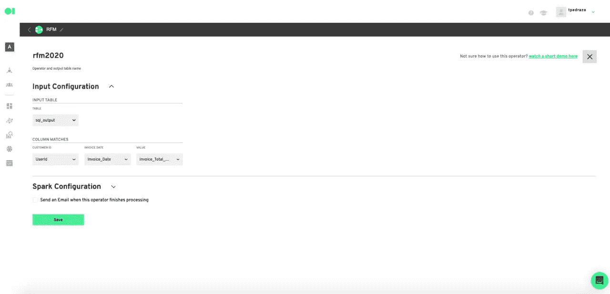
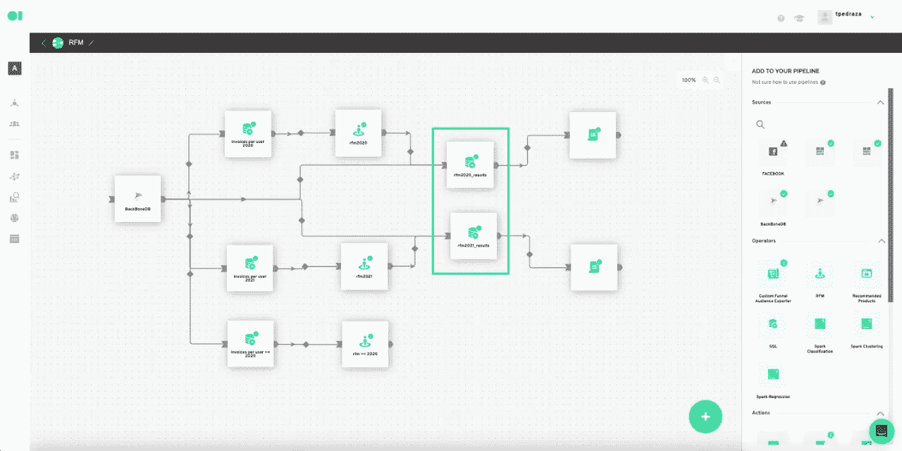
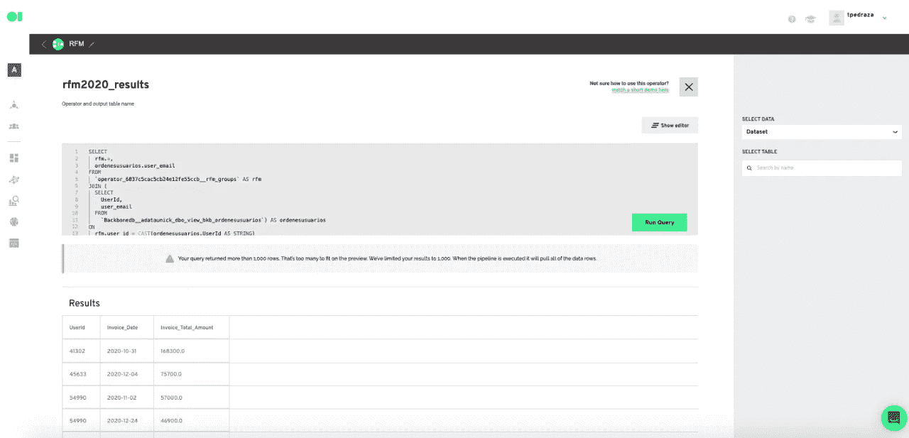
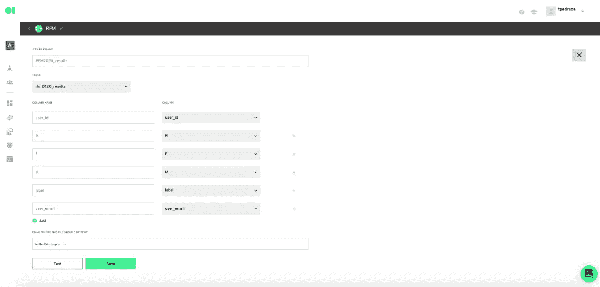

# RFM 分析-通过 RFM 分析和细分建立一个 ML 模型并了解更多关于您的客户的信息

> 原文：<https://medium.com/geekculture/rfm-analysis-build-an-ml-model-and-learn-more-about-your-customers-with-rfm-analysis-and-2811482d38f3?source=collection_archive---------22----------------------->

在这篇博客文章中，我们将看看 RFM(最近、频率、货币价值)建模，该建模用于根据行为以及客户如何从大数据集进行购买来对客户或细分市场进行分组。因此，您将获得关于直接营销的宝贵见解。

# 什么是 RFM 建模，营销人员或数据分析师如何使用它？

RFM(最近，频率，货币)分析是一个成熟的基于行为的客户细分营销模型。它根据客户的交易历史对他们进行分组——他们最近从您的公司购买了多少产品，购买的频率以及这些客户购买了多少产品。

RFM 帮助将客户分为不同的类别或集群，以确定哪些客户更有可能对促销和未来的个性化服务做出反应。

仅根据一个参数来评估客户是不够的。

例如，您可以假设在您的业务上花费最多的人是您的最佳客户。我们大多数人都同意并将有同样的假设。但请稍等，如果他们只从您的公司购买一次呢？还是很久以前？如果他们不再使用您的产品怎么办？他们还能被视为您的最佳客户吗？可能不会。仅从一个方面来判断客户价值，会对您的客户群及其终身价值提供不准确的报告。

这就是为什么 RFM 模型结合了三种不同的客户属性来对客户进行排名。

如果他们最近购买，他们会获得更多积分。如果他们买了不止一次，他们会得到更高的分数。如果他们花的钱更多，他们也会得到更多的积分。把这三个分数加起来，你就会得到 RFM 分数。

最后，您可以根据这个“最近-频率-金钱”分数将您的客户数据库划分为不同的组。

-最近:最近天数的最小值

-频率:客户购买的数量

-货币:每个客户所有购买的总价值

RFM 分析是一种便捷的方法，可以帮助您找到最好的客户，了解他们的行为，然后开展有针对性的电子邮件/营销活动，以提高销售额、满意度和客户终身价值。

# 构建一个基于时间的客户细分 RFM 模型，了解客户行为，识别客户流失。

在本教程中，您将学习如何在 Datagran 上运行 ML 模型，通过将去年的数据与当前的数据进行比较，使用 RFM 分析来评估快餐店的顾客行为。其结果将不仅提供有关客户行为的见解，还将有助于确定客户流失的原因。

**首先，集成您将从中提取信息的数据源。** Datagran 从各种数据仓库和数据源导入数据，包括 PostgreSQL、Azure Cosmos DB、雪花数据库等数据库，以及 HubSpot、Shopify、脸书 Ads、Salesforce、Segment、波幅等商业软件。

对于本教程，我们将使用 Microsoft SQL Server 源来获取数据。[点击此处](https://youtu.be/p4G6UfukDwM)了解如何将数据源集成到您的 Datagran 帐户中。

**然后，** [**创建一个新的管道**](https://youtu.be/-5Kj6RX67YU)**——data gran 称之为工作流——来处理你的数据。**

**现在，将 Microsoft SQL Server 数据源拖放到管道画布中**。

提示:通过[安装我们的 Web Pixel 或 mobile SDK](https://www.notion.so/Datagran-Documentation-bd0f3437b00a49ca816f43cffb9d22c8) 或使用 [Segment](https://segment.com/) ，也可以将多个来源添加到管道中，例如来自 Stripe 的交易数据和来自 CRM 的行为数据，甚至来自您的网站或应用程序的数据。

**是时候建立 ML 模型了。首先，准备数据集。**

你将运营三家 RFM 运营商——一家运营 2020 年，一家运营 2021 年，还有一家运营这两年。

对于这一步，有必要从数据源(Microsoft SQL Server)中提取将要使用的数据(表)。这将设置模型，以便 RFM 操作员使用正确的信息工作。

您需要交易数据才能执行 RFM 模型。然后，我们的系统将选择我们下面提供的示例查询所需的内容。交易数据表应包括以下各栏:

提示:确保表中的值与查询中输入的值相匹配。例如，如果列的名称是唯一客户 ID，那么您将需要使用相同的大写。

**唯一客户 id**

**这些交易的日期**

**发票总金额**

第一个 SQL 操作符将包含 2020 年的用户发票数据。为此，将 MySQL 操作符拖放到画布中。

**运算符是嵌入在 Datagran 平台中的功能，可帮助您与数据进行交互并对其进行处理。**

将鼠标悬停在第一个操作符元素上，然后按下 edit 按钮。将弹出 SQL 查询编辑器页面。命名操作符，复制并粘贴下面的查询示例，替换每个变量以应用于您的表的变量，或者按右上角的*显示编辑器*按钮选择列，而无需添加代码。用表格中的字段替换相应的字段。

SELECT
Customer_id，
DATE(Invoice_date)为 Invoice_date，
SUM(transaction_value)为 Invoice _ total _ amount FROM
FROM
transactional _ table
GROUP BY
Customer _ id，
Invoice_date，
Invoice_id

运行查询，然后保存它。回到画布后，将鼠标悬停在操作符上并按下播放图标来运行操作符。

**对 2021 用户发票数据和 2021+2020 用户发票数据重复同样的过程。**

您可以使用我们上面提供的相同查询示例。

**运行 RFM 模式。**

将三个 RFM 操作符拖放到画布中，并将它们分别连接到 SQL 操作符。

将鼠标悬停在第一个 RFM 运算符上，然后按下编辑按钮。使用下拉菜单选择要使用的表以及将确定最近发生率、频率和货币分数的列。相应的列将是唯一的客户标识、发票日期和发票标识。对于这个例子，您将保持 Spark 配置不变，但是如果您需要为更高级的建模配置它，那么使用下拉箭头打开设置。

将鼠标悬停在 RFM 操作符上并按下播放按钮，保存您的配置并运行元素。对剩下的两个 RFM 操作符重复这个过程。

**从您的数据中提取电子邮件和电话号码，联系得分最高的客户群。**

为了充分利用您的模式，您希望获得客户的联系信息，以便通过电子邮件活动、脸书广告甚至推送通知发送个性化信息。其中一个方法是从数据源中提取信息，如果数据源中有信息的话。只需将 Microsoft SQL Server 数据源连接到两个 SQL 操作符，然后复制并粘贴下面的查询。运行它，一旦回到管道画布，通过按下 play 按钮运行 SQL 元素。使用下面列出的第二个查询示例重复这个过程来检索电话号码信息。

**用户邮箱:**

选择
rfm。*，
ordeneusualios . user _ email
FROM
` operator _ 6037 C5 CAC 5 CB 24 e 12 Fe 55 CCB _ _ RFM _ groups ` AS RFM
JOIN(
SELECT
UserId，
user _ email
FROM
` backbonedb _ _ adatau nick _ dbo _ view _ bkb _ ordeneusualios `)AS ordeneusualios
RF 字符串形式的用户 Id)

**用户电话号码:**

选择
rfm。*，
ordenesuarios . user _ email
FROM
` operator _ 6037d 469966 affa 7a 7d 8 e 55d 03 _ _ RFM _ groups ` AS RFM
JOIN(
SELECT
UserId，
user _ email
FROM
` backbonedb _ _ adatau nick _ dbo _ view _ bkb _ ordenesuarios `) AS ordenesuarios【T33 字符串形式的用户 Id)

**将模型的结果发送到 CSV 文件。**

现在，您希望将模型的结果自动发送到业务应用程序进行进一步分析，或者立即锁定得分最高的客户。在本例中，您将把结果发送到一个 CSV 文件，为此，您只需简单地拖放位于右侧菜单中的两个 CSV 操作元素。将每个操作元素连接到相应的 SQL 操作符。单击每个 CSV 元素上的 edit 按钮，命名该表，选择您希望包含的列，并输入应该发送结果的电子邮件。完成后，单击保存。

**运行 RFM 模型**

是时候运行你的 RFM 模型了。点击+号并点击运行。现在，管道将开始从您的数据源提取信息，对其进行处理，运行 RFM 模型，并将结果发送到您选择的电子邮件。

RFM 模特应该在你的营销策略中排在首位，这样才能通过向顾客发送他们真正想要的信息，在真正有意义的层面上与他们建立联系。

一旦您使用 Datagran 建立了 RFM 模型，您的团队将从您的客户那里获得有价值的见解，否则这些见解将保存在服务器中。

利用这些见解作为战略工具，帮助您的公司增加收入，真正了解客户的终身价值，并减少流失。

一旦 RFM 细分整合到您的客户名单和电子商务网站中，这是一种根据客户过去的行为向他们提供更具针对性的信息的相对简单的方式。

这个 RFM 模型是由 Datagran 的数据科学家制作的黑盒模型，尽管如此，如果您需要更高级或个性化的选项，请与我们的团队[联系](https://www.datagran.io/contact)。