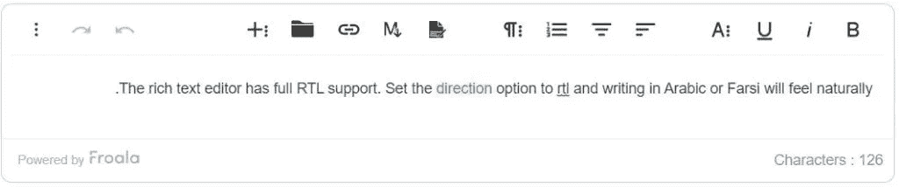

# 富文本编辑器:如何选择

> 原文：<https://medium.com/geekculture/rich-text-editor-how-to-choose-871e41b3be50?source=collection_archive---------17----------------------->


Photo by [Javier Quesada](https://unsplash.com/@quesada179?utm_source=unsplash&utm_medium=referral&utm_content=creditCopyText) on [Unsplash](https://unsplash.com/s/photos/html-editor?utm_source=unsplash&utm_medium=referral&utm_content=creditCopyText)

React-rich 文本编辑器允许您毫不费力地编辑 web 应用程序的内容。然而，有些情况下你需要重新发明它。

比如开机慢，在移动设备上看起来不好看。那么，如何重新发明 React-rich 文本编辑器来解决这些问题呢？在这篇文章中，你会发现所有的细节。

# #什么是 React-Rich 文本编辑器？

React-rich 文本编辑器是一个为 JavaScript web 应用程序提供丰富编辑功能的工具。您可以使用它来创建博客帖子或论坛帖子。它允许您使用丰富的工具轻松编辑内容。

您可以更改文本的格式和对齐方式。

此外，您还可以插入图像、视频和链接。但是，您不必编写任何 HTML 或 CSS 代码。然而，你可以在视觉上做任何事情。

# #你为什么应该考虑改造 React 富文本编辑器？

# #我需要一个超快的富文本编辑器吗？

您不希望等待文本编辑器启动太久。会影响用户体验。如果您有一个可以在几毫秒内初始化的超快的 React-rich 文本编辑器，那将会很有帮助。它将使您的 web 应用程序用户能够快速进入该工具。

因此，他们可以立即编辑内容。比如，弗罗阿拉就是一个超快的编辑器。它可以在不到 40 毫秒的时间内初始化。也就是说，比眨眼快 6 倍。因此，您的 web 应用程序用户会喜欢使用它。

# #我需要一个支持移动设备的文本编辑器吗？

移动支持是另一个关键因素。人们不再仅仅在个人电脑和笔记本电脑上编辑内容。他们也使用智能手机和平板电脑。这就是为什么您需要一个提供移动支持的 React 文本编辑器。它将使用户能够随时编辑内容。

Froala 提供全面的移动支持。它的格式控制在所有设备上都是一样的，包括台式机、笔记本电脑和智能手机。此外，它还允许您在移动设备上调整图像和视频的大小。它是第一个支持这些特性的 React 文本编辑器。

# #我需要一个支持 RTL 的 React 文本编辑器吗？

有些语言，如阿拉伯语或希伯来语，是从右向左读的。它们与英语截然不同，英语是反方向读的。

例如，如果您的 React 应用程序支持其中一种语言，您需要获得一个提供 RTL 功能的编辑器。它将使用户能够从右向左打字。

Froala 支持 RTL 功能。每当您选择阿拉伯语时，工具栏会自动移动和调整；因此，您可以自然地从右向左打字。

当键入方向设置为 RTL 时，Froala 看起来像这样:



# #我需要扩展我的富文本编辑器的功能吗？

有时，您需要向编辑器添加高级功能。例如，您的 web 应用程序用户需要插入数学和化学方程式。

但是，您的富文本编辑器不提供任何类似的功能。你不想从头开始开发这个特性。这会花费你大量的时间和金钱。

您需要一个支持高效插件的 React-rich 文本编辑器。它将允许您快速集成高级功能。例如，Froala 支持 30 个开箱即用的插件，如 Mathtype、Embedly、特殊字符等。您可以利用它们毫不费力地扩展其功能。

# #如何将 Froala 集成到 React 应用中？

将 Froala 实现到 React web 应用程序的过程很简单。您需要遵循以下步骤:

1.  首先，你需要导入 Froala 的 CSS 文件。此外，您必须导入编辑器组件。

```
import React from 'react';
import ReactDOM from 'react-dom';// Require Editor CSS files.
import 'froala-editor/css/froala_style.min.css';
import 'froala-editor/css/froala_editor.pkgd.min.css';import FroalaEditorComponent from 'react-froala-wysiwyg';
```

2.您可以使用以下代码行呈现 Froala 编辑器组件:

```
ReactDOM.render(<FroalaEditorComponent tag='textarea'/>, document.getElementById('editor'));
```

3.现在，你可以去你的 HTML 文件。通过将 ID 传递给 HTML 元素，可以将编辑器添加到 UI 中。

```
<div  id="editor">
</div>
```

这就是将 Froala 集成到 React web 应用程序中的方式。如您所见，这个过程非常简单。它只需要编写几行代码。没有麻烦。

但是，请确保您有正确的 Webpack 设置来加载 CSS 文件。如果您使用的是 Webpack 4，设置如下:

```
var webpack = require("webpack");module.exports = {
  module: {
    rules: [
      {
        test: /\.jsx$/,
        use: {
          loader: 'babel-loader',
          options: {
            cacheDirectory: true,
            presets: ['react','es2015', 'stage-2']
          }
        }
      }, {
        test: /\.css$/,
        use: [
          'style-loader',
          'css-loader'
        ]
      },
      {
        test: /\.woff(\?v=\d+\.\d+\.\d+)?$/,
        use: "url-loader?limit=10000&mimetype=application/font-woff"
      }, {
        test: /\.woff2(\?v=\d+\.\d+\.\d+)?$/,
        use: "url-loader?limit=10000&mimetype=application/font-woff"
      }, {
        test: /\.ttf(\?v=\d+\.\d+\.\d+)?$/,
        use: "url-loader?limit=10000&mimetype=application/octet-stream"
      }, {
        test: /\.eot(\?v=\d+\.\d+\.\d+)?$/,
        use: "file-loader"
      }, {
        test: /\.svg(\?v=\d+\.\d+\.\d+)?$/,
        use: "url-loader?limit=10000&mimetype=image/svg+xml"
      }
    ]
  },
  resolve: {
    modules: ['node_modules']
  }
};
```

# #源代码:

你可以在这里得到源代码。