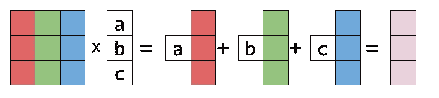
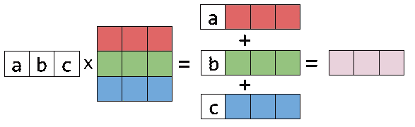

# 左右矩阵乘法

> 原文：<https://medium.com/geekculture/right-and-left-matrix-multiplication-d21947f195d8?source=collection_archive---------3----------------------->

矩阵乘法是数学和计算中最重要的运算之一。这篇文章介绍了两种更好的方法来思考矩阵乘法，相对于你可能是如何学习它的。


Image found on Wikipedia

每个人都首先学习矩阵乘法，其中乘积中的每个元素都是单独计算的。对于 *A×b=c* ，其中 *A* 为矩阵， *b* 和 *c* 为向量， *c* 中的每一项都是通过将 *A* 的第 *i* 行与列向量 *b* 相乘来计算的。 *c* 的项一次计算一项，这是学习矩阵向量乘法的一种快速简单的方法。然而，这种方法不能很好地捕捉矩阵变换的结构。

考虑矩阵向量乘法的一个更好的方法是将 *A* 中的行和列进行线性组合。不是一次一个地计算 *c* 中的每一项，而是计算一系列大小为 *c* 的向量，然后将它们加在一起以获得最终结果。这可以让我们深入了解矩阵乘法正在执行的转换类型。是 *A* 的行还是列，取决于矩阵 *b* 在哪边。接下来的部分描述了两种思考矩阵向量乘法的好方法。

# 右乘法:列间距

最常见的是，人们做矩阵向量乘法为 *A×b* ，其中 *b* 在 *A* 的*右*侧。这是看待乘法更常见的方式，因为它非常适合求解线性系统，而线性系统是矩阵代数的典型动机。如果 *A* 是一个 *m×n* 矩阵，所以它有 *m* 行和 *n* 列，那么 *b* 一定是一个有 *n* 行的列向量。

乘法的乘积 *c* ，是 *A* 的 *n* 列向量的线性组合。因为当向量在 *A* 的右侧时，输出是 *A* 的列的线性组合，右乘使用列空间。



Right multiplication with the column space. Image by [Eli Bendersky’s](https://eli.thegreenplace.net/) on thegreenplace.net

上图中， *A* 是一个 3×3 的矩阵，各列颜色不同。向量 *b* 有 3 个元素。最右边的乘积是 A 列的线性组合，其中 *b* 中的元素是线性组合的系数。

# 左乘法:行空间

左乘法的原理与右乘法相同，但由于向量在 *A* 的另一侧，所以列空间被切换到行空间。设置类似: *A* 是 *m×n* 和 *b* 一个带有 *m* 元素的向量。在右或列空间乘法中， *b* 的元素数与 *A* 的列数相同，但在左或行空间乘法中， *b* 的元素数与 *A* 的行数相同。

*b×A* 的乘积是 m 行 *A* 的线性组合，其中 *b* 的元素是线性组合的系数。



Left multiplication with the row space. Image by [Eli Bendersky’s](https://eli.thegreenplace.net/) on thegreenplace.net

上图中， *A* 是具有不同颜色行的矩阵， *b* 的元素与 *A* 中的行数完全相同。右边显示的乘积是以 *b* 的元素为系数的 *A* 的行的线性组合。

# Python 实现

下面是用 Python 写的两个函数，它们做左右矩阵向量乘法。这些功能被设置为基于上述直觉工作。这段代码和一些例子可以在这个 [colab 文件](https://colab.research.google.com/drive/1D8haX5D-UONHr4AtriFbLYVXx3f6yd5s?usp=sharing)中找到。

```
def right_multiplication(A, b):
  C = np.zeros(b.shape)
  m, n = A.shape
  for i in range(n):
    C += np.reshape(b[i,0] * A[:,i], (m,1))
return Cdef left_multiplication(b, A):
  C = np.zeros(b.shape)
  m, n = A.shape
  for i in range(m):
    C += np.reshape(b[0,i] * A[i,:], (1,n))
return C
```

以上两个函数的结构非常相似，不同之处仅在于`for`循环。对于右行乘法，循环迭代 A 的行，对于左列乘法，循环迭代 A 的列。在循环内部，两个函数分别将`c`增加一行或一列，乘以从`b`开始的相应的第`i`个元素。

虽然`NumPy`已经内置了矩阵乘法的函数，这比上面的函数更有效，但是理解矩阵乘法的这两个观点可以让我们深入了解矩阵是如何真正线性变换的，以及矩阵所包含的其他秘密。

如果你做到了这一步，按下鼓掌按钮。我刚接触媒体，正试图写出一些关于我如何看待数学、数据科学和计算机的内容。跟我来，如果你喜欢的话。