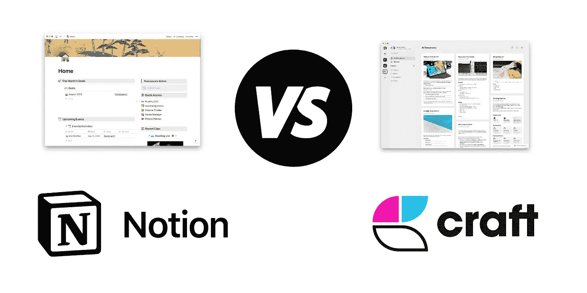

# RIP:工艺 vs 理念

> 原文：<https://medium.com/geekculture/rip-craft-vs-notion-36784d31d598?source=collection_archive---------0----------------------->

## 战斗结束了，这两个人的下一步是什么？

我喜欢反思应用程序之间的竞争。在 2020 年和 2021 年，Craft 和 concept 都占据了主导地位，因为这些应用程序可以帮助我们以简化的方式完成工作——Craft 凭借其可靠性和令人惊叹的文档创建工具，而 concept 凭借其强大的 API 和数据库功能。