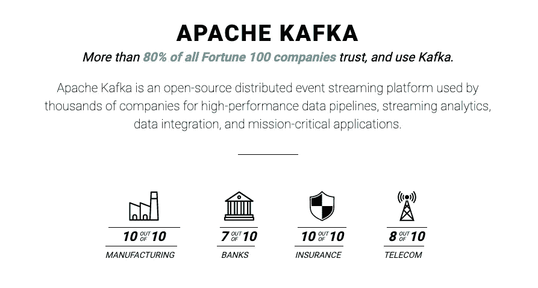
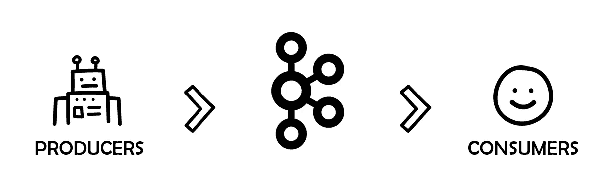
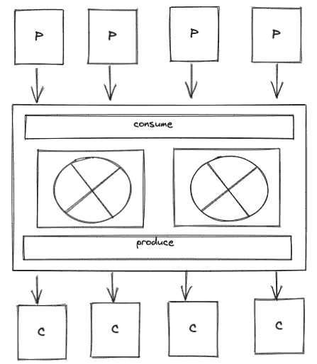
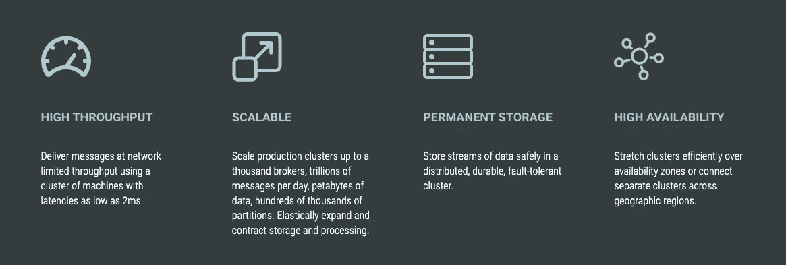

# 卡夫卡之路

> 原文：<https://medium.com/geekculture/road-to-kafka-3c36c5b02b?source=collection_archive---------18----------------------->



考虑一个例子，你有一个电子商务服务，它有两个部分，第一部分是结账服务，另一部分是发货，一旦结账发生，发货就必须触发。

一般来说，可以使用 REST API 调用让运输服务知道已经发生了结帐，并且需要触发运输，但是如果有其他服务出于不同的目的想要使用相同的结帐信息，例如消息服务或库存服务，您可能希望向您的客户发送电子邮件通知已经发生了结帐，或者从您的库存中删除该商品数量。

所有这些都可以是有效的用例，并且所有这些仍然可以使用传统的 REST API 调用来完成，但是这使得每个服务都直接依赖于基础服务，并且集成可以有多个部分，随着时间的推移或系统中服务数量的增加，这些都会变得复杂。

为了解决这些问题，如果基础服务 checkout 只是在发生 checkout 时发布一条消息，而根本不需要担心消费者，会怎么样呢？

在这种情况下，消费者可以独立于基础服务，按照自己的节奏完成自己的工作。



> **Apache Kafka 是一个开源分布式事件流平台，被数千家公司用于高性能数据管道、流分析、数据集成和关键任务应用。**

顾名思义它是一个事件流平台所以在去卡夫卡之前让我们了解一下， ***什么是事件流？***

事件流是发布/订阅架构模式(pub/sub)的一种实现，具有某些特定的特征。发布/订阅模式包含以下元素:

*   消息:发布者希望传达给订阅者的离散数据。
*   发布者:将消息放入特定主题的消息代理中。
*   订阅者:从消息代理的特定主题中读取消息。
*   消息代理:能够存储来自发布者的消息并将其提供给订阅者的系统
*   频道或主题:共享一个类别的事件子集。术语“主题”和“渠道”在行业中可以互换使用。在这篇博文中，我们将这些称为**主题。**

## 消息是事件

事件包含有关状态更改的信息，其中可能包含业务信息。

```
// example of an event
{
   "key": "Alice",
   "value": "Made a payment of $200 to Bob",
   "timestamp": "Jun. 25, 2020 at 2:06 p.m."
}
```

事件流只不过是按顺序排列的事件序列，这些事件从生产者流向消费者。

## 为什么选择事件流？

事件流和驱动架构有很多使用案例，下面列出了其中的一些。

*   实时处理支付和金融交易，例如在证券交易所、银行和保险行业。
*   实时跟踪和监控汽车、卡车、车队和货物，例如在物流和汽车行业。
*   持续捕获和分析来自物联网设备或其他设备(如工厂和风力发电场)的传感器数据。
*   收集客户互动和订单并立即做出反应，例如在零售业、酒店和旅游业以及移动应用程序中。
*   监测住院病人并预测病情变化，以确保在紧急情况下得到及时治疗。
*   连接、存储和提供由公司不同部门产生的数据。
*   作为数据平台、事件驱动架构和微服务的基础。

# 卡夫卡

> Apache Kafka 是一个社区分布式事件流平台，每天能够处理数万亿个事件。Kafka 最初被设想为一个消息队列，它基于分布式提交日志的抽象。自 2011 年由 LinkedIn 创建并开源以来，Kafka 已经从消息队列迅速发展成为一个成熟的事件流媒体平台。

## 卡夫卡蜜蜂

Kafka 建立在 4 个核心 API 之上:

1.  生产者 API:允许应用程序产生供消费者使用的数据流。它创建一个记录并将它们发布到主题中，而主题只是一个有序的记录列表。
2.  消费者 API:订阅一个或多个主题，并监听主题以获取数据。生产者可以直接向消费者提供记录，这也是一个更简单的用例。
3.  Streams API:这是真正让 Kafka 如此强大的东西，生产者为主题制作记录，Streams 从主题中消费记录，然后它可以实时转换数据**，然后为相同的主题或新的主题制作消息。**

****

**kafka streams apis**

**4.连接器 API:它使开发人员能够编写可重用的生产者和消费者连接器，这样开发人员就不需要编写已经存在的重复内容。**

# **为什么是卡夫卡？**

****

**core-capabilities from Apache Kafka docs**

1.  ****卡夫卡是高度可扩展的。** Kafka 是一个分布式系统，能够快速轻松地扩展，不会导致任何停机。Apache Kafka 能够处理许多兆兆字节的数据，而不会产生太多的开销。**
2.  ****卡夫卡是高度耐用的。** Kafka 将消息保存在磁盘上，提供集群内复制。这使得消息传递系统非常耐用。**
3.  ****卡夫卡是高度可靠的。** Kafka 复制数据并能够支持多个用户。此外，它会在出现故障时自动平衡用户。这意味着它比现有的类似信息服务更可靠。**
4.  ****卡夫卡提供高性能。** Kafka 为发布和订阅提供了高吞吐量，其磁盘结构能够提供恒定的性能水平，即使在处理许多 TB 的存储消息时也是如此。**

**弄脏你的手:——[https://kafka.apache.org/quickstart](https://kafka.apache.org/quickstart)**