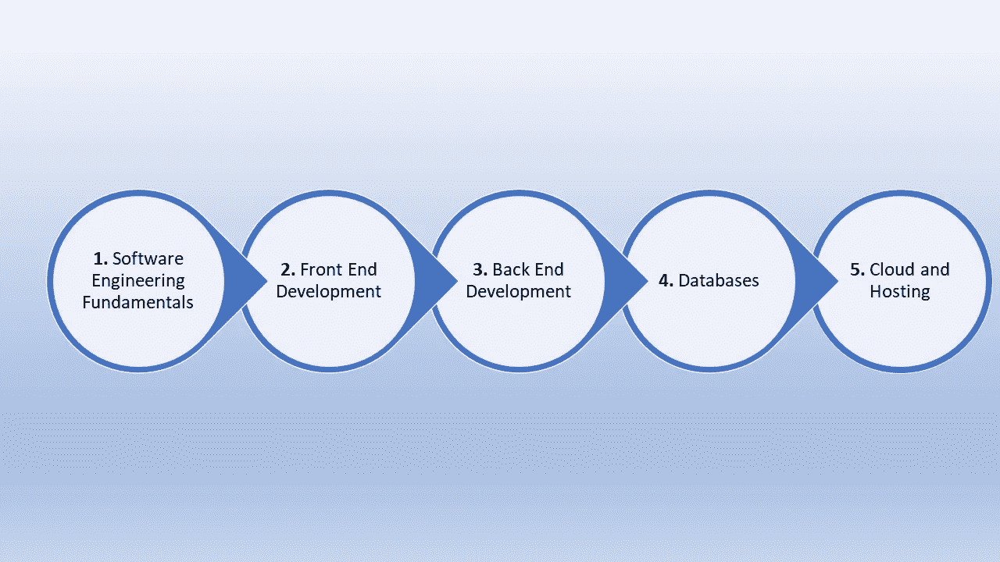

# 全栈软件开发路线图

> 原文：<https://medium.com/geekculture/roadmap-to-full-stack-software-developer-6a6a8bd02bd7?source=collection_archive---------7----------------------->

自过去几年以来，对全堆栈开发人员的需求一直很大。随着大规模软件的大繁荣，开发端到端应用程序的技能在技术领域大受欢迎。在本文中，我们将看看在几个月内从零开始成为全栈开发人员的路线图。

1.  **软件工程基础**

从基础开始，迈出软件工程基础的第一步——SDLC、测试技术、SRS、UML 图等。经历各种开发模型，如敏捷和 DevOps，在当今世界也是必不可少的。

2.**前端开发**

下一步是从动手开始，但不是技术性很强的东西。UI 开发侧重于开发应用程序的客户端/用户端(基本上就是用户与之交互的内容)。随着时间的推移，UI 开发已经发生了很多变化，目前非常需要像 React 和 Angular 这样的框架。因为基础知识不容忽视，所以从 0 开始——HTML、CSS 和 JS，然后是 React 或 Angular 等框架。从最大的需求出发，着手优化移动设备的用户界面。

3.**后端开发**

后端开发离完成你的应用程序更近了一步，它专注于为应用程序编写服务器端脚本以与服务器交互(主要是获取数据或资源)。后端开发是一个相对技术性的角色，因此要确保对服务器的工作和网络基础有很好的了解。因为这是一个更技术性的概念，所以基础知识在这里也很重要——从更简单的开发框架开始，比如 Express(基于 JS)或 Flask(基于 Python)。像微软技术。NET 在这里也有很好的位置，但是对于一个新手来说可能会超载。

4.**数据库**

在这个数据驱动的世界中，数据是核心部分。因此，数据库已经成为任何应用程序的重要组成部分。常用的数据库有 SQL(关系型)和 MongoDB(非关系型)。实际上，这两个数据库都是学习的基础，因为它们都有广泛的用途。

5.**云和托管**

现在你已经制作了你的应用程序，终端用户如何访问它呢？从学习主机开始(有很多免费的主机平台)。一旦你熟悉了这个概念，就开始学习云和相关服务。学习云托管和各种其他服务，如云托管的数据库和存储服务。现代应用程序要求资源位于可扩展的高效平台上，如云。

感谢您的阅读！

## 有用的链接:

*   在 LinkedIn 上找到我:[https://www.linkedin.com/in/vishnuu039](https://www.linkedin.com/in/vishnuu039)
*   更多地了解我:https://bit.ly/vishnu-u