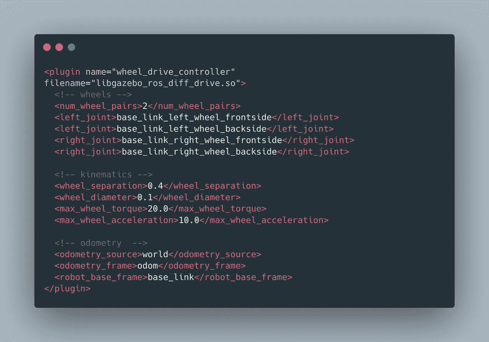
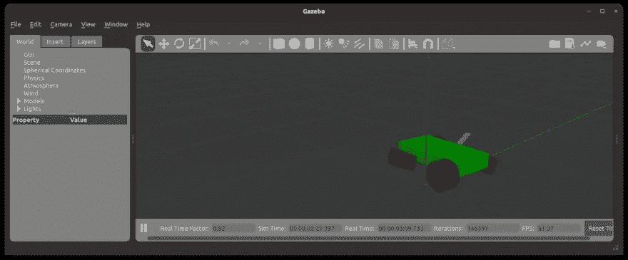

# 机器人操作系统:用 ROS Gazebo 插件控制机器人

> 原文：<https://medium.com/geekculture/robot-operating-system-controlling-a-robot-with-the-ros-gazebo-plugins-e8055cf28f44?source=collection_archive---------6----------------------->



在我最近关于 ROS 和我的项目 RADU 的文章中，我展示了如何在 Gazebo 中启动一个定制的机器人模型，并通过特殊的控制节点暴露其关节。这些节点接受命令来改变它们的努力、速度或位置。然而，节点本身并不翻译命令和移动你的机器人，你仍然需要编写与 Gazebo 接口的代码。

Gazebo 插件与典型的 ROS 安装捆绑在一起。插件支持几种致动器，如差动驱动或滑动驱动，以及传感器，如相机、深度相机和 IMU。插件通过内部的控制器节点进行通信，您不需要公开它们。相反，他们会发布相关的主题，如向机器人发送线性和角运动命令的`/cmd_vel`，或表示自模拟开始以来机器人位置的`/odom`。

本文是关于 Gazebo 插件的实践研讨会。你将学习插件是如何工作的，我们将看到如何使用 ROS2 中的 diff-drive 插件来控制一个四轮机器人。

*本文原载于我的博客*[*admantium.com*](https://admantium.com/blog/ros09_controlling_a_robot_in_gazebo/)。

# Gazebo 插件

在我的机器人项目期间，我查看了社区的其他几个机器人项目。我很疑惑为什么有些项目没有衍生出任何控制器节点，但上面提到的话题`/cmd_vel`和`/odom`还是被发表了。我的假设是这些机器人的插件会自动启动控制器。查看官方的 Gazebo 文档，我们可以找到这样一段话:

> *Gazebo 以前的版本使用控制器。这些插件的行为与插件非常相似，但是被静态编译到 Gazebo 中。插件更加灵活，允许用户挑选在他们的模拟中包含什么功能。*

*来源:* [*官方凉亭文档*](http://gazebosim.org/tutorials?tut=plugins_hello_world&cat=write_plugin) 。

插件是遵循[插件开发指南](http://gazebosim.org/tutorials?tut=plugins_hello_world&cat=write_plugin)中概述的约定的 C++库。这些插件继承了一个基类——比如传感器、系统、视觉或世界——并公开了`Load`功能。这是插件开发指南中的一个例子。

```
#include <gazebo/gazebo.hh>namespace gazebo
{
  class WorldPluginTutorial : public WorldPlugin {
    public: WorldPluginTutorial() : WorldPlugin() {
      printf("Hello World!\n");
    } public: void Load(physics::WorldPtr _world, sdf::ElementPtr _sdf) { }
  }; GZ_REGISTER_WORLD_PLUGIN(WorldPluginTutorial)
}
```

编译完成后，插件需要通过机器人的 URDF 模型加载。

```
<?xml version="1.0"?>
<sdf version="1.4">
  <world name="default">
    <plugin name="hello_world" filename="libhello_world.so"/>
  </world>
</sdf>
```

当使用一个预制的插件时，我们只需要将它添加到 URDF 模型中。

# ROS2 插件

自 ROS2 问世以来，插件一直在稳步转换。[状态页面](https://github.com/ros-simulation/gazebo_ros_pkgs/wiki)显示摄像机等独立插件被合并到一个包中。以此为参考，我们可以选择和合并我们选择的插件，使它们与我们的原型一起工作。

我们想控制机器人如何移动。插件支持四种不同的转向原理:差速驱动、滑移驱动、阿克曼驱动和三轮驱动。我的 RADU 机器人是一辆四轮车，可以作为滑行驱动来控制。因此，我们将使用`ros_diff_drive`插件。

# 使用差异驱动插件

除了机器人的物理模型之外，使用插件比手动添加控制器节点要简单得多。事实上，您只需要添加一个`<plugin>`标签！

以下是完整的示例:

```
<plugin name="wheel_drive_controller" filename="libgazebo_ros_diff_drive.so"> <!-- wheels -->
  <num_wheel_pairs>2</num_wheel_pairs>
  <left_joint>base_link_left_wheel_frontside</left_joint>
  <left_joint>base_link_left_wheel_backside</left_joint>
  <right_joint>base_link_right_wheel_frontside</right_joint>
  <right_joint>base_link_right_wheel_backside</right_joint> <!-- kinematics -->
  <wheel_separation>0.4</wheel_separation>
  <wheel_diameter>0.1</wheel_diameter>
  <max_wheel_torque>20.0</max_wheel_torque>
  <max_wheel_acceleration>10.0</max_wheel_acceleration> <!-- odometry  --> 
  <odometry_source>world</odometry_source>
  <odometry_frame>odom</odometry_frame>
  <robot_base_frame>base_link</robot_base_frame> <!-- topic & re remappings -->
  <ros>
    <namespace>/</namespace>
    <argument>/cmd_vel:=cmd_vel</argument>
    <argument>/odom:=odom</argument>
  </ros> <publish_odom>true</publish_odom>
  <publish_odom_tf>true</publish_odom_tf>
  <update_rate>100.0</update_rate>
</plugin>
```

该声明由 4 个配置块组成。每个块中的标签应该是不言自明的，所以我只简单解释一下。

*   车轮:指定车轮的数量，然后参考哪些关节考虑用于右侧，哪些关节参考用于左侧转向
*   运动学:车轮的附加物理配置:沿 y 轴的分离、直径、扭矩和加速度
*   里程计:如果您发布里程计信息，您需要指定其来源和框架以及基础框架
*   主题:这个块配置您想要发布的主题、发布的名称空间/名称以及更新的速度。

# 启动凉亭并控制机器人

一旦插件在你的机器人描述中可用，我们可以开始 Gazebo 和所需的节点。我们需要显式启动三个节点——Gazebo、关节状态控制器和机器人状态发布器——然后生成机器人。最后一步为插件创建一个额外的控制器节点。

以下是启动文件:

```
#!/usr/bin/python3
# -*- coding: utf-8 -*-
import osfrom ament_index_python.packages import get_package_share_directory
from launch import LaunchDescription
from launch.actions import DeclareLaunchArgument
from launch.actions import IncludeLaunchDescription
from launch.launch_description_sources import PythonLaunchDescriptionSource
from launch_ros.actions import Nodefrom time import sleep
import xacropackage_name = 'radu_bot'
world_file = 'living_room3.sdf'def generate_launch_description(): pkg_gazebo_ros = get_package_share_directory('gazebo_ros')
    pkg_radu_simulation = get_package_share_directory(package_name)
    rviz_config_path = os.path.join(pkg_radu_simulation, 'config/urdf_config.rviz') robot_description_path =  os.path.join(
        pkg_radu_simulation,
        "urdf",
        "gazebo.xacro",
    ) robot_description = {"robot_description": xacro.process_file(robot_description_path).toxml()} print("MODEL %s" % robot_description['robot_description']) sleep(3) joint_state_publisher_node = Node(
        package='joint_state_publisher',
        executable='joint_state_publisher',
        name='joint_state_publisher'
    ) robot_state_publisher_node = Node(
        package="robot_state_publisher",
        executable="robot_state_publisher",
        output="both",
        parameters=[robot_description],
    ) gazebo_node = IncludeLaunchDescription(
        PythonLaunchDescriptionSource(
            os.path.join(pkg_gazebo_ros, 'launch', 'gazebo.launch.py'),
        )
    ) robot_spawner = Node(
            package='gazebo_ros',
            executable='spawn_entity.py',
            name='urdf_spawner',
            output='screen',
            arguments=["-topic", "/robot_description", "-entity", "radu_bot", "-x", "-3.0", "-y", "-1.5"]) print("STARTING ALL NODES") sleep(3) world_arg = DeclareLaunchArgument(
          'world',
          default_value=[os.path.join(pkg_radu_simulation, 'worlds', world_file), ''],
          description='SDF world file')    no_sim_time = DeclareLaunchArgument(
            'use_sim_time',
            default_value='false',
            description='Use simulation (Gazebo) clock if true') return LaunchDescription([
        world_arg,
        no_sim_time,
        joint_state_publisher_node,
        robot_state_publisher_node,
        gazebo_node,
        robot_spawner
    ])
```

用`ros2 launch radu_bot control.launch.py`启动它，然后我们可以看到可用的节点:

```
$> ros2 node list
/gazebo
/joint_state_publisher
/robot_state_publisher
/wheel_drive_controller
```

最后一个节点`wheel_drive_controller`，订阅了主题`cmd_vel`，通过它我们可以控制机器人。

```
$> ros2 node info /wheel_drive_controller
/wheel_drive_controller
  Subscribers:
    /clock: rosgraph_msgs/msg/Clock
    /cmd_vel: geometry_msgs/msg/Twist
    /parameter_events: rcl_interfaces/msg/ParameterEvent
  Publishers:
    /odom: nav_msgs/msg/Odometry
    /parameter_events: rcl_interfaces/msg/ParameterEvent
    /rosout: rcl_interfaces/msg/Log
    /tf: tf2_msgs/msg/TFMessage
  Service Servers:
    /wheel_drive_controller/describe_parameters: rcl_interfaces/srv/DescribeParameters
    /wheel_drive_controller/get_parameter_types: rcl_interfaces/srv/GetParameterTypes
    /wheel_drive_controller/get_parameters: rcl_interfaces/srv/GetParameters
    /wheel_drive_controller/list_parameters: rcl_interfaces/srv/ListParameters
    /wheel_drive_controller/set_parameters: rcl_interfaces/srv/SetParameters
    /wheel_drive_controller/set_parameters_atomically: rcl_interfaces/srv/SetParametersAtomically
  Service Clients: Action Servers: Action Clients:
```

为了控制机器人，我们运行`teleop_twist_keyboard`命令，该命令将方向键盘按键转换成`/cmd_vel`消息。

```
$> ros2 run teleop_twist_keyboard teleop_twist_keyboard --ros-args --remap cmd_vel:=/cmd_velThis node takes keypresses from the keyboard and publishes them
as Twist messages. It works best with a US keyboard layout.
---------------------------
Moving around:
   u    i    o
   j    k    l
   m    ,    .
```

但是当移动机器人时，它表现得很奇怪:轮子是沿着 y 轴旋转的！



为了解决这个问题，我们需要向关节添加显式的`<axis>`和`<limit>`标签。

```
<xacro:macro name="wheel_joint" params="name parent child xyz ">
  <joint name="${name}" type="continuous">
    <parent link="${parent}" />
    <child link="${child}" />
    <origin xyz="${xyz}" rpy="1.570796 0 0"/>
    <axis rpy="0 0 0" xyz="0 0 1"/>
    <limit effort="1" velocity="1"/>
    <joint_properties damping="1.0" friction="1.0"/>
  </joint>
</xacro:macro>
```

然后机器人顺利移动。

# 结论

漫长的开发之旅告一段落:终于，Gazebo 中的 RADU 机器人仿真建模正确，可以在模拟世界中移动。为了实现这个目标，我们需要了解三个不同的主题。首先，兼容露台的 URDF 模型需要哪些额外的物理属性。第二，我们需要在我们的 ROS 系统中增加控制节点，以暴露机器人的关节来进行力度、速度或位置操作，并让这些节点翻译`cmd_vel`命令来改变模拟。第三，插件承担了第二部分的重任，只需要一个正确配置的规范和附加连接状态/机器人状态连接的开始。在此基础上，机器人现在可以配备图像相机和深度相机，用于在凉亭中进行模拟。