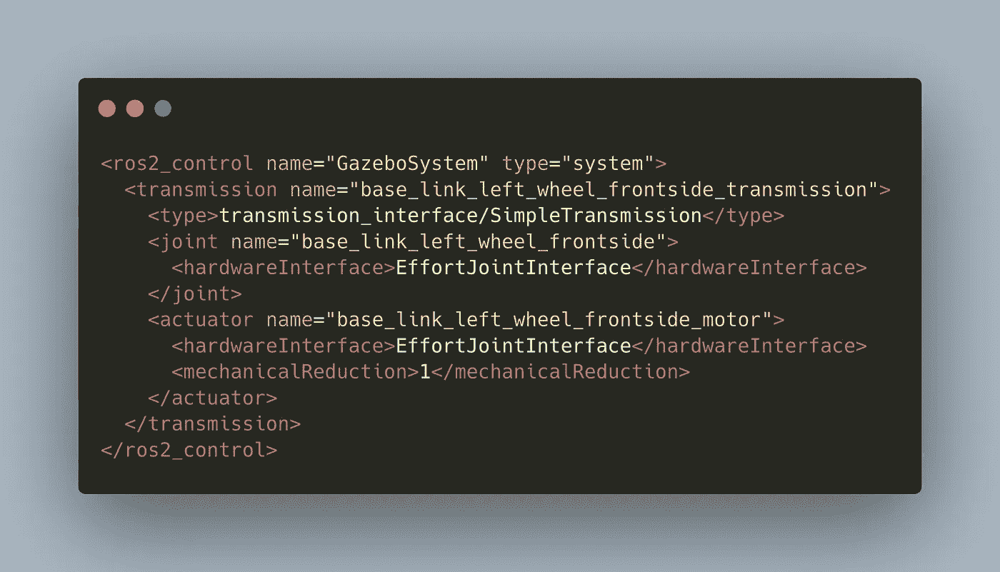

# 机器人操作系统:在凉亭中为交互式模拟展示控制节点

> 原文：<https://medium.com/geekculture/robot-operating-system-expose-control-nodes-for-an-interactive-simulation-in-gazebo-ff4b3544d25?source=collection_archive---------20----------------------->



在最近关于 ROS 和我的项目 RADU 的文章中，我展示了如何在 RVIZ 和 Gazebo 中发布定制的机器人模型。在 RVIZ 中，机器人是可视化呈现的，通过一个小的内置 GUI 应用程序，我们可以修改机器人的关节。我们在上一篇文章中完成的凉亭模拟只是视觉上的。然而，我们的目标是拥有一个可以在其环境中移动的完全工作的、可控的机器人模型。

有两种方法可以实现这个目标。显式公开控制器节点并使用它们——这是本文的重点。或者使用预定义的 Gazebo 插件来帮你完成繁重的工作。

在本文中，我将介绍如何配置您的 URDF 模型并显式启动控制节点的教程。这些节点公开了控制机器人模型的命令，但是要工作，它们需要额外的粘合代码，这里不讨论。然而，你将学习关于 ROS 内部的基本信息，并且当你想要实现在真实世界中移动你的机器人的代码时，你可以使用它。

*本文原载于我的博客【admantium.com】[](https://admantium.com/blog/ros08_control_nodes_in_ros/)*。**

# *背景:ROS2 控制器高级视图*

*控制器节点提供了一个方便的界面来控制机器人的关节。当你的机器人的关节暴露在外时，你可以发送命令，它们会将当前状态转换为所需状态。控制器节点分为三组:力、速度和位置。每个控制器将根据这种类型修改状态。*

*控制器节点与机器人的硬件接口通信。这个硬件接口也是一个中间层，它代表一个模拟的机器人，例如在 Gazebo 中，或者一个真实的机器人。因此，一旦您运行了模拟，理论上您只需要提供一个与模拟控制器具有相同接口的硬件控制器。而且，这允许你在真实环境中移动你的机器人，并且用 Gazebo 看实时模拟。*

*控制器配有`ros-control`包，它提供了比这里描述的更多的功能。有关 ros 控制的完整概述，请查阅[官方文档](https://ros-controls.github.io/control.ros.org/getting_started.html#architecture)。*

# *概述:在 Gazebo 中公开控制器节点*

*显式公开控制器节点包括许多步骤。大致遵循官方文档、 [ros 控制演示库](https://github.com/ros-controls/ros2_control_demos)和我自己的经验，这些是:*

*依赖性管理*

*   *向包 XML 中添加依赖项*

*URDF 模型更新*

*   *为每个关节添加`<transmission>`标签*
*   *添加 ROS2 硬件插件*
*   *添加 gazebo-ros 插件*

*控制器节点配置和启动*

*   *提供控制器配置*
*   *为控制器节点定义启动脚本*

# *步骤 1:依赖性管理*

*将以下依赖项添加到您的`pacakge.xml`中。*

```
 *<depend>urdf</depend>
  <depend>angles</depend>
  <depend>gazebo_dev</depend>
  <depend>gazebo_ros</depend>
  <depend>controller_manager</depend>
  <depend>hardware_interface</depend>
  <depend>pluginlib</depend>
  <depend>std_msgs</depend>
  <depend>joint_state_publisher</depend>
  <depend>robot_state_publisher</depend>
  <depend>gazebo_ros_pkgs</depend>
  <depend>ros2launch</depend>*
```

*并安装它们。*

```
*rosdep install --from-paths ./ -i -y --rosdistro foxy       --ignore-src
#All required rosdeps installed successfully*
```

*此外，确保您安装了 ros2 控制包。*

```
*apt-get install ros-foxy-ros2-control ros-foxy-ros2-controllers*
```

# *第二步:URDF 模型更新*

***在您的 URDF 车型中添加传输标签***

*控制器节点需要通过力、速度或位置接口访问关节。对于每个关节，决定要公开哪个接口，然后提供额外的传输标签。*

*这是一个如何给我的机器人前轮关节添加努力接口的例子。*

```
*<ros2_control name="GazeboSystem" type="system">
  <transmission name="base_link_left_wheel_frontside_transmission">
    <type>transmission_interface/SimpleTransmission</type>
    <joint name="base_link_left_wheel_frontside">
      <hardwareInterface>EffortJointInterface</hardwareInterface>
    </joint>
    <actuator name="base_link_left_wheel_frontside_motor">
      <hardwareInterface>EffortJointInterface</hardwareInterface>
      <mechanicalReduction>1</mechanicalReduction>
    </actuator>
  </transmission>
</ros2_control>*
```

*为了使这一点——以及所有其他后续更改——更加可行，我定义了额外的 XACRO 宏。宏提供一个传输块连接。你总是包括如上图的`joint_state_controller`，然后以`joint_name` + `_position_controller`的形式做一个截面。*

***添加硬件插件***

*URDF 模型需要指示 ROS2 系统可以使用哪个硬件插件来访问机器人。出于模拟目的，您可以使用以下内容。注意，您需要将它包含在与上面相同的`<ros2_control>`标签中。*

```
*<ros2_control name="GazeboSystem" type="system">
  <hardware>
    <plugin>gazebo_ros2_control/GazeboSystem</plugin>
  </hardware>
</ros2_control>*
```

***添加 Gazebo ROS 插件***

*为了在模拟中与机器人进行交互，您需要添加特殊的`gazebo-ros`插件，并使用机器人描述的主题名称、机器人的名称空间、可以找到机器人描述的节点名称以及机器人配置文件的链接(下一节将介绍)对其进行配置。*

```
*<gazebo>
  <plugin filename="libgazebo_ros2_control.so" name="gazebo_ros2_control">
    <robot_param>robot_description</robot_param>
    <robot_namespace>box_bot</robot_namespace>
    <robot_param_node>robot_state_publisher</robot_param_node>
    <parameters>$(find radu_bot)/config/controller.yaml</parameters>
  </plugin>
</gazebo>*
```

# *步骤 3:控制器节点配置和启动*

***提供一个控制器配置文件***

*控制器配置文件定义了要使用的控制器类型，以及哪种控制器类型可以连接哪些关节。下面的`config/controller.yaml`文件声明使用了力和速度控制器，并且每个控制器访问所有关节。*

```
*controller_manager:
  ros__parameters:
    update_rate: 100 #Hz joint_state_broadcaster:
      type: joint_state_broadcaster/JointStateBroadcaster joint_state_controller:
      type: joint_state_controller/JointStateController effort_controllers:
      type: effort_controllers/JointGroupEffortController velocity_controller:
      type: velocity_controllers/JointGroupVelocityControllereffort_controllers:
  ros__parameters:
    joints:
      - base_link_right_wheel_frontside
      - base_link_left_wheel_frontside
      - base_link_right_wheel_backside
      - base_link_left_wheel_backsidevelocity_controller:
  ros__parameters:
    joints:
      - base_link_right_wheel_frontside
      - base_link_left_wheel_frontside
      - base_link_right_wheel_backside
      - base_link_left_wheel_backside*
```

***定义控制器节点的启动脚本***

*最后一步是创建一个启动文件。以下脚本启动三个节点:ros2 控制节点，它将读取控制器配置文件并创建定义的控制器接口服务/主题，以及用于发布关节状态和机器人状态的节点。*

```
*#!/usr/bin/python3
# -*- coding: utf-8 -*-
import osfrom ament_index_python.packages import get_package_share_directory
from launch import LaunchDescription
from launch.actions import DeclareLaunchArgument
from launch.actions import IncludeLaunchDescription
from launch.conditions import IfCondition
from launch.launch_description_sources import PythonLaunchDescriptionSource
from launch.substitutions import LaunchConfiguration
from launch_ros.actions import Nodefrom time import sleep
import filecmppackage_name = 'radu_bot'
world_file = 'empty.world'import xacrodef generate_launch_description(): pkg_gazebo_ros = get_package_share_directory('gazebo_ros')
    pkg_radu_simulation = get_package_share_directory(package_name) robot_description_path =  os.path.join(
        pkg_radu_simulation,
        "urdf2",
        "gazebo.xacro",
    ) robot_description = {"robot_description": xacro.process_file(robot_description_path).toxml()} controller_config = os.path.join(
        pkg_radu_simulation,
        "config",
        "controller.yaml",
    ) print("MODEL %s" % robot_description['robot_description'])
    sleep(3)
    print("Config %s" % open(controller_config, 'r').read()) control_node = Node(
        package="controller_manager",
        executable="ros2_control_node",
        parameters=[robot_description, controller_config],
        output="both",
    ) joint_state_publisher_node = Node(
        package='joint_state_publisher',
        executable='joint_state_publisher',
        name='joint_state_publisher'
    ) robot_state_publisher_node = Node(
        package="robot_state_publisher",
        executable="robot_state_publisher",
        output="both",
        parameters=[robot_description],
    ) return LaunchDescription([
      control_node,
      joint_state_publisher_node,
      robot_state_publisher_node
    ])*
```

# *把所有的放在一起*

*顺序很重要——露台、控制器、机器人描述需要以精确的顺序进行交互。把这件事做好是相当困难的。因此，我使用了 [ros2 演示库](https://github.com/ros-simulation/gazebo_ros2_control)进行比较。这个项目提供了一个 Docker 容器，其中包括一个完整的 Ubuntu 运行时和 ROS2 foxy，所有必需的插件，以及机器人的描述和 Gazebo 模拟配置。当这个容器启动时，我看到下面的日志消息。*

```
*[INFO] [gzserver-1]: process started with pid [31]
[INFO] [robot_state_publisher-2]: process started with pid [34]
[robot_state_publisher-2] Parsing robot urdf xml string.
[spawn_entity.py-3] [INFO] [1622572355.263095787] [spawn_entity]: Spawn Entity started
[spawn_entity.py-3] [INFO] [1622572358.704011723] [spawn_entity]: Spawn status: SpawnEntity: Successfully spawned entity [cartpole]
[gzserver-1] [INFO] [1622572358.886969317] [gazebo_ros2_control]: Loading gazebo_ros2_control plugin
[gzserver-1] [INFO] [1622572358.896913314] [gazebo_ros2_control]: Starting gazebo_ros2_control plugin in namespace: /
[gzserver-1] [INFO] [1622572358.898607083] [gazebo_ros2_control]: Starting gazebo_ros2_control plugin in ros 2 node: gazebo_ros2_control
[gzserver-1] [INFO] [1622572358.899384425] [gazebo_ros2_control]: Loading parameter file /home/ros2_ws/install/share/gazebo_ros2_control_demos/config/cartpole_controller.yaml
[gzserver-1] [INFO] [1622572360.067497363] [gazebo_ros2_control]: connected to service!! robot_state_publisher
[gzserver-1] [INFO] [1622572360.075006386] [gazebo_ros2_control]: Recieved urdf from param server, parsing...
[gzserver-1] [INFO] [1622572360.207253145] [gazebo_ros2_control]: Loading joint: slider_to_cart
[gzserver-1] [INFO] [1622572360.207419217] [gazebo_ros2_control]:  Command:
[gzserver-1] [INFO] [1622572360.207595559] [gazebo_ros2_control]:    position
[gzserver-1] [INFO] [1622572360.211177069] [gazebo_ros2_control]:  State:
[gzserver-1] [INFO] [1622572360.211314621] [gazebo_ros2_control]:    position
[gzserver-1] [INFO] [1622572360.213291135] [gazebo_ros2_control]:    velocity
[gzserver-1] [INFO] [1622572360.213430680] [gazebo_ros2_control]:    effort
[gzserver-1] [INFO] [1622572360.221339236] [gazebo_ros2_control]: Loading controller_manager
[gzserver-1] [INFO] [1622572360.297823090] [gazebo_ros2_control]: Loaded gazebo_ros2_control.
[gzserver-1] [INFO] [1622572361.105781106] [controller_manager]: Loading controller 'joint_state_controller'
[gzserver-1] [INFO] [1622572361.192078267] [controller_manager]: Configuring controller 'joint_state_controller'
[ros2-4] Successfully loaded and started controller joint_state_controller*
```

*我们看到这些阶段:*

*   *模型被生成*
*   *Gazebo 加载控制插件*
*   *Gazebo 连接到机器人状态发布器*
*   *Gazebo 解析 URDF，检测控制器类型以及它们对哪些关节有效*
*   *控制器管理器加载联合状态控制器*

*我尝试在启动应用程序时获得完全相同的状态消息顺序，并成功启动 Gazebo，启动控制器节点，然后生成机器人。然后，以相反的顺序，URDF 模型将用于启动关节的控制器节点，Gazebo 将注册控制插件。*

```
*STARTING ALL NODES
[INFO] [ros2_control_node-1]: process started with pid [12284]
[INFO] [joint_state_publisher-2]: process started with pid [12286]
[INFO] [robot_state_publisher-3]: process started with pid [12288]
[INFO] [ros2-4]: process started with pid [12290]
[INFO] [ros2-5]: process started with pid [12292]
[INFO] [ros2-6]: process started with pid [12294]
[robot_state_publisher-3] Parsing robot urdf xml string.
[robot_state_publisher-3] The root link base_link has an inertia specified in the URDF, but KDL does not support a root link with an inertia.  As a workaround, you can add an extra dummy link to your URDF.
[robot_state_publisher-3] Link left_wheel_backside had 0 children
[robot_state_publisher-3] Link left_wheel_frontside had 0 children
[robot_state_publisher-3] Link right_wheel_backside had 0 children
[robot_state_publisher-3] Link right_wheel_frontside had 0 children
[robot_state_publisher-3] [INFO] [1622905120.355071330] [robot_state_publisher]: got segment base_link
[robot_state_publisher-3] [INFO] [1622905120.355477881] [robot_state_publisher]: got segment left_wheel_backside
[robot_state_publisher-3] [INFO] [1622905120.355543125] [robot_state_publisher]: got segment left_wheel_frontside
[robot_state_publisher-3] [INFO] [1622905120.355576706] [robot_state_publisher]: got segment right_wheel_backside
[robot_state_publisher-3] [INFO] [1622905120.355609645] [robot_state_publisher]: got segment right_wheel_frontside
[ros2_control_node-1] [INFO] [1622905120.818789225] [controller_manager]: update rate is 100 Hz Hz
[ros2_control_node-1] [INFO] [1622905125.182432589] [controller_manager]: Loading controller 'velocity_ controller'
[ros2_control_node-1] [INFO] [1622905125.241460316] [controller_manager]: Configuring controller 'velocity_controller'
[ros2_control_node-1] [INFO] [1622905125.243706806] [velocity_controller]: configure successful
[ros2_control_node-1] [INFO] [1622905125.252504529] [controller_manager]: Loading controller 'effort_controllers'
[ros2-6] deprecated warning: Please use 'load_controller --set_state start'
[ros2-6] Successfully loaded and started controller velocity_controller
[ros2_control_node-1] [INFO] [1622905125.342950455] [controller_manager]: Configuring controller 'effort_controllers'
[ros2_control_node-1] [INFO] [1622905125.346626669] [effort_controllers]: configure successful
[ros2-5] deprecated warning: Please use 'load_controller --set_state start'
[ros2-5] Successfully loaded and started controller effort_controllers
[ros2_control_node-1] [INFO] [1622905125.410014821] [controller_manager]: Loading controller 'joint_state_controller'
[ros2_control_node-1] [INFO] [1622905125.528520009] [controller_manager]: Configuring controller 'joint_state_controller'
[ros2-4] deprecated warning: Please use 'load_controller --set_state start'
[ros2-4] Successfully loaded and started controller joint_state_controller
[INFO] [ros2-5]: process has finished cleanly [pid 12292]
[INFO] [ros2-6]: process has finished cleanly [pid 12294]
[INFO] [ros2-4]: process has finished cleanly [pid 12290]
[joint_state_publisher-2] [INFO] [1622905126.082525692] [joint_state_publisher]: Waiting for robot_description to be published on the robot_description topic...*
```

*这看起来不错—所有节点都已启动，没有错误消息。我们将看到几个新的主题——`/velocity_controller`、`/effort_controller`和`/controller_manager`。*

*让我们向控制器发布速度和努力命令:*

```
*ros2topic pub /velocity_controller/commands  std_msgs/msg/Float64MultiArray "data:
- 0.5
- 0.5
- 0.0
- 0.0"ros2topic pub /effort_controllers/commands  std_msgs/msg/Float64MultiArray "data:
- 0.5
- 0.5
- 0.0
- 0.0"*
```

*命令被正确处理。但是正如介绍中所述，机器人不会自己在模拟中移动，您需要另一个节点来解释这些命令并与 Gazebo 模拟交互以移动机器人。我们可以自己编写，例如作为 Python 脚本。这就是插件的作用，ros-control 自带了一套用于执行器和传感器的插件。这将在下一篇文章中探讨。*

# *结论*

*要在节点中控制机器人，可以显式定义“努力”、“速度”和“位置”类型的控制器。这些控制器接受命令并访问公共硬件接口来指示机器人。理论上，这些控制节点可以访问 Gazebo 模拟中的机器人——通过使用 ros-control 插件——或者当您提供接口代码时访问真实的机器人。本文展示了如何定义和发布显式控制器节点。你需要修改你的机器人的 URDF 模型，添加特殊的`<transmission>`，硬件和露台插件。其次，您需要提供一个控制器配置文件和一个启动文件。第三，您需要以特定的顺序启动节点。然而，要在模拟中实际移动机器人，您需要自定义脚本将命令从命令节点翻译到您的机器人。大多数 ROS 模拟明确使用插件来实现这个目的，我们将在下一篇文章中探讨插件。*