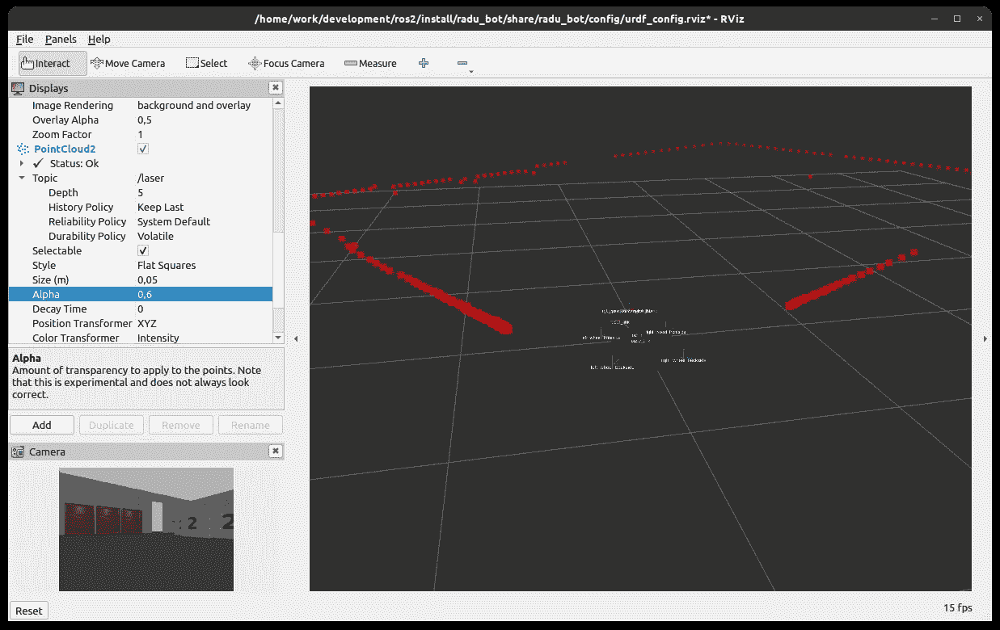
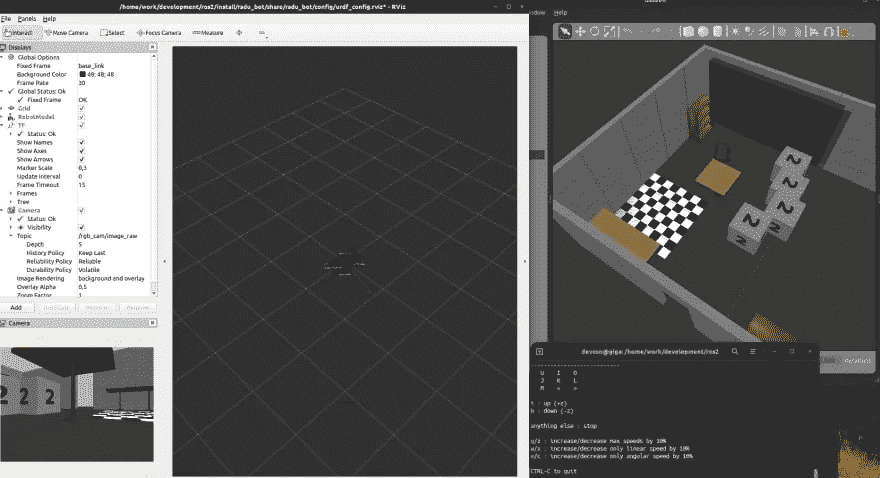
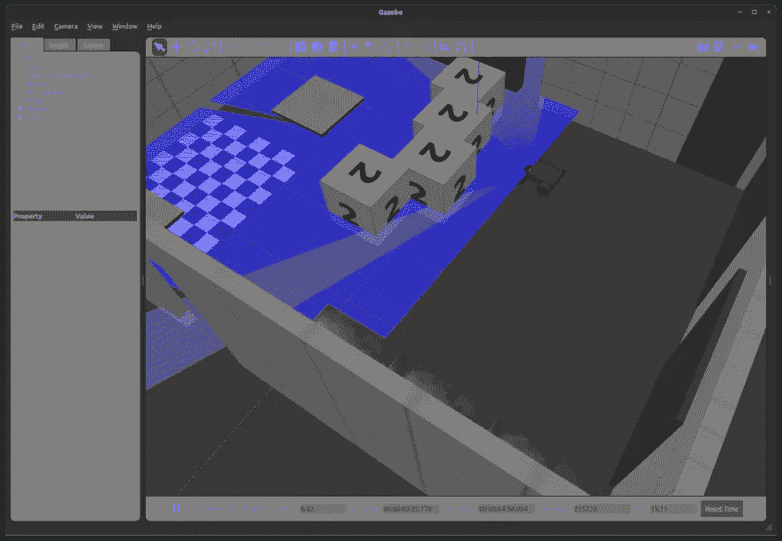

# 机器人操作系统:如何在 ROS2 中建模点云数据

> 原文：<https://medium.com/geekculture/robot-operating-system-how-to-model-point-cloud-data-in-ros2-d36674619078?source=collection_archive---------9----------------------->



RADU 在 RViz 和 Gazebo 的模拟进展顺利。在上一篇文章中，我们学习了如何启动机器人并使用 teleop 节点操作它。在本文中，我们将添加两个视觉传感器。首先，当机器人四处移动时，一个图像摄像头可以看到机器人的实时反馈。第二，深度相机传感器，它输出点云，这是机器人周围的距离测量，其中的颜色代表物体有多远。这两个传感器有助于 2D 导航和 3D 物体识别。

*注:技术环境为 Ubuntu 20.04，ROS2 福克西，Gazebo11，RViz2。*

*本文原载于我的博客*[*admantium.com*](https://admantium.com/blog/ros10_model_point_cloud_data/)*。*

# 凉亭中的视觉传感器

在上一篇文章中，我们看到了如何添加一个插件来控制凉亭模拟中的机器人。添加视觉传感器遵循相同的方法:从 [Gazebo 插件文档](https://github.com/ros-simulation/gazebo_ros_pkgs/wiki)中识别插件，检查并应用配置，然后将其添加到您的机器人的 URDF 模型中。

URDF 模型需要扩展如下:

*   定义 URDF 的环节和关节
*   可选:定义一个`frame`连杆和关节
*   在`<gazebo>`标签中定义一个`sensor`和`plugin`标签

最佳实践是在单独的 XACRO 文件中定义机器人的任何附加传感器。这使您能够为特定的模拟目标提供不同的机器人配置。

# 添加摄像机

先说相机插件。正如[所记录的](https://github.com/ros-simulation/gazebo_ros_pkgs/wiki/ROS-2-Migration:-Camera)，有不同类型的摄像机可供选择。我们将选择插件`libgazebo_ros_camera.so`来模拟传统相机。

# URDF 模型

第一步是添加适当的链接和关节。相机传感器在这方面很特殊:您需要为相机定义一个链接和一个关节，并为充当相机参考点的相机帧定义另一个链接和关节。这是必需的 URDF 部分。

```
<?xml version="1.0"?>
<robot xmlns:xacro="http://www.ros.org/wiki/xacro" name="radu">
  <link name='rgb_cam_camera_link'>
    <visual>
      <origin xyz="0 0 0" rpy="0 0 0" />
      <geometry>
        <box size="0.02 0.04 0.01" />
      </geometry>
    </visual>
  </link> <joint name="rgb_cam_camera_link_joint" type="fixed">
    <origin rpy="0 0 0" xyz="0.30 0.0 0.065" />
    <parent link="base_link" />
    <child link="rgb_cam_camera_link" />
    <axis xyz="0 0 0" />
  </joint> <link name="rgb_cam_camera_link_frame"></link>
  <joint name="rgb_cam_camera_frame_joint" type="fixed">
    <origin xyz="0.01 0 0" rpy="0 0 0" />
    <parent link="rgb_cam_camera_link" />
    <child link="rgb_cam_camera_link_frame" />
    <axis xyz="0 0 0" />
  </joint>
</robot>
```

然后，我们需要在我们的机器人 URDF 中添加`<sensor>`和`<plugin>`标签。

```
<?xml version="1.0"?>
<robot xmlns:xacro="http://www.ros.org/wiki/xacro" name="radu">
  <gazebo reference="rgb_cam_camera_link_frame">
    <sensor type="camera" name="rgb_camera">
      <update_rate>10.0</update_rate>
      <camera name="rgb_camera"> <pose>0 0 0 0 0 0</pose> <horizontal_fov>1.3962634</horizontal_fov>
        <image>
          <width>640</width>
          <height>480</height>
          <format>YUYV</format>
        </image>
        <clip>
          <near>0.005</near>
          <far>10.0</far>
        </clip>
      </camera> <plugin name="camera_controller" filename="libgazebo_ros_camera.so">
        <alwaysOn>true</alwaysOn>
        <updateRate>0.0</updateRate>
        <cameraName>rgb_camera</cameraName>
        <imageTopicName>image_raw</imageTopicName>
        <cameraInfoTopicName>camera_info</cameraInfoTopicName>
        <frameName>rgb_cam_camera_link_frame</frameName>
        <hackBaseline>0.07</hackBaseline>
        <distortionK1>0.0</distortionK1>
        <distortionK2>0.0</distortionK2>
        <distortionK3>0.0</distortionK3>
        <distortionT1>0.0</distortionT1>
        <distortionT2>0.0</distortionT2>
      </plugin>
    </sensor>
  </gazebo>
</robot>
```

这个声明使用了一个有用的技巧:URDF 文件可以包含多个`<gazebo reference="NAME">`标签，Gazebo 将解析这些标签，就好像您将所有声明都写在一个全局`<gazebo>`标签中一样。

配置摄像机的主要属性如下:

*   `<image>`图像的宽度、高度和格式
*   `<clip>`近距和远距属性控制图像记录的裁剪方式

对于插件，我们需要定义更新率(`0.0`意味着一个恒定的流)，图像和相机信息的主题名称，以及几个失真因子。

# RViz 模拟

传感器配置好后，我们就可以启动机器人和 RViz 了。在 RViz 内部，我们需要添加摄像头显示，然后将其配置为订阅主题`/rgb_camera/image_raw`。如果操作正确，您可以看到图像实时视图。

在下面的截图中，您可以在右侧看到凉亭模拟，在左侧看到带有摄像机视图的 RViz。



# 深度相机

成功安装默认图像相机后，我们可以继续添加深度相机。

最初，我计划将 Gazebo 插件用于我将在机器人中使用的深度传感器:英特尔实感 D435。在我对这个插件的研究中，我发现这个官方的、特定的插件只适用于 ROS1。一些用户试图让这个传感器运行，正如这个 [ROS answers 线程](https://answers.ros.org/question/348331/realsense-d435-gazebo-plugin/)中记录的那样——他们成功地在 Gazebo 中启动了控制器，但无法获得任何传感器数据。因此，我决定使用一个类似的工作插件来模拟 3D 点云:ROS2 射线传感器。

# URDF 模型

和以前一样，我们首先需要在机器人模型中创建正确的链接。对于深度传感器，我们只需要一个连杆和一个关节。这里是相关的 URDF。

```
<?xml version="1.0"?>
<robot xmlns:xacro="http://www.ros.org/wiki/xacro" name="radu">
  <link name='laser_link'>
    <visual>
      <origin xyz="0 0 0" rpy="0 0 0" />
      <geometry>
        <box size="0.02 0.04 0.01" />
      </geometry>
    </visual>
  </link> <joint name="laser_link_joint" type="fixed">
    <origin rpy="0 0 0" xyz="0.10 0.1 0.085" />
    <parent link="base_link" />
    <child link="laser_link" />
    <axis xyz="0 0 0" />
  </joint>
</robot>
```

其次，我们添加一个额外的`<gazebo reference="">`标签，其中包括`<sensor>`和`<plugin>`标签。

```
<?xml version="1.0"?>
<robot xmlns:xacro="http://www.ros.org/wiki/xacro" name="radu">
  <gazebo reference="laser_link">
    <sensor type="ray" name="head_laser_scanner">
      <pose>0.0 0 0 0 0 0</pose>
      <ray>
        <scan>
          <horizontal>
            <samples>181</samples>
            <resolution>1</resolution>
            <min_angle>-1.57080</min_angle>
            <max_angle>1.57080</max_angle>
          </horizontal>
        </scan>
        <range>
          <min>0.08</min>
          <max>10</max>
          <resolution>0.05</resolution>
        </range>
        <noise>
          <type>gaussian</type>
          <mean>0.0</mean>
          <stddev>0.01</stddev>
        </noise>
      </ray> <always_on>1</always_on>
      <update_rate>30</update_rate>
      <visualize>true</visualize> <plugin name="laser_scanner" filename="libgazebo_ros_ray_sensor.so">
        <ros>
          <namespace>/</namespace>
          <argument>~/out:=laser</argument>
        </ros>
        <output_type>sensor_msgs/PointCloud2</output_type>
        <frame_name>laser_link</frame_name>
      </plugin>
    </sensor>
  </gazebo>
</robot>
```

传感器类型为`ray`，包括以下配置选项:

*   `<scan>`标签可以包括`<horizontal>`和`<vertical>`标签，用于沿着这些定义进行扫描。每个都定义了最小和最大角度、样本数(检测到的点数)和分辨率
*   使用`<range>`您可以定义传感器探测环境的绝对距离
*   可选的`<noise>`标签定义了如何在仿真中清除接收到的测量值。

根据传感器定义，`<plugin>`为该传感器配置名称空间、主题、数据格式和参考链接。

# 凉亭和 RViz 模拟

不需要修改启动文件——以主题`/robot_description`发布的新 URDF 文件包含了新的传感器和插件。但是我们会看到什么呢？

在 Gazebo 中，我们看到了传感器的视觉表现:发射的光线。我注意到，在我的模拟中，只有房间的墙壁，而不是物体，阻挡了传感器的光线——显然，它们有不同的物理特性，但这对于模拟来说是可以的。



在 RViz 中，我们可以看到传感器数据的实时模拟，并在移动时准确地看到房间的轮廓。一旦开始，我们通过`Add`按钮添加一个新的显示，选择`PointCloud2`，然后配置主题为`/laser`，显示点的大小为 0.03 米。这将如下所示。


# 结论

用传感器插件增强机器人模拟提供了对机器人模型的重要见解。在 ROS2 中，官方 Gazebo 插件包括驱动器、IMU、GPS、相机等。本文展示了添加传感器的基本步骤。首先，定义传感器的链接和关节。其次，添加一个带有传感器和插件配置的`<gazebo>`标签。传感器在仿真工具 Gazebo 和 RViz 中的显示方式不同。在 Gazebo 中，插件公开了可以控制和/或可视化的直接接口。在 RViz 中，您需要添加额外的显示类型来监听插件提供的主题，例如显示实时摄像机或点云。正确配置后，您的机器人模型会显示其环境，并在模拟中为您提供更好的控制。