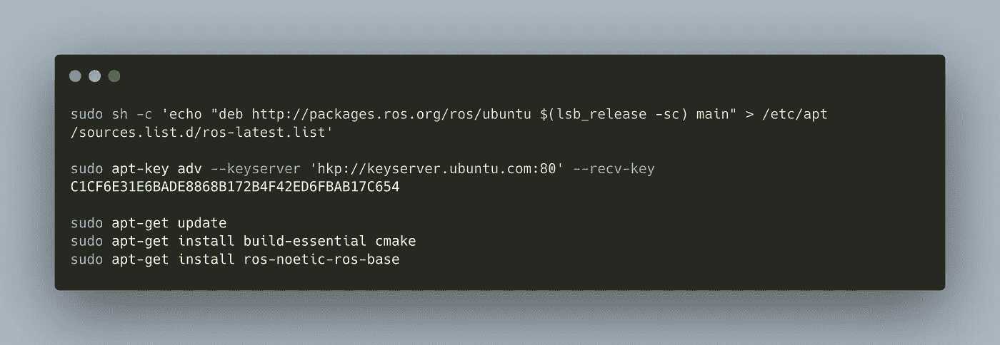

# 机器人操作系统:在带有 Ubuntu 服务器的 Raspberry Pi 上安装和配置

> 原文：<https://medium.com/geekculture/robot-operating-system-installation-configuration-and-auto-startup-on-a-raspberry-pi-with-ubuntu-6eb8e4e1038e?source=collection_archive---------8----------------------->



开发移动机器人有很多选择。甚至还有很多你可能想要满足的要求。所有设置的总体目标应该是运行最新的软件，从操作系统到操作系统包和应用程序库。

如果你想在 Raspberry Pi 上使用 ROS 和默认的获取系统 Raspberry Pi OS，安装不是一个简单的`apt-get install`命令。原因是:没有树莓 Pi 操作系统的[预编译版本。因此，您需要启动一个漫长的过程，包括手动下载和编译几个包。ROS 建议使用 Ubuntu 操作系统进行操作，我只能建议遵循这一点，因为你可能会在 Ubuntu 的上下文中找到关于 ROS 的问题的支持。因此，我决定使用 Ubuntu Server 20.04 作为我的移动机器人的操作系统。](https://answers.ros.org/question/362738/trouble-using-apt-to-install-ros-noetic-on-raspberry-pi/)

这篇文章是关于在运行 Ubuntu 20.04 的 Raspberry Pi 上设置、配置和自动启动 ROS 的完整指南。您将学习如何添加 ROS 包源代码、执行安装、配置默认用户以使其拥有正确的权限，以及如何在运行时自动启动 Raspberry Pi 上的 ROS 代码节点。

*本文的技术背景是 Ubuntu Server 20.04，ROS Noetic 1.15.11，硬件是 Raspberry Pi 3 或 4。所有指令都应该适用于更新的操作系统和库版本。*

*本文原载于我的博客*[*admantium.com*](https://admantium.com/blog/robo09_install_ros_on_ubuntu_and_raspberry_pi/)。

# 在 Ubuntu 服务器上安装 ROS Noetic

考虑到[官方文档](https://wiki.ros.org/Installation/Ubuntu)中提到的步骤，以及一些小的修改，安装归结为:

1.  让您的树莓 Pi 保持最新，包括最新的内核:

```
sudo apt-get update
sudu apt-get upgrade
```

2.将 ROS 包存储库添加到您的`sources.list`中，并导入所需的密钥。

```
sudo sh -c 'echo "deb http://packages.ros.org/ros/ubuntu $(lsb_release -sc) main" > /etc/apt/sources.list.d/ros-latest.list'sudo apt-key adv --keyserver 'hkp://keyserver.ubuntu.com:80' --recv-key C1CF6E31E6BADE8868B172B4F42ED6FBAB17C654
```

3.安装构建基础和 ROS 核心包

```
sudo apt-get update
sudo apt-get install build-essential cmake
sudo apt-get install ros-noetic-ros-base
```

如果一切顺利，让我们通过运行以下两个命令来测试安装:

```
source /opt/ros/noetic/setup.bash
roscore
```

您应该会看到以下输出:

```
started roslaunch server http://omega:35395/
ros_comm version 1.15.13 SUMMARY
========PARAMETERS
 * /rosdistro: noetic
 * /rosversion: 1.15.13
```

如果这些步骤成功，您可以继续下一步。

# 设置用户权限

假设您使用默认用户`pi`，并且您想要使用 Raspberry Pi 的 GPIO 和 I2X 引脚，我们需要设置特定的访问权限。

在终端中执行以下命令:

```
sudo groupadd -f --system gpio
sudo usermod -a -G gpio pi
sudo usermod -a -G i2c pi
```

# 设置新的 ROS 包

要在您的 Raspberry Pi 上正确创建 ROS 项目，请遵循以下步骤:

1.  创建柳絮工作空间

```
mkdir ~/ros-noetic
cd ~/ros-noetic
```

2.在工作区内创建一个 ROS 包

```
catkin_create_pkg cmd_vel_listener std_msg rospy --rosdistro noeticCreated file cmd_vel_listener/package.xml
Created file cmd_vel_listener/CMakeLists.txt
Created folder cmd_vel_listener/srcSuccessfully created files in /home/pi/catkin_ws/src/cmd_vel_listener. Please adjust the values in package.xml.
```

3.运行 ROS 编译流程

```
catkin_make
Base path: /home/pi/catkin_ws
Source space: /home/pi/catkin_ws/src
Build space: /home/pi/catkin_ws/build
Devel space: /home/pi/catkin_ws/devel
Install space: /home/pi/catkin_ws/install
####
#### Running command: "cmake /home/pi/catkin_ws/src -DCATKIN_DEVEL_PREFIX=/home/pi/catkin_ws/devel -DCMAKE_INSTALL_PREFIX=/home/pi/catkin_ws/install -G Unix Makefiles" in "/home/pi/catkin_ws/build"
####
-- Using CATKIN_DEVEL_PREFIX: /home/pi/catkin_ws/devel
-- Using CMAKE_PREFIX_PATH: /opt/ros/noetic
-- This workspace overlays: /opt/ros/noetic
-- Using PYTHON_EXECUTABLE: /usr/bin/python3
-- Using Debian Python package layout
-- Using empy: /usr/lib/python3/dist-packages/em.py
-- Using CATKIN_ENABLE_TESTING: False
-- catkin 0.8.10
-- BUILD_SHARED_LIBS is on
-- BUILD_SHARED_LIBS is on
-- ~~~~~~~~~~~~~~~~~~~~~~~~~~~~~~~~~~~~~~~~~~~~~~~~~
-- ~~  traversing 4 packages in topological order:
-- ~~  - cmd_vel_listener
-- ~~~~~~~~~~~~~~~~~~~~~~~~~~~~~~~~~~~~~~~~~~~~~~~~~
```

完成这一步后，您就可以开始了。

# 结论

这篇短文展示了在运行 Ubuntu 服务器的 Raspberry Pi 上安装 ROS 的基本步骤。通过使用 Ubuntu，你可以使用可用的 Debian 软件包，而不是从头开始编译。安装步骤包括 a)更新源列表，b)添加所需的 SSH 密钥，c)安装软件包。之后，我展示了如何为与 GPIOs 和 Raspberry Pi 的 I2C 子系统交互设置正确的用户权限。最后，我展示了如何设置一个 ROS 工作空间，在其中定义您的项目。